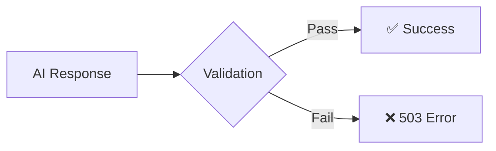
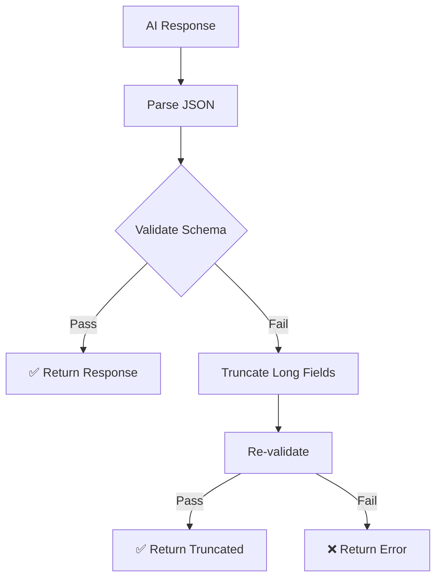
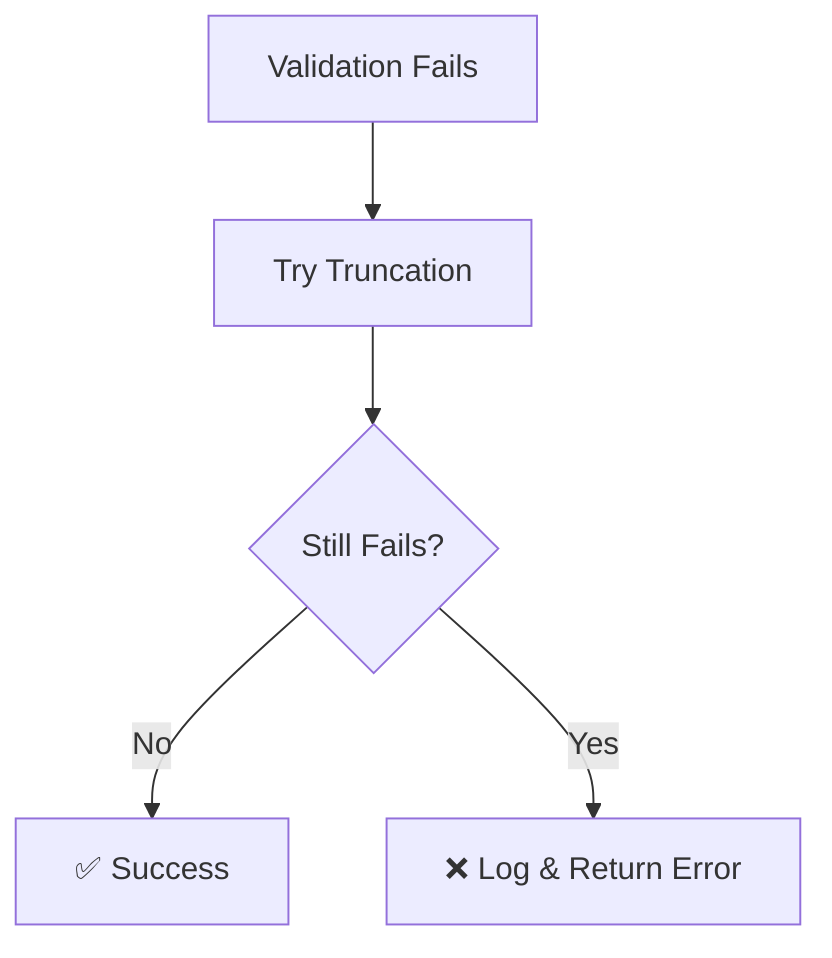

# Invalid Response Validation Design

## Problem Statement

AI personas are generating responses that exceed Zod schema string limits, causing 503 errors. Need a simple, practical fix for MVP without over-engineering.

## Root Cause

Static string length limits in Zod schemas are too restrictive for AI-generated content:
- `creative_temperature`: 300 char limit, AI generates 500+
- `reasoning`: 500 char limit, AI generates longer explanations
- `interaction_chemistry`: 500 char limit, AI needs more space
- `group_atmosphere`: 200 char limit, too short for descriptions

## Current Impact



## Simple Solution Strategy

### Two-Step Approach

1. **Increase Schema Limits** - Adjust Zod schema limits based on actual AI output
2. **Add Basic Truncation** - Simple string truncation as safety net

### Implementation Flow



## Practical Schema Updates

### Immediate Limit Increases

| Field | Current | New Limit | Why |
|---|---|---|---|
| `creative_temperature` | 300 | 800 | AI needs creative expression space |
| `reasoning` | 500 | 1000 | Complex explanations require more text |
| `interaction_chemistry` | 500 | 800 | Relationship analysis needs detail |
| `group_atmosphere` | 200 | 400 | Atmosphere descriptions are naturally longer |

### Schema Change Pattern


## Simple Truncation Helper

### DRY Utility Function

Create one reusable truncation function to handle all oversized fields:

```
truncateWithEllipsis(text: string, maxLength: number) -> string
```

### Basic Truncation Logic

```mermaid
flowchart LR
    A[Long Text] --> B{Length > Max?}
    B -->|No| C[Return As-Is]
    B -->|Yes| D[Truncate at Word Boundary]
    D --> E[Add "..."]
    E --> F[Return Truncated]
```

### Single Implementation Point

- Apply same truncation logic to all string fields
- No field-specific rules (KISS principle)
- Easy to maintain and debug

## MVP Error Handling

### Keep It Simple



### Minimal Logging

- Log validation failures with field names
- Log when truncation is applied
- No complex metrics or monitoring (MVP focus)

### Error Response

Return simple error message to client:
```
{ "error": "AI response validation failed", "persona": "creative" }
```

## Implementation Plan

### Single Change Session

**Step 1: Update Schema Limits** (5 minutes)
- Modify `reportSchemas.ts` with new limits
- Test with failing personas

**Step 2: Add Truncation Safety** (10 minutes)
- Create simple `truncateField` utility in `generator.ts`
- Apply to validation failures

**Step 3: Test & Deploy** (5 minutes)
- Verify personas work
- Deploy to production

### File Changes Required

| File | Change | Lines |
|---|---|---|
| `reportSchemas.ts` | Increase 4 field limits | ~4 lines |
| `generator.ts` | Add truncation helper | ~10 lines |
| `generator.ts` | Apply truncation on failure | ~5 lines |

**Total: ~20 lines of code changes**

### No Over-Engineering

❌ **Avoid:**
- Complex monitoring systems
- Multi-level recovery strategies  
- Dynamic configuration
- Performance optimization
- Advanced testing frameworks

✅ **Keep:**
- Simple limit increases
- Basic truncation
- Minimal logging
- Quick deployment

### Validation Strategy

Test manually with the personas that are currently failing:
- Generate creative report
- Generate ai-psychologist report
- Verify no 503 errors
- Check truncation works if needed