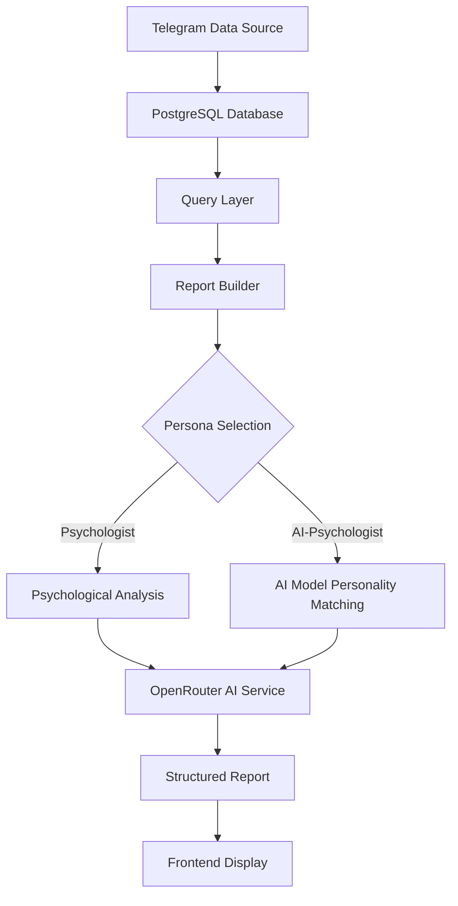
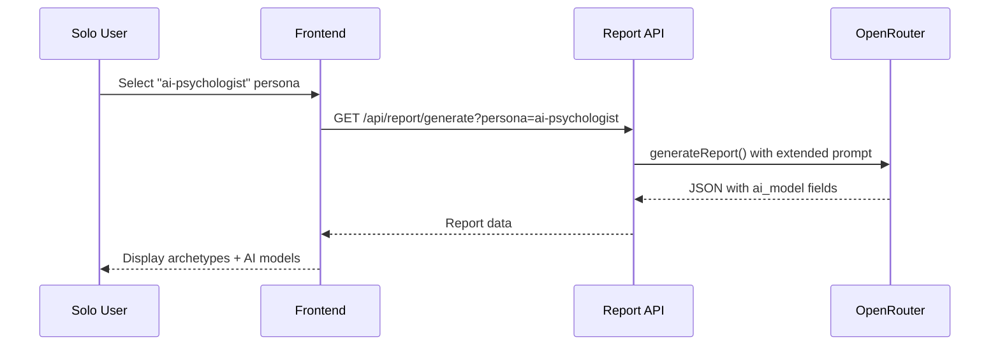

# Psychological Profile Analysis with AI Model Personality Matching (MVP)

## Overview

This MVP feature extends the existing psychologist persona by adding AI model personality matching. As a solo user analyzing your own Telegram communities, you want to quickly see which popular AI model (GPT-5, Claude Sonnet 4.5, GLM, etc.) each community member's communication style resembles.

**Core Value (MVP):**
- Fork existing psychologist persona → create new `ai-psychologist` persona
- Add simple AI model personality field to each participant profile
- Quick visual understanding: "This person writes like GPT-5, that one like Claude"
- No complex UI needed - just extend existing report display

## Repository Type

**Full-Stack Application** (Next.js 15 with App Router, PostgreSQL backend, OpenRouter AI integration)

## Architecture

### High-Level System Flow



### Component Responsibilities (MVP)

| Component | Current State | Modification Required |
|-----------|--------------|----------------------|
| `lib/reportSchemas.ts` | Zod schemas for validation | Add `aiPsychologistReportSchema` with optional `ai_model` field |
| `lib/ai.ts` | AI generation with persona support | Add `'ai-psychologist'` persona case |
| `lib/report.ts` | Report building orchestration | Already supports any persona - no change |
| `lib/queries.ts` | Database queries | No modification (reuse existing) |
| API & Frontend | Existing display | Minimal text addition to show AI model |

## Data Models

### Extended Persona Types (MVP)

| Persona Type | Analysis Focus | Output Structure |
|-------------|----------------|------------------|
| `psychologist` (existing) | Traditional psychological archetypes | group_atmosphere, psychological_archetypes, emotional_patterns, group_dynamics |
| `ai-psychologist` (MVP) | Same + AI model name per person | Just add `ai_model` field to each archetype object |

### AI Model Personality Report Schema (MVP - Simplified)

**Strategy:** Just extend existing `psychological_archetypes` objects with one new optional field.

| Field | Type | Description | Constraints |
|-------|------|-------------|-------------|
| `group_atmosphere` | string | Overall emotional classification (unchanged) | 50-200 characters |
| `psychological_archetypes` | array of objects | **EXTENDED**: Now includes optional `ai_model` field | 4-8 entries |
| `emotional_patterns` | array of strings | Key emotional patterns (unchanged) | 3-6 entries |
| `group_dynamics` | array of strings | Group psychological processes (unchanged) | 3-5 entries |

### Extended Archetype Object Structure

**Minimal change to existing structure:**

| Property | Type | Description | Example Values |
|----------|------|-------------|----------------|
| `name` | string | Participant display name (existing) | "Alex K", "@username" |
| `archetype` | string | Psychological type (existing) | "Leader", "Moderator", etc. |
| `influence` | string | Impact description (existing) | Behavioral patterns |
| `ai_model` | string (optional) | **NEW**: Matched AI model | "GPT-5", "Claude Sonnet 4.5", "GLM-4" |

## AI Model Personality Categories

### Supported AI Models for Matching (MVP - Core Set)

Start with 5 most popular models for simplicity:

| AI Model | Key Characteristic | Quick Indicator |
|----------|-------------------|----------------|
| **GPT-5** | Balanced, comprehensive | Long detailed messages, diplomatic |
| **Claude Sonnet 4.5** | Thoughtful, structured | Organized thinking, nuanced |
| **Gemini 2.5 Pro** | Creative, innovative | Ideas and connections |
| **GLM-4** | Efficient, practical | Direct and action-oriented |
| **DeepSeek V3** | Deep analytical | Technical depth |

### Matching Criteria (MVP - Simplified)

The AI just needs to look at:
- **Message length**: Short vs long
- **Tone**: Technical vs casual vs balanced
- **Style**: Direct vs thoughtful vs creative

## Persona Prompt Design

### AI-Psychologist System Prompt Strategy (MVP)

Keep it simple: extend existing psychologist prompt with one instruction:

**Addition to Existing Psychologist Prompt:**

"For each person in `psychological_archetypes`, also add an `ai_model` field indicating which AI model their communication style resembles:
- GPT-5: balanced, comprehensive, diplomatic
- Claude Sonnet 4.5: thoughtful, structured, analytical  
- Gemini 2.5 Pro: creative, innovative ideas
- GLM-4: efficient, direct, practical
- DeepSeek V3: deep technical analysis

Base this on their message length, tone, and style patterns."

**That's it.** No complex confidence scoring, no separate analysis - just one extra field per person.

## User Flow (MVP)

### Report Generation



## Business Logic Layer

### Report Generation (MVP)

**No changes needed to `buildDailyReport()` in `lib/report.ts`** - it already accepts any persona string.

**Data Preparation:**
- Reuse existing `fetchMessagesWithAuthors()` query
- Same text aggregation logic
- No additional database queries

### AI Generation Logic (MVP)

**Function: `generateReport()` in `lib/ai.ts`**

**Simple Extension:**

1. Add `'ai-psychologist'` to `PersonaType` union
2. In `getPersonaPrompt()`: Copy psychologist prompt + add AI model instruction
3. In `getPersonaJsonSchema()`: Copy psychologist schema + make `ai_model` optional in archetypes
4. In `getPersonaSchema()`: Map to new schema

**That's all the code changes needed.**

## API Endpoints Reference

### Report Generation Endpoint

**Route:** `GET /api/report/generate`

**Query Parameters:**

| Parameter | Type | Required | Valid Values |
|-----------|------|----------|--------------|
| `persona` | string | No | 'psychologist', 'ai-psychologist', 'curator', 'business', etc. |
| `date` | string | No | YYYY-MM-DD |
| `chatId` | string | No | Any chat ID |

**Example Request:**
```
GET /api/report/generate?persona=ai-psychologist&date=2024-01-15
```

**Response Structure:**
```json
{
  "data": {
    "group_atmosphere": "...",
    "psychological_archetypes": [
      {
        "name": "Alex K",
        "archetype": "Leader",
        "influence": "...",
        "ai_model": "Claude Sonnet 4.5"
      }
    ],
    "emotional_patterns": [...],
    "group_dynamics": [...]
  }
}
```

## Frontend Component Architecture

### Component Structure (MVP)

**Just modify existing psychologist display** - no new component needed.

### Display Sections (MVP)

**Psychological Archetypes List:**
- Each person entry now shows: `Name: Archetype (AI Model: GPT-5)`
- Example: "Alex K: Leader (AI Model: Claude Sonnet 4.5) - dominates discussions with structured thinking"

**That's the entire UI change.** Just add the AI model name in parentheses after the archetype.

No fancy charts, no filtering, no separate sections. Keep it minimal for MVP.

## Testing Strategy

### Unit Testing (MVP - Minimal)

**Just test the basics:**
- Schema accepts optional `ai_model` field
- Prompt includes AI model instruction
- Response parses correctly with or without AI model

**That's enough for MVP.** Don't over-test.

### Edge Cases (MVP)

| Scenario | Expected Behavior |
|----------|------------------|
| Missing ai_model field | Display archetype only |
| Unknown AI model name | Accept any string, don't validate |
| AI service timeout | Return null, log error (same as existing) |

## Implementation Steps (MVP - Single Session)

**Step 1: Update Schema (5 minutes)**
- In `lib/reportSchemas.ts`: Copy `psychologyReportSchema`, rename to `aiPsychologistReportSchema`
- Add `.optional()` to `ai_model: z.string()` in archetype object
- Export new schema

**Step 2: Add Persona Type (2 minutes)**
- In `lib/ai.ts`: Add `'ai-psychologist'` to `PersonaType` union
- In `getPersonaSchema()`: Map `'ai-psychologist'` to new schema

**Step 3: Extend Prompt (10 minutes)**
- In `getPersonaPrompt()`: Copy psychologist prompt
- Add instruction: "Also add `ai_model` field (GPT-5/Claude Sonnet 4.5/Gemini 2.5 Pro/GLM-4/DeepSeek V3) based on communication style"
- Update JSON schema in `getPersonaJsonSchema()` to include optional ai_model

**Step 4: Test It (5 minutes)**
- Call API with `?persona=ai-psychologist`
- Check response has `ai_model` in archetypes
- Display in existing UI with simple text addition

**Total: ~25 minutes of focused work**

## Technical Considerations (MVP)

**Keep It Simple:**
- No additional database queries (use same message data)
- No token budget concerns (just adding ~50 tokens to prompt)
- No confidence calibration needed (skip that feature for MVP)
- No performance impact (identical flow to existing psychologist persona)

**What Could Go Wrong:**
- AI might assign weird model names → Make field optional, don't validate strictly
- Results might not make sense → That's fine, it's experimental and for your own use
- Might need prompt tweaking → Easy to iterate on the one-line instruction

## Future Enhancements (If Useful)

**Only if you find the MVP valuable:**
- Add more AI models (o1, Grok, Llama, etc.)
- Show a simple count: "3 people are GPT-5 style, 2 are Claude style"
- Track how people's AI model style changes over time
- Add emoji/icons for each AI model type

**Don't build these until you actually want them.**
