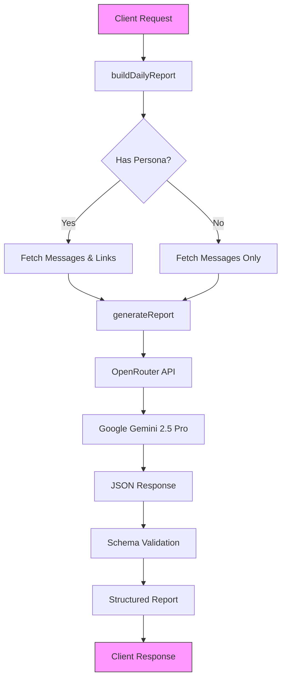
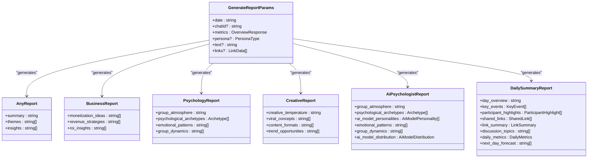
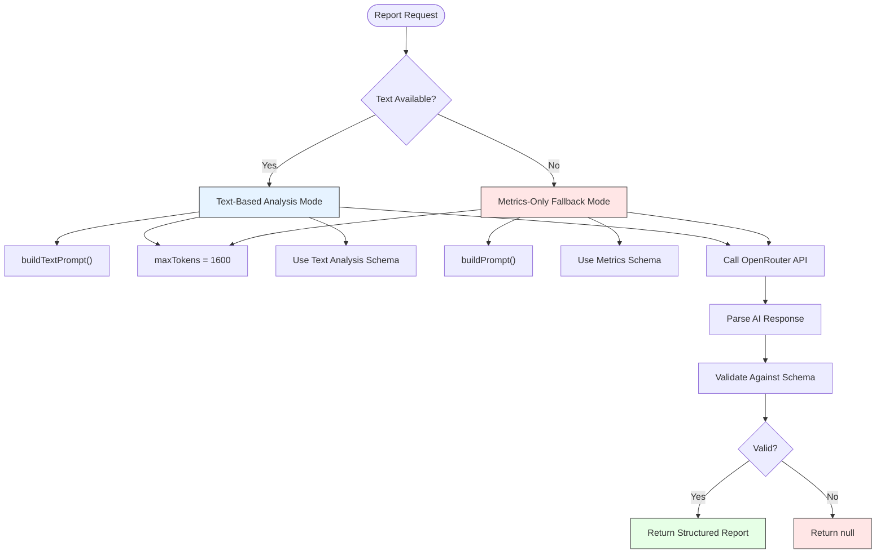
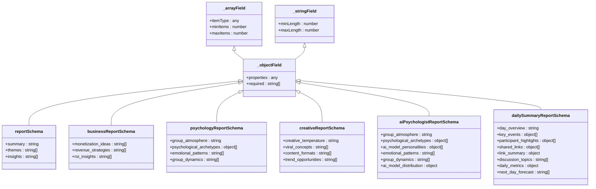
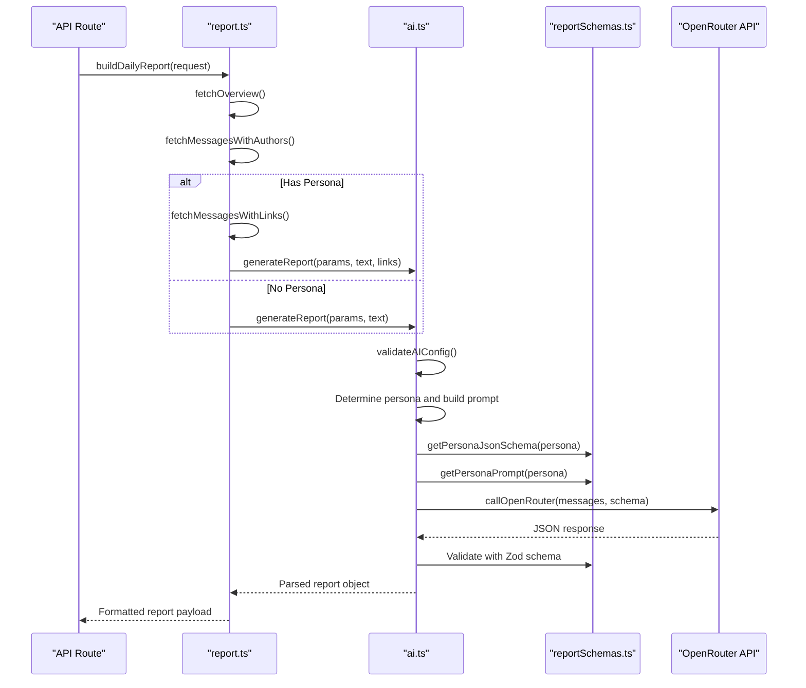
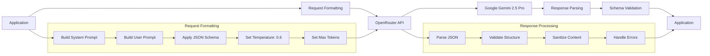
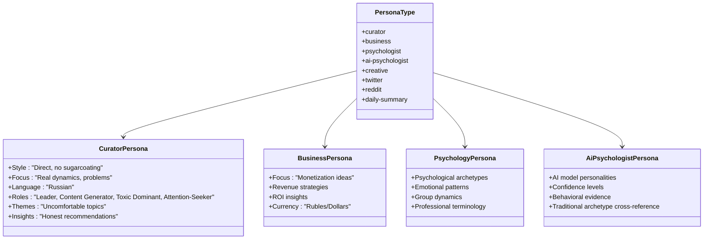
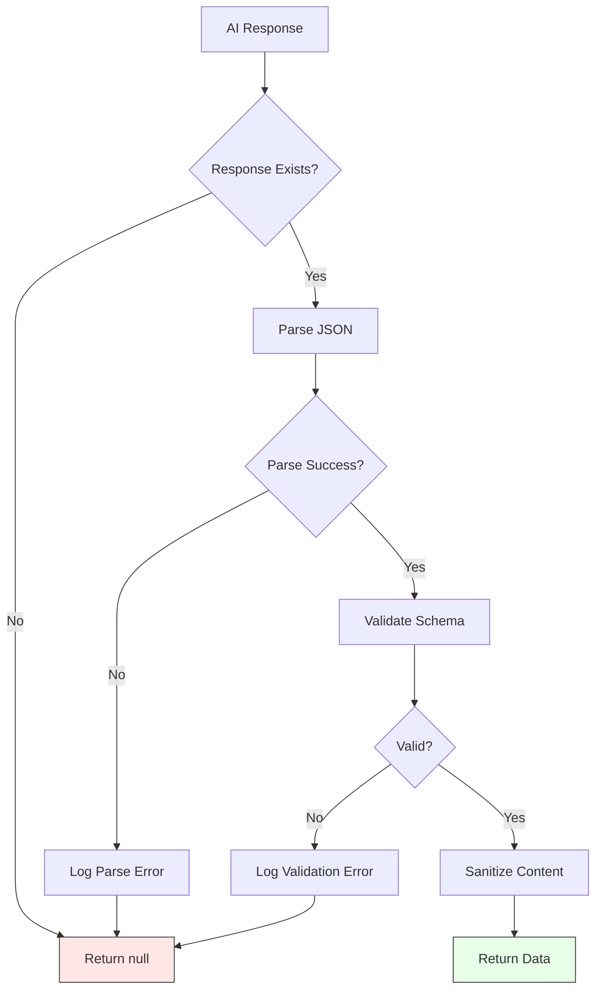
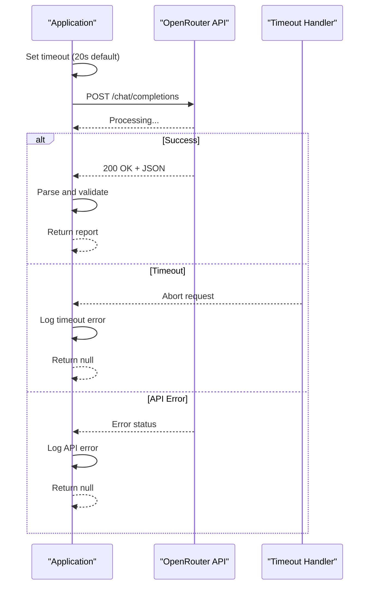

# AI Integration

<cite>
**Referenced Files in This Document**   
- [ai.ts](file://lib/ai.ts)
- [report.ts](file://lib/report.ts)
- [reportSchemas.ts](file://lib/reportSchemas.ts)
- [types.ts](file://lib/types.ts)
</cite>

## Table of Contents
1. [Introduction](#introduction)
2. [Architecture Overview](#architecture-overview)
3. [Core Components](#core-components)
4. [Detailed Component Analysis](#detailed-component-analysis)
5. [System Boundaries and API Integration](#system-boundaries-and-api-integration)
6. [Cross-Cutting Concerns](#cross-cutting-concerns)
7. [Infrastructure and Error Handling](#infrastructure-and-error-handling)
8. [Conclusion](#conclusion)

## Introduction
The AI integration component of the tg-ai-vibecoders-summary application provides intelligent insights generation for Telegram chat analytics using the OpenRouter API with Google Gemini 2.5 Pro. This system transforms raw chat metrics and message content into structured, actionable reports through advanced natural language processing. The architecture centers around a unified reporting system that supports multiple analytical personas while maintaining robust validation, error handling, and fallback mechanisms.

## Architecture Overview
The AI integration follows a layered architectural pattern with clear separation of concerns between data retrieval, AI processing, and response validation. The system orchestrates the flow from raw chat data to structured JSON reports through a well-defined pipeline.

**Diagram sources**
- [report.ts](file://lib/report.ts#L13-L103)
- [ai.ts](file://lib/ai.ts#L33-L165)

## Core Components
The AI system comprises three core components that work in concert to generate insights: the unified report generator, JSON schema validators, and the report orchestrator. These components enable flexible report generation while ensuring data integrity and system reliability.

**Section sources**
- [ai.ts](file://lib/ai.ts#L33-L165)
- [report.ts](file://lib/report.ts#L13-L103)
- [reportSchemas.ts](file://lib/reportSchemas.ts#L3-L7)

## Detailed Component Analysis

### Unified Report Generation System
The `generateReport` function serves as the central AI processing engine, replacing multiple specialized functions through a unified interface. This refactoring eliminated 676 lines of redundant code while enhancing maintainability and extensibility.

**Diagram sources**
- [ai.ts](file://lib/ai.ts#L33-L165)
- [reportSchemas.ts](file://lib/reportSchemas.ts#L3-L111)

#### Two-Mode Report Generation Strategy
The system implements a sophisticated two-mode generation strategy that adapts to available data and user requirements. When message text is available, it enables deep content analysis; otherwise, it falls back to metrics-only interpretation.

**Diagram sources**
- [ai.ts](file://lib/ai.ts#L33-L165)
- [ai.ts](file://lib/ai.ts#L942-L940)

### JSON Schema Validation with Zod
The system employs Zod for robust JSON schema validation, ensuring AI responses conform to expected structures before being processed by the application. This prevents malformed data from propagating through the system.

**Diagram sources**
- [reportSchemas.ts](file://lib/reportSchemas.ts#L3-L111)
- [ai.ts](file://lib/ai.ts#L410-L586)

### Component Relationships and Data Flow
The integration between ai.ts, report.ts, and reportSchemas.ts forms a cohesive system where each component has a distinct responsibility in the report generation pipeline.

**Diagram sources**
- [report.ts](file://lib/report.ts#L13-L103)
- [ai.ts](file://lib/ai.ts#L33-L165)
- [reportSchemas.ts](file://lib/reportSchemas.ts#L3-L111)

## System Boundaries and API Integration
The application interacts with the OpenRouter API through a well-defined boundary that handles request formatting, response parsing, and error management. This boundary ensures reliable communication with the external AI service.

**Diagram sources**
- [ai.ts](file://lib/ai.ts#L1019-L1092)
- [ai.ts](file://lib/ai.ts#L33-L165)

## Cross-Cutting Concerns

### Prompt Engineering and Russian-Language Curator Persona
The system implements sophisticated prompt engineering with a specialized Russian-language curator persona that provides culturally relevant insights while maintaining professional analytical standards.

**Diagram sources**
- [ai.ts](file://lib/ai.ts#L588-L940)
- [ai.ts](file://lib/ai.ts#L410-L586)

### Response Validation and Fallback Strategies
The system implements comprehensive validation and fallback mechanisms to ensure reliability even when AI responses are problematic or unavailable.

**Diagram sources**
- [ai.ts](file://lib/ai.ts#L177-L196)
- [ai.ts](file://lib/ai.ts#L150-L158)

## Infrastructure and Error Handling
The system includes robust infrastructure for handling AI requests with proper timeout management, error logging, and graceful degradation when issues occur.

**Diagram sources**
- [ai.ts](file://lib/ai.ts#L1019-L1092)
- [ai.ts](file://lib/ai.ts#L170-L174)

## Conclusion
The AI integration component of the tg-ai-vibecoders-summary application demonstrates a sophisticated architecture for generating intelligent insights from Telegram chat data. By implementing a unified `generateReport` function, the system achieves code efficiency while supporting multiple analytical personas. The integration of Zod for JSON schema validation ensures data integrity, while comprehensive error handling and fallback strategies maintain system reliability. The two-mode generation strategy (text-based with message authors and metrics-only fallback) provides flexibility in report generation based on available data. The system's boundary with the OpenRouter API is well-defined, with proper request formatting, response parsing, and timeout management. This architecture successfully balances advanced AI capabilities with robust engineering practices, delivering valuable insights to users while maintaining system stability and performance.