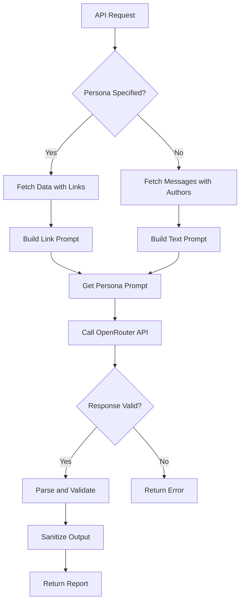
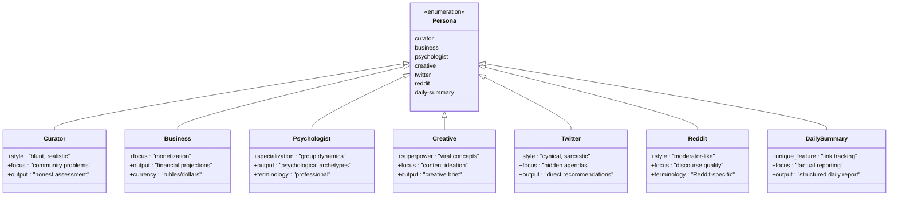
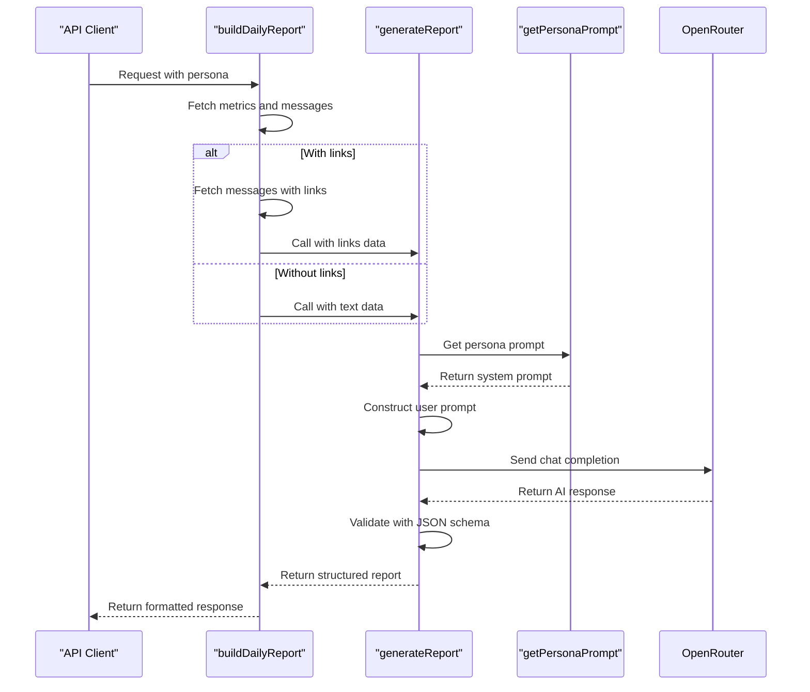
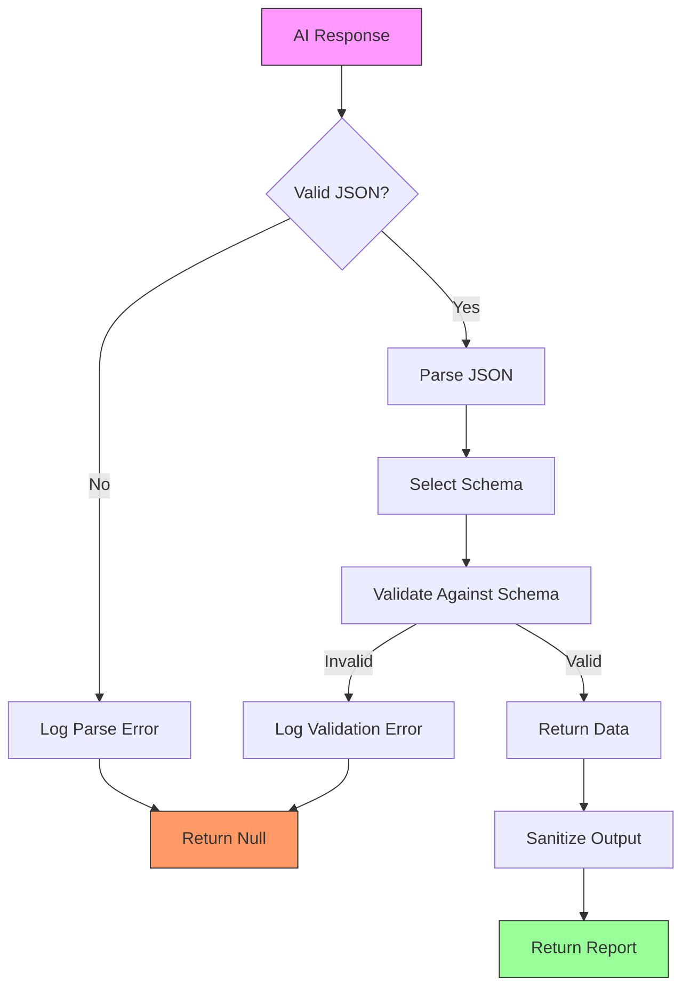

# Prompt Engineering

<cite>
**Referenced Files in This Document**   
- [ai.ts](file://lib/ai.ts)
- [reportSchemas.ts](file://lib/reportSchemas.ts)
- [report.ts](file://lib/report.ts)
- [types.ts](file://lib/types.ts)
- [route.ts](file://app/api/report/[kind]/route.ts)
</cite>

## Table of Contents
1. [Introduction](#introduction)
2. [Core Architecture](#core-architecture)
3. [Persona Domain Models](#persona-domain-models)
4. [Prompt Construction and Implementation](#prompt-construction-and-implementation)
5. [JSON Schema Validation System](#json-schema-validation-system)
6. [Token Management and Performance](#token-management-and-performance)
7. [Security Considerations](#security-considerations)
8. [Extending the Persona System](#extending-the-persona-system)
9. [Conclusion](#conclusion)

## Introduction

The tg-ai-vibecoders-summary application implements a sophisticated multi-persona AI analysis framework that generates structured insights from Telegram chat data. At the core of this system is the `getPersonaPrompt` function in `lib/ai.ts`, which defines seven distinct analysis modes: six expert personas (curator, business, psychologist, creative, twitter, reddit) and one daily-summary mode. This documentation provides a comprehensive analysis of the prompt engineering system, detailing how each persona's unique objectives, stylistic guidelines, and output formats are implemented through carefully crafted system prompts and corresponding JSON schemas.

The system leverages OpenRouter's API with Google Gemini 2.5 Pro to generate insights, requiring mandatory AI functionality for all report generation. The architecture follows a unified approach through the `generateReport` function, which replaces multiple deprecated wrappers and provides a consistent interface for all persona types. Each persona is designed to provide specialized analysis from different perspectives, ranging from blunt community assessments to business monetization strategies, psychological profiling, and creative content ideation.

**Section sources**
- [ai.ts](file://lib/ai.ts#L33-L165)
- [report.ts](file://lib/report.ts#L13-L101)

## Core Architecture

The prompt engineering system is built around a unified report generation architecture that centralizes all AI interactions through the `generateReport` function. This function serves as the single entry point for all persona-based analyses, replacing multiple deprecated functions and reducing code duplication by approximately 586 lines. The architecture follows a decision tree pattern based on input parameters, determining the appropriate persona, constructing the corresponding prompt, and selecting the correct JSON schema for validation.

The system processes input data from various sources, including chat metrics, message content, and shared links, which are aggregated and formatted before being sent to the AI service. The `buildDailyReport` function in `lib/report.ts` orchestrates this process, fetching the necessary data from the database and preparing it for analysis. When a specific persona is requested, the system retrieves the corresponding prompt from `getPersonaPrompt` and combines it with the user context to create a complete AI request.

The architecture includes comprehensive error handling and logging mechanisms, with verbose logging available when the `LLM_DEBUG_VERBOSE` environment variable is set. The system also implements token limit management through the `maxOutputTokens` parameter, with different personas having different token allocations based on their complexity requirements. The `OPENROUTER_TIMEOUT_MS` environment variable allows for request timeout configuration, ensuring the application remains responsive even under adverse network conditions.

**Diagram sources **
- [ai.ts](file://lib/ai.ts#L33-L165)
- [report.ts](file://lib/report.ts#L13-L101)

**Section sources**
- [ai.ts](file://lib/ai.ts#L33-L165)
- [report.ts](file://lib/report.ts#L13-L101)

## Persona Domain Models

The multi-persona AI framework implements seven distinct expert roles, each with its own specialized domain model, objectives, and output format. These personas are designed to provide complementary perspectives on Telegram community dynamics, enabling comprehensive analysis from multiple angles.

### Curator Persona
The curator persona provides blunt, realistic community assessments in Russian, focusing on identifying real problems such as toxicity, passivity, and conflicts. This persona emphasizes honesty over politeness, calling out systemic issues even if they create discomfort. The output includes a detailed summary of chat dynamics, honest psychological profiles of participants, themes addressing uncomfortable topics, and insights with risk assessments.

### Business Persona
The business persona functions as a monetization consultant, focusing exclusively on revenue generation opportunities. Its analysis includes monetization ideas with target audiences and pricing, revenue strategies with implementation steps and income projections, and ROI insights with mathematical calculations based on audience metrics. All recommendations are presented with concrete financial figures in rubles or dollars.

### Psychologist Persona
The psychologist persona specializes in community psychology and group dynamics, avoiding any business analysis. It provides assessments of group atmosphere, identifies psychological archetypes of participants (such as Leader, Provocateur, or Guardian), analyzes emotional patterns in communication, and examines group dynamics mechanisms like groupthink and conformity. The analysis uses professional psychological terminology and focuses on interpersonal relationships within the community.

### Creative Persona
The creative persona acts as a creative director and trend hunter, generating viral content ideas without any analytical components. Its output includes an assessment of the community's creative temperature, viral concepts with mechanics and virality predictions, innovative content formats, and opportunities to adapt current trends from platforms like TikTok and Instagram to the specific audience.

### Twitter Persona
The Twitter persona analyzes the chat with the skepticism characteristic of Twitter/X users, seeing through attempts to create "positive atmosphere." It provides cynical analysis of participants' real motivations, identifies problematic patterns like echo chambers and manipulation attempts, and offers direct recommendations without sugar-coating. The style incorporates internet slang and meme references while remaining understandable.

### Reddit Persona
The Reddit persona approaches analysis as an experienced Reddit power user, focusing on karma systems, moderation, and group dynamics. It uses Reddit-specific terminology like "karma farming," "brigading," and "circlejerk," analyzes power dynamics and moderation gaps, and provides recommendations for improving discourse quality by breaking echo chambers and encouraging diverse viewpoints.

### Daily-Summary Mode
The daily-summary mode functions as a professional daily summarizer with a unique focus on tracking all shared links and resources. It provides detailed factual reports with specific timestamps, names, and domains, analyzing each link's context and categorizing them by type. The output includes comprehensive link statistics, participant highlights, key events, and forecasts for the following day based on observed patterns.

**Diagram sources **
- [ai.ts](file://lib/ai.ts#L555-L830)
- [reportSchemas.ts](file://lib/reportSchemas.ts#L1-L87)

**Section sources**
- [ai.ts](file://lib/ai.ts#L555-L830)
- [reportSchemas.ts](file://lib/reportSchemas.ts#L1-L87)

## Prompt Construction and Implementation

The prompt engineering system implements a sophisticated approach to prompt construction through the `getPersonaPrompt` function, which returns carefully crafted system prompts for each persona type. These prompts are designed to guide the AI's behavior, style, and output format, ensuring consistent and specialized analysis across different expert roles.

Each persona prompt follows a consistent structure with three main components: style guidelines, task definition, and critical requirements. The style guidelines establish the persona's voice and approach, such as the curator's directive to "speak plainly, like an experienced consultant who has seen it all" or the Twitter persona's instruction to "write like an experienced Twitter user: directly, sarcastically, without reverence." These guidelines ensure that each persona maintains a distinct voice and perspective in its analysis.

The task definition section specifies the exact output format and content requirements for each persona. For example, the daily-summary persona requires eight specific sections including day overview, key events, participant highlights, shared links, link summary, discussion topics, daily metrics, and next-day forecast. Each section has detailed requirements, such as the shared_links section which must list every link published during the day with specific fields including URL, domain, sharer, timestamp, context, and category.

Critical requirements ensure the AI adheres to strict output constraints, with all personas required to return only valid JSON without markdown blocks or additional text. The prompts include specific instructions to prevent common issues, such as the curator persona's directive to "not sugarcoat the situation—better an unpleasant truth than a beautiful lie" or the business persona's requirement to include "specific figures and forecasts in rubles/dollars."

The system also implements specialized prompt construction for different data scenarios. When analyzing text content, the `buildTextPrompt` function creates a user prompt that includes the date, chat ID, metrics, and message content in a standardized format. For the daily-summary persona with link data, the `buildLinkPrompt` function generates a more complex prompt that includes aggregated link statistics such as total links, unique domains, top link sharers, and detailed information about each link shared during the day.

**Diagram sources **
- [ai.ts](file://lib/ai.ts#L555-L830)
- [ai.ts](file://lib/ai.ts#L832-L890)
- [report.ts](file://lib/report.ts#L13-L101)

**Section sources**
- [ai.ts](file://lib/ai.ts#L555-L830)
- [ai.ts](file://lib/ai.ts#L832-L890)

## JSON Schema Validation System

The system implements a robust JSON schema validation framework to ensure AI outputs conform to expected structures and data types. This validation system uses Zod schemas defined in `lib/reportSchemas.ts` to validate the structure, content, and constraints of AI-generated reports before they are returned to clients.

Each persona has a corresponding JSON schema that defines the exact structure and validation rules for its output. The schemas are created using helper functions like `_objectField`, `_arrayField`, `_stringField`, and `_enumField`, which provide a DRY (Don't Repeat Yourself) approach to schema definition. These helper functions allow for consistent validation rules across different personas while enabling persona-specific constraints.

The validation system enforces strict requirements on data types, field presence, and value constraints. For example, the business persona schema requires exactly three to six monetization ideas, three to six revenue strategies, and three to five ROI insights, all as string arrays. The psychologist persona schema includes nested object validation for psychological archetypes, requiring each archetype to have a name, archetype type, and influence description.

The daily-summary persona has the most complex schema, with eight required sections and multiple levels of nested objects and arrays. The schema validates that the day_overview is between 100-300 characters, key_events contains 3-8 objects with specific fields, and daily_metrics uses predefined enum values for activity_level, engagement_quality, mood_tone, and productivity in Russian.

The system uses two functions for schema management: `getPersonaJsonSchema` which returns the schema for JSON response formatting, and `getPersonaSchema` which returns the Zod schema for runtime validation. This dual approach ensures that the AI is guided to produce correctly structured JSON while also providing runtime validation to catch any schema violations.

The validation process occurs in the `_parseAIResponse` function, which first attempts to parse the AI response as JSON and then validates it against the appropriate schema. If validation fails, the function logs the error and returns null, preventing malformed responses from being processed further. This two-step validation process provides robust protection against AI output inconsistencies.

**Diagram sources **
- [reportSchemas.ts](file://lib/reportSchemas.ts#L1-L87)
- [ai.ts](file://lib/ai.ts#L408-L553)

**Section sources**
- [reportSchemas.ts](file://lib/reportSchemas.ts#L1-L87)
- [ai.ts](file://lib/ai.ts#L408-L553)

## Token Management and Performance

The system implements comprehensive token management strategies to handle the computational constraints of AI processing while maintaining performance and reliability. The `generateReport` function configures the `maxOutputTokens` parameter based on the persona type, with most personas using 3000 tokens while simpler analyses use 1600 tokens. This adaptive token allocation ensures that complex analyses like the daily-summary mode have sufficient capacity for detailed reporting while conserving resources for simpler tasks.

The system also manages input token limits through the `LLM_TEXT_CHAR_BUDGET` environment variable, which defaults to 80,000 characters. When processing message content, the system truncates the input text to stay within this budget, logging when truncation occurs to help diagnose potential information loss. This approach prevents the AI from receiving excessively long prompts that could exceed model limitations or increase processing time and costs.

For the creative persona, the system implements additional output sanitization to ensure compliance with length constraints. The `creative_temperature` field is specifically limited to 300 characters, and the system automatically truncates longer outputs with a warning message. This post-processing step ensures that even if the AI generates content exceeding the specified limits, the final output remains within acceptable parameters.

The system includes performance monitoring through comprehensive logging that tracks key metrics such as request duration, message lengths, and processing stages. When `LLM_DEBUG_VERBOSE` is enabled, the system logs the complete request payload, allowing for detailed analysis of API interactions. This logging helps identify performance bottlenecks and optimize the prompt engineering system over time.

The architecture also includes timeout management through the `OPENROUTER_TIMEOUT_MS` environment variable, which defaults to 20,000 milliseconds. This timeout prevents requests from hanging indefinitely and ensures the application remains responsive. The system uses an AbortController to cancel requests that exceed the timeout, with appropriate error handling to manage these scenarios gracefully.

**Section sources**
- [ai.ts](file://lib/ai.ts#L33-L165)
- [ai.ts](file://lib/ai.ts#L832-L890)
- [report.ts](file://lib/report.ts#L13-L101)

## Security Considerations

The prompt engineering system addresses several security considerations to protect against common AI-related risks while maintaining the integrity of the analysis process. The most significant security measure is the strict output format requirement that mandates all responses be returned as valid JSON without markdown blocks or additional text. This constraint helps prevent prompt injection attacks by limiting the AI's ability to return arbitrary content.

The system implements input validation at multiple levels, starting with environment variable validation through the `validateAIConfig` function, which ensures that required API credentials are present before making any AI requests. This prevents accidental exposure of API keys and ensures that the system fails gracefully when configuration is incomplete.

The JSON schema validation system provides an additional layer of security by enforcing strict data type and structure requirements. This validation prevents injection of malicious content by ensuring that all output fields conform to expected formats and constraints. For example, the daily-summary persona's schema validates that all link URLs are strings and that importance levels are limited to "high," "medium," or "low" values.

The system also addresses privacy concerns by processing message content in a way that aggregates and anonymizes sensitive information where appropriate. While participant names are included in the analysis, the system does not store or expose raw message content beyond what is necessary for the current analysis cycle.

The architecture includes protection against excessive resource consumption through token limits and request timeouts. By limiting the maximum output tokens and implementing request timeouts, the system prevents denial-of-service scenarios that could result from extremely long processing times or excessive API usage.

**Section sources**
- [ai.ts](file://lib/ai.ts#L33-L165)
- [ai.ts](file://lib/ai.ts#L408-L553)
- [ai.ts](file://lib/ai.ts#L832-L890)

## Extending the Persona System

Extending the multi-persona AI framework with new personas follows a well-defined pattern that ensures consistency across the system. To add a new persona, developers should follow these steps:

1. **Define the Persona Type**: Add the new persona to the `PersonaType` union type in `lib/ai.ts`, ensuring it follows the naming convention used by existing personas.

2. **Create the Prompt**: Implement the system prompt in the `getPersonaPrompt` function, following the established structure of style guidelines, task definition, and critical requirements. The prompt should clearly define the persona's unique perspective, objectives, and output format.

3. **Define the JSON Schema**: Create a corresponding JSON schema in `lib/reportSchemas.ts` using the helper functions (`_objectField`, `_arrayField`, etc.) to ensure consistency with existing schemas. The schema should validate all required fields and enforce appropriate constraints on data types, lengths, and value ranges.

4. **Implement Validation**: Add the new persona to the `getPersonaSchema` and `getPersonaJsonSchema` functions to ensure proper validation at both the API and runtime levels.

5. **Test Integration**: Verify that the new persona integrates correctly with the `generateReport` function and that responses are properly validated and returned through the API endpoints.

When designing new personas, developers should maintain consistency with the existing system by:
- Using Russian language for non-English personas to maintain the authentic voice
- Focusing on a specific domain of expertise without overlapping with existing personas
- Defining clear output formats with specific field requirements
- Including appropriate constraints in the JSON schema
- Following the same security and validation patterns as existing personas

The system's modular design makes it relatively straightforward to add new personas while maintaining the integrity of the overall architecture. The unified `generateReport` function automatically handles the new persona once it is properly configured, requiring minimal changes to the core logic.

**Section sources**
- [ai.ts](file://lib/ai.ts#L555-L830)
- [reportSchemas.ts](file://lib/reportSchemas.ts#L1-L87)

## Conclusion

The prompt engineering system in the tg-ai-vibecoders-summary application represents a sophisticated implementation of multi-perspective AI analysis for Telegram communities. By leveraging seven distinct personas, the system provides comprehensive insights ranging from blunt community assessments to specialized business, psychological, and creative analyses. The architecture centers around the `getPersonaPrompt` function, which defines each persona's unique voice, objectives, and output format through carefully crafted system prompts.

The system's strength lies in its unified architecture, which consolidates multiple analysis functions into a single `generateReport` interface while maintaining specialized behavior through persona-specific prompts and JSON schemas. This approach reduces code duplication, improves maintainability, and ensures consistent behavior across different analysis modes. The integration of JSON schema validation provides robust protection against malformed AI outputs, while token management and performance monitoring ensure reliable operation under various conditions.

The Russian-language implementation of the curator persona exemplifies the system's ability to deliver authentic, culturally relevant analysis with a blunt, realistic perspective on community dynamics. This persona, along with the others, demonstrates how carefully crafted prompts can guide AI behavior to produce specialized, actionable insights. The daily-summary mode's comprehensive link tracking and factual reporting further showcase the system's ability to handle complex, data-intensive analyses.

For future development, the extensible design allows for the addition of new personas following established patterns, enabling the system to evolve with changing analytical needs. The comprehensive documentation of prompt structure, validation requirements, and implementation patterns provides a solid foundation for maintaining and expanding the system while ensuring consistency and reliability across all persona types.