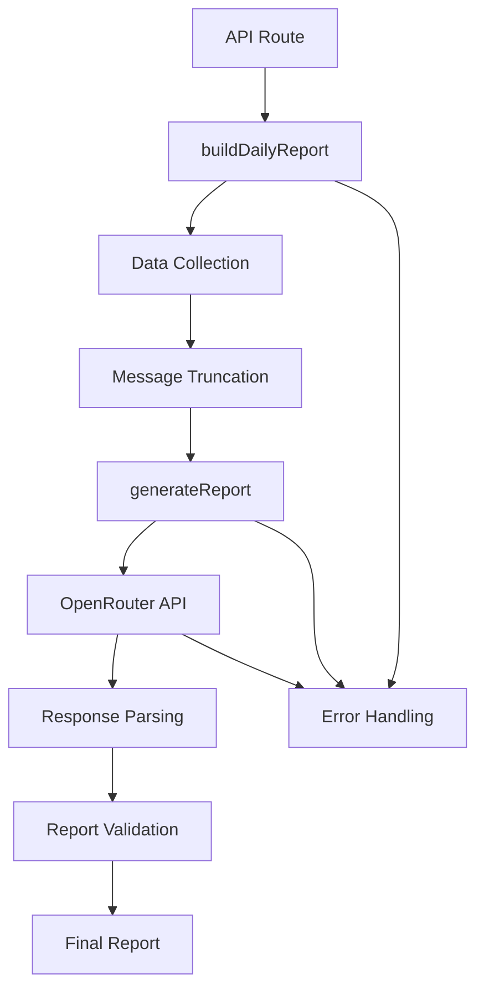
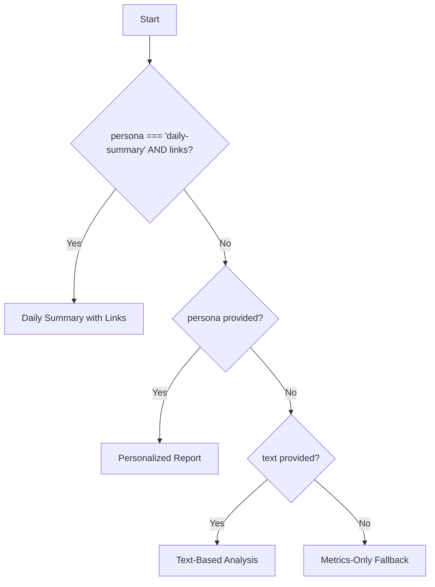
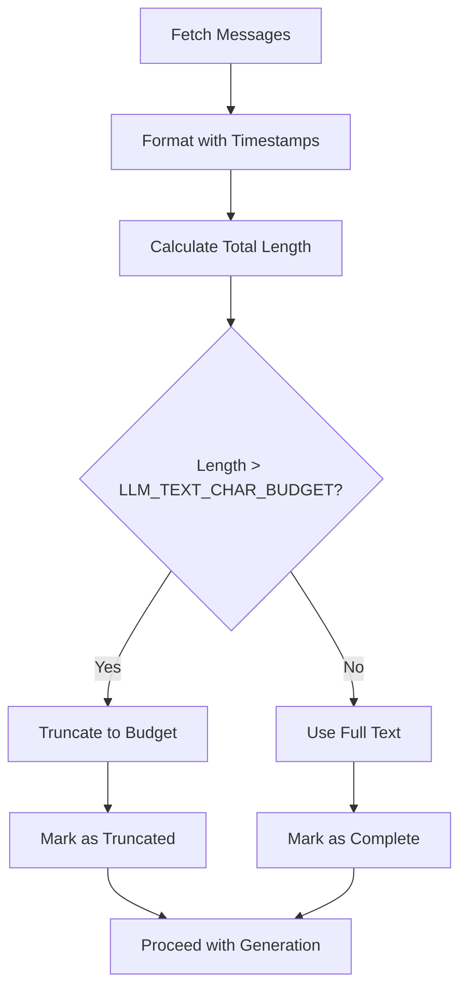
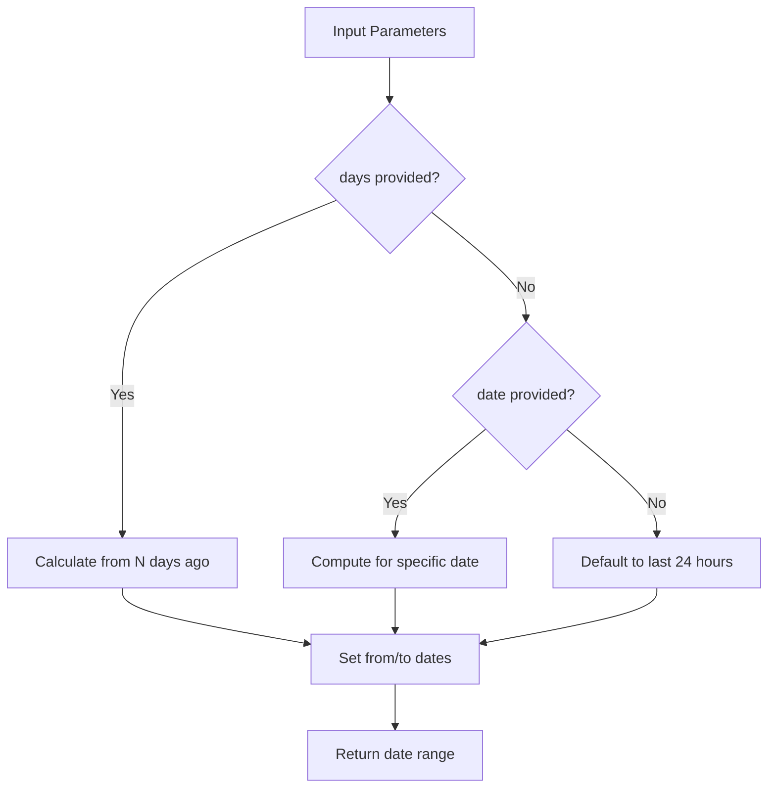
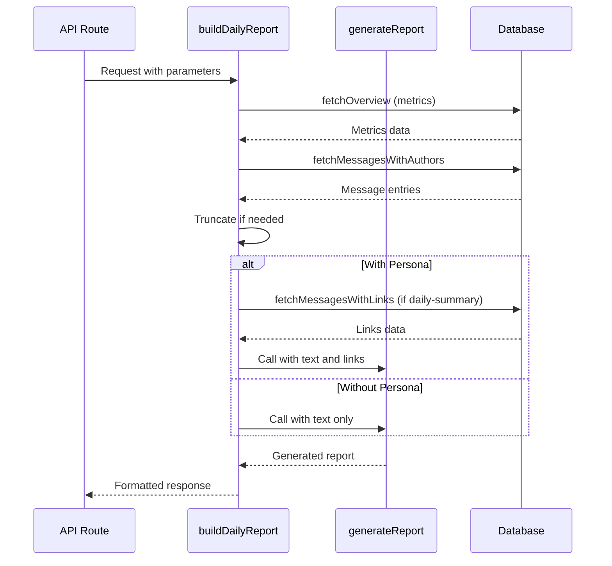
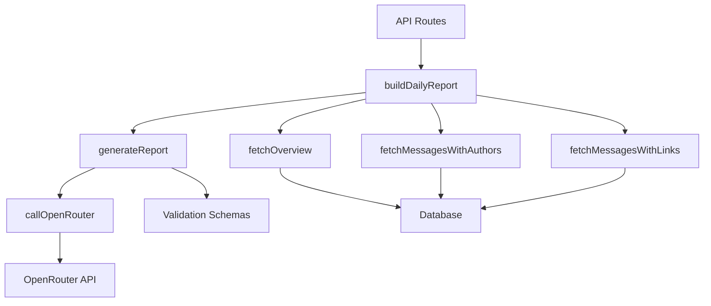

# Report Generation

<cite>
**Referenced Files in This Document**   
- [lib/ai.ts](file://lib/ai.ts)
- [lib/report.ts](file://lib/report.ts)
- [app/api/report/[kind]/route.ts](file://app/api/report/[kind]/route.ts)
- [lib/reportSchemas.ts](file://lib/reportSchemas.ts)
- [lib/queries.ts](file://lib/queries.ts)
- [lib/types.ts](file://lib/types.ts)
- [lib/date-utils.ts](file://lib/date-utils.ts)
</cite>

## Table of Contents
1. [Introduction](#introduction)
2. [Core Components](#core-components)
3. [Architecture Overview](#architecture-overview)
4. [Detailed Component Analysis](#detailed-component-analysis)
5. [Dependency Analysis](#dependency-analysis)
6. [Performance Considerations](#performance-considerations)
7. [Troubleshooting Guide](#troubleshooting-guide)
8. [Conclusion](#conclusion)

## Introduction
The AI-powered report generation system in the tg-ai-vibecoders-summary application provides a unified interface for creating insightful summaries of Telegram chat activity. This document details the implementation of the core `generateReport` function in `lib/ai.ts` and its orchestration through `buildDailyReport` in `lib/report.ts`. The system supports multiple generation strategies including text-based analysis using message transcripts and a metrics-only fallback mode. The documentation covers the invocation relationship between API routes, report orchestration, and AI service layers, along with error handling strategies and common issues.

## Core Components

The report generation system consists of two primary components: the unified `generateReport` function that serves as the AI service layer, and the `buildDailyReport` function that orchestrates the report creation process. These components work together to provide a flexible and robust reporting system that can handle various input types and generate structured JSON responses. The system implements a fallback strategy that gracefully degrades from text-based analysis to metrics-only reporting when necessary, ensuring reliable operation under different conditions.

**Section sources**
- [lib/ai.ts](file://lib/ai.ts#L33-L165)
- [lib/report.ts](file://lib/report.ts#L13-L101)

## Architecture Overview

The report generation system follows a layered architecture with clear separation of concerns. API routes handle HTTP requests and parameter parsing, the report orchestration layer manages data collection and preparation, and the AI service layer handles the actual report generation through LLM integration. This architecture enables flexible configuration and easy extension of reporting capabilities while maintaining a consistent interface.

**Diagram sources**
- [lib/ai.ts](file://lib/ai.ts#L33-L165)
- [lib/report.ts](file://lib/report.ts#L13-L101)
- [app/api/report/[kind]/route.ts](file://app/api/report/[kind]/route.ts#L1-L83)

## Detailed Component Analysis

### generateReport Function Analysis
The `generateReport` function serves as the unified interface for all AI-powered report generation in the application. It replaces multiple deprecated functions, saving approximately 676 lines of code through consolidation. The function implements a strategy pattern that selects the appropriate generation approach based on input parameters, supporting four distinct modes: daily summary with links, personalized reporting, text-based analysis, and metrics-only fallback.

#### Strategy Selection Logic

**Diagram sources**
- [lib/ai.ts](file://lib/ai.ts#L33-L165)

#### Text Truncation and Payload Management
The system implements careful payload management to prevent exceeding LLM token limits. When processing message transcripts, the system truncates text based on the `LLM_TEXT_CHAR_BUDGET` environment variable, defaulting to 80,000 characters. This ensures that the input payload remains within acceptable limits while preserving as much context as possible.

**Diagram sources**
- [lib/report.ts](file://lib/report.ts#L22-L40)

### buildDailyReport Orchestration
The `buildDailyReport` function serves as the primary orchestration layer, coordinating data collection, preparation, and AI processing. It handles date range computation, message fetching, and strategy selection, providing a unified interface for report generation regardless of the requested report type.

#### Date Range Computation
The system supports flexible date range specification through the `computeRange` function, which can handle both specific dates and relative time periods (1 or 7 days). When no parameters are provided, it defaults to the last 24 hours, ensuring sensible behavior for ad-hoc requests.

**Diagram sources**
- [lib/report.ts](file://lib/report.ts#L112-L122)
- [lib/date-utils.ts](file://lib/date-utils.ts#L1-L58)

#### Generation Strategy Flow
The orchestration layer implements a sophisticated strategy selection process that determines the appropriate generation approach based on available data and requested persona. This ensures optimal use of available information while maintaining system reliability.

**Diagram sources**
- [lib/report.ts](file://lib/report.ts#L13-L101)
- [lib/ai.ts](file://lib/ai.ts#L33-L165)

## Dependency Analysis

The report generation system has a well-defined dependency structure that ensures loose coupling between components. The API routes depend on the report orchestration layer, which in turn depends on both data access functions and the AI service layer. This layered dependency structure enables independent testing and modification of each component.

**Diagram sources**
- [app/api/report/[kind]/route.ts](file://app/api/report/[kind]/route.ts#L1-L83)
- [lib/report.ts](file://lib/report.ts#L13-L101)
- [lib/ai.ts](file://lib/ai.ts#L33-L165)
- [lib/queries.ts](file://lib/queries.ts#L1-L382)

## Performance Considerations

The system implements several performance optimizations to ensure responsive operation. Message fetching is limited to 5,000 entries to prevent excessive database load, while link fetching is limited to 500 entries given the typically lower volume of link-containing messages. The text truncation mechanism prevents excessive payload sizes to the LLM API, reducing both processing time and cost. The system also implements verbose logging that can be toggled via the `LLM_DEBUG_VERBOSE` environment variable, allowing for detailed performance analysis when needed without impacting production performance.

## Troubleshooting Guide

The report generation system implements comprehensive error handling at multiple levels to ensure reliability and provide useful diagnostic information. Both `generateReport` and `buildDailyReport` functions use try-catch blocks to handle exceptions, with detailed console logging to aid debugging.

Common issues and their solutions include:

- **API timeouts**: Configured via `OPENROUTER_TIMEOUT_MS` (default 20,000ms), with abort controller integration to prevent hanging requests
- **Response parsing failures**: Handled by the `_parseAIResponse` function, which validates JSON structure and schema compliance
- **Payload size limitations**: Addressed through text truncation based on `LLM_TEXT_CHAR_BUDGET`
- **Invalid date formats**: Detected in `computeDayRange` with descriptive error messages
- **Missing environment variables**: Validated by `validateAIConfig` with clear error messages

The system uses structured logging via `_logOpenRouterCall` to record key information about each API call, including context, metrics, and message lengths (with full message content only in verbose mode). This provides valuable insights for troubleshooting without compromising performance or security.

**Section sources**
- [lib/ai.ts](file://lib/ai.ts#L199-L212)
- [lib/ai.ts](file://lib/ai.ts#L909-L982)
- [lib/ai.ts](file://lib/ai.ts#L177-L196)
- [lib/report.ts](file://lib/report.ts#L13-L101)

## Conclusion

The AI-powered report generation system in tg-ai-vibecoders-summary provides a robust and flexible framework for creating insightful summaries of Telegram chat activity. The unified `generateReport` function successfully consolidates multiple reporting capabilities into a single interface, reducing code complexity by approximately 676 lines while improving maintainability. The orchestration through `buildDailyReport` ensures proper data collection and preparation, with intelligent strategy selection based on available inputs. The system's comprehensive error handling, performance optimizations, and clear architecture make it a reliable component of the application, capable of handling various reporting scenarios from detailed text analysis to metrics-only summaries.