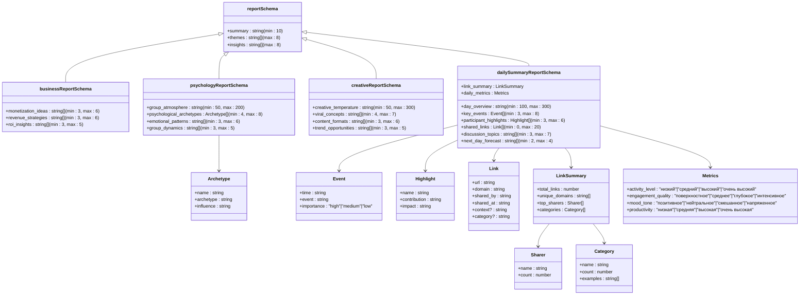
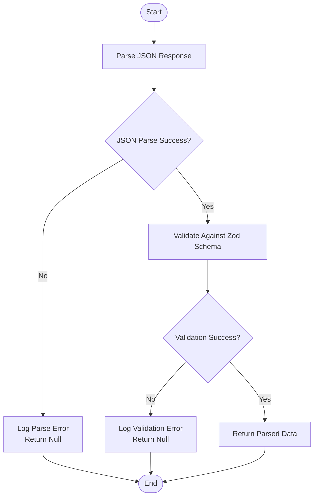
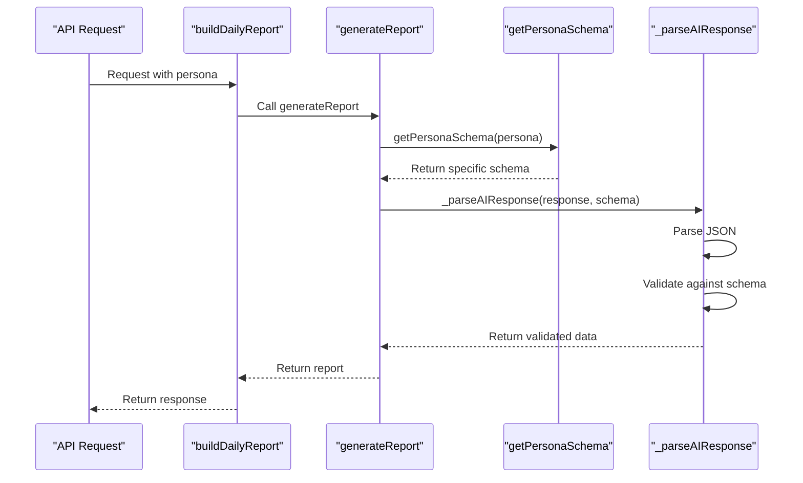
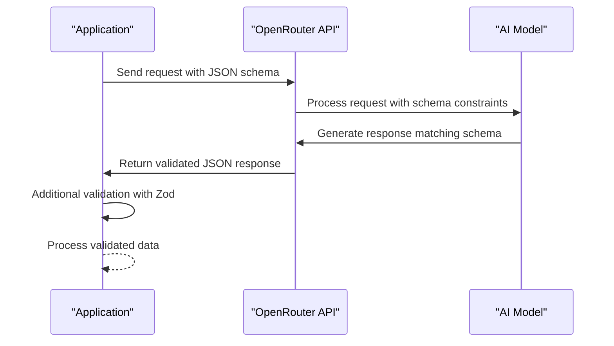

# Schema Validation

<cite>
**Referenced Files in This Document**   
- [reportSchemas.ts](file://lib/reportSchemas.ts)
- [ai.ts](file://lib/ai.ts)
- [types.ts](file://lib/types.ts)
- [report.ts](file://lib/report.ts)
</cite>

## Table of Contents
1. [Introduction](#introduction)
2. [Core Data Models](#core-data-models)
3. [Entity Relationships](#entity-relationships)
4. [Field Definitions and Validation Rules](#field-definitions-and-validation-rules)
5. [JSON Schema Validation Implementation](#json-schema-validation-implementation)
6. [Dynamic Schema Selection](#dynamic-schema-selection)
7. [Sample Data Structures](#sample-data-structures)
8. [OpenRouter Integration](#openrouter-integration)
9. [Performance Considerations](#performance-considerations)
10. [Security Aspects](#security-aspects)

## Introduction
The AI response validation system in the tg-ai-vibecoders-summary application implements a robust schema validation framework using Zod to ensure data integrity and consistency across AI-generated reports. This documentation details the architecture of the validation system, focusing on the entity relationships between different persona-specific schemas (business, psychology, creative, daily-summary) and the base report schema. The system enforces strict type checking through JSON schema validation, providing a reliable mechanism for processing AI responses from external services like OpenRouter. The validation framework is designed to handle various report types with specific structural requirements while maintaining a consistent interface for downstream components.

**Section sources**
- [reportSchemas.ts](file://lib/reportSchemas.ts#L3-L78)
- [ai.ts](file://lib/ai.ts#L33-L165)

## Core Data Models
The validation system is built around a set of Zod schemas that define the structure of AI-generated reports. These schemas represent different personas or report types, each with specific fields and validation rules. The core data models include a base report schema and specialized schemas for business, psychology, creative, and daily-summary personas. Each schema defines the expected structure, data types, and constraints for its respective report type, ensuring that AI responses conform to the expected format before being processed by the application.



**Diagram sources**
- [reportSchemas.ts](file://lib/reportSchemas.ts#L3-L78)
- [types.ts](file://lib/types.ts#L39-L44)

**Section sources**
- [reportSchemas.ts](file://lib/reportSchemas.ts#L3-L78)

## Entity Relationships
The validation system implements a hierarchical relationship between the base report schema and specialized persona schemas. The base schema serves as the foundation for generic reports, while specialized schemas extend this foundation with persona-specific fields and constraints. The entity relationships are designed to support polymorphic behavior, allowing the system to handle different report types through a unified interface. The daily-summary schema represents the most complex entity with nested objects and arrays, while other schemas maintain simpler structures focused on specific domains like business, psychology, or creative content.

```mermaid
erDiagram
reportSchema ||--o{ businessReportSchema : "extends"
reportSchema ||--o{ psychologyReportSchema : "extends"
reportSchema ||--o{ creativeReportSchema : "extends"
reportSchema ||--o{ dailySummaryReportSchema : "extends"
psychologyReportSchema ||--o{ Archetype : "contains"
dailySummaryReportSchema ||--o{ Event : "contains"
dailySummaryReportSchema ||--o{ Highlight : "contains"
dailySummaryReportSchema ||--o{ Link : "contains"
dailySummaryReportSchema ||--o{ LinkSummary : "contains"
LinkSummary ||--o{ Sharer : "contains"
LinkSummary ||--o{ Category : "contains"
dailySummaryReportSchema ||--o{ Metrics : "contains"
class reportSchema {
summary: string
themes: string[]
insights: string[]
}
class businessReportSchema {
monetization_ideas: string[]
revenue_strategies: string[]
roi_insights: string[]
}
class psychologyReportSchema {
group_atmosphere: string
psychological_archetypes: Archetype[]
emotional_patterns: string[]
group_dynamics: string[]
}
class creativeReportSchema {
creative_temperature: string
viral_concepts: string[]
content_formats: string[]
trend_opportunities: string[]
}
class dailySummaryReportSchema {
day_overview: string
key_events: Event[]
participant_highlights: Highlight[]
shared_links: Link[]
link_summary: LinkSummary
discussion_topics: string[]
daily_metrics: Metrics
next_day_forecast: string[]
}
```

**Diagram sources**
- [reportSchemas.ts](file://lib/reportSchemas.ts#L3-L78)
- [types.ts](file://lib/types.ts#L39-L44)

**Section sources**
- [reportSchemas.ts](file://lib/reportSchemas.ts#L3-L78)

## Field Definitions and Validation Rules
Each schema in the validation system defines specific fields with precise validation rules to ensure data quality and consistency. The validation rules include string length constraints, array item limits, required properties, and enumerated values. These rules are implemented using Zod's validation methods, providing a declarative way to define the expected structure and constraints for each report type. The system enforces minimum and maximum lengths for string fields, minimum and maximum item counts for arrays, and specific value ranges for enumerated fields.

### Base Report Schema Rules
- **summary**: String with minimum length of 10 characters
- **themes**: Array of strings with maximum length of 8 items
- **insights**: Array of strings with maximum length of 8 items

### Business Report Schema Rules
- **monetization_ideas**: Array of strings with 3-6 items
- **revenue_strategies**: Array of strings with 3-6 items
- **roi_insights**: Array of strings with 3-5 items

### Psychology Report Schema Rules
- **group_atmosphere**: String with 50-200 characters
- **psychological_archetypes**: Array of objects with 4-8 items, each containing name, archetype, and influence fields
- **emotional_patterns**: Array of strings with 3-6 items
- **group_dynamics**: Array of strings with 3-5 items

### Creative Report Schema Rules
- **creative_temperature**: String with 50-300 characters
- **viral_concepts**: Array of strings with 4-7 items
- **content_formats**: Array of strings with 3-6 items
- **trend_opportunities**: Array of strings with 3-5 items

### Daily Summary Report Schema Rules
- **day_overview**: String with 100-300 characters
- **key_events**: Array of objects with 3-8 items, each containing time, event, and importance fields (importance must be "high", "medium", or "low")
- **participant_highlights**: Array of objects with 3-6 items, each containing name, contribution, and impact fields
- **shared_links**: Array of objects with 0-20 items, each containing url, domain, shared_by, shared_at, context (optional), and category (optional) fields
- **link_summary**: Object containing total_links (number), unique_domains (string array), top_sharers (array of objects with name and count), and categories (array of objects with name, count, and examples)
- **discussion_topics**: Array of strings with 3-7 items
- **daily_metrics**: Object containing activity_level, engagement_quality, mood_tone, and productivity fields with specific enumerated values
- **next_day_forecast**: Array of strings with 2-4 items

**Section sources**
- [reportSchemas.ts](file://lib/reportSchemas.ts#L3-L78)

## JSON Schema Validation Implementation
The JSON schema validation is implemented through the `_parseAIResponse` function in `lib/ai.ts`, which handles the parsing and validation of AI responses. This function first attempts to parse the JSON response from the AI service, then validates the parsed data against the appropriate Zod schema. The validation process includes error handling for both JSON parsing failures and schema validation mismatches, ensuring that invalid responses are properly handled and logged.



**Diagram sources**
- [ai.ts](file://lib/ai.ts#L177-L196)

**Section sources**
- [ai.ts](file://lib/ai.ts#L177-L196)

## Dynamic Schema Selection
The system implements dynamic schema selection through the `getPersonaSchema` and `getPersonaJsonSchema` helper functions, which determine the appropriate validation rules based on the requested persona. These functions use a switch statement to return the corresponding schema for each persona type, enabling the system to adapt its validation behavior to different report types. The dynamic selection mechanism allows the application to handle various AI response formats while maintaining a consistent validation interface.



**Diagram sources**
- [ai.ts](file://lib/ai.ts#L341-L357)
- [ai.ts](file://lib/ai.ts#L408-L553)
- [ai.ts](file://lib/ai.ts#L177-L196)

**Section sources**
- [ai.ts](file://lib/ai.ts#L341-L357)
- [ai.ts](file://lib/ai.ts#L408-L553)

## Sample Data Structures
The validation system supports various data structures for different report types, each with specific field definitions and validation rules. These sample data structures illustrate the expected format for each persona type, demonstrating how the validation rules are applied to ensure data consistency and quality.

### Business Report Sample
```json
{
  "monetization_ideas": [
    "Premium subscription model: $9.99/month for exclusive content",
    "Affiliate marketing program: 15% commission on recommended tools",
    "Sponsored content packages: $500 per post for industry partners"
  ],
  "revenue_strategies": [
    "Membership tiers with escalating benefits",
    "Digital product marketplace for community creators",
    "Corporate training programs for enterprise clients"
  ],
  "roi_insights": [
    "Current engagement suggests 5-7% conversion rate potential",
    "High-value members contribute 80% of total revenue",
    "Content promotion generates 3x ROI on advertising spend"
  ]
}
```

### Psychology Report Sample
```json
{
  "group_atmosphere": "Supportive and collaborative with occasional competitive elements",
  "psychological_archetypes": [
    {
      "name": "Alex",
      "archetype": "Leader",
      "influence": "Sets agenda and drives discussions forward"
    },
    {
      "name": "Maria",
      "archetype": "Mentor",
      "influence": "Provides guidance and support to newer members"
    }
  ],
  "emotional_patterns": [
    "Enthusiasm peaks during new project announcements",
    "Frustration emerges when technical issues disrupt workflow",
    "Pride in collective achievements and milestones"
  ],
  "group_dynamics": [
    "Strong peer-to-peer support network",
    "Informal leadership structure with multiple influencers",
    "Healthy debate with constructive criticism"
  ]
}
```

### Daily Summary Report Sample
```json
{
  "day_overview": "Active day with multiple discussions on project updates and technical challenges. Key contributors shared valuable insights and resources.",
  "key_events": [
    {
      "time": "09:15",
      "event": "Project status update shared by team lead",
      "importance": "high"
    },
    {
      "time": "14:30",
      "event": "Technical solution proposed for current blocker",
      "importance": "medium"
    }
  ],
  "participant_highlights": [
    {
      "name": "John",
      "contribution": "Shared comprehensive solution to technical problem",
      "impact": "Unblocked team progress on critical feature"
    }
  ],
  "shared_links": [
    {
      "url": "https://example.com/article",
      "domain": "example.com",
      "shared_by": "Sarah",
      "shared_at": "11:20",
      "context": "Relevant to current discussion on optimization techniques",
      "category": "обучение"
    }
  ],
  "link_summary": {
    "total_links": 12,
    "unique_domains": ["example.com", "tutorial.org", "docs.net"],
    "top_sharers": [
      {
        "name": "Sarah",
        "count": 5
      }
    ],
    "categories": [
      {
        "name": "обучение",
        "count": 8,
        "examples": ["example.com", "tutorial.org"]
      }
    ]
  },
  "discussion_topics": [
    "Project timeline adjustments",
    "Technical architecture decisions",
    "Team collaboration improvements"
  ],
  "daily_metrics": {
    "activity_level": "высокий",
    "engagement_quality": "глубокое",
    "mood_tone": "позитивное",
    "productivity": "высокая"
  },
  "next_day_forecast": [
    "Continue technical deep dive on architecture options",
    "Schedule team sync for project timeline review"
  ]
}
```

**Section sources**
- [reportSchemas.ts](file://lib/reportSchemas.ts#L3-L78)

## OpenRouter Integration
The validation system is integrated with OpenRouter's JSON schema response format to ensure that AI responses conform to the expected structure before being processed by the application. When making requests to OpenRouter, the system specifies a JSON schema in the request payload, instructing the AI service to generate responses that match the defined structure. This integration provides an additional layer of validation at the API level, reducing the likelihood of receiving malformed responses that would fail schema validation.



**Diagram sources**
- [ai.ts](file://lib/ai.ts#L33-L165)

**Section sources**
- [ai.ts](file://lib/ai.ts#L33-L165)

## Performance Considerations
The schema validation system has several performance considerations that impact the overall efficiency of the application. Schema compilation occurs at startup, with Zod schemas being compiled once and reused for subsequent validation operations. This approach minimizes the performance overhead of schema compilation during runtime. The validation process itself is optimized to handle large JSON responses efficiently, with early termination on validation failures to avoid unnecessary processing. The system also implements response truncation for specific fields like creative_temperature to prevent excessive data processing and storage.

**Section sources**
- [ai.ts](file://lib/ai.ts#L150-L152)
- [ai.ts](file://lib/ai.ts#L33-L165)

## Security Aspects
The validation system implements several security measures to protect against potential vulnerabilities when processing external AI responses. Strict type enforcement through Zod schemas prevents injection attacks by ensuring that only data matching the expected structure and types is accepted. The system validates all string fields for length constraints, preventing denial-of-service attacks through excessively large responses. Enumerated values are strictly enforced for fields with limited options, preventing unauthorized values from being accepted. Additionally, the system implements comprehensive error handling and logging to detect and respond to validation failures, providing visibility into potential security issues.

**Section sources**
- [reportSchemas.ts](file://lib/reportSchemas.ts#L3-L78)
- [ai.ts](file://lib/ai.ts#L177-L196)