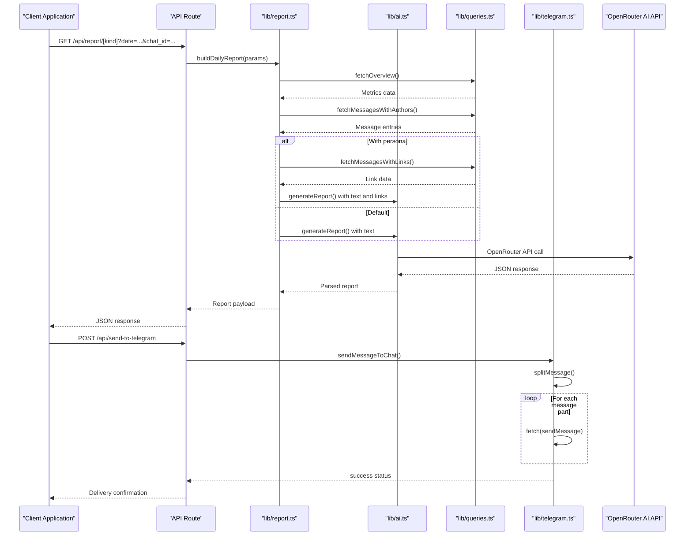
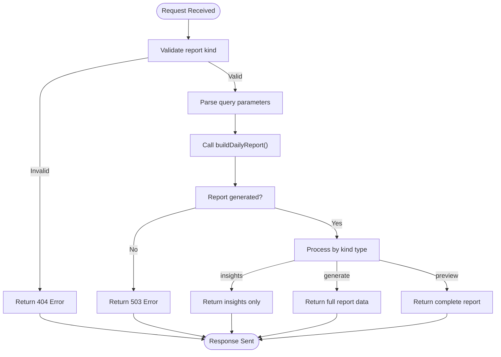
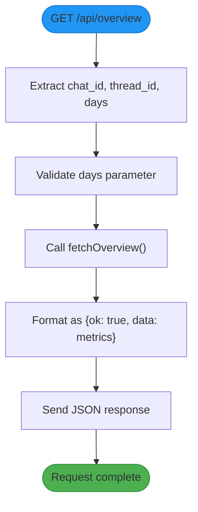
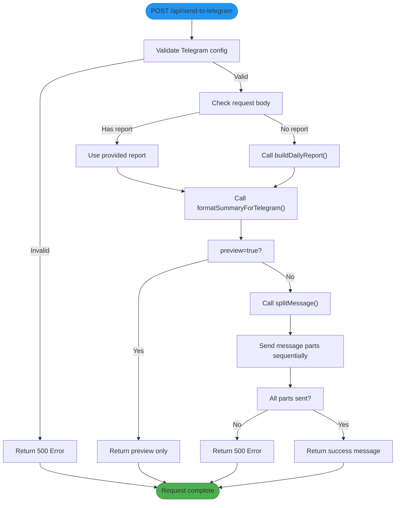
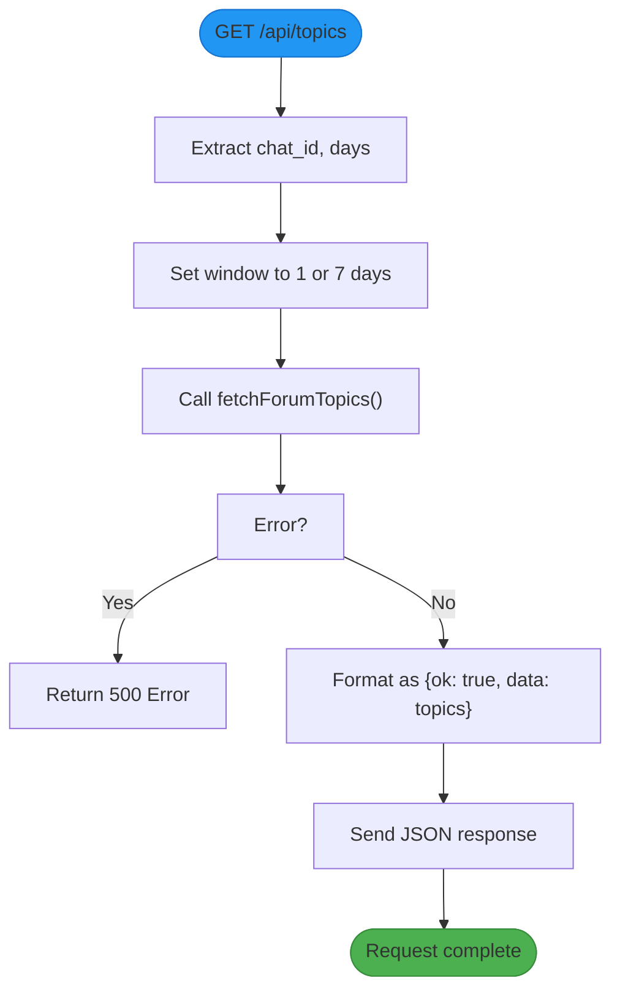
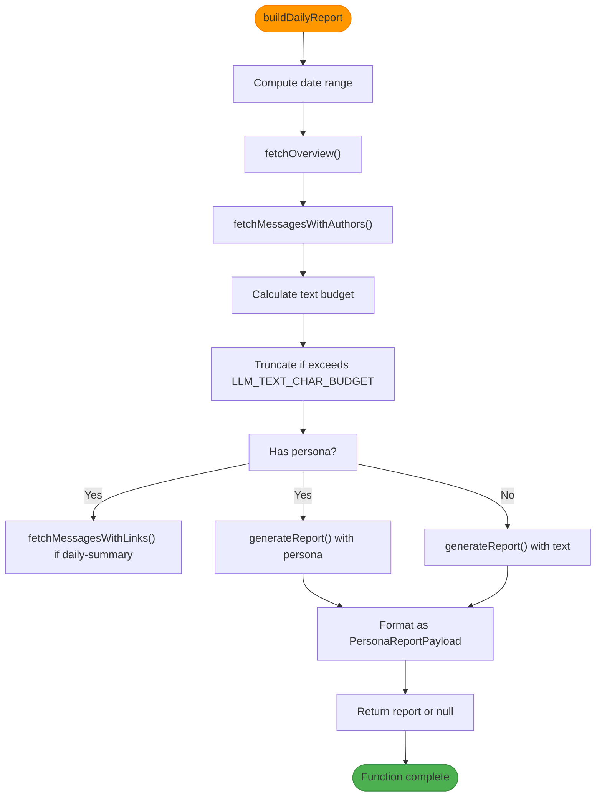
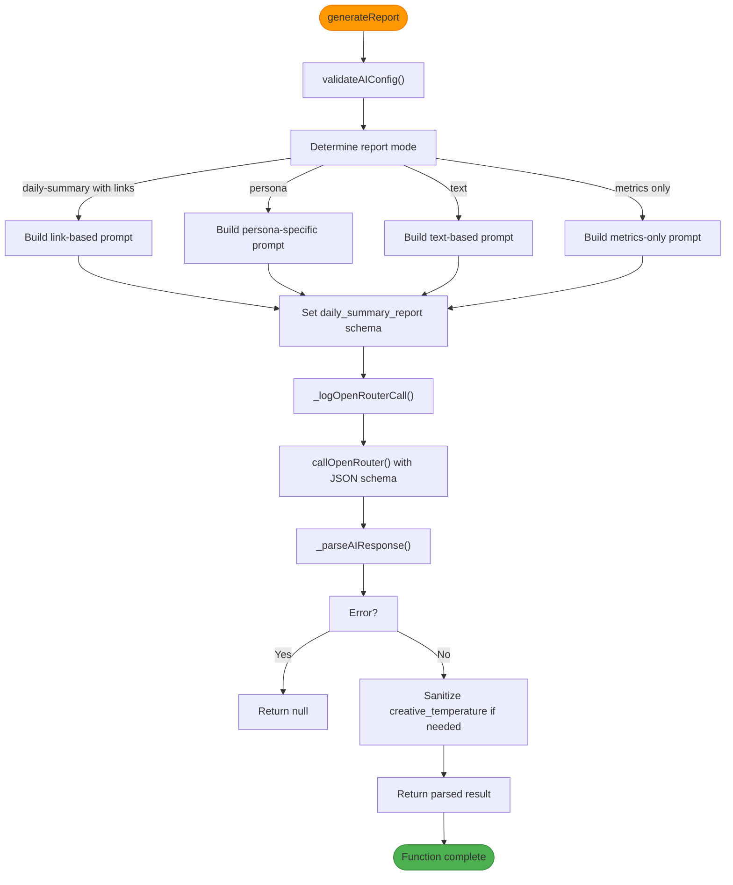
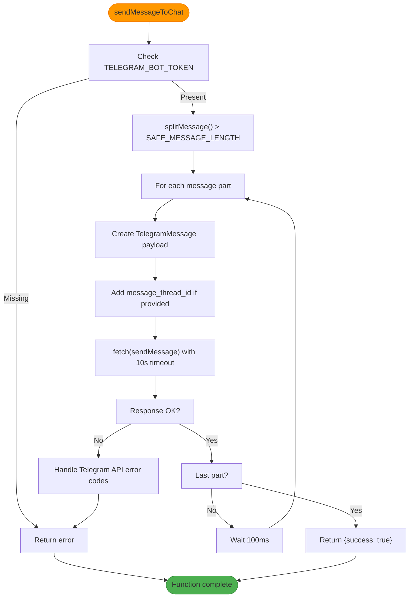
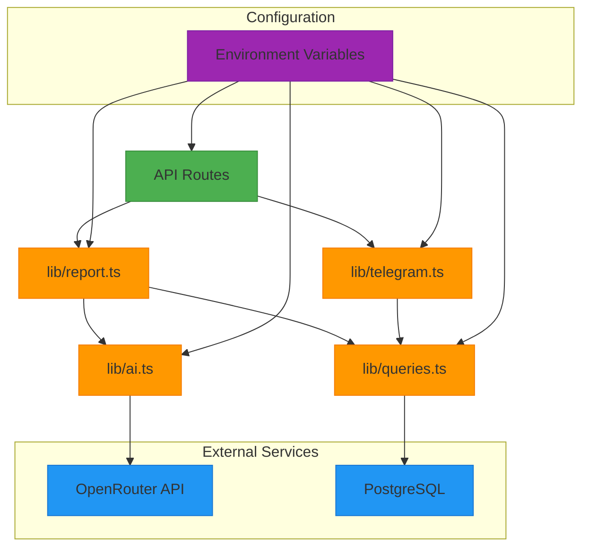

# API Overview

<cite>
**Referenced Files in This Document**   
- [app/api/report/[kind]/route.ts](file://app/api/report/[kind]/route.ts)
- [app/api/overview/route.ts](file://app/api/overview/route.ts)
- [app/api/send-to-telegram/route.ts](file://app/api/send-to-telegram/route.ts)
- [app/api/topics/route.ts](file://app/api/topics/route.ts)
- [lib/report.ts](file://lib/report.ts)
- [lib/ai.ts](file://lib/ai.ts)
- [lib/telegram.ts](file://lib/telegram.ts)
- [lib/queries.ts](file://lib/queries.ts)
- [lib/types.ts](file://lib/types.ts)
</cite>

## Table of Contents
1. [Introduction](#introduction)
2. [Project Structure](#project-structure)
3. [Core Components](#core-components)
4. [Architecture Overview](#architecture-overview)
5. [Detailed Component Analysis](#detailed-component-analysis)
6. [Dependency Analysis](#dependency-analysis)
7. [Performance Considerations](#performance-considerations)
8. [Troubleshooting Guide](#troubleshooting-guide)
9. [Conclusion](#conclusion)

## Introduction
The tg-ai-vibecoders-summary application is a backend API layer built using Next.js App Router that generates AI-powered summaries of Telegram chat activity. The system orchestrates data flow from a PostgreSQL database through business logic and AI processing to deliver structured reports via API endpoints. This documentation provides an architectural overview of the API layer, detailing endpoint responsibilities, request/response patterns, integration with service layers, and infrastructure considerations.

## Project Structure

```mermaid
graph TD
subgraph "API Endpoints"
A[/api/overview]
B[/api/report/[kind]]
C[/api/send-to-telegram]
D[/api/topics]
end
subgraph "Service Layer"
E[lib/report.ts]
F[lib/ai.ts]
G[lib/telegram.ts]
H[lib/queries.ts]
end
subgraph "Data Layer"
I[PostgreSQL Database]
end
A --> H
B --> E
C --> E
C --> G
E --> F
E --> H
H --> I
G --> I
style A fill:#4CAF50,stroke:#388E3C
style B fill:#4CAF50,stroke:#388E3C
style C fill:#4CAF50,stroke:#388E3C
style D fill:#4CAF50,stroke:#388E3C
```

**Diagram sources**
- [app/api/overview/route.ts](file://app/api/overview/route.ts)
- [app/api/report/[kind]/route.ts](file://app/api/report/[kind]/route.ts)
- [app/api/send-to-telegram/route.ts](file://app/api/send-to-telegram/route.ts)
- [app/api/topics/route.ts](file://app/api/topics/route.ts)
- [lib/report.ts](file://lib/report.ts)
- [lib/ai.ts](file://lib/ai.ts)
- [lib/telegram.ts](file://lib/telegram.ts)
- [lib/queries.ts](file://lib/queries.ts)

**Section sources**
- [app/api](file://app/api)
- [lib](file://lib)

## Core Components

The core components of the API layer include the report generation engine, AI integration service, Telegram messaging service, and database query layer. These components work together to process chat data, generate insights through AI analysis, and deliver formatted summaries to Telegram channels. The system follows a clean separation of concerns with API routes handling HTTP requests, service modules implementing business logic, and utility libraries managing external integrations.

**Section sources**
- [lib/report.ts](file://lib/report.ts#L13-L101)
- [lib/ai.ts](file://lib/ai.ts#L33-L165)
- [lib/telegram.ts](file://lib/telegram.ts#L405-L473)
- [lib/queries.ts](file://lib/queries.ts#L11-L115)

## Architecture Overview



**Diagram sources**
- [app/api/report/[kind]/route.ts](file://app/api/report/[kind]/route.ts)
- [lib/report.ts](file://lib/report.ts)
- [lib/ai.ts](file://lib/ai.ts)
- [lib/queries.ts](file://lib/queries.ts)
- [lib/telegram.ts](file://lib/telegram.ts)

## Detailed Component Analysis

### API Endpoint Analysis

#### Report Generation Endpoint
The `/api/report/[kind]` endpoint serves as the primary interface for generating AI-powered summaries of Telegram chat activity. It accepts various query parameters to customize the report generation process.



**Diagram sources**
- [app/api/report/[kind]/route.ts](file://app/api/report/[kind]/route.ts#L1-L83)

**Section sources**
- [app/api/report/[kind]/route.ts](file://app/api/report/[kind]/route.ts#L1-L83)

#### Overview Endpoint
The `/api/overview` endpoint provides basic metrics about chat activity without AI processing. It serves as a lightweight alternative for applications that need quick access to statistical data.



**Diagram sources**
- [app/api/overview/route.ts](file://app/api/overview/route.ts#L1-L22)

**Section sources**
- [app/api/overview/route.ts](file://app/api/overview/route.ts#L1-L22)

#### Send to Telegram Endpoint
The `/api/send-to-telegram` endpoint orchestrates the complete workflow of generating a report and sending it to a Telegram channel. It handles both report generation and message delivery with comprehensive error handling.



**Diagram sources**
- [app/api/send-to-telegram/route.ts](file://app/api/send-to-telegram/route.ts#L1-L151)

**Section sources**
- [app/api/send-to-telegram/route.ts](file://app/api/send-to-telegram/route.ts#L1-L151)

#### Topics Endpoint
The `/api/topics` endpoint retrieves information about active discussion threads in the Telegram chat, providing insights into the most popular conversation topics.



**Diagram sources**
- [app/api/topics/route.ts](file://app/api/topics/route.ts#L1-L21)

**Section sources**
- [app/api/topics/route.ts](file://app/api/topics/route.ts#L1-L21)

### Service Layer Analysis

#### Report Generation Service
The `buildDailyReport` function in `lib/report.ts` serves as the central orchestrator for report generation, coordinating data retrieval, AI processing, and result formatting.



**Diagram sources**
- [lib/report.ts](file://lib/report.ts#L13-L101)

**Section sources**
- [lib/report.ts](file://lib/report.ts#L13-L101)

#### AI Integration Service
The `generateReport` function in `lib/ai.ts` manages the interaction with the OpenRouter AI API, handling prompt construction, response validation, and error recovery.



**Diagram sources**
- [lib/ai.ts](file://lib/ai.ts#L33-L165)

**Section sources**
- [lib/ai.ts](file://lib/ai.ts#L33-L165)

#### Telegram Messaging Service
The `sendMessageToChat` function in `lib/telegram.ts` handles the delivery of formatted messages to Telegram channels with proper error handling and rate limiting.



**Diagram sources**
- [lib/telegram.ts](file://lib/telegram.ts#L405-L473)

**Section sources**
- [lib/telegram.ts](file://lib/telegram.ts#L405-L473)

## Dependency Analysis



**Diagram sources**
- [app/api](file://app/api)
- [lib](file://lib)
- [package.json](file://package.json)

**Section sources**
- [package.json](file://package.json#L1-L10)

## Performance Considerations

The API layer implements several performance optimizations to handle large volumes of chat data efficiently. The system uses a text character budget controlled by the LLM_TEXT_CHAR_BUDGET environment variable (default 80,000 characters) to prevent excessive AI processing costs. Message retrieval is limited to 5,000 entries in `fetchMessagesWithAuthors` and 500 in `fetchMessagesWithLinks` to maintain response times. The Telegram message sender splits long messages at 4,000 characters (SAFE_MESSAGE_LENGTH) to comply with Telegram's message size limits and includes a 100ms delay between message parts to avoid rate limiting. The AI service calls include a timeout mechanism, and database queries are optimized with appropriate indexing on sent_at, chat_id, and message_thread_id fields.

**Section sources**
- [lib/report.ts](file://lib/report.ts#L25-L30)
- [lib/telegram.ts](file://lib/telegram.ts#L10-L11)
- [lib/queries.ts](file://lib/queries.ts#L20-L25)

## Troubleshooting Guide

Common issues with the API layer typically involve configuration errors, service timeouts, or data retrieval problems. Configuration issues often stem from missing environment variables such as OPENROUTER_API_KEY, OPENROUTER_MODEL, TELEGRAM_BOT_TOKEN, or TELEGRAM_CHAT_ID, which will result in 500 or 503 status codes. AI service failures may occur due to network connectivity issues with OpenRouter or invalid API keys, with detailed error logging in the console. Database connectivity problems can arise from an invalid DATABASE_URL, and the system includes global connection pooling to manage database resources efficiently. Telegram message delivery failures may result from incorrect chat IDs, missing bot permissions, or message formatting issues, with specific error codes returned from the Telegram API (400 for invalid requests, 401 for unauthorized, 403 for forbidden). The system implements comprehensive error handling with descriptive messages to aid in troubleshooting.

**Section sources**
- [lib/ai.ts](file://lib/ai.ts#L15-L25)
- [lib/telegram.ts](file://lib/telegram.ts#L30-L50)
- [lib/db.ts](file://lib/db.ts#L1-L10)

## Conclusion

The tg-ai-vibecoders-summary backend API layer demonstrates a well-structured architecture that effectively orchestrates data flow from database to AI processing to external service delivery. The system follows clean separation of concerns with distinct API routes, service modules, and utility libraries. Key strengths include flexible report generation with multiple persona types, robust error handling, and efficient resource management. The architecture supports various query parameters (chat_id, days, date, threadId) to customize data retrieval and report generation. Security is maintained through environment variable protection and input validation. The system handles infrastructure considerations like timeout management (10-second timeout for Telegram API calls) and rate limiting (100ms delay between message parts). This documentation provides a comprehensive overview of the API layer's design, enabling effective maintenance and future enhancements.