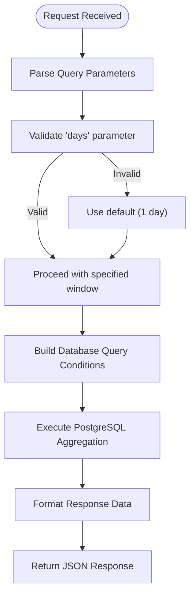
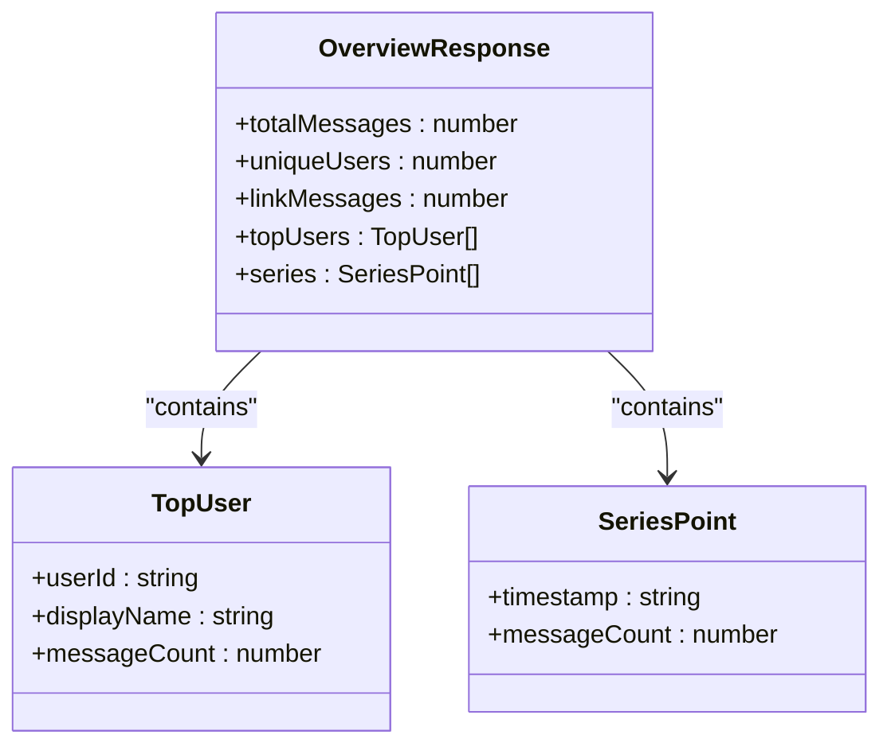
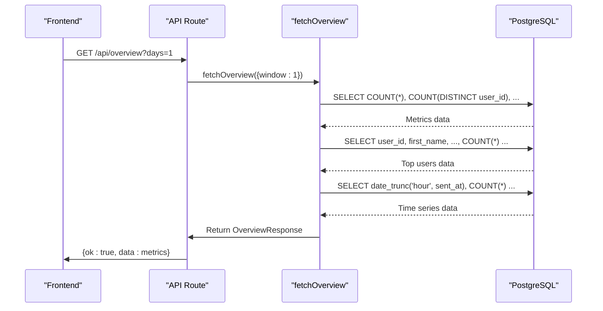

# Overview API

<cite>
**Referenced Files in This Document**   
- [route.ts](file://app/api/overview/route.ts)
- [queries.ts](file://lib/queries.ts)
- [types.ts](file://lib/types.ts)
- [top-users.tsx](file://components/top-users.tsx)
- [metric-card.tsx](file://components/metric-card.tsx)
</cite>

## Table of Contents
1. [Introduction](#introduction)
2. [API Endpoint Specification](#api-endpoint-specification)
3. [Response Schema](#response-schema)
4. [Data Aggregation Logic](#data-aggregation-logic)
5. [Frontend Integration](#frontend-integration)
6. [Performance Considerations](#performance-considerations)
7. [Error Handling](#error-handling)
8. [Usage Patterns](#usage-patterns)

## Introduction
The `/api/overview` endpoint provides comprehensive analytics for Telegram chat activity within the tg-ai-vibecoders-summary application. This API endpoint serves as the primary data source for the application's dashboard, delivering aggregated message metrics and user engagement statistics. The endpoint supports flexible time window filtering and can be scoped to specific chat or thread contexts, enabling detailed analysis of communication patterns in group discussions.

**Section sources**
- [route.ts](file://app/api/overview/route.ts#L1-L23)
- [queries.ts](file://lib/queries.ts#L11-L115)

## API Endpoint Specification

### HTTP Method and URL Pattern
- **Method**: GET
- **URL Pattern**: `/api/overview`

### Query Parameters
The endpoint accepts the following query parameters to filter and scope the analytics data:

| Parameter | Type | Required | Description | Valid Values |
|---------|------|----------|-------------|-------------|
| `chat_id` | string | No | Filters metrics to a specific chat | Any valid chat ID |
| `thread_id` | string | No | Filters metrics to a specific message thread | Any valid thread ID |
| `days` | number | No | Specifies the time window for data aggregation | 1 (24 hours), 7 (7 days) |

When no parameters are provided, the endpoint returns data for the last 24 hours across all chats. The `days` parameter is restricted to values of 1 or 7 to prevent arbitrary time window requests and ensure predictable performance.



**Diagram sources**
- [route.ts](file://app/api/overview/route.ts#L10-L22)
- [queries.ts](file://lib/queries.ts#L13-L27)

**Section sources**
- [route.ts](file://app/api/overview/route.ts#L10-L22)

## Response Schema

The endpoint returns data structured according to the `OverviewResponse` type, which contains comprehensive metrics about chat activity.

### OverviewResponse Structure


**Diagram sources**
- [types.ts](file://lib/types.ts#L18-L24)
- [types.ts](file://lib/types.ts#L0-L4)
- [types.ts](file://lib/types.ts#L6-L9)

**Section sources**
- [types.ts](file://lib/types.ts#L18-L24)

### Field Descriptions

| Field | Type | Description |
|------|------|-------------|
| `totalMessages` | number | Total count of messages in the specified time window and scope |
| `uniqueUsers` | number | Count of distinct users who sent messages |
| `linkMessages` | number | Count of messages containing URLs |
| `topUsers` | TopUser[] | Array of the top 10 most active users |
| `series` | SeriesPoint[] | Time-series data showing message volume over time |

The `topUsers` array contains objects with user identifiers, display names (constructed from first/last name or username), and their individual message counts. The `series` array provides time-series data points with timestamps and corresponding message counts, enabling visualization of activity patterns throughout the day or week.

## Data Aggregation Logic

The `/api/overview` endpoint leverages the `fetchOverview` function from `lib/queries.ts` to aggregate message metrics from PostgreSQL. This function implements sophisticated query building and data processing to efficiently retrieve analytics data.

### Query Building Process
The function dynamically constructs SQL queries based on the provided parameters:

1. **Time Window Handling**: When `from` and `to` parameters are provided, the query uses exact date filtering. Otherwise, it uses relative time windows (1 or 7 days) with `NOW() - interval`.
2. **Conditional Filtering**: The function builds a WHERE clause with conditions for chat ID, thread ID, and time constraints.
3. **Parameterized Queries**: All user inputs are properly parameterized to prevent SQL injection.

### Database Aggregation
The implementation executes three separate queries to gather different aspects of the analytics data:

1. **Metrics Query**: Aggregates total messages, unique users, and link-containing messages using COUNT functions with appropriate filters.
2. **Top Users Query**: Joins the messages and users tables to identify the most active participants, ordered by message count.
3. **Time Series Query**: Uses `date_trunc` to group messages into time buckets (hourly for 1-day windows, daily for 7-day windows) for trend analysis.



**Diagram sources**
- [queries.ts](file://lib/queries.ts#L11-L115)
- [route.ts](file://app/api/overview/route.ts#L1-L23)

**Section sources**
- [queries.ts](file://lib/queries.ts#L11-L115)

## Frontend Integration

The analytics data from `/api/overview` is consumed by several frontend components to create a comprehensive dashboard experience.

### Component Usage
The `TopUsers` component renders the top participants list, while `MetricCard` components display the key metrics. These components are designed to handle the structured data returned by the API.

```mermaid
graph TB
API[/api/overview] --> |JSON Response| Dashboard[Dashboard Page]
Dashboard --> MetricCard1[MetricCard: Total Messages]
Dashboard --> MetricCard2[MetricCard: Unique Users]
Dashboard --> MetricCard3[MetricCard: Links Shared]
Dashboard --> TopUsers[TopUsers Component]
Dashboard --> Chart[Time Series Chart]
TopUsers --> |topUsers data| UserList[User List UI]
Chart --> |series data| LineChart[Line Chart Visualization]
```

**Diagram sources**
- [top-users.tsx](file://components/top-users.tsx#L1-L30)
- [metric-card.tsx](file://components/metric-card.tsx#L1-L16)

**Section sources**
- [top-users.tsx](file://components/top-users.tsx#L1-L30)
- [metric-card.tsx](file://components/metric-card.tsx#L1-L16)

### Data Flow
The frontend fetches data from the API endpoint and passes it directly to specialized components:
- The `totalMessages`, `uniqueUsers`, and `linkMessages` fields are displayed in separate `MetricCard` components
- The `topUsers` array is passed to the `TopUsers` component for rendering a ranked list
- The `series` array is used to generate time-series charts showing message volume trends

## Performance Considerations

The `/api/overview` endpoint is designed with performance in mind, particularly when handling large datasets from active Telegram chats.

### Query Optimization
- **Index Utilization**: The queries are structured to leverage database indexes on `sent_at`, `chat_id`, and `message_thread_id` columns.
- **Efficient Aggregation**: PostgreSQL's built-in aggregation functions (COUNT, GROUP BY) are used to minimize data transfer.
- **Limited Result Sets**: The top users query is limited to 10 results, and time-series data is pre-aggregated at the database level.

### Time Window Strategy
The endpoint uses different time bucketing strategies based on the selected window:
- For 1-day windows: Hourly buckets to show detailed activity patterns throughout the day
- For 7-day windows: Daily buckets to show weekly trends without overwhelming the client

This adaptive approach ensures that the amount of data transferred remains manageable regardless of the time window.

### Scalability Notes
For extremely large datasets, consider implementing:
- Server-side caching of recent results
- Pagination for top users beyond the top 10
- Sampling strategies for very large time windows
- Database materialized views for frequently accessed metrics

## Error Handling

The endpoint implements robust error handling to ensure reliable operation.

### Error Response
When an error occurs during data retrieval, the endpoint returns a 500 Internal Server Error with a standardized response:
```json
{
  "ok": false,
  "error": "Failed to fetch overview"
}
```

The error is also logged to the server console for debugging purposes.

### Failure Modes
Potential failure points include:
- Database connection issues
- Query execution errors
- Invalid parameter parsing

The try-catch block in the route handler ensures that all errors are caught and converted to appropriate HTTP responses, preventing unhandled exceptions from crashing the server.

**Section sources**
- [route.ts](file://app/api/overview/route.ts#L18-L22)

## Usage Patterns

The `/api/overview` endpoint supports several usage patterns for real-time analytics:

### Real-time Dashboard Updates
The endpoint is typically called when the dashboard loads and can be polled periodically to show up-to-date statistics. The 1-day window is ideal for monitoring current activity, while the 7-day window provides context for weekly trends.

### Contextual Analysis
By specifying `chat_id` and `thread_id` parameters, users can analyze specific conversations or sub-threads within larger chats, enabling focused examination of particular discussion topics.

### Comparative Analysis
Applications can make multiple requests with different parameters to compare metrics across different time periods or chat contexts, facilitating deeper insights into communication patterns.

The endpoint's design balances flexibility with performance, making it suitable for both real-time monitoring and historical analysis of Telegram chat activity.