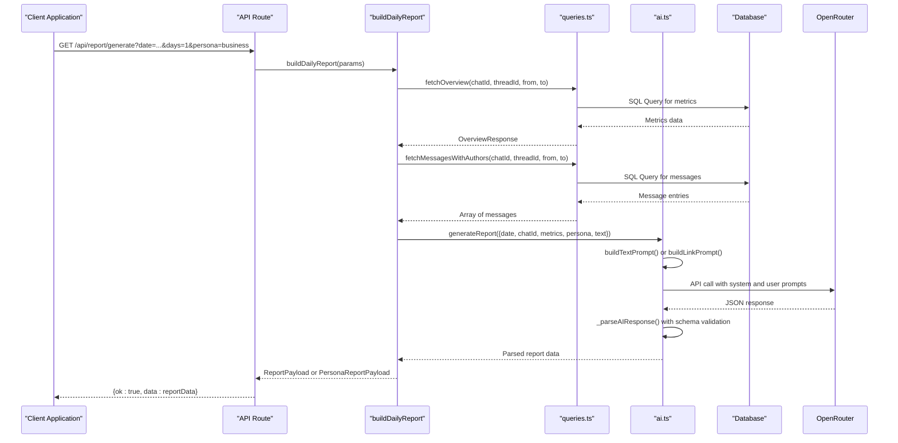
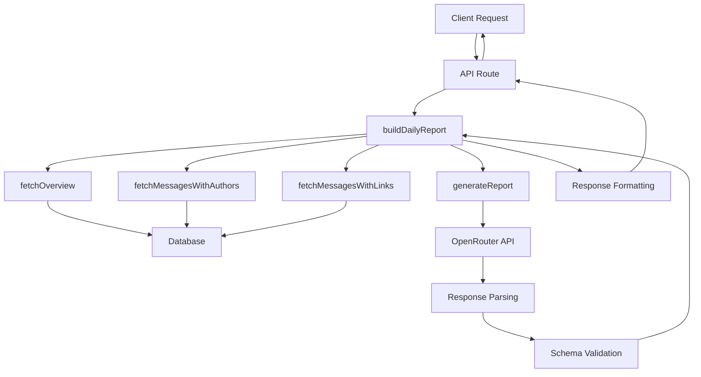

# Generate Report

<cite>
**Referenced Files in This Document**   
- [app/api/report/[kind]/route.ts](file://app/api/report/[kind]/route.ts)
- [lib/report.ts](file://lib/report.ts)
- [lib/ai.ts](file://lib/ai.ts)
- [lib/queries.ts](file://lib/queries.ts)
- [lib/reportSchemas.ts](file://lib/reportSchemas.ts)
- [lib/types.ts](file://lib/types.ts)
- [lib/date-utils.ts](file://lib/date-utils.ts)
- [components/summary-generator.tsx](file://components/summary-generator.tsx)
</cite>

## Table of Contents
1. [Introduction](#introduction)
2. [Endpoint Overview](#endpoint-overview)
3. [Request Parameters](#request-parameters)
4. [Report Generation Flow](#report-generation-flow)
5. [Response Structure](#response-structure)
6. [Error Handling](#error-handling)
7. [Usage Examples](#usage-examples)
8. [Integration with Frontend](#integration-with-frontend)
9. [Architecture Overview](#architecture-overview)

## Introduction

The `/api/report/generate` endpoint is a core feature of the tg-ai-vibecoders-summary application, responsible for generating comprehensive analytical reports from Telegram chat data. This API orchestrates data retrieval, AI processing, and structured response generation to provide actionable insights about chat activity, user behavior, and content patterns. The endpoint supports both traditional analytical reports and specialized persona-based reports that offer domain-specific perspectives.

## Endpoint Overview

The `/api/report/generate` endpoint is implemented as a GET method within the Next.js API route system. It serves as the primary interface for triggering report generation, accepting various query parameters to customize the analysis scope and output format. The endpoint is part of a dynamic route structure that supports different report kinds, with "generate" being the primary mode for full report creation.

The endpoint processes incoming requests by validating parameters, orchestrating data fetching from the database, and coordinating AI-powered analysis to produce structured reports. It acts as the central controller in the report generation workflow, delegating specific tasks to specialized functions while maintaining the overall execution flow.

**Section sources**
- [app/api/report/[kind]/route.ts](file://app/api/report/[kind]/route.ts#L1-L83)

## Request Parameters

The `/api/report/generate` endpoint accepts the following query parameters to customize report generation:

- **date**: Optional string parameter specifying the target date in YYYY-MM-DD format. If not provided, the system uses the current local date.
- **chat_id**: Optional string parameter to filter analysis to a specific Telegram chat.
- **thread_id**: Optional string parameter to focus analysis on a specific message thread within a chat.
- **days**: Required numeric parameter with allowed values of 1 or 7, specifying the time window for data collection (last 24 hours or last 7 days).
- **persona**: Optional string parameter that determines the analytical perspective of the report. Supported values include: business, psychology, creative, twitter, reddit, and daily-summary.

These parameters are extracted from the request URL and validated before being passed to the report generation pipeline. The system implements strict validation to ensure only supported values are accepted, with appropriate defaults applied when parameters are missing.

**Section sources**
- [app/api/report/[kind]/route.ts](file://app/api/report/[kind]/route.ts#L15-L45)
- [lib/types.ts](file://lib/types.ts#L5-L11)

## Report Generation Flow

The report generation process follows a structured workflow that begins with the API endpoint and progresses through data collection, AI processing, and response formatting. When a request is received, the endpoint invokes the `buildDailyReport` function, which orchestrates the entire generation process.



**Diagram sources**
- [app/api/report/[kind]/route.ts](file://app/api/report/[kind]/route.ts#L1-L83)
- [lib/report.ts](file://lib/report.ts#L13-L101)
- [lib/ai.ts](file://lib/ai.ts#L33-L165)
- [lib/queries.ts](file://lib/queries.ts#L1-L383)

**Section sources**
- [lib/report.ts](file://lib/report.ts#L13-L101)
- [lib/ai.ts](file://lib/ai.ts#L33-L165)
- [lib/queries.ts](file://lib/queries.ts#L1-L383)

## Response Structure

The response structure varies based on whether a persona parameter is specified. For traditional reports (without persona), the response includes three core components:

- **summary**: A comprehensive narrative summary of the chat activity, typically 600-900 characters in length.
- **themes**: An array of 4-6 key discussion themes identified in the chat.
- **insights**: An array of 4-6 actionable insights derived from the analysis.

For persona-specific reports, the response structure aligns with predefined JSON schemas that match the analytical perspective:

- **business persona**: Returns monetization_ideas, revenue_strategies, and roi_insights arrays.
- **psychology persona**: Returns group_atmosphere, psychological_archetypes, emotional_patterns, and group_dynamics.
- **creative persona**: Returns creative_temperature, viral_concepts, content_formats, and trend_opportunities.
- **daily-summary persona**: Returns a comprehensive daily summary with day_overview, key_events, participant_highlights, shared_links, and other structured fields.

All responses are wrapped in a consistent envelope format with an "ok" boolean flag and "data" property containing the actual report content.

**Section sources**
- [lib/reportSchemas.ts](file://lib/reportSchemas.ts#L1-L112)
- [lib/types.ts](file://lib/types.ts#L28-L43)
- [app/api/report/[kind]/route.ts](file://app/api/report/[kind]/route.ts#L50-L83)

## Error Handling

The endpoint implements comprehensive error handling to manage various failure scenarios. When invalid parameters are provided, the system returns a 404 status code with an appropriate error message. For example, if an unsupported report kind is requested, the response will indicate "Unsupported report kind".

For AI service failures, the system returns a 503 Service Unavailable status code with a descriptive error message. This occurs when the OpenRouter API is unreachable, when required environment variables (OPENROUTER_API_KEY, OPENROUTER_MODEL) are missing, or when the AI service fails to generate a valid response.

The error handling also includes client-side error management in the frontend components, where network errors and invalid responses are caught and displayed to users through appropriate UI elements.

**Section sources**
- [app/api/report/[kind]/route.ts](file://app/api/report/[kind]/route.ts#L50-L83)
- [lib/ai.ts](file://lib/ai.ts#L33-L165)

## Usage Examples

### Traditional Report
```
GET /api/report/generate?date=2023-12-01&chat_id=12345&days=1
```
This request generates a standard analytical report for chat ID 12345 for December 1, 2023, covering the last 24 hours of activity.

### Business Persona Report
```
GET /api/report/generate?date=2023-12-01&chat_id=12345&days=7&persona=business
```
This request generates a business-focused report that identifies monetization opportunities, revenue strategies, and ROI insights from a week of chat activity.

### Psychology Persona Report
```
GET /api/report/generate?date=2023-12-01&chat_id=12345&days=1&persona=psychology
```
This request generates a psychological analysis of the chat, identifying group atmosphere, psychological archetypes of participants, emotional patterns, and group dynamics.

### Daily Summary Report
```
GET /api/report/generate?date=2023-12-01&chat_id=12345&days=1&persona=daily-summary
```
This request generates a comprehensive daily summary that includes key events, participant highlights, shared links analysis, and discussion topics.

## Integration with Frontend

The `/api/report/generate` endpoint is integrated with the frontend through the `summary-generator.tsx` component, which provides a user interface for report generation and display. The component handles the complete workflow from user interaction to API communication and result presentation.

The integration includes loading states, error handling, and success feedback to create a seamless user experience. After generating a report, users can also send the results directly to Telegram through a companion endpoint, creating a complete workflow from analysis to dissemination.

**Section sources**
- [components/summary-generator.tsx](file://components/summary-generator.tsx#L1-L190)

## Architecture Overview

The report generation system follows a modular architecture with clear separation of concerns. The API route handles HTTP communication and request validation, while business logic is delegated to specialized modules.



**Diagram sources**
- [app/api/report/[kind]/route.ts](file://app/api/report/[kind]/route.ts#L1-L83)
- [lib/report.ts](file://lib/report.ts#L13-L101)
- [lib/ai.ts](file://lib/ai.ts#L33-L165)
- [lib/queries.ts](file://lib/queries.ts#L1-L383)
- [lib/reportSchemas.ts](file://lib/reportSchemas.ts#L1-L112)

**Section sources**
- [lib/report.ts](file://lib/report.ts#L13-L101)
- [lib/ai.ts](file://lib/ai.ts#L33-L165)
- [lib/queries.ts](file://lib/queries.ts#L1-L383)