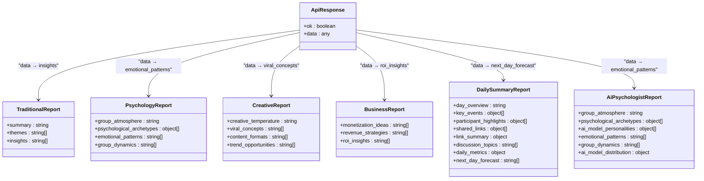

# Insights-Only API

<cite>
**Referenced Files in This Document**   
- [route.ts](file://app/api/report/[kind]/route.ts)
- [report.ts](file://lib/report.ts)
- [ai.ts](file://lib/ai.ts)
- [reportSchemas.ts](file://lib/reportSchemas.ts)
- [ai-insights.tsx](file://components/ai-insights.tsx)
</cite>

## Table of Contents
1. [Introduction](#introduction)
2. [Endpoint Overview](#endpoint-overview)
3. [Query Parameters](#query-parameters)
4. [Response Format](#response-format)
5. [Internal Flow](#internal-flow)
6. [Error Handling](#error-handling)
7. [Caching Considerations](#caching-considerations)
8. [Usage Examples](#usage-examples)
9. [Performance Optimization](#performance-optimization)

## Introduction

The `/api/report/insights` endpoint provides a lightweight method to retrieve only the insights portion of a generated report. This endpoint is optimized for performance and designed for use cases requiring minimal data transfer, such as dashboard widgets and real-time updates. By extracting only the most actionable information, it enables faster rendering and reduced bandwidth consumption.

**Section sources**
- [route.ts](file://app/api/report/[kind]/route.ts#L18-L82)

## Endpoint Overview

The `/api/report/insights` endpoint is a GET method that returns only the insights data from a generated report. It shares the same query parameters as the `/api/report/generate` endpoint, ensuring consistency across the API surface. The endpoint supports both traditional reports and persona-specific reports, adapting its response format accordingly.

The endpoint is part of a dynamic route system that handles multiple report kinds, with "insights" being one of the allowed types. When requested, it processes the full report generation pipeline but returns only the insights portion, making it highly efficient for UI components that need bite-sized recommendations.

```mermaid
flowchart TD
A[Client Request] --> B[/api/report/insights]
B --> C{Valid Kind?}
C --> |Yes| D[buildDailyReport]
D --> E[generateReport]
E --> F{Persona Report?}
F --> |Yes| G[Return data field]
F --> |No| H[Return insights array]
G --> I[Response]
H --> I
C --> |No| J[404 Error]
J --> I
```

**Diagram sources**
- [route.ts](file://app/api/report/[kind]/route.ts#L18-L82)
- [report.ts](file://lib/report.ts#L13-L103)

**Section sources**
- [route.ts](file://app/api/report/[kind]/route.ts#L18-L82)

## Query Parameters

The endpoint accepts the following query parameters, which are identical to those used by the generate endpoint:

- **date**: Specific date in YYYY-MM-DD format for which to generate the report
- **chat_id**: Identifier for the chat context
- **thread_id**: Identifier for the specific thread within the chat
- **days**: Time window for the report (1 or 7 days only)
- **persona**: Persona type that determines the report structure and content focus

When neither date nor days parameters are provided, the endpoint defaults to the last 24 hours. The days parameter is strictly limited to 1 or 7 days to ensure consistent performance characteristics.

**Section sources**
- [route.ts](file://app/api/report/[kind]/route.ts#L18-L82)

## Response Format

The response format varies based on the report type:

For traditional reports, the endpoint returns only the insights array:
```json
{
  "ok": true,
  "data": ["insight 1", "insight 2", "insight 3"]
}
```

For persona-specific reports, it returns the corresponding insights-like array:
- **psychologist persona**: returns the `emotional_patterns` array
- **creative persona**: returns the `viral_concepts` array
- **business persona**: returns the `roi_insights` array
- **ai-psychologist persona**: returns the `emotional_patterns` array
- **daily-summary persona**: returns the `next_day_forecast` array

This adaptive response structure ensures that clients receive the most relevant actionable insights for the selected persona, maintaining a consistent interface while providing persona-appropriate content.



**Diagram sources**
- [reportSchemas.ts](file://lib/reportSchemas.ts#L1-L111)
- [route.ts](file://app/api/report/[kind]/route.ts#L18-L82)

**Section sources**
- [route.ts](file://app/api/report/[kind]/route.ts#L18-L82)
- [reportSchemas.ts](file://lib/reportSchemas.ts#L1-L111)

## Internal Flow

The internal processing flow for the insights endpoint follows a well-defined sequence:

1. **Request Processing**: The GET handler extracts query parameters and validates the request kind
2. **Report Generation**: Calls `buildDailyReport` with the provided parameters
3. **Data Transformation**: Extracts only the relevant insights portion from the generated report
4. **Response Construction**: Returns a minimal JSON response containing only the insights data

The flow begins with the API route handler, which routes to the `buildDailyReport` function in the report module. This function orchestrates the data collection and AI processing pipeline, ultimately calling the `generateReport` function in the AI module. After the full report is generated, the insights endpoint transforms the response by extracting only the relevant insights array before returning it to the client.


**Diagram sources**
- [route.ts](file://app/api/report/[kind]/route.ts#L18-L82)
- [report.ts](file://lib/report.ts#L13-L103)
- [ai.ts](file://lib/ai.ts#L33-L165)

**Section sources**
- [route.ts](file://app/api/report/[kind]/route.ts#L18-L82)
- [report.ts](file://lib/report.ts#L13-L103)
- [ai.ts](file://lib/ai.ts#L33-L165)

## Error Handling

The endpoint implements comprehensive error handling to ensure reliable operation:

- **404 Not Found**: Returned when an unsupported report kind is requested
- **503 Service Unavailable**: Returned when the AI service is temporarily unavailable or misconfigured
- **500 Internal Server Error**: Returned for unexpected errors during report generation

The error handling logic includes specific detection for AI service configuration issues, returning a 503 status when critical environment variables are missing. All errors include descriptive messages to aid debugging while maintaining security by not exposing sensitive implementation details.

When the `buildDailyReport` function fails or returns null, the endpoint gracefully handles this by returning a 503 response with a user-friendly message about AI service availability. This ensures clients receive meaningful feedback rather than generic server errors.

**Section sources**
- [route.ts](file://app/api/report/[kind]/route.ts#L18-L82)

## Caching Considerations

While the documentation does not explicitly show caching implementation, several factors influence caching strategy:

- The dynamic nature of the endpoint (`export const dynamic = "force-dynamic"`) suggests that responses are not statically cached
- The personalized nature of reports based on chat_id, thread_id, and persona parameters makes caching more complex
- The performance optimization goal of the insights endpoint implies that response times are critical

For optimal performance, implementers should consider:
- Client-side caching of recent insights responses
- CDN-level caching with appropriate cache keys based on query parameters
- Cache invalidation strategies tied to new message activity in the chat
- Time-based caching with short TTLs (e.g., 5-15 minutes) given the dynamic nature of chat data

The insights-only approach inherently supports better caching efficiency by reducing payload size, making cached responses faster to serve and less bandwidth-intensive.

**Section sources**
- [route.ts](file://app/api/report/[kind]/route.ts#L18-L82)

## Usage Examples

The insights endpoint is particularly useful for UI components that display bite-sized recommendations, such as the `ai-insights.tsx` component:


The component uses the insights data to render a clean, focused UI that highlights actionable recommendations. By consuming only the insights portion of the report, the component ensures fast loading and smooth rendering, even on lower-powered devices.

Integration with the component follows this pattern:
1. Fetch data from `/api/report/insights` endpoint
2. Pass the response data to the `AiInsights` component
3. The component renders the insights as a bulleted list

This usage pattern demonstrates how the insights-only endpoint enables lightweight, responsive UI components that provide immediate value to users without waiting for full report generation.

```mermaid
classDiagram
class AiInsightsProps {
+report : ReportPayload | null
}
class AiInsights {
+AiInsights(props)
+render()
}
AiInsights --> AiInsightsProps : "uses"
ApiClient --> AiInsights : "provides data"
class ApiClient {
+fetchInsights(params)
-baseUrl : string
}
ApiClient --> "GET /api/report/insights" : "HTTP Request"
"GET /api/report/insights" --> ApiClient : "JSON Response"
```

**Diagram sources**
- [ai-insights.tsx](file://components/ai-insights.tsx#L0-L41)
- [route.ts](file://app/api/report/[kind]/route.ts#L18-L82)

**Section sources**
- [ai-insights.tsx](file://components/ai-insights.tsx#L0-L41)
- [route.ts](file://app/api/report/[kind]/route.ts#L18-L82)

## Performance Optimization

The insights-only endpoint provides significant performance benefits:

- **Reduced Payload Size**: By returning only insights data, response sizes are minimized
- **Faster Parsing**: Smaller JSON payloads are faster to parse on client devices
- **Lower Bandwidth Consumption**: Ideal for mobile clients and low-bandwidth scenarios
- **Quick Rendering**: UI components can render immediately with minimal data processing

The optimization is particularly valuable for dashboard widgets and real-time updates where:
- Multiple insights components may be loaded simultaneously
- Users expect immediate feedback
- Network conditions may be suboptimal
- Device resources are limited

By extracting only the most actionable information, the endpoint enables a responsive user experience while still leveraging the full power of the AI report generation system. This approach represents a best practice in API design, providing specialized endpoints for specific use cases rather than forcing clients to filter data themselves.

**Section sources**
- [route.ts](file://app/api/report/[kind]/route.ts#L18-L82)
- [ai-insights.tsx](file://components/ai-insights.tsx#L0-L41)