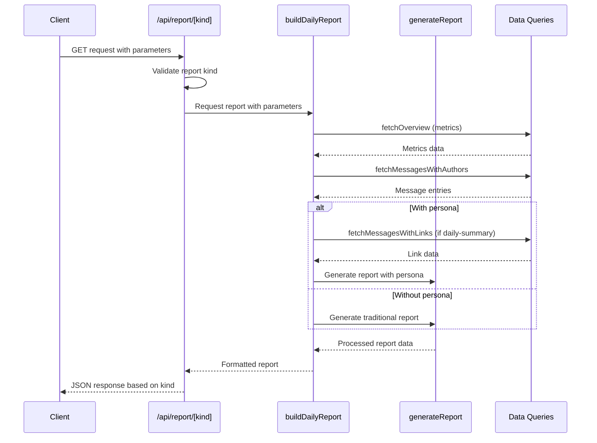
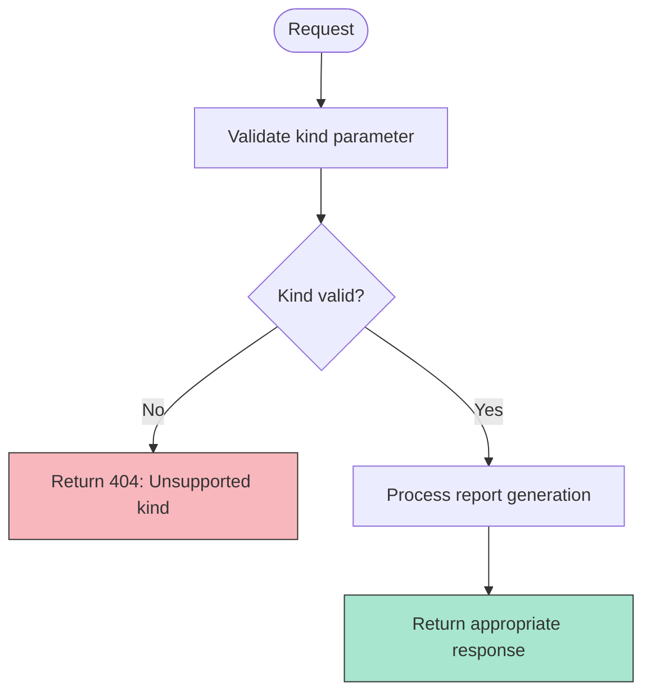
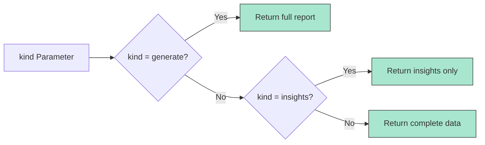
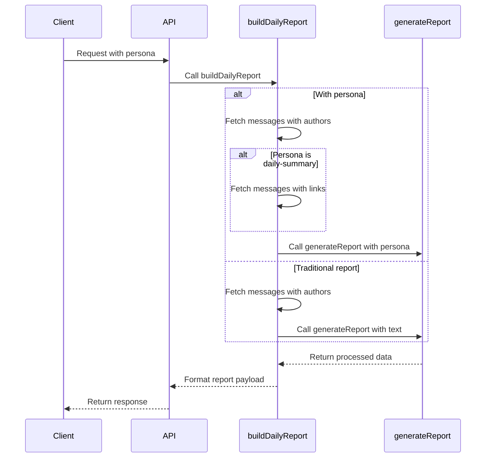
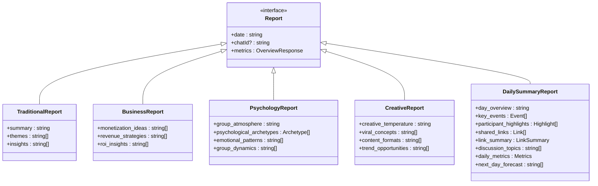

# Report API

<cite>
**Referenced Files in This Document**   
- [route.ts](file://app/api/report/[kind]/route.ts)
- [report.ts](file://lib/report.ts)
- [ai.ts](file://lib/ai.ts)
- [reportSchemas.ts](file://lib/reportSchemas.ts)
- [types.ts](file://lib/types.ts)
- [queries.ts](file://lib/queries.ts)
</cite>

## Table of Contents
1. [Introduction](#introduction)
2. [API Endpoint Overview](#api-endpoint-overview)
3. [Query Parameters](#query-parameters)
4. [Path Parameter: kind](#path-parameter-kind)
5. [Response Modes](#response-modes)
6. [Report Generation Flow](#report-generation-flow)
7. [Response Schemas](#response-schemas)
8. [Error Handling](#error-handling)
9. [Usage Examples](#usage-examples)
10. [Integration Patterns](#integration-patterns)

## Introduction
The `/api/report/[kind]` endpoint in the tg-ai-vibecoders-summary application provides dynamic AI-powered reporting capabilities for Telegram chat analytics. This API enables clients to generate comprehensive reports, extract insights, or preview content based on chat activity data. The system leverages AI processing through OpenRouter with various personas to deliver tailored analytical perspectives. This documentation details the API's functionality, parameters, response formats, and integration patterns.

## API Endpoint Overview
The `/api/report/[kind]` route is a dynamic Next.js API endpoint that accepts GET requests with a path parameter (`kind`) and multiple query parameters. The endpoint orchestrates data fetching, AI processing, and response formatting based on the requested report type and parameters.

The API follows a structured flow:
1. Validates the requested report kind
2. Processes query parameters for date range and filtering
3. Orchestrates data collection through `buildDailyReport`
4. Routes processing through `generateReport` with appropriate persona
5. Formats and returns responses according to the requested mode



**Diagram sources**
- [route.ts](file://app/api/report/[kind]/route.ts)
- [report.ts](file://lib/report.ts)
- [ai.ts](file://lib/ai.ts)
- [queries.ts](file://lib/queries.ts)

**Section sources**
- [route.ts](file://app/api/report/[kind]/route.ts)
- [report.ts](file://lib/report.ts)

## Query Parameters
The API accepts several query parameters to customize report generation:

**Query Parameters**
- `date`: ISO date string (YYYY-MM-DD) for a specific day's report
- `chat_id`: Filter results for a specific chat
- `thread_id`: Filter results for a specific message thread
- `days`: Time window (1 or 7) for report generation
- `persona`: AI persona for specialized analysis

When no date or days parameter is provided, the API defaults to the last 24 hours of data. The `chat_id` and `thread_id` parameters allow for targeted analysis of specific conversations within larger chat ecosystems.

The `persona` parameter enables specialized analytical perspectives, with different personas providing unique insights based on their expertise domain. The system validates all parameters and handles edge cases such as invalid dates or unsupported values.

**Section sources**
- [route.ts](file://app/api/report/[kind]/route.ts)
- [report.ts](file://lib/report.ts)

## Path Parameter: kind
The dynamic path parameter `kind` determines the response mode and processing logic. Three values are supported:

**Supported Report Kinds**
- `generate`: Full report generation with complete content
- `insights`: Extract only insights from the generated report
- `preview`: Return the complete report data without processing

The API validates the `kind` parameter against the allowed values and returns a 404 status for unsupported kinds. This parameter-driven approach allows clients to request different representations of the same underlying data without additional processing overhead.



**Diagram sources**
- [route.ts](file://app/api/report/[kind]/route.ts)

**Section sources**
- [route.ts](file://app/api/report/[kind]/route.ts)

## Response Modes
The API supports three distinct response modes based on the `kind` path parameter:

### Full Report Generation (kind=generate)
Returns a complete report with all generated content. For traditional reports, this includes summary, themes, and insights. For persona-specific reports, it returns the complete structured data according to the persona's schema.

### Insights-Only Extraction (kind=insights)
Extracts and returns only the insights portion of the report. This mode is useful for applications that need quick access to key takeaways without the full context. The response contains only the insights array, making it lightweight for display in dashboards or notifications.

### Preview Functionality (kind=preview)
Returns the complete raw report data without any processing or filtering. This mode is primarily used for debugging and development purposes, allowing developers to inspect the full structure and content of generated reports.



**Diagram sources**
- [route.ts](file://app/api/report/[kind]/route.ts)

**Section sources**
- [route.ts](file://app/api/report/[kind]/route.ts)

## Report Generation Flow
The report generation process is orchestrated through the `buildDailyReport` function, which coordinates data collection and AI processing. This function serves as the central hub for report creation, handling both traditional and persona-specific reports.

### Data Collection Strategy
The system employs a multi-stage data collection approach:
1. Fetches overview metrics (total messages, unique users, link messages)
2. Retrieves message content with author information
3. Optionally fetches messages with links for daily-summary persona
4. Constructs text payload within character limits

The system respects the `LLM_TEXT_CHAR_BUDGET` environment variable to ensure text payloads remain within processing limits. If the raw text exceeds this limit, it is truncated to prevent processing failures.

### AI Processing Orchestration
The `buildDailyReport` function routes processing to `generateReport` with appropriate parameters based on the requested persona. For the `daily-summary` persona, it specifically fetches link data to enhance the analysis. The system logs the processing strategy to help with debugging and performance monitoring.



**Diagram sources**
- [report.ts](file://lib/report.ts)
- [ai.ts](file://lib/ai.ts)

**Section sources**
- [report.ts](file://lib/report.ts)

## Response Schemas
The API uses Zod validation schemas defined in `reportSchemas.ts` to ensure consistent and valid responses. Different personas have specialized schemas that define their unique response structures.

### Traditional Report Schema
The base schema for non-persona reports includes:
- `summary`: Comprehensive overview of chat activity
- `themes`: Key discussion topics and patterns
- `insights`: Actionable recommendations and observations

### Persona-Specific Schemas
Each persona has a specialized schema that defines its unique response structure:

**Business Report Schema**
- `monetization_ideas`: Revenue-generating concepts
- `revenue_strategies`: Monetization approaches
- `roi_insights`: Return on investment analyses

**Psychology Report Schema**
- `group_atmosphere`: Emotional climate assessment
- `psychological_archetypes`: Participant personality profiles
- `emotional_patterns`: Communication behavior patterns
- `group_dynamics`: Social interaction mechanisms

**Creative Report Schema**
- `creative_temperature`: Innovation potential assessment
- `viral_concepts`: Shareable content ideas
- `content_formats`: Recommended content types
- `trend_opportunities`: Current trend applications

**Daily Summary Schema**
- `day_overview`: Daily activity summary
- `key_events`: Significant moments
- `participant_highlights`: Contributor spotlights
- `shared_links`: Resource sharing analysis
- `discussion_topics`: Conversation themes
- `daily_metrics`: Quantitative performance indicators
- `next_day_forecast`: Predictive insights



**Diagram sources**
- [reportSchemas.ts](file://lib/reportSchemas.ts)

**Section sources**
- [reportSchemas.ts](file://lib/reportSchemas.ts)

## Error Handling
The API implements comprehensive error handling to ensure reliable operation and meaningful feedback to clients.

### Client-Side Errors
- **404 Not Found**: Returned when an unsupported report kind is requested
- The response includes a clear error message: "Unsupported report kind"

### Server-Side Errors
- **503 Service Unavailable**: Returned when the AI service is temporarily unavailable
- **500 Internal Server Error**: Returned for invalid report formats or other processing failures

The system catches exceptions during report generation and returns appropriate error responses with descriptive messages. When AI processing fails, the API returns a 503 status with a message about AI service availability, helping clients understand the nature of the failure.

Error responses follow a consistent format:
```json
{
  "ok": false,
  "error": "Descriptive error message"
}
```

The error handling system also logs detailed error information for debugging purposes while ensuring that only appropriate information is exposed to clients.

**Section sources**
- [route.ts](file://app/api/report/[kind]/route.ts)
- [report.ts](file://lib/report.ts)
- [ai.ts](file://lib/ai.ts)

## Usage Examples
The following examples demonstrate how to use the API for different report types:

### Traditional Report Generation
```bash
GET /api/report/generate?days=1&chat_id=12345
```
Returns a complete traditional report with summary, themes, and insights for the last 24 hours of the specified chat.

### Business Insights Extraction
```bash
GET /api/report/insights?date=2023-12-01&persona=business
```
Returns only the business-related insights (monetization ideas, revenue strategies, ROI insights) for the specified date.

### Daily Summary Preview
```bash
GET /api/report/preview?days=7&persona=daily-summary
```
Returns the complete daily summary report with all sections including shared links and participant highlights for the last 7 days.

### Psychology Analysis
```bash
GET /api/report/generate?chat_id=12345&thread_id=67890&persona=psychologist
```
Generates a comprehensive psychological analysis of the specified chat thread, including group atmosphere and participant archetypes.

### Creative Perspective
```bash
GET /api/report/insights?date=2023-12-01&persona=creative
```
Extracts only the creative insights (viral concepts, content formats, trend opportunities) for the specified date.

**Section sources**
- [route.ts](file://app/api/report/[kind]/route.ts)

## Integration Patterns
The API supports various integration patterns for frontend components and external systems.

### Dashboard Integration
For dashboard displays, use the `insights` mode to quickly retrieve key takeaways without loading the full report content. This approach reduces data transfer and improves rendering performance.

### Detailed Report Views
For detailed report views, use the `generate` mode to retrieve complete content. Implement loading states to handle the AI processing delay, and consider caching responses to improve user experience.

### Development and Debugging
Use the `preview` mode during development to inspect the complete structure and content of generated reports. This mode is invaluable for understanding the data available for UI implementation.

### Persona-Based User Interfaces
Design UI components that adapt to different personas, displaying only the relevant sections of the report. For example, a business dashboard would focus on monetization ideas and revenue strategies, while a creative team interface would highlight viral concepts and content formats.

### Error State Handling
Implement appropriate error handling in frontend components:
- For 404 errors, display a message about unsupported report types
- For 503 errors, show a service unavailable message with retry options
- Provide fallback content when AI processing fails

The API's consistent response format enables reliable integration across different client applications and use cases.

**Section sources**
- [route.ts](file://app/api/report/[kind]/route.ts)
- [report.ts](file://lib/report.ts)
- [components/](file://components/)