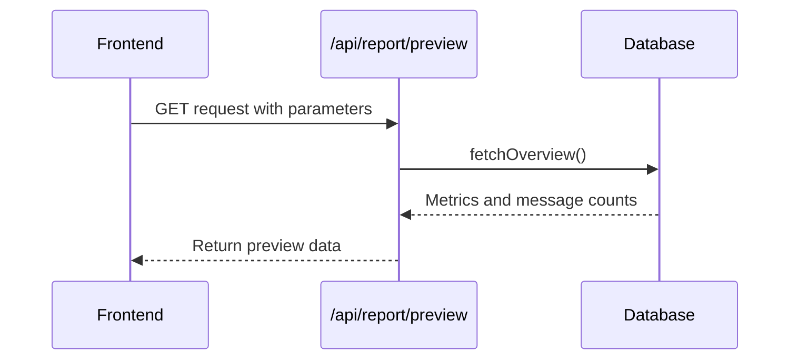
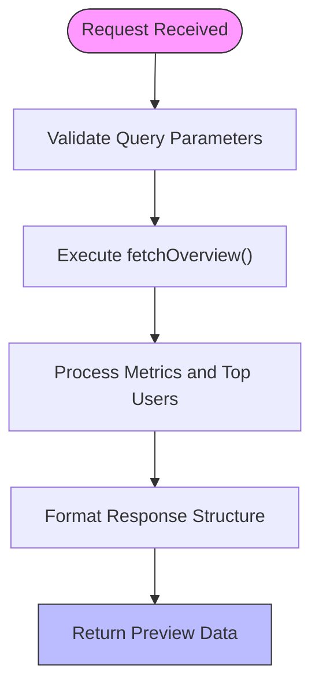
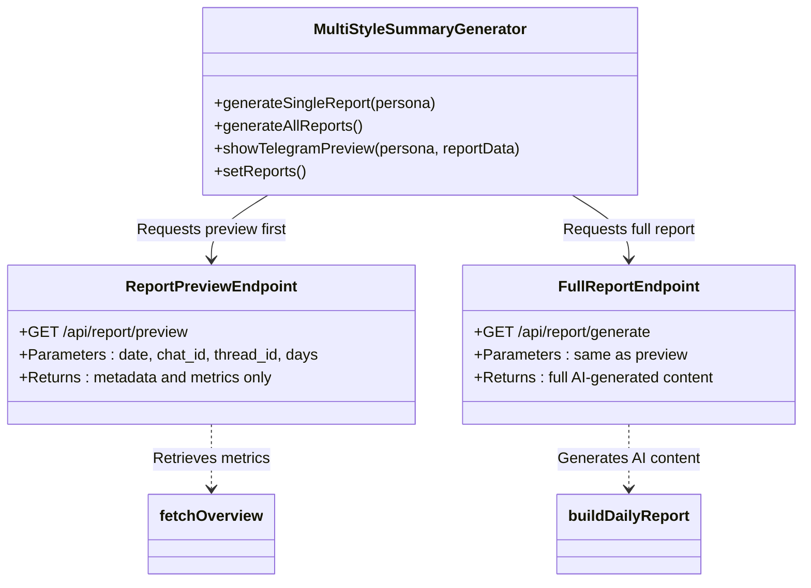

# Report Preview

<cite>
**Referenced Files in This Document**   
- [route.ts](file://app/api/report/[kind]/route.ts)
- [report.ts](file://lib/report.ts)
- [queries.ts](file://lib/queries.ts)
- [multi-style-summary-generator.tsx](file://components/multi-style-summary-generator.tsx)
</cite>

## Table of Contents
1. [Introduction](#introduction)
2. [Endpoint Overview](#endpoint-overview)
3. [Request Parameters](#request-parameters)
4. [Response Structure](#response-structure)
5. [Usage Patterns](#usage-patterns)
6. [Integration with Summary Generator](#integration-with-summary-generator)
7. [Error Handling](#error-handling)
8. [Performance Benefits](#performance-benefits)
9. [User Experience Improvements](#user-experience-improvements)

## Introduction

The `/api/report/preview` endpoint provides a lightweight preview of report data without triggering full AI processing. This endpoint is designed to deliver immediate feedback to users while the system prepares for resource-intensive AI generation. By returning core metadata and metrics quickly, it enables frontend components to render loading states and provide estimated processing times, significantly improving perceived performance and user experience.

**Section sources**
- [route.ts](file://app/api/report/[kind]/route.ts#L0-L83)

## Endpoint Overview

The `/api/report/preview` endpoint is a GET method that returns a minimal dataset containing base report metadata and raw message counts. It operates under the same routing logic as other report types in the application, using the `[kind]` parameter to determine behavior. When `kind=preview`, the system bypasses AI generation entirely and returns only the foundational data gathered from database queries.

This endpoint serves as a critical optimization layer between user interaction and heavy computational workloads. It allows the frontend to acknowledge user requests instantly while background processes prepare the full AI-generated content.

**Diagram sources**
- [route.ts](file://app/api/report/[kind]/route.ts#L0-L83)
- [report.ts](file://lib/report.ts#L13-L101)
- [queries.ts](file://lib/queries.ts#L11-L115)

**Section sources**
- [route.ts](file://app/api/report/[kind]/route.ts#L0-L83)

## Request Parameters

The endpoint accepts the following query parameters:

- **date**: Optional date string in YYYY-MM-DD format to specify the report date
- **chat_id**: Optional string to filter messages by specific chat ID
- **thread_id**: Optional string to filter messages by specific thread ID
- **days**: Optional number (1 or 7) to specify the time window (defaults to 1 if not provided)

These parameters are identical to those used in the full report generation endpoint, ensuring consistency across the API surface. When no date or days parameter is provided, the system defaults to the last 24 hours.

The parameter validation and parsing logic is handled within the route handler, which normalizes input values before passing them to the underlying report building functions.

**Section sources**
- [route.ts](file://app/api/report/[kind]/route.ts#L0-L83)

## Response Structure

The response from the `/api/report/preview` endpoint includes the following structure:

- **ok**: Boolean indicating successful request processing
- **data**: Object containing:
  - **date**: String representing the report date
  - **chatId**: Optional string of the chat ID (if specified)
  - **metrics**: Object with:
    - **totalMessages**: Number of messages in the time window
    - **uniqueUsers**: Number of unique participants
    - **linkMessages**: Number of messages containing links
    - **topUsers**: Array of top 10 users by message count
    - **series**: Time series data of message activity

Notably absent from this response are all AI-generated content fields such as summary, insights, and themes. This deliberate exclusion keeps the payload lightweight and ensures rapid response times.

**Diagram sources**
- [report.ts](file://lib/report.ts#L13-L101)
- [queries.ts](file://lib/queries.ts#L11-L115)

**Section sources**
- [report.ts](file://lib/report.ts#L13-L101)
- [queries.ts](file://lib/queries.ts#L11-L115)

## Usage Patterns

The `/api/report/preview` endpoint follows a specific usage pattern designed to optimize user experience:

1. User initiates a report generation request
2. Frontend immediately calls `/api/report/preview` with the same parameters
3. System returns basic metrics within milliseconds
4. Frontend displays loading state with preliminary data
5. Simultaneously, the system begins full AI processing
6. When complete, the full report replaces the preview

This pattern decouples user interface responsiveness from computational complexity. The preview provides immediate feedback, reducing perceived wait times and preventing user frustration during AI processing.

The endpoint leverages the `fetchOverview` function to retrieve message statistics without loading message content, making it significantly faster than full report generation.

**Section sources**
- [route.ts](file://app/api/report/[kind]/route.ts#L0-L83)
- [report.ts](file://lib/report.ts#L13-L101)

## Integration with Summary Generator

The preview functionality is tightly integrated with the `multi-style-summary-generator` component. When users interact with this component, it first requests a preview to populate initial UI elements before initiating full AI processing.

The component uses the preview data to:
- Display immediate feedback upon user action
- Show message count and participant statistics
- Render activity time series charts
- Calculate estimated processing time based on message volume
- Provide visual loading indicators

This integration creates a seamless user experience where the interface appears responsive even when backend processing takes several seconds.

**Diagram sources**
- [multi-style-summary-generator.tsx](file://components/multi-style-summary-generator.tsx#L0-L799)
- [route.ts](file://app/api/report/[kind]/route.ts#L0-L83)

**Section sources**
- [multi-style-summary-generator.tsx](file://components/multi-style-summary-generator.tsx#L0-L799)

## Error Handling

The endpoint implements robust error handling to ensure reliability:

- Invalid report kinds return 404 with appropriate error messages
- Database connection issues propagate with 500 status codes
- Missing AI service configuration returns 503 Service Unavailable
- All errors are logged for debugging purposes

When errors occur during preview generation, the system returns structured error responses that the frontend can display to users. This prevents silent failures and provides clear feedback about issues.

The error handling strategy prioritizes user communication, ensuring that even when previews cannot be generated, users receive meaningful information rather than timeouts or blank states.

**Section sources**
- [route.ts](file://app/api/report/[kind]/route.ts#L0-L83)

## Performance Benefits

The `/api/report/preview` endpoint delivers significant performance advantages:

- **Reduced latency**: Responses typically under 100ms compared to several seconds for full AI processing
- **Lower resource consumption**: No LLM API calls or text processing required
- **Database efficiency**: Uses optimized aggregate queries instead of loading message content
- **Scalability**: Can handle high request volumes without overloading AI services

By separating preview generation from AI processing, the system can serve many concurrent users without degrading performance. The preview endpoint acts as a circuit breaker, preventing overwhelming the AI generation pipeline with requests.

The performance profile makes it suitable for frequent polling or real-time updates, enabling dynamic interfaces that respond instantly to user interactions.

**Section sources**
- [report.ts](file://lib/report.ts#L13-L101)
- [queries.ts](file://lib/queries.ts#L11-L115)

## User Experience Improvements

The preview endpoint enables several key user experience enhancements:

- **Immediate feedback**: Users see a response as soon as they click generate
- **Progressive disclosure**: Interface shows basic information first, then enriches with AI content
- **Loading state accuracy**: Estimated processing time based on actual message volume
- **Reduced abandonment**: Users are less likely to navigate away during long processing times
- **Perceived performance**: Interface feels responsive even when background processing takes time

Frontend components use the preview data to create engaging loading experiences, such as displaying message counts and top participants while the AI works. This transforms what could be a frustrating wait into an informative and interactive experience.

The design follows modern web application patterns where partial content delivery creates a more fluid and responsive user interface.

**Section sources**
- [multi-style-summary-generator.tsx](file://components/multi-style-summary-generator.tsx#L0-L799)
- [route.ts](file://app/api/report/[kind]/route.ts#L0-L83)