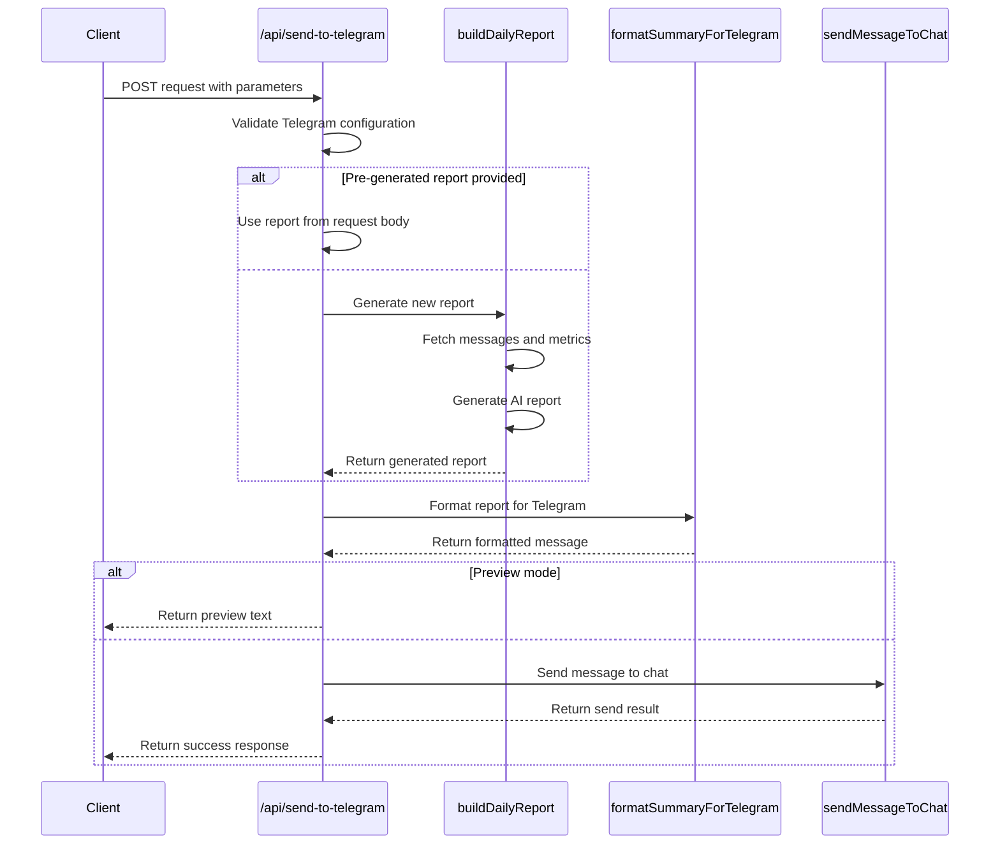
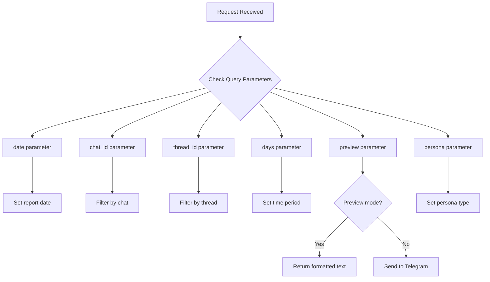
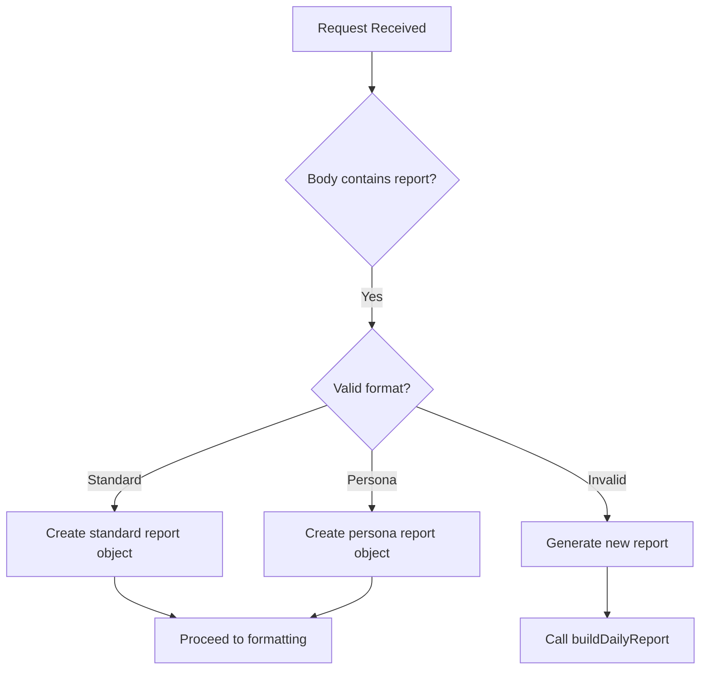
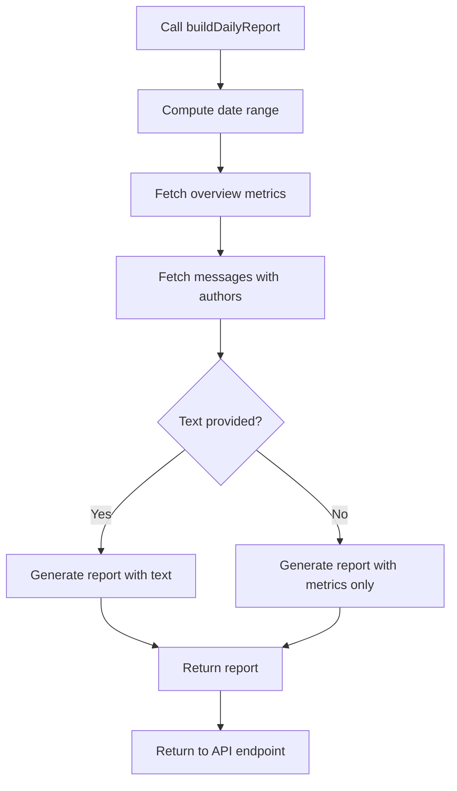
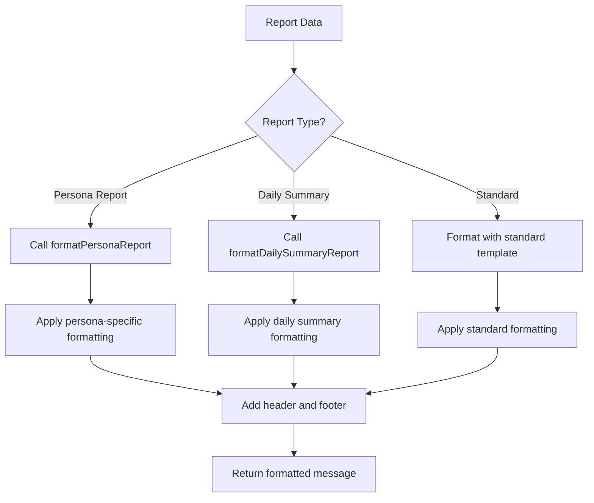
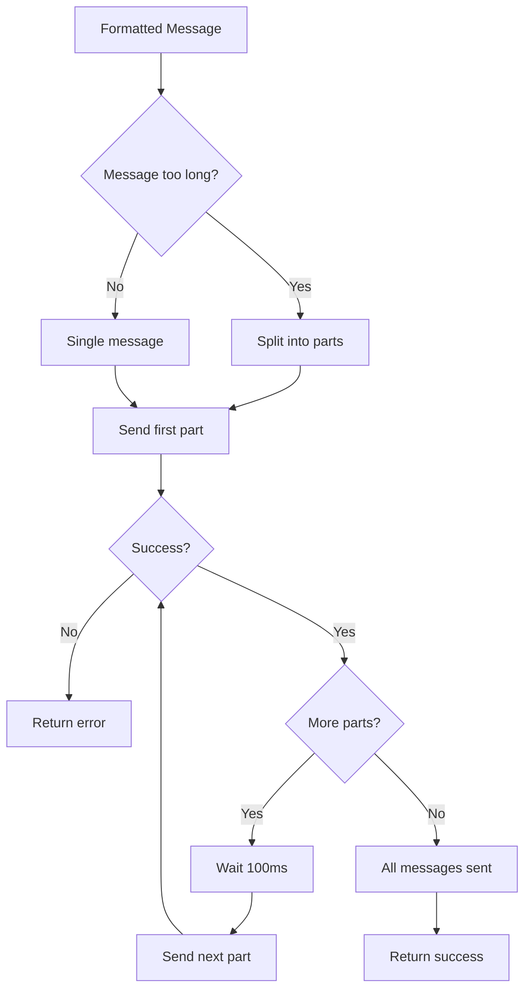
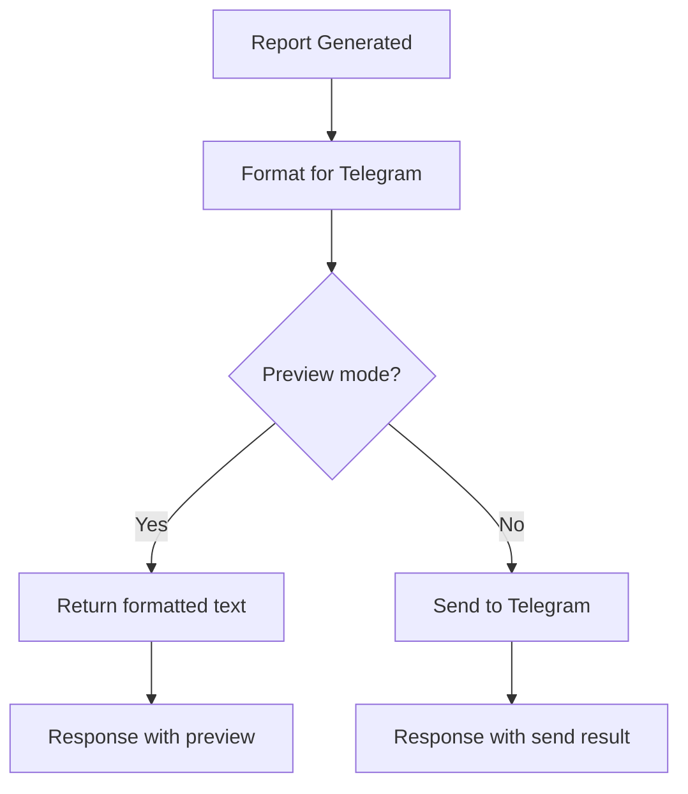
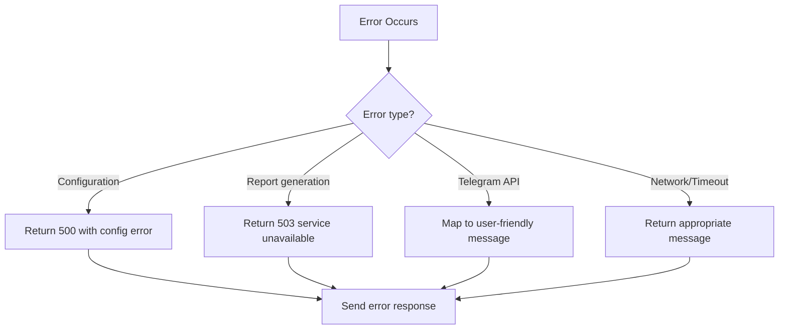
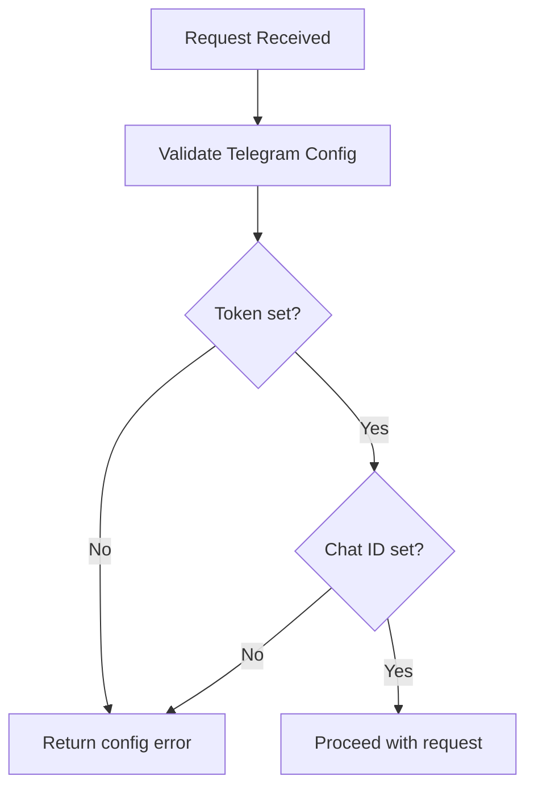

# Telegram Integration API

<cite>
**Referenced Files in This Document**   
- [route.ts](file://app/api/send-to-telegram/route.ts)
- [telegram.ts](file://lib/telegram.ts)
- [report.ts](file://lib/report.ts)
- [ai.ts](file://lib/ai.ts)
- [types.ts](file://lib/types.ts)
</cite>

## Table of Contents
1. [Introduction](#introduction)
2. [Endpoint Overview](#endpoint-overview)
3. [Query Parameters](#query-parameters)
4. [Request Body](#request-body)
5. [Execution Paths](#execution-paths)
6. [Message Formatting](#message-formatting)
7. [Message Delivery](#message-delivery)
8. [Preview Mode](#preview-mode)
9. [Response Schema](#response-schema)
10. [Error Handling](#error-handling)
11. [Security Considerations](#security-considerations)
12. [Rate Limiting](#rate-limiting)

## Introduction
This document provides comprehensive API documentation for the `/api/send-to-telegram` endpoint in the tg-ai-vibecoders-summary application. The endpoint enables sending AI-generated summaries to Telegram channels or groups with various customization options, including persona-based reporting, message threading, and preview functionality.

**Section sources**
- [route.ts](file://app/api/send-to-telegram/route.ts#L7-L148)

## Endpoint Overview
The `/api/send-to-telegram` endpoint is a POST method that sends formatted AI summaries to a Telegram chat. The endpoint supports two primary execution paths: using a pre-generated report provided in the request body or generating a new report using the `buildDailyReport` function. The endpoint validates Telegram credentials, formats the message for Telegram, and handles delivery with support for message threads.



**Diagram sources**
- [route.ts](file://app/api/send-to-telegram/route.ts#L7-L148)
- [report.ts](file://lib/report.ts#L13-L101)
- [telegram.ts](file://lib/telegram.ts#L161-L194)
- [telegram.ts](file://lib/telegram.ts#L405-L473)

**Section sources**
- [route.ts](file://app/api/send-to-telegram/route.ts#L7-L148)

## Query Parameters
The endpoint accepts several query parameters to customize the report generation and delivery:

| Parameter | Type | Required | Default | Description |
|---------|------|--------|--------|-----------|
| date | string | No | Current date | Date for which to generate the report (YYYY-MM-DD format) |
| chat_id | string | No | None | Specific chat ID to filter messages for report generation |
| thread_id | string | No | None | Message thread ID to filter messages and send reply within thread |
| days | number | No | 1 | Time period for report (1 or 7 days only) |
| preview | boolean | No | false | If true, returns formatted text without sending to Telegram |
| persona | string | No | None | Persona type for specialized reporting (business, psychologist, creative, etc.) |



**Diagram sources**
- [route.ts](file://app/api/send-to-telegram/route.ts#L7-L148)

**Section sources**
- [route.ts](file://app/api/send-to-telegram/route.ts#L7-L148)

## Request Body
The endpoint accepts an optional JSON request body containing pre-generated report data. This allows clients to generate reports independently and send them through the Telegram integration.

### Standard Report Format
When providing a pre-generated standard report, include the following fields:

```json
{
  "date": "2023-12-01",
  "summary": "Summary text",
  "themes": ["Theme 1", "Theme 2"],
  "insights": ["Insight 1", "Insight 2"]
}
```

### Persona Report Format
When providing a pre-generated persona report, include the persona type and data structure specific to that persona:

```json
{
  "date": "2023-12-01",
  "persona": "business",
  "data": {
    "monetization_ideas": ["Idea 1", "Idea 2"],
    "revenue_strategies": ["Strategy 1", "Strategy 2"],
    "roi_insights": ["Insight 1", "Insight 2"]
  }
}
```

If the request body format is not recognized, the system will fall back to generating a new report using `buildDailyReport`.

**Section sources**
- [route.ts](file://app/api/send-to-telegram/route.ts#L7-L148)
- [types.ts](file://lib/types.ts#L30-L44)

## Execution Paths
The endpoint implements two distinct execution paths based on whether a pre-generated report is provided in the request body.

### Path 1: Pre-generated Report
When a valid report is provided in the request body, the endpoint uses this data directly without generating a new report. The system validates the format and constructs a report object with the provided data.



### Path 2: New Report Generation
When no valid pre-generated report is provided, the endpoint generates a new report by calling the `buildDailyReport` function with the query parameters.



The `buildDailyReport` function fetches message data from the database, processes it, and generates an AI-powered report using the appropriate persona if specified.

**Diagram sources**
- [route.ts](file://app/api/send-to-telegram/route.ts#L7-L148)
- [report.ts](file://lib/report.ts#L13-L101)

**Section sources**
- [route.ts](file://app/api/send-to-telegram/route.ts#L7-L148)
- [report.ts](file://lib/report.ts#L13-L101)

## Message Formatting
The endpoint uses the `formatSummaryForTelegram` function to convert the report data into a properly formatted Telegram message with HTML parsing.

### Formatting Process
The formatting process converts the structured report data into a visually appealing message with appropriate styling, emojis, and layout for Telegram.



### Supported Report Types
The formatter supports three types of reports:

1. **Standard Reports**: Contain summary, themes, and insights
2. **Persona Reports**: Contain specialized data based on the persona type
3. **Daily Summary Reports**: Contain detailed daily metrics and structured data

The formatter applies appropriate styling, including bold headers, bullet points, numbered lists, and section dividers to enhance readability.

**Diagram sources**
- [telegram.ts](file://lib/telegram.ts#L161-L194)

**Section sources**
- [telegram.ts](file://lib/telegram.ts#L161-L194)

## Message Delivery
The endpoint uses the `sendMessageToChat` function to deliver the formatted message to the specified Telegram chat.

### Delivery Process
The delivery process handles sending the message to Telegram with proper error handling and rate limiting considerations.



### Thread Support
The endpoint supports sending messages to specific message threads by including the `message_thread_id` parameter in the Telegram API call when a `thread_id` is provided in the query parameters.

### Message Splitting
Messages exceeding 4,000 characters are automatically split into multiple parts to comply with Telegram's message length limits. The system adds a small delay between messages to avoid rate limiting.

**Diagram sources**
- [telegram.ts](file://lib/telegram.ts#L405-L473)

**Section sources**
- [telegram.ts](file://lib/telegram.ts#L405-L473)

## Preview Mode
When the `preview` query parameter is set to `true`, the endpoint returns the formatted message text without sending it to Telegram.

### Preview Flow


The preview response includes the formatted message in the `preview` field, allowing clients to review the message content and formatting before actual delivery.

**Section sources**
- [route.ts](file://app/api/send-to-telegram/route.ts#L7-L148)

## Response Schema
The endpoint returns JSON responses with a consistent structure for both success and error cases.

### Success Response
```json
{
  "ok": true,
  "message": "Саммари успешно отправлено в Telegram"
}
```

When preview mode is enabled:
```json
{
  "ok": true,
  "preview": "Formatted message text...",
  "message": "Предпросмотр создан"
}
```

### Error Response
```json
{
  "ok": false,
  "error": "Error description",
  "details": "Original error message (in development mode)"
}
```

**Section sources**
- [route.ts](file://app/api/send-to-telegram/route.ts#L7-L148)

## Error Handling
The endpoint implements comprehensive error handling for various failure scenarios.

### Error Types
The system maps technical errors to user-friendly messages:

| Error Type | User-Friendly Message |
|----------|---------------------|
| Network issues | "Не удалось подключиться к Telegram API. Проверьте интернет-соединение." |
| Timeout | "Превышено время ожидания ответа от Telegram API." |
| Invalid chat_id | "Неверный chat_id или формат сообщения" |
| Invalid token | "Неверный токен бота" |
| Bot permissions | "Бот не добавлен в чат или не имеет прав на отправку сообщений" |
| AI service unavailable | "Failed to generate report. AI service may be unavailable." |

### Error Flow


**Section sources**
- [route.ts](file://app/api/send-to-telegram/route.ts#L7-L148)
- [telegram.ts](file://lib/telegram.ts#L405-L473)

## Security Considerations
The endpoint implements several security measures to protect the integration.

### Credential Validation
The endpoint validates Telegram credentials on each request using the `validateTelegramConfig` function, which checks for the presence of required environment variables:

- `TELEGRAM_BOT_TOKEN`
- `TELEGRAM_CHAT_ID`



### Input Sanitization
The system sanitizes HTML content for Telegram messages by escaping special characters (`&`, `<`, `>`) to prevent parsing issues.

**Diagram sources**
- [telegram.ts](file://lib/telegram.ts#L115-L128)

**Section sources**
- [telegram.ts](file://lib/telegram.ts#L115-L128)

## Rate Limiting
The endpoint implements rate limiting considerations to prevent overwhelming the Telegram API.

### Rate Limiting Strategy
- Adds a 100ms delay between sending message parts for long messages
- Uses a 10-second timeout for API calls to prevent hanging requests
- Splits long messages into smaller parts to comply with Telegram limits

The system handles Telegram API rate limiting responses appropriately and returns meaningful error messages to the client.

**Section sources**
- [telegram.ts](file://lib/telegram.ts#L405-L473)