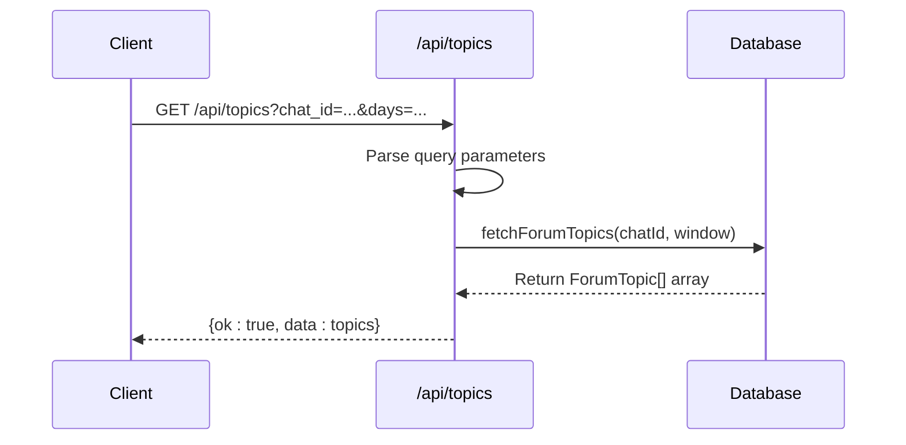
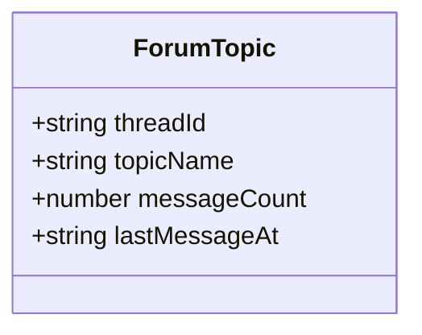
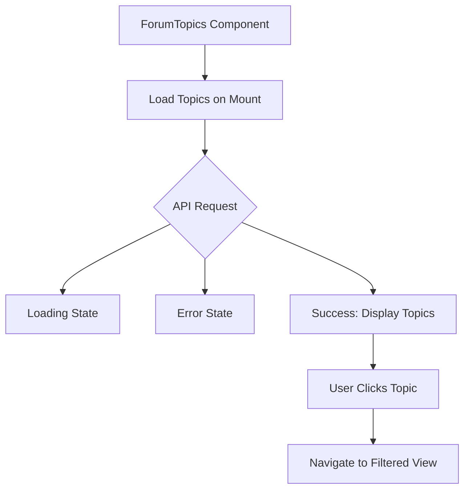

# Topics API

<cite>
**Referenced Files in This Document**   
- [route.ts](file://app/api/topics/route.ts)
- [queries.ts](file://lib/queries.ts)
- [forum-topics.tsx](file://components/forum-topics.tsx)
- [types.ts](file://lib/types.ts)
- [page.tsx](file://app/page.tsx)
- [week/page.tsx](file://app/week/page.tsx)
</cite>

## Table of Contents
1. [Introduction](#introduction)
2. [API Endpoint](#api-endpoint)
3. [Query Parameters](#query-parameters)
4. [Response Schema](#response-schema)
5. [Database Query Logic](#database-query-logic)
6. [Error Handling](#error-handling)
7. [Integration with ForumTopics Component](#integration-with-forumtopics-component)
8. [Usage Examples](#usage-examples)
9. [Dashboard Thread-Based Analysis](#dashboard-thread-based-analysis)
10. [Conclusion](#conclusion)

## Introduction
The `/api/topics` endpoint in the tg-ai-vibecoders-summary application provides a RESTful API for retrieving active discussion threads from a Telegram group or channel. This API enables thread-based analysis in the dashboard by identifying forum topics based on message thread IDs and extracting relevant metadata such as topic name, message count, and last activity time. The endpoint is integrated with the frontend ForumTopics component to provide a navigational interface for users to explore different discussion threads.

**Section sources**
- [route.ts](file://app/api/topics/route.ts#L1-L22)
- [forum-topics.tsx](file://components/forum-topics.tsx#L1-L103)

## API Endpoint
The `/api/topics` endpoint supports the GET method for retrieving a list of active forum topics. The endpoint is implemented as a Next.js API route and returns a JSON response containing an array of forum topics with their metadata.



**Diagram sources**
- [route.ts](file://app/api/topics/route.ts#L1-L22)
- [queries.ts](file://lib/queries.ts#L238-L296)

**Section sources**
- [route.ts](file://app/api/topics/route.ts#L1-L22)

## Query Parameters
The API accepts two optional query parameters to filter the results:

- `chat_id`: Filters topics to a specific chat (group or channel)
- `days`: Time window for active topics (7 for weekly, any other value defaults to 1 day)

When no parameters are provided, the API returns topics from all chats within the default 1-day window.

**Section sources**
- [route.ts](file://app/api/topics/route.ts#L6-L12)

## Response Schema
The API returns a JSON object with an `ok` status and `data` field containing an array of `ForumTopic` objects. Each topic includes the following properties:

| Field | Type | Description |
|-------|------|-------------|
| threadId | string | Unique identifier of the message thread |
| topicName | string | Name of the topic (first message text or fallback) |
| messageCount | number | Total messages in the thread |
| lastMessageAt | string | ISO timestamp of the most recent message |



**Diagram sources**
- [types.ts](file://lib/types.ts#L11-L16)
- [queries.ts](file://lib/queries.ts#L238-L296)

**Section sources**
- [types.ts](file://lib/types.ts#L11-L16)
- [queries.ts](file://lib/queries.ts#L274-L288)

## Database Query Logic
The `fetchForumTopics` function in `queries.ts` queries the PostgreSQL database to identify active discussion threads. The query logic includes:

1. Filtering messages from the specified time window (default: 1 day, optional: 7 days)
2. Identifying messages with non-null `message_thread_id` values
3. Optionally filtering by `chat_id` when provided
4. Grouping results by `message_thread_id` and `chat_id`
5. Counting messages per thread and finding the last message timestamp
6. Extracting the first message text as the topic name using a subquery
7. Limiting results to 50 topics ordered by message count (descending)

The topic name is derived from the earliest message in each thread, providing a meaningful label for the discussion. If the first message text is unavailable, a fallback name is generated using the thread ID.

**Section sources**
- [queries.ts](file://lib/queries.ts#L238-L296)

## Error Handling
The API implements robust error handling for database operations:

- Catches all errors during database query execution
- Specifically handles missing `message_thread_id` column by returning an empty array with a warning
- Logs detailed error information for debugging
- Returns a user-friendly error message in the response
- Sets appropriate HTTP status code (500) for server errors

When the `message_thread_id` column is missing (indicating an older database schema), the function gracefully returns an empty array instead of failing, allowing the application to continue functioning without forum topic functionality.

**Section sources**
- [route.ts](file://app/api/topics/route.ts#L14-L22)
- [queries.ts](file://lib/queries.ts#L268-L296)

## Integration with ForumTopics Component
The `/api/topics` endpoint is consumed by the `ForumTopics` React component, which provides a user interface for navigating discussion threads in the dashboard. The integration includes:

- Automatic loading of topics when the component mounts
- Display of loading state during API request
- Error handling with user-friendly messages
- Rendering of topic buttons with message counts
- Navigation to filtered views when topics are clicked

The component supports both daily and weekly dashboards by passing the appropriate `days` parameter. When a topic is selected, the application navigates to the corresponding dashboard view filtered by that thread ID.



**Diagram sources**
- [forum-topics.tsx](file://components/forum-topics.tsx#L1-L103)
- [page.tsx](file://app/page.tsx#L1-L42)
- [week/page.tsx](file://app/week/page.tsx#L1-L42)

**Section sources**
- [forum-topics.tsx](file://components/forum-topics.tsx#L1-L103)
- [page.tsx](file://app/page.tsx#L1-L42)
- [week/page.tsx](file://app/week/page.tsx#L1-L42)

## Usage Examples
### Get topics for a specific chat (1-day window)
```
GET /api/topics?chat_id=123456789
```

### Get topics for a specific chat (7-day window)
```
GET /api/topics?chat_id=123456789&days=7
```

### Get topics from all chats (default 1-day window)
```
GET /api/topics
```

These examples demonstrate how the API can be used to filter topics by chat and time window, enabling focused analysis of specific discussion threads within different time periods.

**Section sources**
- [route.ts](file://app/api/topics/route.ts#L6-L12)
- [forum-topics.tsx](file://components/forum-topics.tsx#L44-L51)

## Dashboard Thread-Based Analysis
The `/api/topics` endpoint enables thread-based analysis in the dashboard by providing the foundation for navigating and filtering discussion threads. When integrated with the `ForumTopics` component, it allows users to:

- Identify the most active discussion threads
- Navigate between different threads with a single click
- Analyze message metrics and AI insights within specific threads
- Compare discussion patterns across different time windows (daily vs. weekly)
- Focus analysis on specific chats or channels

This thread-based approach enhances the dashboard's analytical capabilities by allowing users to drill down into specific conversations rather than viewing all messages as a single stream.

**Section sources**
- [forum-topics.tsx](file://components/forum-topics.tsx#L1-L103)
- [page.tsx](file://app/page.tsx#L1-L42)
- [week/page.tsx](file://app/week/page.tsx#L1-L42)

## Conclusion
The `/api/topics` endpoint provides a robust API for retrieving and analyzing forum discussion threads in the tg-ai-vibecoders-summary application. By exposing thread metadata through a simple RESTful interface, it enables rich thread-based analysis in the dashboard while maintaining clean separation between backend data retrieval and frontend presentation. The integration with the ForumTopics component creates an intuitive user experience for navigating active discussions, making it easier to identify and analyze important conversations within large Telegram groups or channels.

[No sources needed since this section summarizes without analyzing specific files]