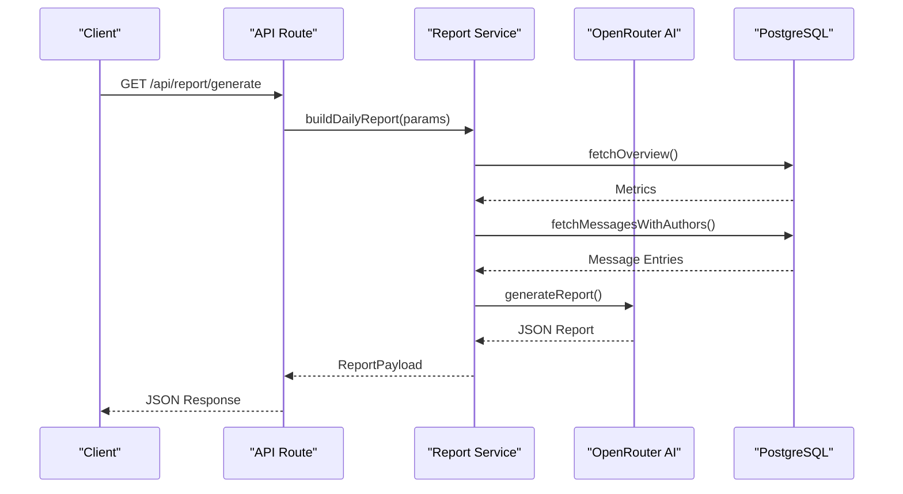
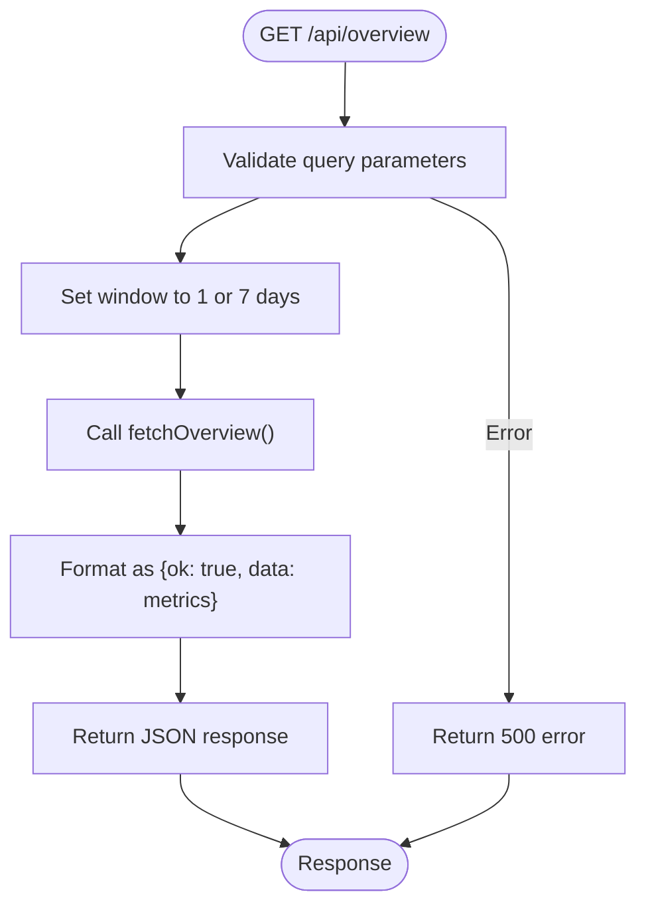
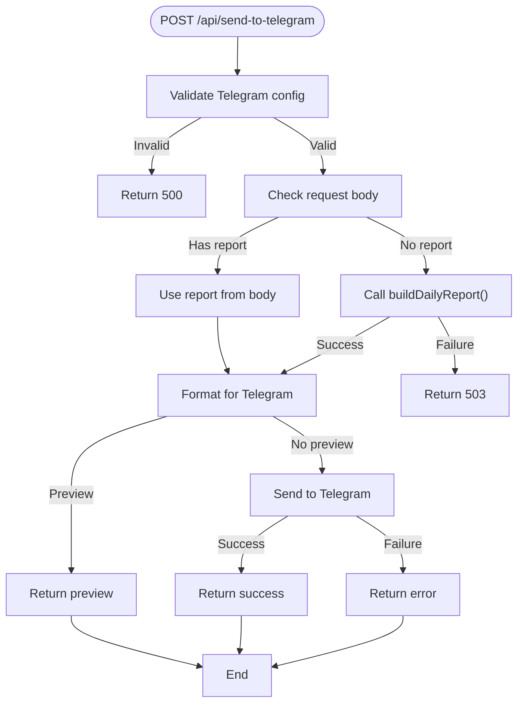
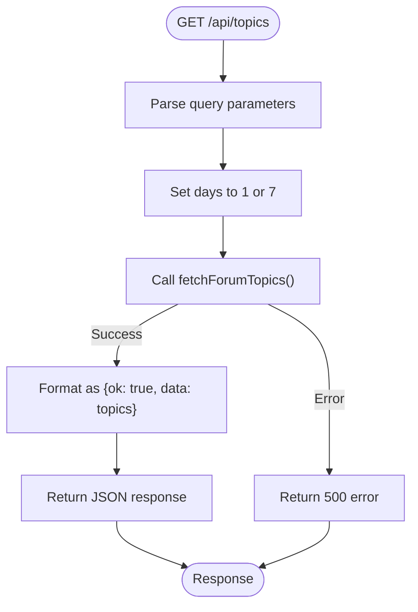
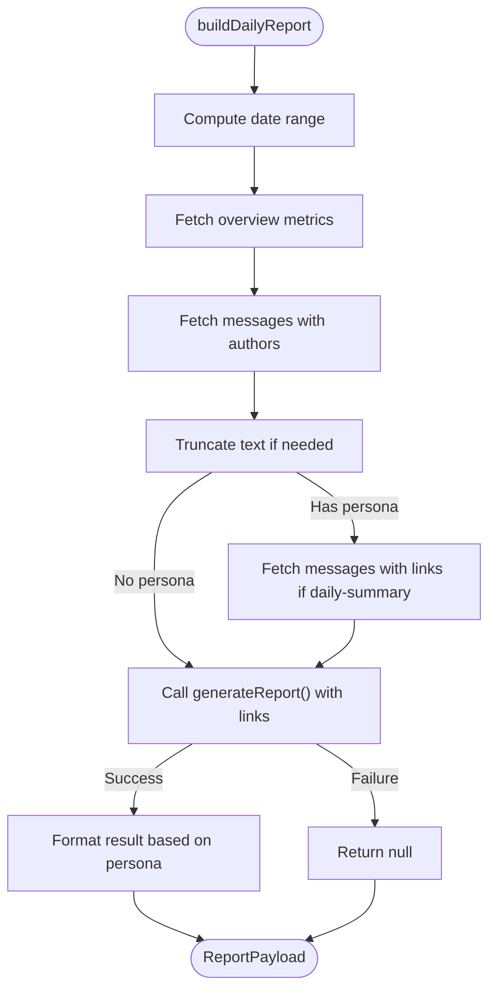
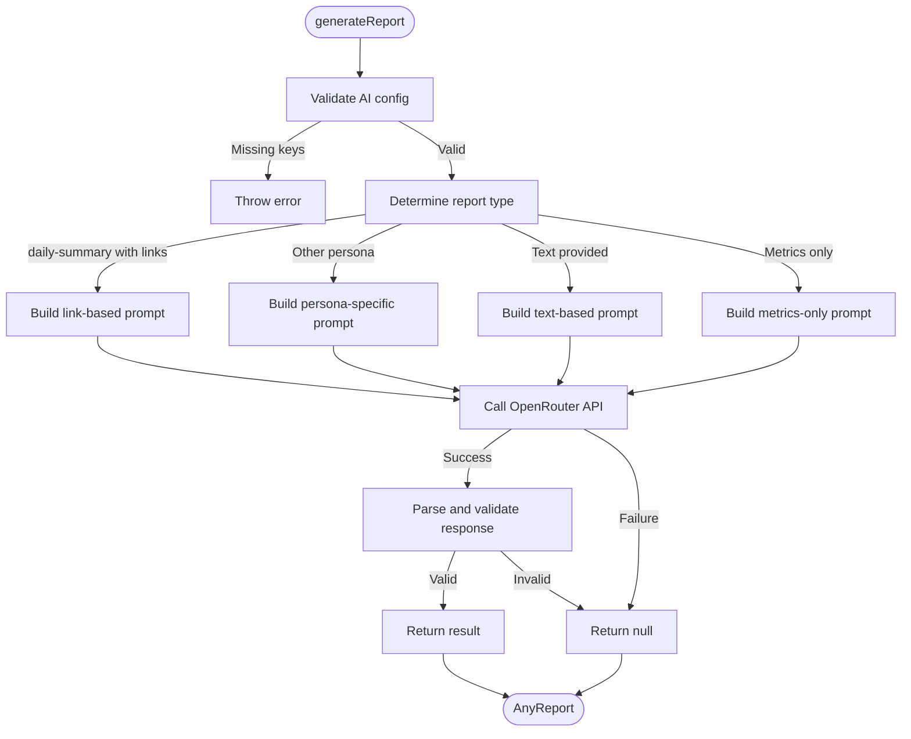
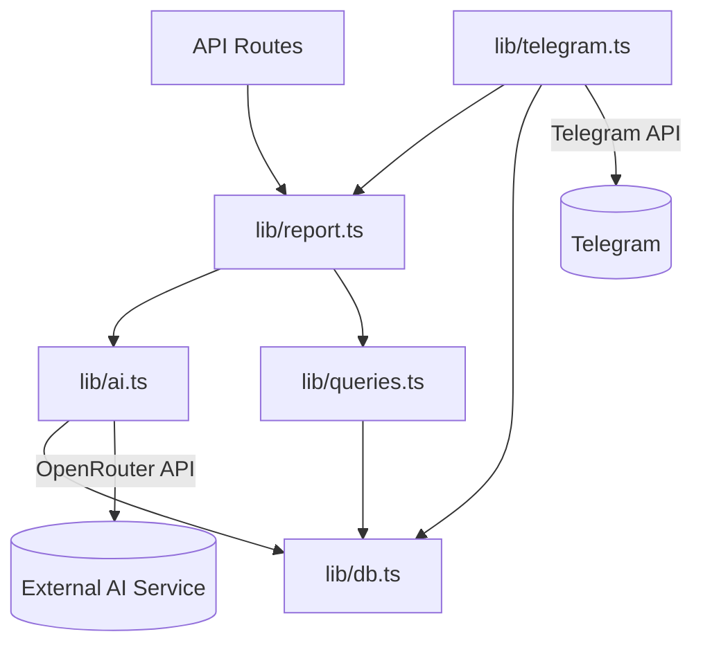

# Backend Architecture

<cite>
**Referenced Files in This Document**   
- [app/api/overview/route.ts](file://app/api/overview/route.ts)
- [app/api/report/[kind]/route.ts](file://app/api/report/[kind]/route.ts)
- [app/api/send-to-telegram/route.ts](file://app/api/send-to-telegram/route.ts)
- [app/api/topics/route.ts](file://app/api/topics/route.ts)
- [lib/report.ts](file://lib/report.ts)
- [lib/ai.ts](file://lib/ai.ts)
- [lib/db.ts](file://lib/db.ts)
- [lib/telegram.ts](file://lib/telegram.ts)
- [lib/queries.ts](file://lib/queries.ts)
- [lib/types.ts](file://lib/types.ts)
- [lib/reportSchemas.ts](file://lib/reportSchemas.ts)
</cite>

## Table of Contents
1. [Introduction](#introduction)
2. [Project Structure](#project-structure)
3. [Core Components](#core-components)
4. [Architecture Overview](#architecture-overview)
5. [Detailed Component Analysis](#detailed-component-analysis)
6. [Dependency Analysis](#dependency-analysis)
7. [Performance Considerations](#performance-considerations)
8. [Troubleshooting Guide](#troubleshooting-guide)
9. [Conclusion](#conclusion)

## Introduction
The tg-ai-vibecoders-summary application is a backend system designed to analyze Telegram chat data and generate AI-powered summaries. The architecture follows a layered pattern with clear separation between API routes, service logic, and data access. Built using Next.js App Router, the system exposes RESTful endpoints for retrieving chat analytics, generating AI reports, and sending summaries to Telegram. The backend integrates with external AI services through OpenRouter, stores data in PostgreSQL, and handles asynchronous operations with proper error handling and timeout management.

## Project Structure

The application follows a feature-based organization with distinct directories for API routes, components, and shared libraries. The backend logic is primarily contained within the `app/api` directory for route handlers and the `lib` directory for business logic and utilities.

```mermaid
graph TB
subgraph "API Routes"
A[app/api/overview]
B[app/api/report/[kind]]
C[app/api/send-to-telegram]
D[app/api/topics]
end
subgraph "Libraries"
E[lib/report.ts]
F[lib/ai.ts]
G[lib/db.ts]
H[lib/telegram.ts]
I[lib/queries.ts]
end
A --> E
B --> E
C --> E
D --> I
E --> F
E --> I
F --> G
H --> G
I --> G
```

**Diagram sources**
- [app/api/overview/route.ts](file://app/api/overview/route.ts)
- [app/api/report/[kind]/route.ts](file://app/api/report/[kind]/route.ts)
- [app/api/send-to-telegram/route.ts](file://app/api/send-to-telegram/route.ts)
- [app/api/topics/route.ts](file://app/api/topics/route.ts)
- [lib/report.ts](file://lib/report.ts)
- [lib/ai.ts](file://lib/ai.ts)
- [lib/db.ts](file://lib/db.ts)
- [lib/telegram.ts](file://lib/telegram.ts)
- [lib/queries.ts](file://lib/queries.ts)

**Section sources**
- [app/api](file://app/api)
- [lib](file://lib)

## Core Components

The backend architecture is built around several core components that handle different aspects of the application's functionality. The API routes serve as entry points, the service layer in `lib/report.ts` orchestrates report generation, and the database layer in `lib/queries.ts` handles data retrieval. The AI integration in `lib/ai.ts` provides the intelligence for generating summaries, while `lib/telegram.ts` manages communication with the Telegram API.

**Section sources**
- [lib/report.ts](file://lib/report.ts#L13-L103)
- [lib/ai.ts](file://lib/ai.ts#L33-L165)
- [lib/queries.ts](file://lib/queries.ts#L11-L115)
- [lib/telegram.ts](file://lib/telegram.ts#L1-L474)

## Architecture Overview

The system follows a layered architecture with clear separation of concerns. API routes handle HTTP requests and responses, the service layer coordinates business logic, and the data access layer retrieves information from the database. When generating reports, the system follows a specific flow: API receives request → service layer processes parameters → database queries retrieve relevant data → AI service generates summary → response is formatted and returned.



**Diagram sources**
- [app/api/report/[kind]/route.ts](file://app/api/report/[kind]/route.ts#L1-L83)
- [lib/report.ts](file://lib/report.ts#L13-L103)
- [lib/ai.ts](file://lib/ai.ts#L33-L165)
- [lib/queries.ts](file://lib/queries.ts#L11-L115)

## Detailed Component Analysis

### API Routes Analysis

The application exposes several API endpoints through the Next.js App Router, each serving a specific purpose in the analytics workflow.

#### Overview Endpoint
The `/api/overview` endpoint provides basic analytics about chat activity, including message counts, unique users, and top contributors. It accepts query parameters for filtering by chat ID, thread ID, and time window (1 or 7 days).



**Diagram sources**
- [app/api/overview/route.ts](file://app/api/overview/route.ts#L1-L22)

#### Report Generation Endpoint
The `/api/report/[kind]` endpoint is the core of the application, responsible for generating AI-powered summaries of chat activity. It supports different report kinds (generate, insights, preview) and accepts various query parameters to customize the report.

```mermaid
flowchart TD
Start([GET /api/report/{kind}]) --> ParseParams["Parse query parameters"]
ParseParams --> ValidateKind["Validate report kind"]
ValidateKind --> |Invalid| Return404["Return 404"]
ValidateKind --> |Valid| BuildReport["Call buildDailyReport()"]
BuildReport --> |Success| CheckKind["Check report kind"]
CheckKind --> |insights| ReturnInsights["Return insights only"]
CheckKind --> |generate| ReturnFull["Return full report"]
CheckKind --> |preview| ReturnFull["Return full report"]
BuildReport --> |Failure| Return503["Return 503 Service Unavailable"]
ReturnInsights --> End
ReturnFull --> End
Return503 --> End
```

**Diagram sources**
- [app/api/report/[kind]/route.ts](file://app/api/report/[kind]/route.ts#L1-L83)

#### Telegram Integration Endpoint
The `/api/send-to-telegram` endpoint handles sending generated reports to Telegram channels. It can either generate a new report or use a pre-generated one from the request body.



**Diagram sources**
- [app/api/send-to-telegram/route.ts](file://app/api/send-to-telegram/route.ts#L1-L151)

#### Topics Retrieval Endpoint
The `/api/topics` endpoint retrieves information about forum topics in the chat, including thread IDs, topic names, and activity levels.



**Diagram sources**
- [app/api/topics/route.ts](file://app/api/topics/route.ts#L1-L21)

### Service Layer Analysis

The service layer, primarily implemented in `lib/report.ts`, orchestrates the report generation process by coordinating between the API routes, database queries, and AI service.

#### Report Building Process
The `buildDailyReport` function is the main entry point for report generation, handling all aspects of preparing data for the AI service.



**Diagram sources**
- [lib/report.ts](file://lib/report.ts#L13-L103)

#### AI Report Generation
The `generateReport` function in `lib/ai.ts` handles communication with the OpenRouter AI service, constructing appropriate prompts based on the requested persona.



**Diagram sources**
- [lib/ai.ts](file://lib/ai.ts#L33-L165)

### Data Access Layer Analysis

The data access layer, implemented in `lib/queries.ts`, provides functions for retrieving chat data from the PostgreSQL database.

#### Database Query Functions
The queries module exports several functions for retrieving different types of data from the database.

```mermaid
classDiagram
class fetchOverview {
+fetchOverview(params) OverviewResponse
}
class fetchMessagesWithAuthors {
+fetchMessagesWithAuthors(params) {timestamp : Date, label : string, text : string}[]
}
class fetchMessagesWithLinks {
+fetchMessagesWithLinks(params) {timestamp : Date, label : string, text : string, links : string[]}[]
}
class fetchForumTopics {
+fetchForumTopics(params) ForumTopic[]
}
class getPool {
+getPool() Pool
}
fetchOverview --> getPool : "uses"
fetchMessagesWithAuthors --> getPool : "uses"
fetchMessagesWithLinks --> getPool : "uses"
fetchForumTopics --> getPool : "uses"
```

**Diagram sources**
- [lib/queries.ts](file://lib/queries.ts#L11-L115)
- [lib/queries.ts](file://lib/queries.ts#L167-L230)
- [lib/queries.ts](file://lib/queries.ts#L298-L370)
- [lib/db.ts](file://lib/db.ts#L1-L25)

## Dependency Analysis

The application has a clear dependency hierarchy with well-defined boundaries between components. The API routes depend on the service layer, which in turn depends on both the AI integration and database access layers.



**Diagram sources**
- [app/api](file://app/api)
- [lib/report.ts](file://lib/report.ts)
- [lib/ai.ts](file://lib/ai.ts)
- [lib/queries.ts](file://lib/queries.ts)
- [lib/db.ts](file://lib/db.ts)
- [lib/telegram.ts](file://lib/telegram.ts)

## Performance Considerations

The application implements several performance optimizations to handle large volumes of chat data efficiently. The `OPENROUTER_TIMEOUT_MS` environment variable (default 20,000ms) controls the timeout for AI service requests, preventing hanging operations. The system limits database queries to 5,000 messages for text analysis and 500 for link analysis to prevent excessive memory usage. Text processing includes character budgeting through the `LLM_TEXT_CHAR_BUDGET` environment variable (default 80,000 characters), ensuring AI requests remain within reasonable size limits. Database queries are optimized with appropriate indexing on `sent_at`, `chat_id`, and `message_thread_id` fields, and the PostgreSQL connection pool is limited to 5 concurrent connections to prevent database overload.

**Section sources**
- [lib/ai.ts](file://lib/ai.ts#L1019-L1092)
- [lib/report.ts](file://lib/report.ts#L13-L103)
- [lib/db.ts](file://lib/db.ts#L1-L25)

## Troubleshooting Guide

The system implements comprehensive error handling across all components. When the AI service is unavailable, endpoints return HTTP 503 status with a descriptive error message. Database connection issues are handled gracefully, with the connection pool implementation ensuring that transient failures don't crash the application. The Telegram integration includes specific error handling for common issues like invalid chat IDs (400), authentication problems (401), and permission issues (403). All critical operations are logged with structured console output, including timestamps and operation context, facilitating debugging. The system validates required environment variables at startup, failing fast if `OPENROUTER_API_KEY`, `OPENROUTER_MODEL`, `TELEGRAM_BOT_TOKEN`, or `TELEGRAM_CHAT_ID` are missing.

**Section sources**
- [app/api/report/[kind]/route.ts](file://app/api/report/[kind]/route.ts#L1-L83)
- [app/api/send-to-telegram/route.ts](file://app/api/send-to-telegram/route.ts#L1-L151)
- [lib/ai.ts](file://lib/ai.ts#L170-L174)
- [lib/telegram.ts](file://lib/telegram.ts#L1-L474)

## Conclusion

The tg-ai-vibecoders-summary backend architecture demonstrates a well-structured approach to building AI-powered analytics for Telegram chats. The system follows RESTful principles with clearly defined endpoints for different use cases. The layered architecture provides separation of concerns, making the codebase maintainable and extensible. The integration with external AI services is robust, with proper error handling and timeout management. Security is addressed through environment variable management for API keys and tokens. The application efficiently handles large datasets through query limiting and text truncation. Overall, the architecture balances functionality, performance, and reliability, providing a solid foundation for generating insightful chat summaries.