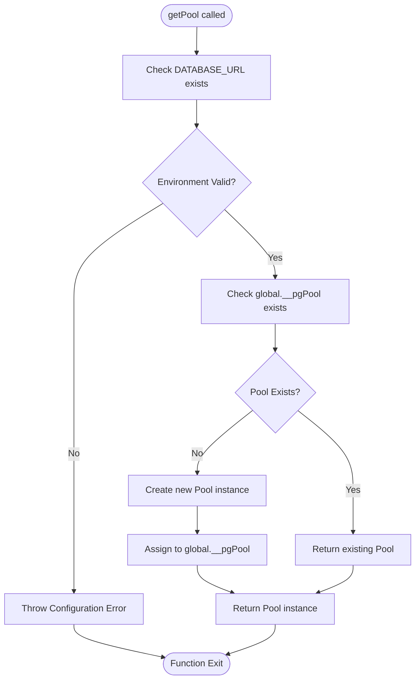
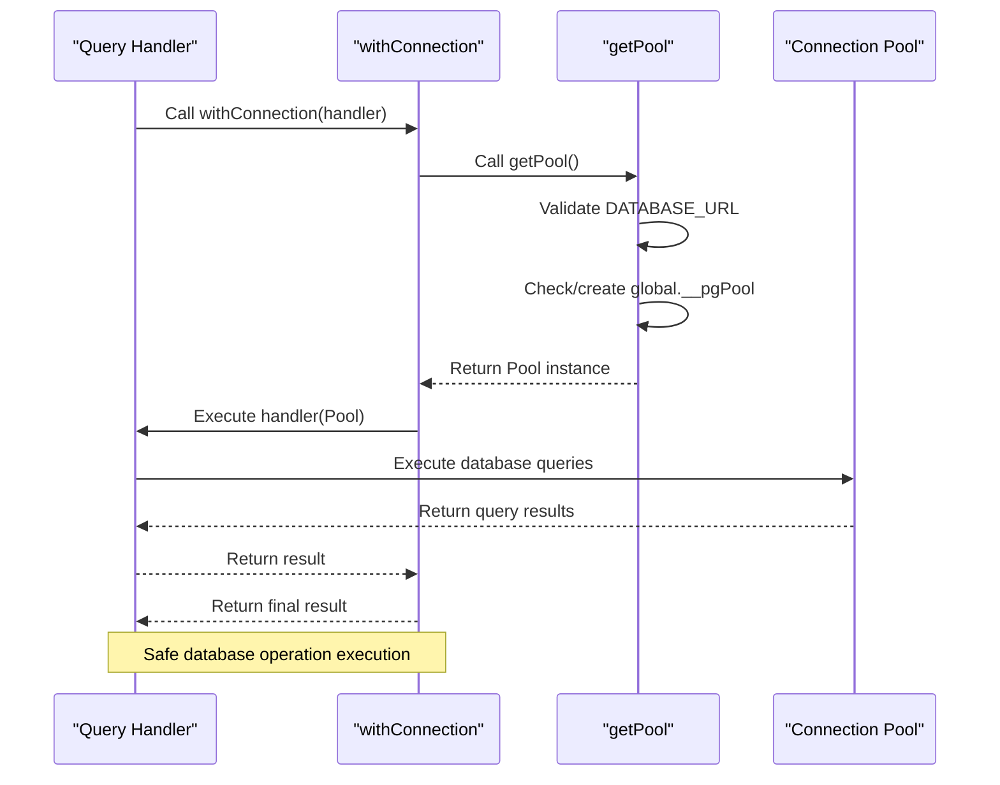

# Connection Management

<cite>
**Referenced Files in This Document**   
- [lib/db.ts](file://lib/db.ts)
- [lib/queries.ts](file://lib/queries.ts)
- [next.config.mjs](file://next.config.mjs)
</cite>

## Table of Contents
1. [Introduction](#introduction)
2. [Global Pool Instance and Singleton Pattern](#global-pool-instance-and-singleton-pattern)
3. [Pool Initialization and Environment Validation](#pool-initialization-and-environment-validation)
4. [Connection Pool Configuration](#connection-pool-configuration)
5. [Safe Database Operation Interface](#safe-database-operation-interface)
6. [Security Considerations](#security-considerations)
7. [Serverless Environment Implications](#serverless-environment-implications)
8. [Best Practices for Graceful Shutdown](#best-practices-for-graceful-shutdown)
9. [Conclusion](#conclusion)

## Introduction
This document provides a comprehensive analysis of the connection management system in the data access layer of the application. The system is built around PostgreSQL database connectivity using the `pg` library, implementing a singleton pattern for efficient connection pooling. The design focuses on ensuring reliable database access while maintaining application performance and scalability. The implementation includes critical security checks, a streamlined interface for database operations, and considerations for deployment in serverless environments.

## Global Pool Instance and Singleton Pattern

The connection management system implements a singleton pattern through the global `__pgPool` variable to ensure that only one instance of the database connection pool exists throughout the application lifecycle. This approach prevents the creation of multiple pool instances, which could lead to resource exhaustion and inconsistent database state. The global declaration allows the pool instance to persist across different modules and function calls, providing a consistent entry point for all database operations.

The singleton pattern is particularly beneficial in server-side rendering and API route contexts where multiple requests may attempt to access the database simultaneously. By sharing a single pool instance, the application can efficiently manage database connections and reduce the overhead associated with establishing new connections for each request.

**Section sources**
- [lib/db.ts](file://lib/db.ts#L3-L6)

## Pool Initialization and Environment Validation

The `getPool` function serves as the central mechanism for initializing and retrieving the database connection pool. This function implements a lazy initialization pattern, creating the pool instance only when first requested. Before creating the pool, the function validates the presence of the required `DATABASE_URL` environment variable, throwing an explicit error if this critical configuration is missing.

This validation ensures that the application fails fast during startup or first database access attempt, providing clear feedback about misconfiguration rather than allowing silent failures or undefined behavior. The function checks for the existence of the global `__pgPool` instance and creates a new `Pool` object only if one does not already exist, guaranteeing that initialization occurs exactly once regardless of how many times `getPool` is called.



**Diagram sources**
- [lib/db.ts](file://lib/db.ts#L9-L19)

**Section sources**
- [lib/db.ts](file://lib/db.ts#L9-L19)

## Connection Pool Configuration

The connection pool is configured with a maximum of 5 concurrent clients, which represents a balance between performance and resource constraints. This configuration limits the number of simultaneous connections to the PostgreSQL database, preventing the application from overwhelming the database server with too many concurrent requests. The pool automatically manages the lifecycle of these connections, reusing them for subsequent database operations and handling the details of connection establishment and cleanup.

The connection string is derived from the `DATABASE_URL` environment variable, allowing for flexible configuration across different deployment environments (development, staging, production) without code changes. The pool configuration also inherits default values for other parameters such as connection timeout, idle timeout, and maximum lifetime, which are appropriate for most use cases.

This pooling strategy significantly improves application scalability by eliminating the overhead of establishing a new database connection for each request. Instead, requests can quickly acquire an existing connection from the pool, execute their queries, and return the connection to the pool for reuse by other requests.

**Section sources**
- [lib/db.ts](file://lib/db.ts#L15-L17)

## Safe Database Operation Interface

The `withConnection` utility function provides a safe and consistent interface for executing database operations. This higher-order function abstracts away the details of pool management, requiring callers to provide only a handler function that performs the actual database work. The utility automatically retrieves the pool instance through `getPool` and passes it to the handler, ensuring that all database operations use the same connection management strategy.

By encapsulating the pool access pattern, `withConnection` promotes code reuse and reduces the risk of errors related to improper pool handling. The generic type parameter `<T>` allows the function to work with handlers that return any type of value, making it flexible enough to support various database operations while maintaining type safety.

Multiple functions in the `queries.ts` module demonstrate the usage of this pattern by importing and using `getPool` directly for database access, showing a consistent approach to database interaction throughout the application.



**Diagram sources**
- [lib/db.ts](file://lib/db.ts#L21-L24)
- [lib/queries.ts](file://lib/queries.ts#L7-L14)

**Section sources**
- [lib/db.ts](file://lib/db.ts#L21-L24)
- [lib/queries.ts](file://lib/queries.ts#L7-L14)

## Security Considerations

The implementation includes a critical security consideration by requiring the `DATABASE_URL` environment variable to be set before any database access can occur. This requirement prevents the application from accidentally connecting to unintended database instances or operating without proper configuration. The explicit error message guides developers to set the necessary environment variable, reducing configuration-related deployment issues.

The use of environment variables for database credentials follows security best practices by keeping sensitive information out of the source code. This approach allows different credentials to be used in different environments without code changes and prevents accidental exposure of database credentials in version control systems.

The global pool instance is also protected by the module system, as it is only accessible within the scope of the `db.ts` module unless explicitly exported. This encapsulation helps prevent unauthorized access or modification of the pool configuration.

**Section sources**
- [lib/db.ts](file://lib/db.ts#L7-L11)

## Serverless Environment Implications

The connection management system has specific implications for serverless environments, as indicated by the `serverExternalPackages: ["pg"]` configuration in `next.config.mjs`. This configuration suggests that the `pg` library is treated as an external package, which is typical in serverless deployments where certain native dependencies need special handling.

In serverless environments, the traditional connection pooling model faces challenges due to the ephemeral nature of serverless functions. The global `__pgPool` variable may not persist between invocations, potentially leading to the creation of new pool instances on each invocation. This could result in connection leaks or exhaustion of database connection limits if not properly managed.

The current implementation does not include explicit connection cleanup or pool termination logic, which is particularly important in serverless contexts where functions may be terminated unexpectedly. Without proper cleanup, idle connections could accumulate in the database server, eventually exhausting available connections.

```mermaid
graph TB
subgraph "Serverless Function"
A[Function Invocation]
B[Create Connection Pool]
C[Execute Database Operations]
D[Function Termination]
end
subgraph "Database Server"
E[Connection 1]
F[Connection 2]
G[Connection N]
end
A --> B
B --> C
C --> D
B --> E
B --> F
B --> G
style D stroke:#ff0000,stroke-width:2px
Note over D: Function terminated<br/>without connection cleanup
classDef red fill:#ffe6e6,stroke:#ff0000;
class D red;
linkStyle 4 stroke:#ff0000,stroke-width:2px;
linkStyle 5 stroke:#ff0000,stroke-width:2px;
linkStyle 6 stroke:#ff0000,stroke-width:2px;
```

**Diagram sources**
- [lib/db.ts](file://lib/db.ts#L15-L17)
- [next.config.mjs](file://next.config.mjs#L6-L7)

**Section sources**
- [lib/db.ts](file://lib/db.ts#L15-L17)
- [next.config.mjs](file://next.config.mjs#L6-L7)

## Best Practices for Graceful Shutdown

While the current implementation provides effective connection management during normal operation, it lacks explicit mechanisms for graceful shutdown and connection cleanup. In long-running applications or serverless environments with persistent instances, it is essential to properly terminate the connection pool when the application shuts down.

Best practices for graceful shutdown should include:

1. **Pool Termination**: Implement a function to safely end the connection pool, ensuring all active connections are properly closed before the application exits.
2. **Signal Handling**: Register handlers for termination signals (SIGTERM, SIGINT) to trigger cleanup procedures during deployment or scaling operations.
3. **Context Cancellation**: Use context cancellation patterns to abort ongoing database operations when shutdown is initiated.
4. **Health Checks**: Implement health check endpoints that verify database connectivity, allowing orchestration systems to detect and replace unhealthy instances.

A recommended implementation would add a `closePool` function to the `db.ts` module:

```typescript
export async function closePool(): Promise<void> {
  if (global.__pgPool) {
    await global.__pgPool.end();
    global.__pgPool = undefined;
  }
}
```

This function should be called during application shutdown to ensure all connections are properly closed and resources are released.

**Section sources**
- [lib/db.ts](file://lib/db.ts#L1-L25)

## Conclusion

The connection management system effectively implements a singleton pattern for database connection pooling using the `pg` library. The design ensures efficient resource utilization through lazy initialization of a single pool instance with a maximum of 5 concurrent clients. The `getPool` function provides robust environment validation by requiring the `DATABASE_URL` variable, while the `withConnection` utility offers a safe interface for database operations.

However, the implementation would benefit from additional features for graceful shutdown and connection cleanup, particularly important in serverless environments where the current configuration suggests deployment. Adding explicit pool termination logic and signal handling would enhance the reliability and resource management of the application. Despite these opportunities for improvement, the current system provides a solid foundation for database access with appropriate security considerations and performance optimizations.