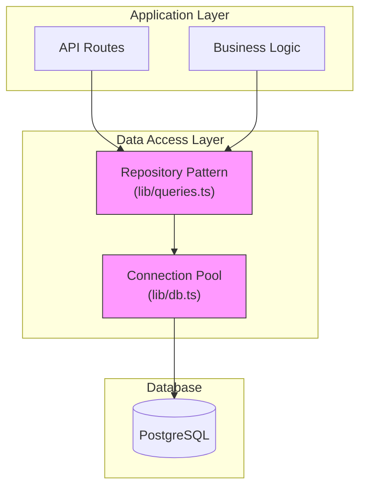
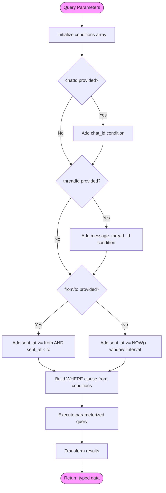
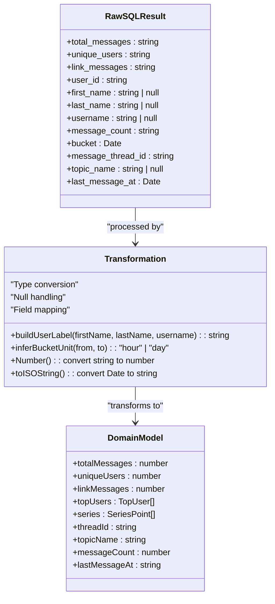
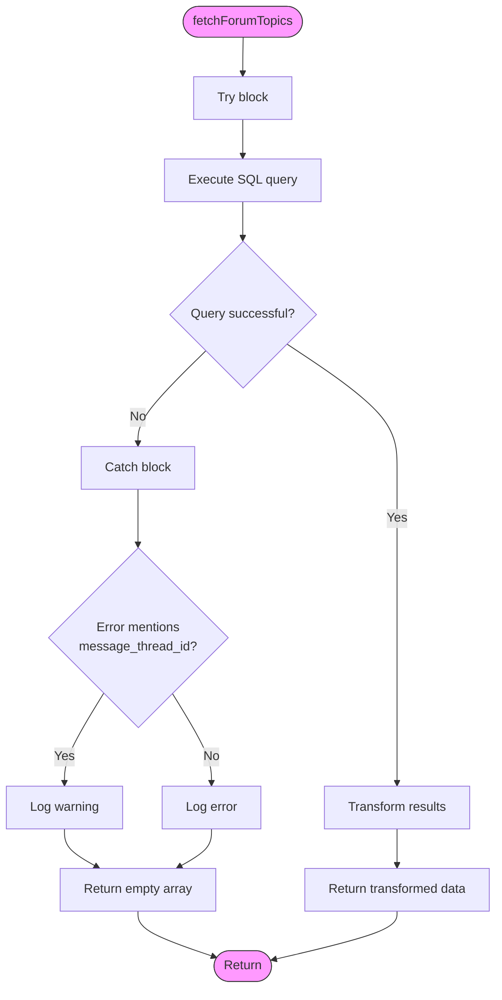

# Data Access Layer

<cite>
**Referenced Files in This Document**   
- [lib/queries.ts](file://lib/queries.ts)
- [lib/db.ts](file://lib/db.ts)
- [lib/types.ts](file://lib/types.ts)
- [app/api/overview/route.ts](file://app/api/overview/route.ts)
- [app/api/topics/route.ts](file://app/api/topics/route.ts)
</cite>

## Table of Contents
1. [Introduction](#introduction)
2. [Architecture Overview](#architecture-overview)
3. [Repository Pattern Implementation](#repository-pattern-implementation)
4. [Connection Pooling Strategy](#connection-pooling-strategy)
5. [Query Composition Techniques](#query-composition-techniques)
6. [Data Transformation Pipeline](#data-transformation-pipeline)
7. [Performance Considerations](#performance-considerations)
8. [Error Handling](#error-handling)
9. [API Integration](#api-integration)

## Introduction
The data access layer of the tg-ai-vibecoders-summary application provides a structured interface for interacting with PostgreSQL data, specifically focused on metrics, message retrieval, and forum topics. This documentation details the implementation of the Repository Pattern in lib/queries.ts, the connection pooling strategy using pg, query composition techniques for dynamic filtering, and the data transformation pipeline from raw SQL results to typed domain models. The layer abstracts database interactions while maintaining performance and type safety.

## Architecture Overview



**Diagram sources**
- [lib/queries.ts](file://lib/queries.ts)
- [lib/db.ts](file://lib/db.ts)

**Section sources**
- [lib/queries.ts](file://lib/queries.ts)
- [lib/db.ts](file://lib/db.ts)

## Repository Pattern Implementation

The Repository Pattern is implemented in lib/queries.ts to abstract PostgreSQL interactions for various data retrieval operations. The pattern provides a clean separation between the application logic and database operations, exposing a set of well-defined functions for different query types.

The implementation includes specialized repository functions for different data access needs:
- `fetchOverview`: Retrieves comprehensive metrics including message counts, unique users, and top contributors
- `fetchMessagesWithLinks`: Extracts messages containing URLs with author information
- `fetchForumTopics`: Retrieves forum thread information with topic naming logic
- `fetchMessagesText`: Retrieves raw message text for analysis
- `fetchMessagesWithAuthors`: Retrieves messages with associated author metadata

Each repository function follows a consistent pattern of parameter validation, query construction, execution, and result transformation, ensuring maintainability and type safety.

**Section sources**
- [lib/queries.ts](file://lib/queries.ts#L11-L115)
- [lib/queries.ts](file://lib/queries.ts#L238-L296)
- [lib/queries.ts](file://lib/queries.ts#L298-L370)

## Connection Pooling Strategy

```mermaid
classDiagram
class Pool {
+max : number
+connectionString : string
+query(sql, params) : Promise~QueryResult~
+connect() : Promise~Client~
+end() : Promise~void~
}
class GlobalScope {
-__pgPool : Pool
}
class ConnectionManager {
+getPool() : Pool
+withConnection(handler) : Promise~T~
}
GlobalScope --> ConnectionManager : "declares"
ConnectionManager --> Pool : "creates"
ConnectionManager : "Singleton pattern"
ConnectionManager : "Max connections : 5"
```

**Diagram sources**
- [lib/db.ts](file://lib/db.ts#L1-L25)

**Section sources**
- [lib/db.ts](file://lib/db.ts#L1-L25)

The connection pooling strategy is implemented in lib/db.ts using the pg library's Pool class. The implementation follows a singleton pattern through the global.__pgPool variable, ensuring that only one pool instance exists throughout the application lifecycle. This approach prevents connection proliferation and optimizes resource utilization.

The pool is configured with a maximum of 5 concurrent connections, which balances performance with database resource constraints. The getPool() function initializes the pool with the DATABASE_URL environment variable and returns the singleton instance for all database operations. The withConnection utility function provides an alternative interface for operations requiring direct client access.

## Query Composition Techniques



**Diagram sources**
- [lib/queries.ts](file://lib/queries.ts#L11-L50)
- [lib/queries.ts](file://lib/queries.ts#L238-L250)

**Section sources**
- [lib/queries.ts](file://lib/queries.ts#L11-L115)
- [lib/queries.ts](file://lib/queries.ts#L238-L296)

The data access layer employs dynamic query composition techniques to support flexible filtering by various parameters. Queries are constructed programmatically based on input parameters including chat_id, threadId, date ranges, and time windows. The implementation uses parameterized queries with numbered placeholders ($1, $2, etc.) to prevent SQL injection attacks while allowing dynamic condition building.

For date-based filtering, the system supports both absolute date ranges (from/to parameters) and relative time windows (1-day or 7-day windows). The query composition logic automatically determines the appropriate filtering strategy based on available parameters. When both from and to dates are provided, the system infers the appropriate bucket unit (hour or day) for time series data based on the date range duration.

## Data Transformation Pipeline



**Diagram sources**
- [lib/queries.ts](file://lib/queries.ts#L50-L115)
- [lib/types.ts](file://lib/types.ts)

**Section sources**
- [lib/queries.ts](file://lib/queries.ts#L50-L115)
- [lib/types.ts](file://lib/types.ts#L0-L24)

The data transformation pipeline converts raw SQL query results into typed domain models defined in lib/types.ts. This pipeline performs several critical transformations:

1. **Type Conversion**: PostgreSQL returns numeric values as strings, which are converted to JavaScript numbers using the Number() function
2. **Date Formatting**: Date objects are converted to ISO string format using toISOString() for JSON serialization
3. **User Label Construction**: The buildUserLabel function combines first name, last name, and username into a display name with fallback logic
4. **Null Handling**: COALESCE expressions in SQL and null checks in JavaScript ensure consistent handling of missing data
5. **Field Mapping**: Database column names are mapped to camelCase property names in the domain models

The pipeline transforms raw query results into strongly-typed interfaces including OverviewResponse, TopUser, SeriesPoint, and ForumTopic, ensuring type safety throughout the application.

## Performance Considerations

The data access layer incorporates several performance optimizations:

1. **LIMIT Clauses**: Most queries include LIMIT clauses to prevent excessive data retrieval, particularly in fetchOverview (LIMIT 10 for top users) and fetchForumTopics (LIMIT 50 for topics)
2. **Efficient Text Extraction**: The fetchMessagesWithLinks function uses a regex pattern to extract URLs from message text, avoiding expensive database text processing
3. **Index Usage Implications**: The query patterns suggest the need for database indexes on key columns including chat_id, message_thread_id, and sent_at for optimal performance
4. **Connection Pooling**: The global Pool instance with a maximum of 5 connections prevents connection overhead and database resource exhaustion
5. **Parameterized Queries**: Using parameterized queries with placeholders allows PostgreSQL to cache execution plans for improved performance on repeated queries

The implementation balances performance with functionality, using efficient SQL patterns like COUNT(*) FILTER() for conditional counting and date_trunc() for time series bucketing.

**Section sources**
- [lib/queries.ts](file://lib/queries.ts#L80-L90)
- [lib/queries.ts](file://lib/queries.ts#L298-L370)
- [lib/db.ts](file://lib/db.ts#L1-L25)

## Error Handling



**Diagram sources**
- [lib/queries.ts](file://lib/queries.ts#L238-L296)

**Section sources**
- [lib/queries.ts](file://lib/queries.ts#L238-L296)
- [app/api/overview/route.ts](file://app/api/overview/route.ts#L15-L22)
- [app/api/topics/route.ts](file://app/api/topics/route.ts#L15-L21)

The data access layer implements robust error handling for both database connectivity issues and schema mismatches. The fetchForumTopics function includes a try-catch block that specifically handles schema evolution scenarios where the message_thread_id column might be missing from the database.

When a schema mismatch is detected (specifically when the error message contains references to the message_thread_id column), the function logs a warning and returns an empty array rather than propagating the error. This graceful degradation allows the application to continue functioning even when database schema changes occur.

For general database errors, the function logs the error details and returns an empty array as a fallback. API routes that consume these repository functions implement additional error handling, catching exceptions and returning appropriate HTTP status codes (500) with error messages to the client.

## API Integration

The repository functions in lib/queries.ts are directly consumed by API routes in the application, demonstrating a clean separation of concerns. The API routes handle HTTP-specific concerns like parameter extraction from URL search parameters, while delegating data access to the repository layer.

The GET handler in app/api/overview/route.ts extracts parameters such as chat_id, thread_id, and days from the request URL, validates them against allowed values, and passes them to the fetchOverview repository function. Similarly, app/api/topics/route.ts extracts chat_id and days parameters and passes them to fetchForumTopics.

This integration pattern ensures that the data access layer remains focused on database operations while the API layer handles HTTP protocol concerns, request validation, and error response formatting.

**Section sources**
- [app/api/overview/route.ts](file://app/api/overview/route.ts)
- [app/api/topics/route.ts](file://app/api/topics/route.ts)
- [lib/queries.ts](file://lib/queries.ts)