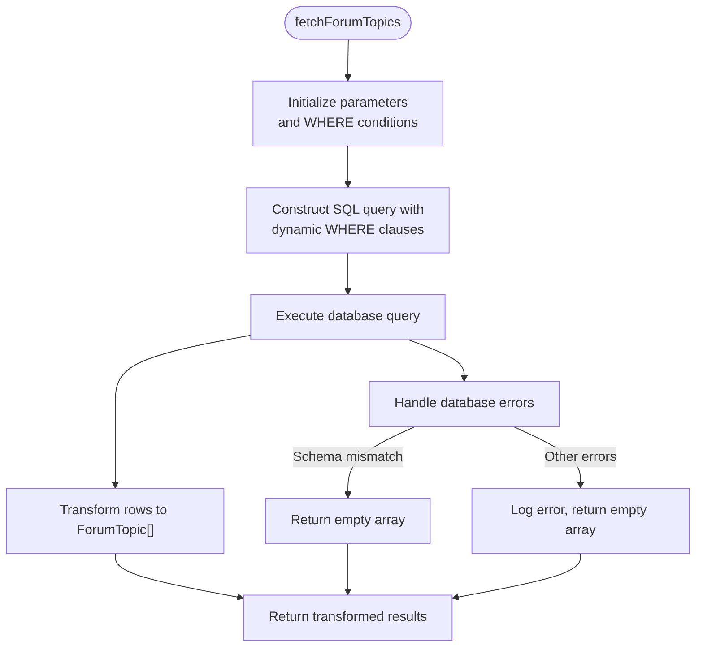
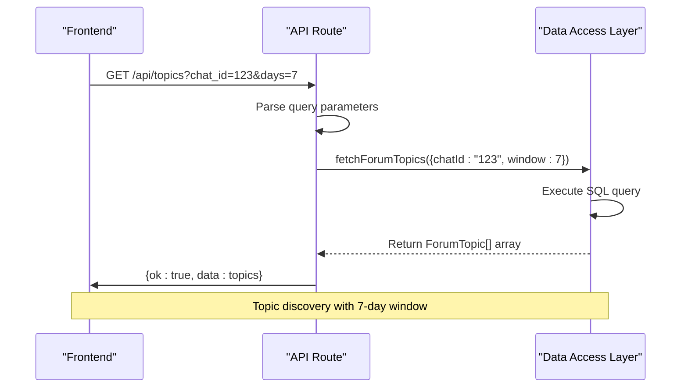

# Forum Topics Queries

<cite>
**Referenced Files in This Document**   
- [queries.ts](file://lib/queries.ts)
- [db.ts](file://lib/db.ts)
- [topics/route.ts](file://app/api/topics/route.ts)
- [types.ts](file://lib/types.ts)
</cite>

## Table of Contents
1. [Introduction](#introduction)
2. [Core Implementation](#core-implementation)
3. [SQL Query Logic](#sql-query-logic)
4. [Error Handling Strategy](#error-handling-strategy)
5. [Performance Considerations](#performance-considerations)
6. [API Integration](#api-integration)
7. [Data Model](#data-model)

## Introduction

The forum topics queries functionality enables the identification and retrieval of active discussion threads from Telegram groups. This system analyzes message data stored in the database to surface the most engaging conversation threads based on message volume and recency. The implementation centers around the `fetchForumTopics` function, which executes a sophisticated SQL query to group messages by thread and extract meaningful metadata about each discussion topic.

**Section sources**
- [queries.ts](file://lib/queries.ts#L238-L296)

## Core Implementation

The `fetchForumTopics` function serves as the primary interface for retrieving forum topics from the data access layer. It accepts optional parameters for filtering by specific chat ID and time window (1 or 7 days), providing flexibility in topic discovery. The function establishes a database connection through the connection pooling mechanism and constructs a parameterized SQL query to prevent injection attacks.

The implementation follows a structured approach:
1. Parameter initialization for time window filtering
2. Dynamic WHERE clause construction based on provided filters
3. Execution of the main SQL query to aggregate thread data
4. Transformation of database results into the application's ForumTopic type
5. Comprehensive error handling for database schema issues



**Diagram sources**
- [queries.ts](file://lib/queries.ts#L238-L296)

**Section sources**
- [queries.ts](file://lib/queries.ts#L238-L296)

## SQL Query Logic

The SQL query implemented in `fetchForumTopics` employs several advanced PostgreSQL features to efficiently identify and characterize forum topics. The query logic centers on grouping messages by their `message_thread_id` and extracting key metrics for each thread.

### Main Query Structure

The primary query selects four key pieces of information for each thread:
- `message_thread_id`: The unique identifier for the discussion thread
- `COUNT(*) as message_count`: Total messages in the thread (engagement metric)
- `MAX(sent_at) as last_message_at`: Timestamp of the most recent message (recency metric)
- Subquery-derived `topic_name`: The first message text in the thread

The query groups results by both `message_thread_id` and `chat_id` to ensure proper isolation of threads across different Telegram groups.

### Subquery for Topic Name Extraction

The system uses a correlated subquery to retrieve the first message text as the topic name:

```sql
(SELECT text FROM messages m2 
 WHERE m2.message_thread_id = m.message_thread_id 
 AND m2.chat_id = m.chat_id
 ORDER BY sent_at ASC LIMIT 1) as topic_name
```

This subquery identifies the earliest message in each thread by ordering by `sent_at` in ascending order and limiting to one result. By using the first message as the topic name, the system captures the original subject of the discussion, which typically sets the context for subsequent replies.

### Fallback Behavior for Null Topic Names

When the topic name cannot be determined (null value), the implementation provides a fallback mechanism:

```typescript
topicName: row.topic_name || `Тема ${row.message_thread_id}`
```

This ensures that every thread has a displayable name by using the thread ID as a default label with the Russian prefix "Тема" (meaning "Topic"). This fallback prevents UI issues from null values while maintaining traceability through the unique thread ID.

**Section sources**
- [queries.ts](file://lib/queries.ts#L258-L274)

## Error Handling Strategy

The implementation includes robust error handling specifically designed to address schema compatibility issues. The primary concern is the potential absence of the `message_thread_id` column, which would occur if the database schema hasn't been updated to support forum topics.

The error handling mechanism uses pattern matching on error messages to identify schema-related issues:

```typescript
if (error?.message?.includes("column") && error?.message?.includes("message_thread_id")) {
  console.warn("[DB] Forum topics not available (message_thread_id column missing)");
  return [];
}
```

This targeted approach allows the system to:
- Distinguish between schema errors and other database issues
- Gracefully degrade functionality when forum topics aren't supported
- Provide meaningful warnings for debugging
- Return an empty array instead of propagating the error

For all other database errors, the system logs the full error details for debugging purposes while still returning an empty array to prevent application crashes. This ensures that the failure to retrieve forum topics doesn't disrupt the overall application functionality.

**Section sources**
- [queries.ts](file://lib/queries.ts#L288-L295)

## Performance Considerations

The implementation incorporates several performance optimizations to ensure efficient query execution and scalability.

### Result Limiting

The query includes a `LIMIT 50` clause to restrict the number of returned topics:

```sql
LIMIT 50
```

This prevents excessive data transfer and processing, particularly important when dealing with large Telegram groups that may have hundreds of active threads. The limit focuses on the most active topics, which are typically the most relevant for users.

### Indexing Implications

For optimal performance, the database should have appropriate indexes on the following columns:
- `message_thread_id`: Critical for the GROUP BY operation and subquery filtering
- `sent_at`: Essential for the time-based filtering in the WHERE clause
- Composite index on `(chat_id, message_thread_id, sent_at)`: Would optimize the main query's filtering, grouping, and ordering operations

Without proper indexing, the query performance would degrade significantly as the message table grows, particularly for the GROUP BY and ORDER BY operations.

### Time Window Parameter

The `window` parameter (1 or 7 days) directly affects the time range filtering in the query:

```typescript
const params: Array<string | number> = [`${window} days`];
```

This parameter controls the recency of topics discovered:
- **1-day window**: Focuses on very recent, highly active discussions
- **7-day window**: Captures topics with sustained engagement over a week

The choice of window affects both query performance and result relevance. Shorter windows typically return fewer rows and execute faster, while longer windows provide a broader view of discussion activity at the cost of increased processing time.

**Section sources**
- [queries.ts](file://lib/queries.ts#L242-L256)

## API Integration

The forum topics functionality is exposed through a Next.js API route that serves as the bridge between the frontend and data access layer. The `/api/topics` endpoint handles HTTP GET requests and translates query parameters into the appropriate function arguments.

The API route:
- Extracts `chat_id` and `days` parameters from the request URL
- Maps the days parameter to the valid window values (1 or 7)
- Calls `fetchForumTopics` with the processed parameters
- Returns results in a standardized JSON format
- Implements error handling to return appropriate HTTP status codes



**Diagram sources**
- [topics/route.ts](file://app/api/topics/route.ts#L1-L21)
- [queries.ts](file://lib/queries.ts#L238-L296)

**Section sources**
- [topics/route.ts](file://app/api/topics/route.ts#L1-L21)

## Data Model

The forum topics functionality relies on a well-defined data model that ensures type safety and consistency between the database and application layers.

### ForumTopic Type Definition

The `ForumTopic` interface defines the structure of topic data returned by the system:

```typescript
export type ForumTopic = {
  threadId: string;
  topicName: string;
  messageCount: number;
  lastMessageAt: string;
};
```

This type includes:
- `threadId`: The unique identifier for the discussion thread
- `topicName`: The display name for the topic (first message text or fallback)
- `messageCount`: The total number of messages in the thread (engagement metric)
- `lastMessageAt`: ISO string timestamp of the most recent message

### Type Transformation

The implementation includes explicit type transformation from database results to the application model:

```typescript
return rows.map((row) => ({
  threadId: row.message_thread_id,
  topicName: row.topic_name || `Тема ${row.message_thread_id}`,
  messageCount: Number(row.message_count),
  lastMessageAt: row.last_message_at.toISOString()
}));
```

This transformation ensures:
- Proper type conversion (string to number for messageCount)
- Date formatting consistency (toISOString)
- Null safety through the topic name fallback
- Clear separation between database schema and application interface

**Section sources**
- [types.ts](file://lib/types.ts#L11-L16)
- [queries.ts](file://lib/queries.ts#L276-L286)