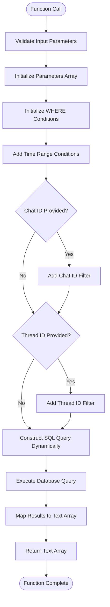
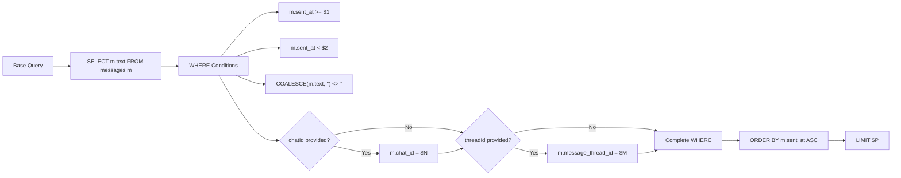
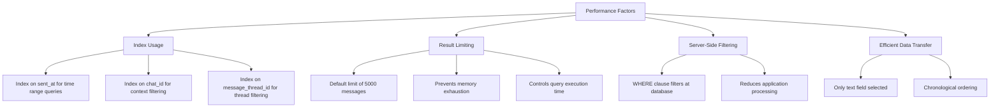

# Fetch Messages Text

<cite>
**Referenced Files in This Document**   
- [queries.ts](file://lib/queries.ts)
- [db.ts](file://lib/db.ts)
</cite>

## Table of Contents
1. [Introduction](#introduction)
2. [Function Overview](#function-overview)
3. [Parameter Details](#parameter-details)
4. [SQL Query Construction](#sql-query-construction)
5. [Data Filtering and Cleanliness](#data-filtering-and-cleanliness)
6. [Security Implementation](#security-implementation)
7. [Performance Considerations](#performance-considerations)
8. [Usage Example](#usage-example)
9. [Integration with AI Pipelines](#integration-with-ai-pipelines)
10. [Conclusion](#conclusion)

## Introduction

The `fetchMessagesText` function serves as a critical data access layer component in the application's message retrieval system. This function is specifically designed to extract raw message text from the database for analysis purposes, with a focus on providing clean, structured data for downstream processing. The function plays a vital role in enabling AI-driven analysis of communication patterns by providing a reliable interface for accessing message content within specified temporal and contextual boundaries.

**Section sources**
- [queries.ts](file://lib/queries.ts#L117-L165)

## Function Overview

The `fetchMessagesText` function is an asynchronous utility that retrieves message text from the database based on time range and optional filtering criteria. It operates as part of the data access layer, abstracting the complexity of database interactions from higher-level application logic. The function returns a promise that resolves to an array of strings, each representing the text content of a message that meets the specified criteria.

The function is designed with several key objectives in mind: data cleanliness, performance optimization, security, and flexibility. It ensures that only meaningful message content is retrieved by filtering out empty or null values, limits result sets to prevent memory issues, and uses parameterized queries to prevent SQL injection attacks. The implementation follows a pattern of dynamic query construction based on the provided parameters, allowing for efficient filtering without unnecessary complexity.

**Diagram sources**
- [queries.ts](file://lib/queries.ts#L117-L165)

**Section sources**
- [queries.ts](file://lib/queries.ts#L117-L165)

## Parameter Details

The `fetchMessagesText` function accepts five parameters that provide flexibility in data retrieval:

- `chatId` (optional string): Filters messages to a specific chat context
- `threadId` (optional string): Filters messages to a specific conversation thread
- `from` (required Date): Specifies the start of the time range for message retrieval
- `to` (required Date): Specifies the end of the time range for message retrieval
- `limit` (optional number, default 5000): Caps the maximum number of messages returned

The function uses TypeScript interfaces to ensure type safety and provides default values for optional parameters. The `limit` parameter is particularly important for performance management, preventing excessive memory usage when querying large datasets. By default, the function will return at most 5,000 messages, which represents a balance between providing sufficient data for analysis and maintaining system performance.

The parameters are collected into an array that is used for parameterized query execution, ensuring that all user-provided values are properly escaped and preventing SQL injection vulnerabilities. The function also logs its parameters for debugging purposes, which can be valuable for monitoring and troubleshooting.

**Section sources**
- [queries.ts](file://lib/queries.ts#L117-L165)

## SQL Query Construction

The `fetchMessagesText` function employs a dynamic SQL query construction approach that builds the query string based on the provided parameters. This approach allows for efficient filtering without requiring multiple separate query templates. The function starts with a base set of conditions and adds additional WHERE clauses only when specific filters are requested.

The SQL query is parameterized using PostgreSQL's dollar-sign notation ($1, $2, etc.), which ensures that all user input is properly escaped and prevents SQL injection attacks. The parameters are stored in an array and passed to the database driver separately from the query text, maintaining a clear separation between code and data.

The query selects only the `text` field from the `messages` table, optimizing for the specific use case of retrieving message content. Results are ordered by `sent_at` in ascending order to maintain chronological consistency, which is important for time-series analysis. The LIMIT clause is dynamically positioned as the final parameter in the query, ensuring that result sets are appropriately constrained.

**Diagram sources**
- [queries.ts](file://lib/queries.ts#L117-L165)

**Section sources**
- [queries.ts](file://lib/queries.ts#L117-L165)

## Data Filtering and Cleanliness

A key feature of the `fetchMessagesText` function is its implementation of data cleanliness through the use of the `COALESCE` function in the SQL query. The condition `COALESCE(m.text, '') <> ''` ensures that only messages with meaningful text content are returned, filtering out both NULL values and empty strings.

The `COALESCE` function returns the first non-NULL value in its argument list, effectively treating NULL message text as an empty string. By comparing this result to an empty string with the `<>` operator, the query excludes any messages that would contribute no meaningful content to analysis. This preprocessing at the database level reduces the amount of data transferred over the network and eliminates the need for additional filtering in application code.

This approach to data cleanliness is particularly important for AI analysis pipelines, where empty or null messages could skew statistical analyses or waste computational resources. By ensuring that only substantive messages are retrieved, the function provides a clean corpus of text that is ready for natural language processing tasks such as sentiment analysis, topic modeling, or summarization.

**Section sources**
- [queries.ts](file://lib/queries.ts#L117-L165)

## Security Implementation

The `fetchMessagesText` function implements robust security measures to prevent SQL injection attacks through the use of parameterized queries. Rather than concatenating user input directly into the SQL string, the function uses PostgreSQL's parameterized query syntax with numbered placeholders ($1, $2, etc.).

All user-provided values (chatId, threadId, from, to, and limit) are added to a parameters array and passed separately to the database driver. This ensures that these values are properly escaped and treated as data rather than executable code, eliminating the risk of injection attacks. The dynamic construction of the WHERE clause maintains this security by only incorporating predefined SQL fragments, never user input, into the query structure.

The function also benefits from TypeScript's type system, which provides compile-time validation of parameter types and helps prevent certain classes of injection vulnerabilities. Combined with the parameterized query approach, this creates multiple layers of defense against malicious input.

**Section sources**
- [queries.ts](file://lib/queries.ts#L117-L165)

## Performance Considerations

The `fetchMessagesText` function incorporates several performance optimizations to ensure efficient database operations and system stability. The most significant of these is the default limit of 5,000 messages, which prevents excessive memory usage and long-running queries that could impact system performance.

The function leverages database indexing through its filtering conditions, particularly on the `sent_at` column which is used for time-based queries. Proper indexing on this column allows for efficient range queries and rapid retrieval of messages within the specified time window. Additional indexes on `chat_id` and `message_thread_id` would further optimize performance when these filters are applied.

The use of server-side filtering through the SQL WHERE clause minimizes data transfer between the database and application server, as only messages that meet all criteria are returned. This is more efficient than retrieving a large dataset and filtering in application code. The chronological ordering of results also supports efficient processing by downstream components that may analyze messages in temporal sequence.

**Diagram sources**
- [queries.ts](file://lib/queries.ts#L117-L165)

**Section sources**
- [queries.ts](file://lib/queries.ts#L117-L165)

## Usage Example

The `fetchMessagesText` function can be used to retrieve message content for analysis within a specific time frame and context. A typical usage scenario involves extracting messages from a particular chat over a defined period to analyze communication patterns or generate summaries.

For example, to retrieve messages from a specific chat during a one-week period, the function would be called with appropriate date objects and the chat identifier. The function's flexibility allows for various combinations of parameters depending on the analytical needs, such as analyzing all messages across chats within a time window or focusing on a specific conversation thread.

The returned array of message texts can then be processed by AI algorithms for tasks such as sentiment analysis, topic extraction, or summary generation. The clean, chronological data provided by this function serves as an ideal input for natural language processing pipelines.

**Section sources**
- [queries.ts](file://lib/queries.ts#L117-L165)

## Integration with AI Pipelines

The `fetchMessagesText` function is specifically designed to support AI analysis pipelines by providing a clean, structured corpus of message text. Its primary use case is feeding textual data to machine learning models for various analytical purposes, including sentiment analysis, topic modeling, trend detection, and automated summarization.

By filtering out empty and null messages at the database level, the function ensures that AI models receive only meaningful input, improving the accuracy and efficiency of analysis. The chronological ordering of results supports time-series analysis and enables the detection of evolving conversation patterns over time.

The function's parameterization allows AI systems to request data at different granularities, from broad overviews of all messages in a time period to focused analyses of specific conversation threads. This flexibility makes it a versatile component in the data pipeline architecture, capable of supporting various analytical workflows and research questions.

**Section sources**
- [queries.ts](file://lib/queries.ts#L117-L165)

## Conclusion

The `fetchMessagesText` function represents a well-designed data access layer component that balances functionality, performance, and security. By providing a clean interface for retrieving message text with flexible filtering options, it enables sophisticated AI-driven analysis of communication patterns while maintaining system stability and data integrity.

The function's implementation demonstrates several best practices in database interaction, including parameterized queries for security, server-side filtering for efficiency, and result limiting for performance management. Its focus on data cleanliness through the use of COALESCE ensures that downstream AI pipelines receive high-quality input, improving the reliability of analytical results.

As a critical component in the application's data infrastructure, `fetchMessagesText` plays an essential role in transforming raw message data into actionable insights, supporting the overall mission of understanding and summarizing communication patterns in digital forums.

**Section sources**
- [queries.ts](file://lib/queries.ts#L117-L165)
- [db.ts](file://lib/db.ts#L9-L19)