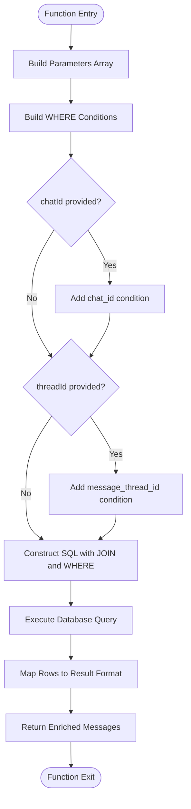
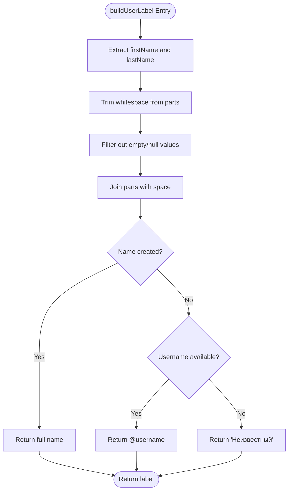

# Fetch Messages With Authors

<cite>
**Referenced Files in This Document**   
- [queries.ts](file://lib/queries.ts)
- [db.ts](file://lib/db.ts)
- [format.ts](file://lib/format.ts)
</cite>

## Table of Contents
1. [Introduction](#introduction)
2. [Core Components](#core-components)
3. [SQL Query Construction](#sql-query-construction)
4. [Author Data Enrichment](#author-data-enrichment)
5. [User Label Generation](#user-label-generation)
6. [Parameter Filtering](#parameter-filtering)
7. [Error Handling and Logging](#error-handling-and-logging)
8. [Performance Considerations](#performance-considerations)
9. [Integration and Usage](#integration-and-usage)
10. [Conclusion](#conclusion)

## Introduction
The `fetchMessagesWithAuthors` function serves as a critical data access layer component that retrieves enriched message data by combining information from both messages and users tables. This function is designed to provide contextual information for AI analysis and dashboard visualization by attaching author identity details to each message. The implementation demonstrates thoughtful consideration for data completeness, performance optimization, and error resilience in a production environment.

## Core Components

The `fetchMessagesWithAuthors` function orchestrates several key components to deliver enriched message data. It begins by establishing a database connection through the connection pooling mechanism provided by `getPool()`, ensuring efficient resource utilization. The function then constructs a parameterized SQL query that safely incorporates dynamic filtering criteria while preventing SQL injection vulnerabilities. The core logic revolves around a LEFT JOIN operation between the messages and users tables, which preserves all messages in the result set regardless of whether complete user data is available. After executing the query, the function processes the raw database results by transforming them into a standardized format that includes timestamp, author label, and message text.

**Section sources**
- [queries.ts](file://lib/queries.ts#L167-L230)

## SQL Query Construction

The SQL query within `fetchMessagesWithAuthors` is dynamically constructed based on input parameters, allowing flexible filtering while maintaining security through parameterized queries. The base query selects essential message fields (sent_at, text) along with user identity information (first_name, last_name, username) using explicit column references. The use of table aliases (m for messages, u for users) enhances query readability and reduces ambiguity. The WHERE clause is built incrementally by pushing conditions into an array, which are then joined with AND operators. This approach allows conditional inclusion of chatId and threadId filters without creating complex conditional SQL string concatenation. The query orders results chronologically by sent_at timestamp and applies a configurable limit to prevent excessive data retrieval.

**Diagram sources**
- [queries.ts](file://lib/queries.ts#L167-L230)

**Section sources**
- [queries.ts](file://lib/queries.ts#L167-L230)

## Author Data Enrichment

The function enriches message data through a LEFT JOIN between the messages and users tables, specifically linking on the user_id field. This join strategy is crucial as it ensures message records are preserved in the result set even when corresponding user data is incomplete or missing from the database. The use of COALESCE functions in the SELECT clause handles potential NULL values in user profile fields by substituting empty strings, preventing null propagation issues in subsequent processing. This approach maintains data integrity while providing a consistent interface for consumers of the function. The enrichment process transforms raw database records into a structured format that combines temporal data (timestamp), author identification (label), and message content (text), creating a comprehensive view of chat activity.

**Section sources**
- [queries.ts](file://lib/queries.ts#L167-L230)

## User Label Generation

The `buildUserLabel` utility function implements a hierarchical approach to constructing user display names from available profile data. It first attempts to create a full name by combining non-null first_name and last_name fields, trimming whitespace and filtering out empty values. If a complete name can be formed, it is returned as the primary identifier. When name data is unavailable, the function falls back to the username prefixed with '@', providing a recognizable alternative. As a final fallback, when neither name nor username is available, the function returns "Неизвестный" (Unknown in Russian), ensuring every message has a meaningful author label. This cascading logic prioritizes human-readable names while maintaining consistency across the dataset, even with incomplete user information.

**Diagram sources**
- [queries.ts](file://lib/queries.ts#L372-L381)

**Section sources**
- [queries.ts](file://lib/queries.ts#L372-L381)

## Parameter Filtering

The function supports multiple filtering parameters to narrow the result set according to specific requirements. The mandatory from and to parameters define a time window for message retrieval, enabling temporal analysis of chat activity. Optional chatId and threadId parameters allow for context-specific filtering, where chatId restricts results to a particular chat group and threadId focuses on a specific conversation thread within that chat. These parameters are incorporated into the WHERE clause as additional conditions only when provided, maintaining query efficiency by avoiding unnecessary filters. The limit parameter controls the maximum number of messages returned, preventing performance degradation with large result sets and enabling pagination-like behavior in client applications.

**Section sources**
- [queries.ts](file://lib/queries.ts#L167-L230)

## Error Handling and Logging

The function incorporates comprehensive logging to facilitate debugging and monitoring of database operations. Before executing the query, it logs all input parameters including chatId, threadId, date range, and limit, providing visibility into the filtering criteria being applied. The use of ISO string formatting for dates ensures consistent and readable timestamp representation in logs. While the function itself does not implement explicit error handling, it relies on the underlying database driver and connection pool to propagate errors, which would typically be caught at higher levels of the application stack. The parameterized query construction inherently protects against SQL injection attacks, contributing to the overall security of the data access layer.

**Section sources**
- [queries.ts](file://lib/queries.ts#L167-L230)

## Performance Considerations

The implementation balances data completeness with performance optimization through several strategies. The LEFT JOIN operation, while potentially expensive on large datasets, is necessary to preserve message context when user data is incomplete. The function mitigates performance risks by applying a configurable limit to result sets and leveraging database indexing through the use of primary key joins (user_id). The connection pooling mechanism provided by `getPool()` reduces the overhead of establishing database connections for each function call. However, on very large datasets, the JOIN operation could become a bottleneck, particularly if appropriate indexes are not in place on the user_id, chat_id, and message_thread_id columns. The sequential processing of query results through the map operation is efficient for moderate result sizes but could be optimized further through streaming for extremely large datasets.

**Section sources**
- [queries.ts](file://lib/queries.ts#L167-L230)
- [db.ts](file://lib/db.ts#L9-L19)

## Integration and Usage

The enriched data format produced by `fetchMessagesWithAuthors` is specifically designed to support contextual AI analysis and dashboard visualization. The combination of timestamp, author label, and message text provides a complete context for natural language processing algorithms to analyze conversation patterns, sentiment, and topic evolution over time. Dashboard components can leverage this structured data to display chronological message streams with proper author attribution, even when user profile information is incomplete. The function's flexible parameterization allows it to serve various use cases, from real-time chat monitoring to historical analysis of specific conversation threads. Its integration with the connection pooling system ensures efficient resource utilization in high-concurrency environments.

**Section sources**
- [queries.ts](file://lib/queries.ts#L167-L230)
- [format.ts](file://lib/format.ts#L1-L14)

## Conclusion

The `fetchMessagesWithAuthors` function exemplifies a well-designed data access pattern that prioritizes data completeness, security, and usability. By combining thoughtful SQL construction with intelligent data enrichment and fallback mechanisms, it delivers reliable message data even in the presence of incomplete user information. The function's design considerations around performance, security, and maintainability make it a robust component of the application's data infrastructure. Future enhancements could include more sophisticated caching strategies, support for additional filtering criteria, and optimization for very large datasets through query plan analysis and index tuning.