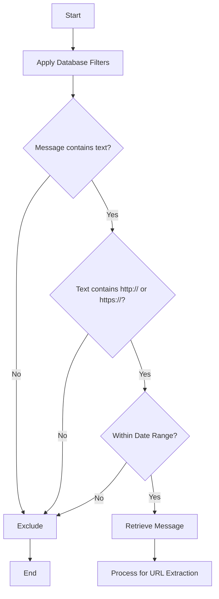
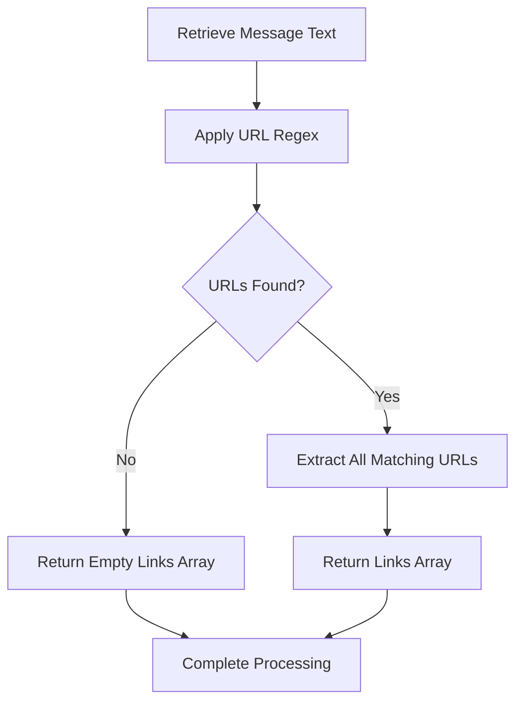
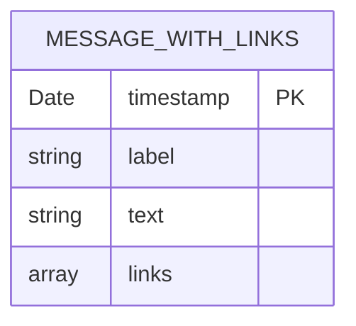

# Fetch Messages With Links

<cite>
**Referenced Files in This Document**   
- [queries.ts](file://lib/queries.ts)
</cite>

## Table of Contents
1. [Introduction](#introduction)
2. [Core Functionality](#core-functionality)
3. [Database Query and Pre-Filtering](#database-query-and-pre-filtering)
4. [URL Extraction Process](#url-extraction-process)
5. [Result Structure and Formatting](#result-structure-and-formatting)
6. [Performance Considerations](#performance-considerations)
7. [Integration with Analytics Features](#integration-with-analytics-features)
8. [Edge Cases and Limitations](#edge-cases-and-limitations)
9. [Conclusion](#conclusion)

## Introduction
The `fetchMessagesWithLinks` function is a critical component in the analytics system that enables the identification and extraction of URLs from message content within a messaging platform. This function serves as the foundation for link analysis features in the analytics dashboard, allowing users to track, categorize, and analyze shared resources across conversations. By combining efficient database querying with precise JavaScript-based URL pattern matching, the function provides a robust solution for extracting meaningful insights from message data.

**Section sources**
- [queries.ts](file://lib/queries.ts#L298-L370)

## Core Functionality
The `fetchMessagesWithLinks` function retrieves messages containing URLs within a specified time range and context. It accepts parameters for chat identification, thread filtering, date range specification, and result limiting. The function's primary purpose is to identify messages with embedded links and extract the individual URLs for further analysis. This capability supports various analytics use cases, including tracking resource sharing patterns, identifying popular content, and understanding user engagement with external resources.

The function operates on a two-phase processing model: first retrieving candidate messages from the database using efficient SQL filtering, then applying JavaScript regex matching to extract individual URLs from each message's text content. This approach balances database efficiency with the flexibility of client-side pattern matching.

**Section sources**
- [queries.ts](file://lib/queries.ts#L298-L370)

## Database Query and Pre-Filtering
The function implements an efficient pre-filtering mechanism using PostgreSQL's case-insensitive regular expression operator `~*` with the pattern `'https?://'`. This SQL WHERE clause condition `m.text ~* 'https?://'` serves as an initial filter to identify messages that potentially contain HTTP or HTTPS links. The case-insensitive nature of the operator ensures that links are detected regardless of their capitalization (e.g., "HTTP://", "https://", "Http://").

This database-level filtering significantly improves performance by reducing the dataset size before application-level processing. Only messages that pass this initial filter are retrieved from the database, minimizing network transfer and subsequent processing overhead. The query also includes additional filters for date range (`m.sent_at >= $1` and `m.sent_at < $2`), non-empty text content (`COALESCE(m.text, '') <> ''`), and optional filters for specific chat or thread IDs.

**Diagram sources**
- [queries.ts](file://lib/queries.ts#L305-L308)

**Section sources**
- [queries.ts](file://lib/queries.ts#L305-L308)

## URL Extraction Process
After retrieving candidate messages from the database, the function applies a JavaScript regular expression to extract individual URLs from each message's text. The regex pattern `/https?:\/\/(www\.)?[-a-zA-Z0-9@:%._\+~#=]{1,256}\.[a-zA-Z0-9()]{1,6}\b([-a-zA-Z0-9()@:%_\+.~#?&//=]*)/gi` is designed to match HTTP and HTTPS URLs with the following characteristics:

- Supports both HTTP and HTTPS protocols
- Optionally matches "www." subdomain
- Matches domain names with alphanumeric characters and common special characters
- Validates top-level domains with 1-6 characters
- Captures URL paths, query parameters, and fragments
- Uses case-insensitive global matching (flags 'gi')

The function processes each message by applying the `match()` method with this regex pattern, which returns an array of all matching URLs in the text. If no URLs are found, an empty array is returned, ensuring consistent data structure across all results.

**Diagram sources**
- [queries.ts](file://lib/queries.ts#L355-L356)

**Section sources**
- [queries.ts](file://lib/queries.ts#L355-L356)

## Result Structure and Formatting
The function returns a promise that resolves to an array of objects, each representing a message with extracted links. Each object in the result array has the following structure:

- `timestamp`: The date and time when the message was sent (Date object)
- `label`: A formatted user identifier combining first name, last name, and username
- `text`: The original message text containing the links
- `links`: An array of strings, each representing a URL extracted from the message

The user label is generated using the `buildUserLabel` helper function, which prioritizes the user's full name if available, falls back to their username (prefixed with "@"), and defaults to "Unknown" if neither is available. This consistent formatting ensures that user identification is uniform across the application.

**Diagram sources**
- [queries.ts](file://lib/queries.ts#L358-L364)

**Section sources**
- [queries.ts](file://lib/queries.ts#L358-L364)

## Performance Considerations
The function incorporates several performance optimizations to handle large datasets efficiently. The default `limit` parameter of 500 controls the maximum number of messages returned, preventing excessive memory usage and long response times. This configurable limit allows clients to balance result comprehensiveness with performance requirements.

The two-phase processing approach contributes significantly to performance: the database performs initial filtering using its optimized text search capabilities, while the application layer handles the more complex pattern matching. This division of labor leverages the strengths of both systems. Additionally, parameterized SQL queries prevent injection attacks and allow for query plan caching, further improving performance for repeated calls with similar parameters.

The function also includes comprehensive logging of its parameters, which aids in performance monitoring and debugging without impacting runtime efficiency.

**Section sources**
- [queries.ts](file://lib/queries.ts#L300-L302)

## Integration with Analytics Features
The `fetchMessagesWithLinks` function serves as a foundational component for various analytics features in the dashboard. Its output directly supports the "shared_links" section of daily summaries, where all links shared during a period are cataloged with their context, sharer, and timing. This enables detailed analysis of information flow within the community.

The extracted link data allows for categorization by domain, identification of popular resources, and analysis of sharing patterns by user. Analytics can track which users are most active in sharing external content, which domains are most frequently referenced, and how link sharing correlates with overall engagement metrics. This information is valuable for community managers and content strategists seeking to understand information dissemination patterns.

**Section sources**
- [queries.ts](file://lib/queries.ts#L298-L370)
- [ai.ts](file://lib/ai.ts#L875-L912)

## Edge Cases and Limitations
While the current implementation is effective for most use cases, it has several edge cases and limitations. The regex pattern may not correctly handle all valid URL formats, particularly those with internationalized domain names, unusual port specifications, or complex authentication components. URLs that are split across multiple lines or contain unusual encoding may be missed or incorrectly parsed.

The database pre-filter `text ~* 'https?://'` might miss links that use alternative protocols (like ftp://) or those that are obfuscated in the text. Additionally, the function does not validate that extracted URLs are actually accessible or resolve to working resources.

The character length restrictions in the regex pattern (e.g., domain names limited to 256 characters, TLDs to 6 characters) may exclude some valid but unusually long URLs. As new top-level domains emerge with longer names, the pattern may need updates to maintain comprehensive coverage.

**Section sources**
- [queries.ts](file://lib/queries.ts#L355-L356)

## Conclusion
The `fetchMessagesWithLinks` function provides a robust solution for extracting URLs from message content, combining efficient database filtering with precise client-side pattern matching. Its two-phase processing approach optimizes performance while maintaining accuracy in link detection. The function's output structure supports comprehensive link analysis features in the analytics dashboard, enabling insights into information sharing patterns within the community.

While the current implementation effectively handles the majority of use cases, awareness of its limitations regarding edge cases in URL formatting is important for interpreting results accurately. Future enhancements could include support for additional protocols, improved handling of internationalized URLs, and integration with URL validation services to verify link accessibility.