# Message Queries

<cite>
**Referenced Files in This Document**   
- [queries.ts](file://lib/queries.ts)
- [db.ts](file://lib/db.ts)
</cite>

## Table of Contents
1. [Introduction](#introduction)
2. [Core Message Retrieval Functions](#core-message-retrieval-functions)
3. [Text Extraction and Filtering](#text-extraction-and-filtering)
4. [Author Information Enrichment](#author-information-enrichment)
5. [Link Extraction and Processing](#link-extraction-and-processing)
6. [Data Transformation Pipeline](#data-transformation-pipeline)
7. [Query Parameterization and Filtering](#query-parameterization-and-filtering)
8. [Error Handling and Logging](#error-handling-and-logging)
9. [Conclusion](#conclusion)

## Introduction
This document provides a comprehensive analysis of the message queries functionality in the data access layer of the application. The system implements three primary functions for retrieving message content with varying levels of enrichment: `fetchMessagesText`, `fetchMessagesWithAuthors`, and `fetchMessagesWithLinks`. These functions serve as the foundation for extracting and processing message data from the database, supporting various use cases across the application. The implementation leverages PostgreSQL features for efficient querying, includes robust filtering mechanisms, and incorporates data transformation to deliver enriched results to higher-level components.

**Section sources**
- [queries.ts](file://lib/queries.ts#L117-L381)

## Core Message Retrieval Functions

The data access layer provides three specialized functions for retrieving message content, each designed to serve different use cases with varying levels of data enrichment. The functions share a common parameter structure that includes optional chat_id and threadId filters, required date range parameters (from, to), and a configurable limit parameter that defaults to 5000 for text and author queries, and 500 for link queries. All functions utilize a connection pool managed by the `getPool()` function from the db module, ensuring efficient database connection management.

**Diagram sources**
- [queries.ts](file://lib/queries.ts#L117-L370)

**Section sources**
- [queries.ts](file://lib/queries.ts#L117-L370)

## Text Extraction and Filtering

The `fetchMessagesText` function implements a robust text extraction mechanism that retrieves message content while filtering out empty messages. The implementation uses PostgreSQL's `COALESCE` function to handle potential null values in the message text field, ensuring that only messages with meaningful content are returned. The query structure includes date range filtering with `sent_at >= $1` and `sent_at < $2` conditions, which efficiently narrows down results based on the provided time window. The function supports optional filtering by chat_id and message_thread_id, allowing for targeted retrieval of messages from specific conversations or discussion threads.

**Diagram sources**
- [queries.ts](file://lib/queries.ts#L117-L145)

**Section sources**
- [queries.ts](file://lib/queries.ts#L117-L145)

## Author Information Enrichment

The `fetchMessagesWithAuthors` function extends basic message retrieval by enriching results with author information through a LEFT JOIN operation between the messages and users tables. This JOIN connects messages to their respective authors using the user_id field, allowing the query to retrieve first name, last name, and username information alongside the message content. The function implements comprehensive null handling using COALESCE for all user fields, ensuring that missing information does not disrupt the query results. The data transformation pipeline then processes these fields to create user labels, providing a consistent representation of authors across the application.

**Diagram sources**
- [queries.ts](file://lib/queries.ts#L167-L230)

**Section sources**
- [queries.ts](file://lib/queries.ts#L167-L230)

## Link Extraction and Processing

The `fetchMessagesWithLinks` function specializes in retrieving messages that contain hyperlinks, implementing regex-based URL extraction to identify HTTP and HTTPS links within message content. The query uses PostgreSQL's case-insensitive pattern matching operator `~*` with the pattern 'https?://' to efficiently filter messages containing URLs at the database level, reducing the amount of data transferred. After retrieval, a JavaScript regular expression processes the message text to extract all matching URLs, returning them as an array. The function has a lower default limit of 500 results, reflecting the typically smaller volume of link-containing messages compared to general message traffic.

**Diagram sources**
- [queries.ts](file://lib/queries.ts#L298-L370)

**Section sources**
- [queries.ts](file://lib/queries.ts#L298-L370)

## Data Transformation Pipeline

The data transformation pipeline begins with raw database results and produces enriched message objects suitable for application use. The `buildUserLabel` function plays a crucial role in this pipeline, constructing user labels from first name, last name, and username fields. The function first attempts to create a full name by combining non-null first and last name components, falling back to the username (prefixed with '@') if name information is unavailable, and finally returning "Неизвестный" (Unknown) as a default when no identifying information exists. This hierarchical approach ensures consistent user representation across the application while gracefully handling incomplete data.

```mermaid
flowchart TD
A["First Name"] --> B["Trim and Validate"]
C["Last Name"] --> D["Trim and Validate"]
B --> E["Combine Non-empty Parts"]
D --> E
E --> F{"Name Exists?"}
F --> |Yes| G["Return Full Name"]
F --> |No| H["Username Available?"]
H --> |Yes| I["Return @username"]
H --> |No| J["Return 'Неизвестный'"]
G --> K["Final User Label"]
I --> K
J --> K
```

**Diagram sources**
- [queries.ts](file://lib/queries.ts#L372-L381)

**Section sources**
- [queries.ts](file://lib/queries.ts#L372-L381)

## Query Parameterization and Filtering

The message query functions implement a flexible parameterization system that supports dynamic query construction based on input parameters. All functions accept optional chat_id and threadId filters, which are conditionally added to the WHERE clause when provided. The parameter array is dynamically constructed to maintain proper positional references in the SQL query, with each additional condition incrementing the parameter index. Date range filtering uses inclusive start and exclusive end conditions to prevent overlap in time-based queries. The LIMIT parameter is configurable with sensible defaults, allowing clients to control result set size based on their specific requirements.

**Section sources**
- [queries.ts](file://lib/queries.ts#L117-L370)

## Error Handling and Logging

The message query implementation includes comprehensive logging to support debugging and monitoring of database operations. Each function logs its input parameters, including chat_id, threadId, date range, and limit values, providing visibility into query execution context. The logging uses the "[DB]" prefix to distinguish database-related messages in application logs. While the provided code does not show explicit error handling within the query functions, the architecture relies on the underlying database driver and application-level error handling. The `getPool` function in db.ts includes validation of the DATABASE_URL environment variable, preventing connection attempts when essential configuration is missing.

**Diagram sources**
- [queries.ts](file://lib/queries.ts#L117-L370)
- [db.ts](file://lib/db.ts#L9-L19)

**Section sources**
- [queries.ts](file://lib/queries.ts#L117-L370)
- [db.ts](file://lib/db.ts#L9-L19)

## Conclusion

The message queries functionality in the data access layer provides a robust foundation for retrieving and processing message content with varying levels of enrichment. The implementation demonstrates effective use of PostgreSQL features including COALESCE for null handling, regex pattern matching for content filtering, and parameterized queries for security and flexibility. The three primary functions—fetchMessagesText, fetchMessagesWithAuthors, and fetchMessagesWithLinks—serve distinct use cases while sharing a consistent interface and implementation pattern. The data transformation pipeline, particularly the buildUserLabel function, ensures consistent presentation of user information across the application. Together, these components enable efficient and reliable access to message data, supporting the application's core functionality.