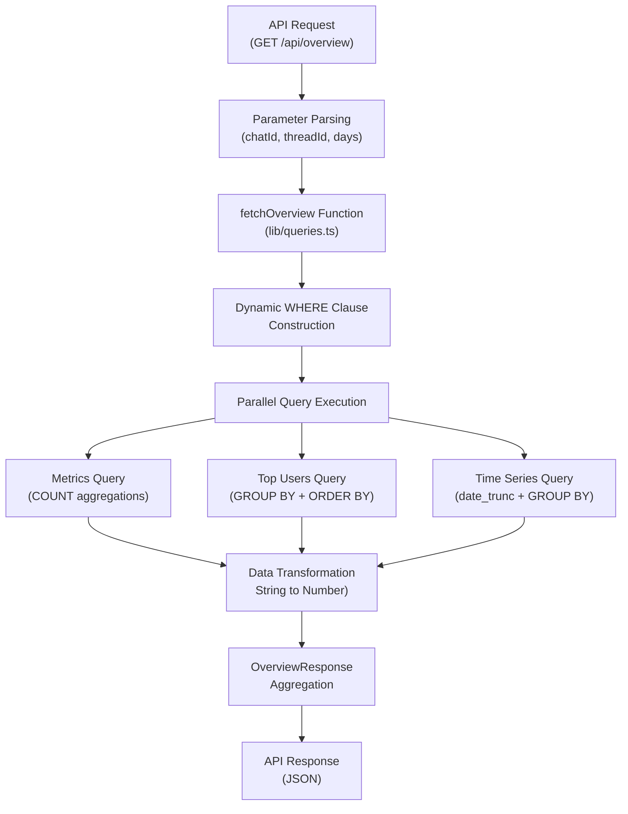
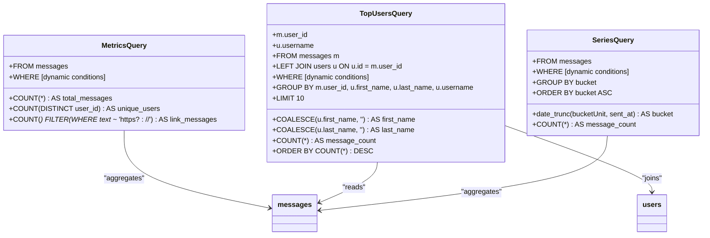
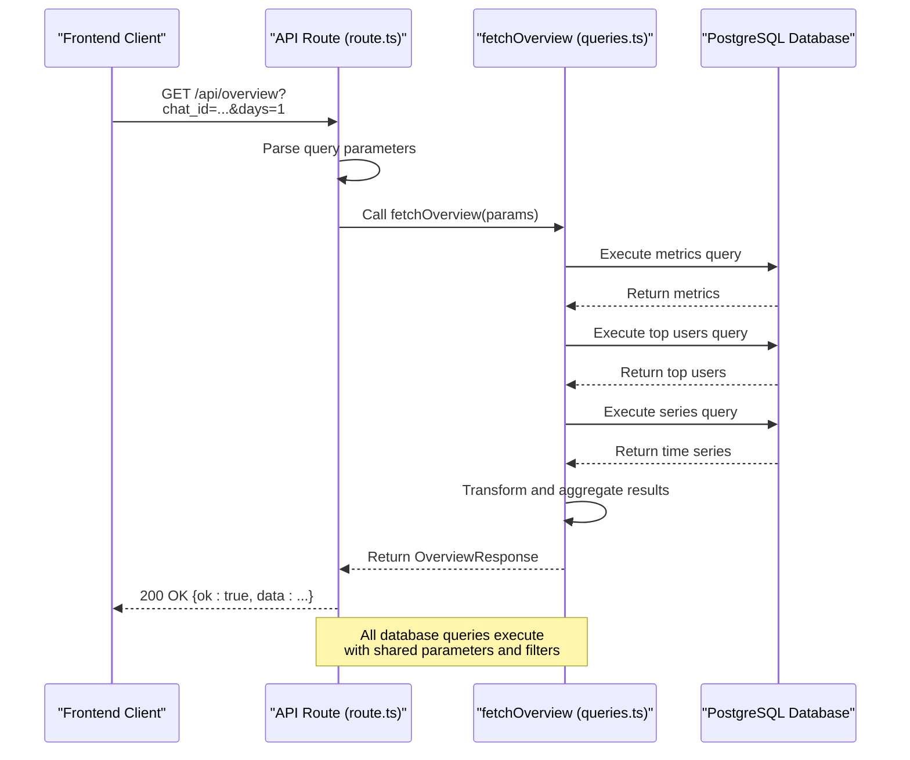

# Overview Queries

<cite>
**Referenced Files in This Document**   
- [queries.ts](file://lib/queries.ts)
- [types.ts](file://lib/types.ts)
- [db.ts](file://lib/db.ts)
- [route.ts](file://app/api/overview/route.ts)
</cite>

## Table of Contents
1. [Introduction](#introduction)
2. [Core Components](#core-components)
3. [Data Flow Architecture](#data-flow-architecture)
4. [Query Composition and Dynamic Filtering](#query-composition-and-dynamic-filtering)
5. [SQL Query Implementation](#sql-query-implementation)
6. [Data Transformation and Type Coercion](#data-transformation-and-type-coercion)
7. [Performance Considerations](#performance-considerations)
8. [Error Handling and Robustness](#error-handling-and-robustness)
9. [API Integration](#api-integration)
10. [Conclusion](#conclusion)

## Introduction

The Overview Queries functionality provides comprehensive analytics for messaging data, delivering core metrics that enable users to understand communication patterns and engagement levels. This system retrieves and processes data from a PostgreSQL database to generate insights including total message volume, unique participant counts, link sharing activity, top contributors, and temporal message distribution. The implementation features dynamic filtering capabilities that allow users to focus on specific conversations, threads, or time periods, making it a flexible tool for analyzing communication patterns across different contexts and durations.

**Section sources**
- [queries.ts](file://lib/queries.ts#L11-L115)
- [types.ts](file://lib/types.ts#L18-L24)

## Core Components

The overview functionality is built around several interconnected components that work together to deliver analytics data. At the heart of the system is the `fetchOverview` function, which orchestrates the retrieval and processing of metrics from the database. This function accepts filtering parameters and returns a structured `OverviewResponse` containing all requested analytics. The response model is defined by TypeScript interfaces that ensure type safety throughout the application. The system leverages PostgreSQL's advanced querying capabilities, including conditional aggregation, date truncation for time-series analysis, and parameterized queries for security and performance.

The data access layer abstracts database interactions through a connection pool managed by the `getPool` function, ensuring efficient resource utilization and connection reuse. This architecture enables the system to handle multiple concurrent requests while maintaining database performance. The implementation separates concerns by isolating query logic in the `queries.ts` file, type definitions in `types.ts`, and database connection management in `db.ts`, following clean architectural principles that enhance maintainability and testability.

**Section sources**
- [queries.ts](file://lib/queries.ts#L11-L115)
- [types.ts](file://lib/types.ts#L0-L24)
- [db.ts](file://lib/db.ts#L0-L25)

## Data Flow Architecture

**Diagram sources**
- [queries.ts](file://lib/queries.ts#L11-L115)
- [route.ts](file://app/api/overview/route.ts#L0-L22)

**Section sources**
- [queries.ts](file://lib/queries.ts#L11-L115)
- [route.ts](file://app/api/overview/route.ts#L0-L22)

## Query Composition and Dynamic Filtering

The system implements a sophisticated query composition mechanism that dynamically builds SQL WHERE clauses based on provided parameters. The filtering logic supports multiple dimensions: conversation context (via chatId), thread-specific analysis (via threadId), and temporal scope (via time window parameters). When both `from` and `to` date parameters are provided, the system uses explicit date range filtering with inclusive start and exclusive end boundaries. Otherwise, it defaults to a relative time window based on the `window` parameter (1 or 7 days), using PostgreSQL's `NOW()` function and interval arithmetic.

The parameterization system uses PostgreSQL's placeholder syntax ($1, $2, etc.) to safely incorporate user inputs into queries, preventing SQL injection vulnerabilities. The conditions array accumulates WHERE clause segments, while the params array collects corresponding parameter values, ensuring that the SQL structure and data remain properly separated. This approach allows for flexible query construction while maintaining security and performance. The system intelligently determines the appropriate time bucketing unit (hour or day) based on the requested time range, optimizing the granularity of time-series data for different analysis periods.

**Section sources**
- [queries.ts](file://lib/queries.ts#L15-L35)

## SQL Query Implementation

**Diagram sources**
- [queries.ts](file://lib/queries.ts#L40-L100)

**Section sources**
- [queries.ts](file://lib/queries.ts#L40-L100)

## Data Transformation and Type Coercion

The system performs critical data transformation to convert raw PostgreSQL query results into a properly typed frontend-ready format. PostgreSQL returns COUNT aggregation results as strings, requiring explicit type coercion to JavaScript numbers using the `Number()` function. This transformation is applied consistently across all numeric metrics to ensure type safety in the application. The `OverviewResponse` interface defines the expected structure with number types for all metrics, creating a contract between the data access layer and consuming components.

User data transformation includes constructing display names from user profile fields using the `buildUserLabel` helper function, which intelligently combines first name, last name, and username fields while handling null values through COALESCE operations in the SQL query and nullish coalescing in JavaScript. Time-series data is transformed by converting PostgreSQL timestamp objects to ISO 8601 string format using the `toISOString()` method, ensuring consistent date representation across the application. The transformation process also handles edge cases such as empty result sets by providing default values, ensuring that the API always returns a valid response structure regardless of query results.

**Section sources**
- [queries.ts](file://lib/queries.ts#L95-L115)
- [types.ts](file://lib/types.ts#L18-L24)

## Performance Considerations

The implementation incorporates several performance optimizations to ensure efficient data retrieval and processing. The top users query limits results to 10 entries using the LIMIT clause, preventing excessive data transfer and rendering overhead. The system uses a connection pool with a maximum of 5 concurrent connections, balancing resource utilization with database server capacity. Parameterized queries enable query plan caching in PostgreSQL, improving performance for repeated requests with different parameters.

Time-series analysis employs PostgreSQL's `date_trunc` function to efficiently bucket timestamps without requiring client-side processing, leveraging database-level optimization for date arithmetic. The system intelligently selects the appropriate time bucketing unit (hour or day) based on the analysis window, reducing the number of data points for longer time ranges while maintaining appropriate granularity for shorter periods. Index usage is implied by the filtering conditions on `sent_at`, `chat_id`, and `message_thread_id` columns, though specific index definitions are not visible in the code. The parallel execution of three independent queries (metrics, top users, and series) maximizes throughput by leveraging PostgreSQL's ability to process multiple requests concurrently.

**Section sources**
- [queries.ts](file://lib/queries.ts#L70-L85)
- [db.ts](file://lib/db.ts#L15-L20)

## Error Handling and Robustness

The system implements robust error handling to ensure reliability and graceful degradation. While the `fetchOverview` function itself does not include explicit error handling, it operates within a try-catch block in the API route, providing a safety net for database connectivity issues, query execution errors, or other runtime exceptions. The data transformation logic includes defensive programming practices, such as providing default values for potentially missing result rows (`metricsRow ?? { total_messages: "0", ... }`), preventing null reference errors in the response construction.

The implementation handles optional parameters gracefully, treating undefined values as absent filters rather than errors. Type coercion operations are wrapped in the `Number()` function, which safely converts string representations of numbers while handling edge cases. The API route validates the `days` parameter against an allowed set (1 or 7), defaulting to 1 if an invalid value is provided, ensuring that queries always execute with valid temporal parameters. This layered approach to error handling—combining defensive programming in the data access layer with comprehensive exception handling in the API layer—creates a resilient system that maintains availability even under unexpected conditions.

**Section sources**
- [queries.ts](file://lib/queries.ts#L90-L95)
- [route.ts](file://app/api/overview/route.ts#L15-L22)

## API Integration

**Diagram sources**
- [route.ts](file://app/api/overview/route.ts#L0-L22)
- [queries.ts](file://lib/queries.ts#L11-L115)

**Section sources**
- [route.ts](file://app/api/overview/route.ts#L0-L22)

## Conclusion

The Overview Queries functionality demonstrates a well-architected data access layer that effectively balances flexibility, performance, and reliability. By implementing dynamic query composition, the system provides powerful filtering capabilities that allow users to analyze messaging data across multiple dimensions. The separation of concerns between query execution, data transformation, and API integration follows sound architectural principles that enhance maintainability and testability. The use of parameterized queries ensures security against injection attacks, while connection pooling optimizes database resource utilization.

The implementation leverages PostgreSQL's advanced features such as conditional aggregation with FILTER, date truncation for time-series analysis, and efficient GROUP BY operations to perform complex analytics directly in the database layer, minimizing data transfer and client-side processing. The thoughtful handling of type coercion and edge cases ensures that the API consistently delivers properly formatted data to consuming components. Future enhancements could include caching mechanisms for frequently accessed time windows, more sophisticated error logging, and additional filtering options to further expand the analytical capabilities of the system.