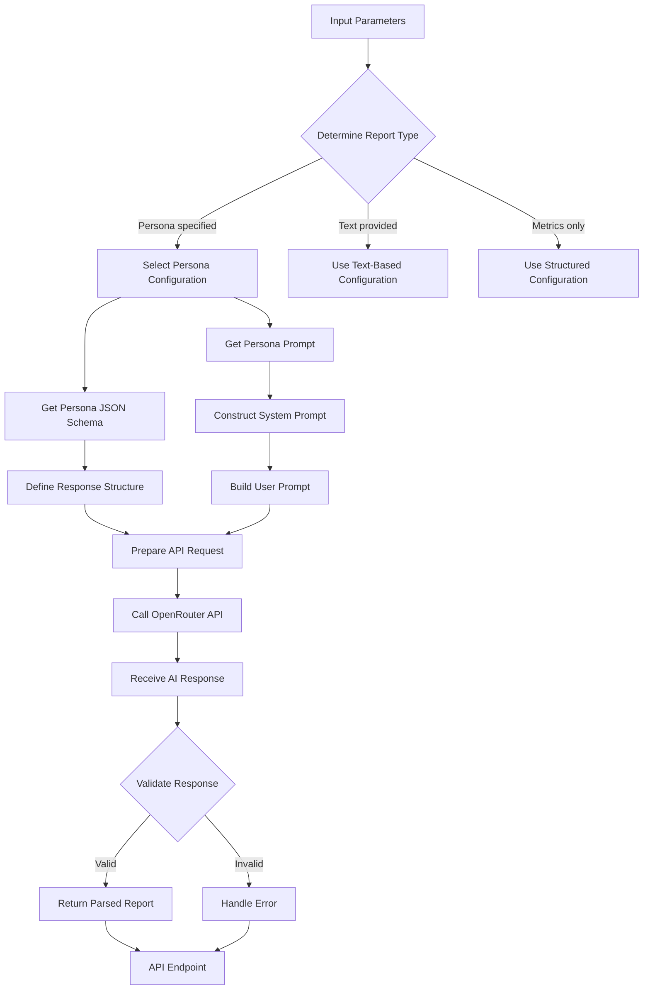
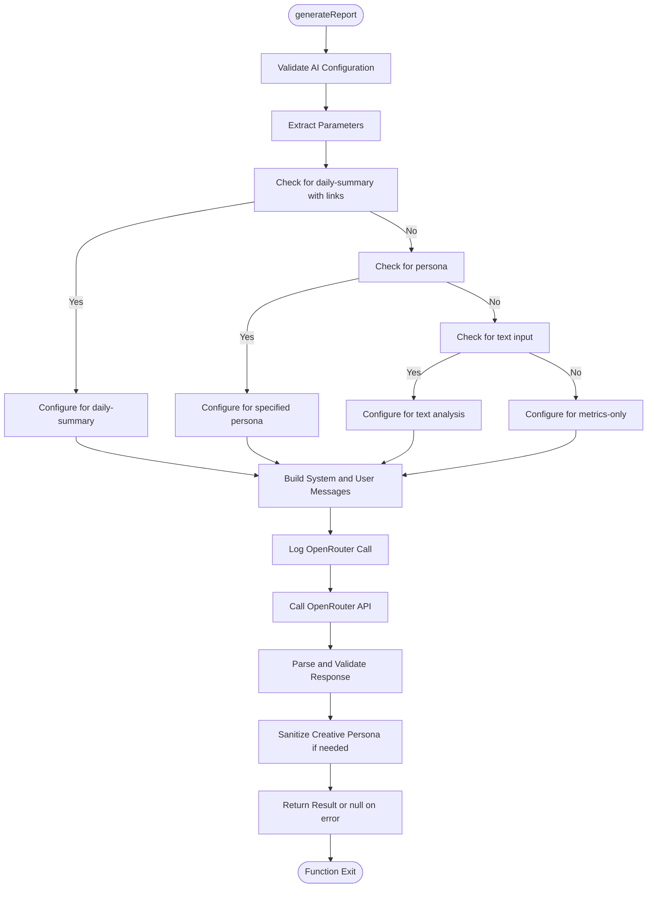
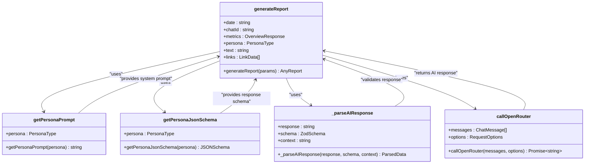
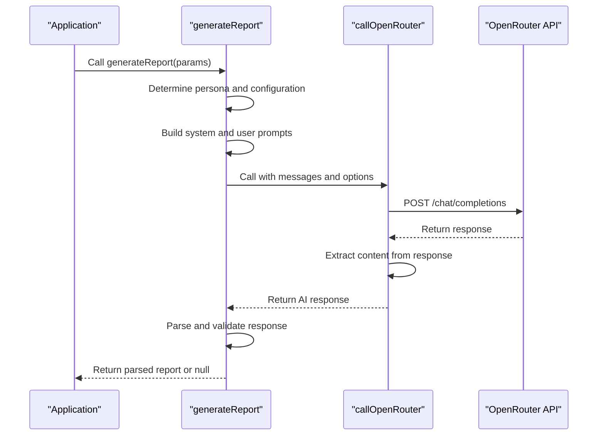
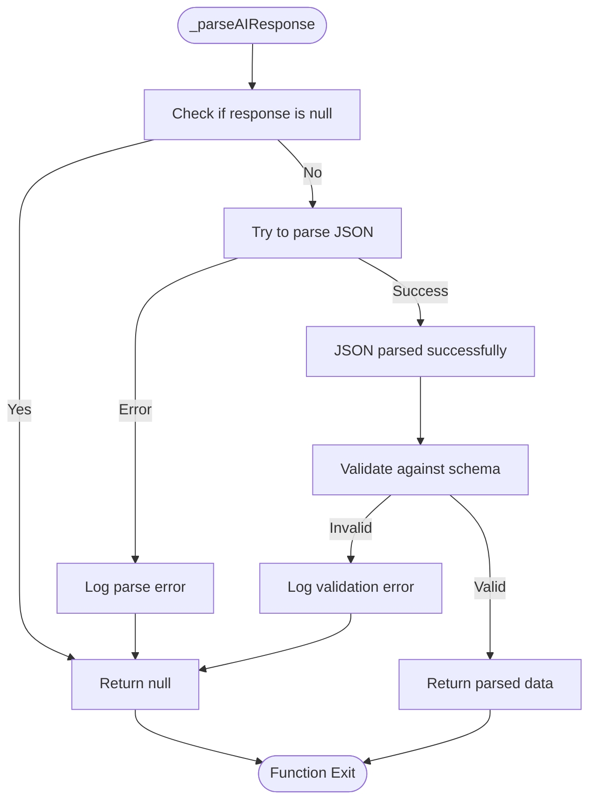
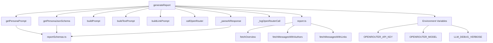

# AI Report Generation

<cite>
**Referenced Files in This Document**   
- [ai.ts](file://lib/ai.ts)
- [reportSchemas.ts](file://lib/reportSchemas.ts)
- [report.ts](file://lib/report.ts)
- [route.ts](file://app/api/report/[kind]/route.ts)
</cite>

## Table of Contents
1. [Introduction](#introduction)
2. [Core Components](#core-components)
3. [Architecture Overview](#architecture-overview)
4. [Detailed Component Analysis](#detailed-component-analysis)
5. [Dependency Analysis](#dependency-analysis)
6. [Performance Considerations](#performance-considerations)
7. [Troubleshooting Guide](#troubleshooting-guide)
8. [Conclusion](#conclusion)

## Introduction
The AI Report Generation system in the tg-ai-vibecoders-summary application is a sophisticated framework for creating personalized analytical reports from Telegram chat data. This system leverages the OpenRouter API to generate structured JSON responses based on various analytical personas, transforming raw chat metrics and message content into actionable insights. The architecture is designed to support multiple report types through a unified interface, allowing for flexible analysis across different domains including business, psychology, creativity, and community moderation. The system's core functionality revolves around dynamic prompt engineering, JSON schema validation, and robust error handling to ensure reliable report generation.

## Core Components

The AI report generation system consists of several key components that work together to produce structured analytical reports. The primary entry point is the `generateReport` function, which orchestrates the entire report generation process by determining the appropriate persona, constructing prompts, and handling API communication. Supporting this core function are specialized utilities for prompt construction (`buildPrompt`, `buildTextPrompt`, `buildLinkPrompt`), response validation (`_parseAIResponse`), and schema management (`getPersonaPrompt`, `getPersonaJsonSchema`). The system integrates with the OpenRouter API through the `callOpenRouter` function, which manages the HTTP communication and response handling. Additionally, the system leverages Zod schemas defined in `reportSchemas.ts` to validate the structure and content of AI-generated responses, ensuring data integrity and consistency across different report types.

**Section sources**
- [ai.ts](file://lib/ai.ts#L33-L165)
- [reportSchemas.ts](file://lib/reportSchemas.ts#L1-L88)
- [report.ts](file://lib/report.ts#L1-L126)

## Architecture Overview

The AI report generation system follows a modular architecture that separates concerns between data preparation, AI interaction, and response processing. The system begins with data collection from the chat, which is then processed into appropriate formats based on the requested report type. The core `generateReport` function acts as the orchestrator, determining the appropriate persona and constructing the necessary prompts and JSON schemas. Once the AI response is received, the system validates it against the expected schema before returning the structured data. This architecture enables the system to support multiple analytical personas while maintaining a consistent interface and error handling strategy.

**Diagram sources **
- [ai.ts](file://lib/ai.ts#L33-L165)
- [report.ts](file://lib/report.ts#L1-L126)

## Detailed Component Analysis

### generateReport Function Analysis
The `generateReport` function serves as the central orchestrator of the AI report generation system, handling all aspects of report creation from parameter processing to final output. This function accepts a comprehensive set of parameters including date, chatId, metrics, persona, text, and links, which it uses to determine the appropriate report configuration. The function's logic branches based on the presence of specific parameters, allowing for different report types such as daily summaries with links, personalized reports with specific personas, text-based analyses, or metrics-only reports. For each report type, the function dynamically selects the appropriate system prompt, user prompt, and JSON schema, ensuring that the AI response adheres to the expected structure.

**Diagram sources **
- [ai.ts](file://lib/ai.ts#L33-L165)

**Section sources**
- [ai.ts](file://lib/ai.ts#L33-L165)

### Persona-Based Prompt and Schema System
The system implements a sophisticated persona-based approach to customize AI behavior for different analytical domains. The `getPersonaPrompt` and `getPersonaJsonSchema` functions work together to define both the behavioral characteristics and structural output requirements for each persona. When a specific persona is requested, these functions return the appropriate system prompt that guides the AI's analytical approach and the corresponding JSON schema that defines the expected response structure. This dual mechanism ensures that not only does the AI adopt the appropriate analytical perspective (business, psychology, creative, etc.), but also produces output in a consistent, predictable format that can be reliably processed by the application.

**Diagram sources **
- [ai.ts](file://lib/ai.ts#L555-L830)
- [ai.ts](file://lib/ai.ts#L408-L553)
- [ai.ts](file://lib/ai.ts#L177-L196)

**Section sources**
- [ai.ts](file://lib/ai.ts#L408-L830)

### OpenRouter API Integration
The system integrates with the OpenRouter API through the `callOpenRouter` function, which handles all aspects of the HTTP communication with the AI service. This function constructs the API request with the appropriate headers, including authentication via the OPENROUTER_API_KEY and model specification via OPENROUTER_MODEL. The request includes the conversation messages, temperature settings, and response format configuration with JSON schema validation. The function implements robust error handling, including timeout management through an AbortController and comprehensive logging for debugging purposes. The response is parsed and the AI-generated content is extracted from the JSON response structure, ensuring that only the relevant text content is returned to the calling function.

**Diagram sources **
- [ai.ts](file://lib/ai.ts#L909-L982)

**Section sources**
- [ai.ts](file://lib/ai.ts#L909-L982)

### Response Validation and Error Handling
The `_parseAIResponse` function implements a critical validation layer that ensures the integrity and reliability of AI-generated reports. This function first attempts to parse the raw JSON response from the AI service, handling potential parsing errors gracefully. If parsing succeeds, the function validates the parsed JSON against the expected Zod schema, which was dynamically selected based on the requested persona. The validation process checks not only the structure of the response but also the data types and value constraints defined in the schema. When validation fails, the function logs detailed error information to aid in debugging while returning null to indicate failure. This robust validation approach protects the application from malformed or unexpected AI responses, maintaining data consistency across the system.

**Diagram sources **
- [ai.ts](file://lib/ai.ts#L177-L196)

**Section sources**
- [ai.ts](file://lib/ai.ts#L177-L196)

## Dependency Analysis

The AI report generation system has a well-defined dependency structure that promotes modularity and maintainability. The core `generateReport` function depends on several utility functions for prompt construction, API communication, and response validation. These dependencies are clearly delineated, with each function having a specific responsibility. The system also depends on external configuration through environment variables (OPENROUTER_API_KEY, OPENROUTER_MODEL) and integrates with the application's data layer through the `buildDailyReport` function in the report module. The use of Zod schemas for validation creates a dependency on the schema definitions in `reportSchemas.ts`, ensuring that response validation is consistent across different report types.

**Diagram sources **
- [ai.ts](file://lib/ai.ts#L33-L165)
- [report.ts](file://lib/report.ts#L1-L126)

**Section sources**
- [ai.ts](file://lib/ai.ts#L33-L165)
- [report.ts](file://lib/report.ts#L1-L126)

## Performance Considerations

The system implements several performance optimizations to ensure efficient report generation. The `buildDailyReport` function in the report module includes character budgeting through the LLM_TEXT_CHAR_BUDGET environment variable, which limits the amount of text sent to the AI service to prevent excessive processing times and costs. The system also implements intelligent data selection, prioritizing the most relevant messages and metrics for analysis. The API integration includes timeout management with a configurable OPENROUTER_TIMEOUT_MS environment variable, preventing hanging requests from impacting application performance. Additionally, the system logs detailed information about request sizes and processing times, enabling performance monitoring and optimization.

## Troubleshooting Guide

Common issues with the AI report generation system typically relate to configuration, API connectivity, or response validation. The most frequent configuration issue is missing environment variables, specifically OPENROUTER_API_KEY and OPENROUTER_MODEL, which will cause the `validateAIConfig` function to throw an error. API connectivity issues may result from network problems, service outages, or incorrect API keys, and are typically indicated by HTTP error responses logged by the `callOpenRouter` function. Invalid JSON responses from the AI service will be caught by the `_parseAIResponse` function's parsing step, while schema validation failures will be logged with detailed error information from the Zod validation process. The LLM_DEBUG_VERBOSE environment variable can be set to "1" to enable verbose logging, which provides detailed information about the API requests and responses to aid in troubleshooting.

**Section sources**
- [ai.ts](file://lib/ai.ts#L167-L175)
- [ai.ts](file://lib/ai.ts#L909-L982)
- [ai.ts](file://lib/ai.ts#L177-L196)

## Conclusion

The AI report generation system in the tg-ai-vibecoders-summary application represents a sophisticated integration of AI services with structured data processing. By implementing a flexible persona-based architecture, the system can generate diverse analytical reports tailored to different domains while maintaining a consistent interface and validation framework. The careful separation of concerns between prompt construction, API communication, and response validation ensures reliability and maintainability. The system's robust error handling and comprehensive logging provide valuable insights for troubleshooting and optimization. This architecture serves as an excellent example of how to effectively integrate AI services into an application while maintaining data integrity and user experience.