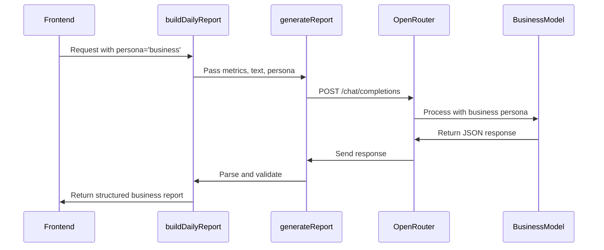

# Business Persona Analysis

<cite>
**Referenced Files in This Document**   
- [ai.ts](file://lib/ai.ts)
- [reportSchemas.ts](file://lib/reportSchemas.ts)
- [report.ts](file://lib/report.ts)
</cite>

## Table of Contents
1. [Introduction](#introduction)
2. [Business Report Schema Structure](#business-report-schema-structure)
3. [System Prompt Construction](#system-prompt-construction)
4. [OpenRouter API Configuration](#openrouter-api-configuration)
5. [Data Flow and Processing](#data-flow-and-processing)
6. [Common Issues and Troubleshooting](#common-issues-and-troubleshooting)
7. [Conclusion](#conclusion)

## Introduction
The business persona in the AI report generation system is designed to transform chat activity metrics into actionable financial insights. This specialized persona functions as a business consultant focused exclusively on monetization opportunities, revenue strategies, and ROI calculations for Telegram communities. By analyzing user engagement patterns, message volume, and participant behavior, the system generates structured business recommendations that help community owners identify potential revenue streams. The implementation leverages a well-defined JSON schema, a targeted system prompt, and a robust API integration to ensure consistent, financially-focused outputs that exclude psychological or creative analyses.

## Business Report Schema Structure

The business persona's output structure is strictly defined by the `businessReportSchema` which ensures consistent formatting and required data points. This schema enforces three key arrays with specific size constraints to maintain report quality and comprehensiveness.

**Section sources**
- [reportSchemas.ts](file://lib/reportSchemas.ts#L10-L14)

### Monetization Ideas (3-6 items)
The `monetization_ideas` array contains concrete product or service suggestions tailored to the specific audience. Each idea follows a strict format: "Product: target audience + estimated price point". The schema requires a minimum of 3 and maximum of 6 ideas, ensuring sufficient coverage without overwhelming the user. These suggestions are derived from analyzing the community's interests, expertise areas, and engagement patterns to identify viable offerings that align with member needs and willingness to pay.

### Revenue Strategies (3-6 items)
The `revenue_strategies` array outlines specific mechanisms for generating income from the community. Each strategy includes actionable steps and monthly revenue projections. Valid strategies include subscriptions, courses, consulting services, advertising, partnerships, and direct sales. The schema enforces 3-6 strategies to provide a balanced portfolio of short-term and long-term revenue options. These strategies are formulated based on the community's size, engagement level, and demonstrated interests, with particular attention to scalable models that can grow with the audience.

### ROI Insights (3-5 items)
The `roi_insights` array contains mathematical calculations that estimate earning potential based on chat metrics. Each insight follows the format: "Audience metric → income potential (with calculations)". The schema requires 3-5 insights to ensure comprehensive financial analysis. These calculations incorporate key business metrics such as conversion rates, customer lifetime value (LTV), customer acquisition cost (CAC), average revenue per user (ARPU), and purchase frequency. The insights transform raw engagement data into projected financial outcomes, helping community owners understand the monetary value of their audience.

```mermaid
erDiagram
BUSINESS_REPORT {
array monetization_ideas 3-6
array revenue_strategies 3-6
array roi_insights 3-5
}
```

**Diagram sources**
- [reportSchemas.ts](file://lib/reportSchemas.ts#L10-L14)

## System Prompt Construction

The business persona's behavior is governed by the `getPersonaPrompt('business')` function, which constructs a highly specialized system prompt that focuses exclusively on financial aspects. This prompt establishes clear boundaries and expectations for the AI model, ensuring outputs remain strictly within the business domain.

**Section sources**
- [ai.ts](file://lib/ai.ts#L588-L615)

The system prompt explicitly instructs the AI to act as a "business consultant for Telegram community monetization" with the singular goal of identifying concrete ways to generate revenue. It emphasizes three critical constraints: no psychological analysis, requirement for specific financial figures in currency terms, and exclusive output in valid JSON format. The prompt defines the exact structure expected: a JSON object with the three arrays mentioned above, with no additional text or markdown.

Key directives in the prompt include focusing on "specific business ideas for this audience," "monetization strategies with clear calculations," and "ROI insights with potential incomes." The instructions prohibit any discussion of psychology, emotions, or creative content, maintaining a laser focus on financial opportunities. This strict guidance ensures that even if the underlying AI model has broad capabilities, its output for this persona remains narrowly focused on monetization.

## OpenRouter API Configuration

The business persona leverages the OpenRouter API with specific configuration parameters that optimize it for financial analysis and structured output. The API call is configured through the `generateReport` function, which sets up the request with appropriate parameters for reliable business insights.

**Section sources**
- [ai.ts](file://lib/ai.ts#L33-L165)

The API configuration includes several critical settings. The `response_format` parameter is set to use JSON schema validation, specifically referencing the `business_report` schema to ensure the output adheres to the required structure. This validation occurs on the server side, preventing malformed responses from being processed further. The temperature is set to 0.6, which balances creativity with consistency—allowing for innovative business ideas while maintaining logical financial reasoning.

The maximum output tokens are set to 3000 for persona-based reports, providing sufficient space for detailed financial calculations and multiple revenue scenarios. The request includes both system and user messages, with the system message containing the business persona prompt and the user message providing the chat metrics and context. Error handling is implemented to catch failed API calls and return null, preventing invalid data from entering the system.



**Diagram sources**
- [ai.ts](file://lib/ai.ts#L33-L165)
- [report.ts](file://lib/report.ts#L13-L103)

## Data Flow and Processing

The business persona analysis follows a structured data processing pipeline that transforms raw chat metrics into financial insights. This flow begins with data collection and ends with validated JSON output, ensuring reliability and consistency throughout the process.

**Section sources**
- [report.ts](file://lib/report.ts#L13-L103)
- [ai.ts](file://lib/ai.ts#L33-L165)

The process starts with `buildDailyReport` which determines the date range and fetches overview metrics such as message count, unique users, and link sharing activity. It then retrieves up to 5,000 messages with author information, constructing a text blob that captures the essence of community conversations. This text is truncated to 80,000 characters if necessary to meet API constraints.

When a business persona is requested, `buildDailyReport` calls `generateReport` with the persona parameter. The `generateReport` function selects the appropriate system prompt using `getPersonaPrompt('business')` and constructs the user prompt with the metrics and text data. It then configures the OpenRouter API call with the business-specific JSON schema for validation.

After receiving the response, the system parses and validates it against the `businessReportSchema` using Zod validation. If successful, the structured business report is returned with monetization ideas, revenue strategies, and ROI insights. The entire flow is logged for debugging, with clear indicators of the processing strategy used (text-based or metrics-only).

## Common Issues and Troubleshooting

Several common issues can arise when generating business persona reports, primarily related to data quality and API limitations. Understanding these issues helps in interpreting the recommendations appropriately and troubleshooting failures.

**Section sources**
- [ai.ts](file://lib/ai.ts#L33-L165)
- [report.ts](file://lib/report.ts#L13-L103)

### Insufficient Data for ROI Calculations
The most common issue occurs when chat activity metrics are too limited to make reliable financial projections. With low message volume or few unique participants, the AI cannot establish meaningful patterns for conversion rates or customer lifetime value. In such cases, the ROI insights may be overly speculative or generic. The system does not fabricate data but may produce less specific recommendations when metrics are sparse.

### Data Truncation Effects
The system limits text input to 80,000 characters, which may truncate longer conversations. When significant discussion occurs beyond this limit, the business analysis might miss important context about community interests or expertise areas. This can lead to monetization ideas that don't fully align with the community's actual capabilities or interests.

### API Failure and Validation Errors
Occasionally, the OpenRouter API may fail to return a valid response, or the response may not conform to the expected JSON schema. The system handles these cases by returning null and logging the error, preventing invalid data from being presented to users. Rate limiting or authentication issues with the API can also interrupt report generation.

### Interpreting Business Recommendations
When reviewing business recommendations, users should consider them as informed suggestions rather than guaranteed outcomes. The monetization ideas and revenue strategies should be evaluated against real-world market conditions and the community's actual capacity to deliver products or services. The ROI insights provide mathematical projections based on chat behavior, but actual conversion rates in a commercial setting may differ significantly.

## Conclusion
The business persona analysis feature provides a structured approach to transforming Telegram chat metrics into actionable financial insights. By enforcing a strict schema, utilizing a focused system prompt, and implementing robust API integration, the system delivers consistent business recommendations that help community owners explore monetization opportunities. The separation of concerns between data collection, prompt engineering, API communication, and response validation ensures reliability and maintainability. While the system performs well with sufficient data, users should interpret the financial projections as informed estimates that require real-world validation before implementation.