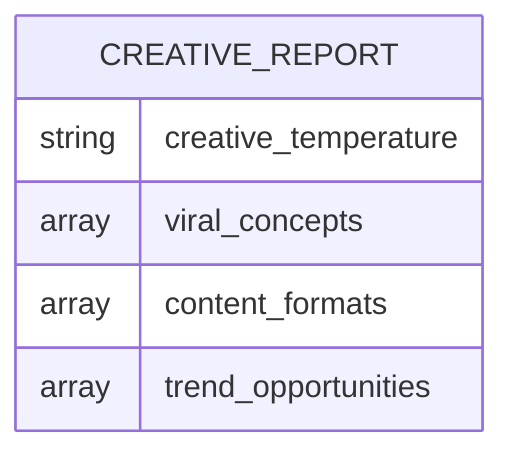
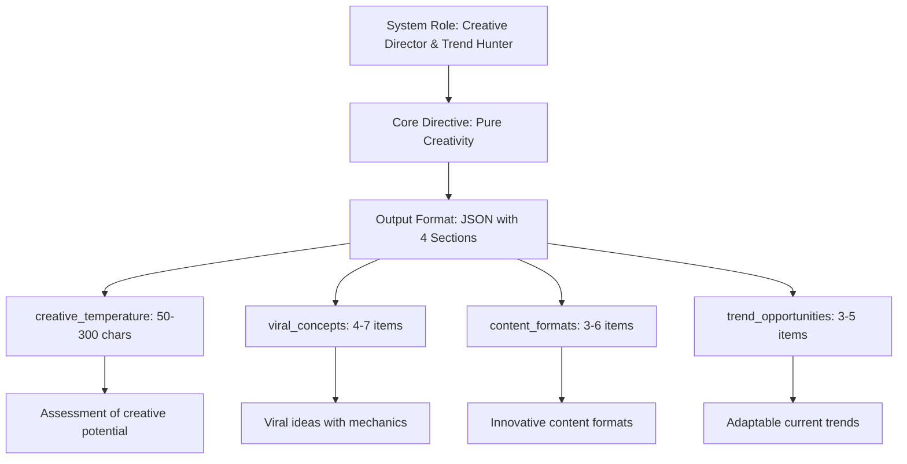
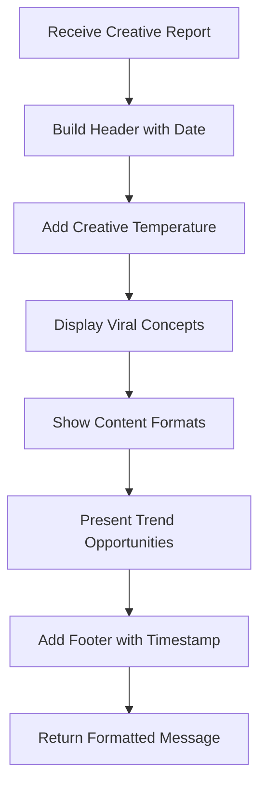

# Creative Persona Analysis

<cite>
**Referenced Files in This Document**   
- [reportSchemas.ts](file://lib/reportSchemas.ts)
- [ai.ts](file://lib/ai.ts)
- [telegram.ts](file://lib/telegram.ts)
</cite>

## Table of Contents
1. [Introduction](#introduction)
2. [Creative Report Schema Structure](#creative-report-schema-structure)
3. [Creative Persona Prompt Construction](#creative-persona-prompt-construction)
4. [Creative Temperature Field Handling](#creative-temperature-field-handling)
5. [Content Generation and Operationalization](#content-generation-and-operationalization)
6. [Telegram Formatting and Display](#telegram-formatting-and-display)
7. [Conclusion](#conclusion)

## Introduction
The creative persona in the AI report generation system functions as a virtual creative director, specializing in generating viral content concepts, innovative formats, and trend opportunities based on chat activity analysis. This persona shifts the focus from analytical reporting to pure creative ideation, providing content creators with actionable inspiration for engaging material. The system leverages structured JSON schemas and AI prompting techniques to ensure consistent, high-quality creative output that can be directly operationalized into content calendars and marketing strategies.

## Creative Report Schema Structure

The creative persona's output is governed by the `creativeReportSchema` defined in the system, which enforces a specific structure for creative recommendations. This schema ensures that all creative reports contain comprehensive, well-structured content across four key dimensions: creative temperature assessment, viral concepts, content formats, and trend opportunities.



**Diagram sources**
- [reportSchemas.ts](file://lib/reportSchemas.ts#L29-L34)

**Section sources**
- [reportSchemas.ts](file://lib/reportSchemas.ts#L29-L34)

### Creative Temperature (50-300 characters)
The `creative_temperature` field provides a concise assessment of the audience's creative potential and receptiveness to innovative content. This qualitative evaluation categorizes the community's creative disposition using descriptors such as conservative, traditional, experimental, meme-oriented, avant-garde, or social-media-native. The field is string-based with strict character limits (minimum 50, maximum 300 characters), ensuring the assessment is substantive yet concise.

### Viral Concepts (4-7 items)
The `viral_concepts` array contains 4-7 specific ideas designed to generate high engagement and shareability. Each concept follows a standardized format: "Concept: mechanism + virality prediction." These ideas encompass various viral content types including memes, challenges, storytelling approaches, and unique formats tailored to the analyzed audience's interests and behaviors.

### Content Formats (3-6 items)
The `content_formats` array suggests 3-6 innovative content formats appropriate for the specific group being analyzed. Each format follows the structure: "Format: how it works + specific examples." Recommended formats include interactive elements like Q&A sessions, stories, gamification mechanics, user-generated content (UGC) campaigns, and other engagement-focused approaches that align with the community's dynamics.

### Trend Opportunities (3-5 items)
The `trend_opportunities` array identifies 3-5 current trends that can be adapted for the target audience. Each opportunity is presented as: "Trend: adaptation strategy for your audience." These include platform-specific trends from TikTok, Instagram, YouTube, and Twitter, as well as broader cultural phenomena that can be leveraged for content creation.

## Creative Persona Prompt Construction

The creative persona's behavior and output structure are defined by the `getPersonaPrompt('creative')` function, which constructs a system prompt that emphasizes creativity and virality while constraining the AI's response format. This prompt establishes the AI's role as a creative director and trend hunter, explicitly instructing it to focus solely on creative ideation rather than analytical assessment.



**Diagram sources**
- [ai.ts](file://lib/ai.ts#L782-L806)

**Section sources**
- [ai.ts](file://lib/ai.ts#L782-L806)

The prompt explicitly prohibits analytical content, stating "No analytics — only pure creativity." It defines the AI's "superpower" as generating viral concepts based on audience analysis, discovering and adapting trends for specific groups, and inventing unique formats and mechanics. The prompt emphasizes concrete, executable ideas rather than abstractions and instructs the AI to think like a TikTok creator focused on what will capture attention and go viral.

## Creative Temperature Field Handling

The system implements special handling for the `creative_temperature` field to ensure compliance with the 300-character maximum limit. When the AI generates a response that exceeds this limit, the system automatically truncates the content while preserving readability and meaning.

```mermaid
flowchart TD
A["Generate Creative Report"] --> B{"Persona = 'creative'?}
B --> |Yes| C["Check creative_temperature length"]
B --> |No| D["Process normally"]
C --> E{"Length > 300 characters?"}
E --> |Yes| F["Truncate to 297 characters"]
E --> |No| G["Keep original"]
F --> H["Append '..."]
H --> I["Log warning"]
I --> J["Return sanitized result"]
G --> J
```

**Diagram sources**
- [ai.ts](file://lib/ai.ts#L154-L156)

**Section sources**
- [ai.ts](file://lib/ai.ts#L154-L156)

This truncation logic is implemented in the `generateReport` function, which checks the length of the `creative_temperature` field after AI response parsing. If the content exceeds 300 characters, the system logs a warning and truncates the string to 297 characters, appending an ellipsis ("...") to indicate the omission. This ensures that the final output adheres to the schema requirements while maintaining the integrity of the creative assessment. The truncation process preserves the beginning of the assessment, which typically contains the most critical information about the audience's creative disposition.

## Content Generation and Operationalization

The creative persona helps content creators develop engaging material by transforming chat activity analysis into actionable creative recommendations. Rather than providing generic advice, the system generates specific, context-aware ideas that can be directly operationalized into content calendars and marketing strategies.

The viral concepts serve as ready-to-implement campaign ideas, each including both the creative concept and its proposed mechanism for achieving virality. Content formats suggest innovative ways to present information that align with the audience's preferences and platform norms. Trend opportunities identify timely cultural moments that can be leveraged for increased relevance and engagement.

Content creators can operationalize these suggestions by:
1. Prioritizing concepts based on resource requirements and potential impact
2. Scheduling trend opportunities according to their cultural relevance window
3. Testing different content formats to determine audience preferences
4. Using the creative temperature assessment to calibrate the boldness of content experiments
5. Combining multiple suggestions into comprehensive content campaigns

The structured JSON output enables easy integration with content management systems and calendar tools, allowing teams to systematically incorporate AI-generated creative ideas into their planning workflows.

## Telegram Formatting and Display

The creative persona's output is formatted for optimal display in Telegram through the `formatPersonaReport` function in the telegram module. This formatting ensures that the creative recommendations are presented in an engaging, visually appealing manner that highlights the different content types.



**Diagram sources**
- [telegram.ts](file://lib/telegram.ts#L227)

**Section sources**
- [telegram.ts](file://lib/telegram.ts#L227)

The formatting uses Telegram's HTML parsing capabilities to enhance readability, employing bold text for section headers and appropriate emojis to visually distinguish content types. The creative temperature is displayed with a thermometer emoji (🌡️), viral concepts with a rocket (🚀), content formats with a paint palette (🎨), and trend opportunities with a fire emoji (🔥). This visual hierarchy helps users quickly scan and identify different types of creative recommendations, making the AI-generated content more accessible and actionable.

## Conclusion
The creative persona in the AI report generation system provides a specialized function for generating viral content concepts, innovative formats, and trend opportunities based on chat activity analysis. Through a well-defined schema structure and targeted prompting, the system produces actionable creative recommendations that help content creators develop engaging material. The implementation includes careful handling of content length constraints and optimized formatting for Telegram display, ensuring that the creative insights are both technically sound and practically useful for content strategy development.