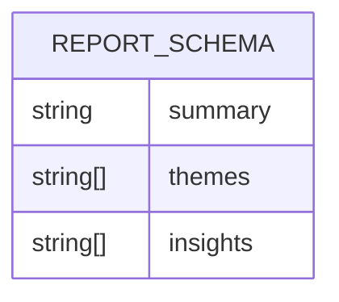
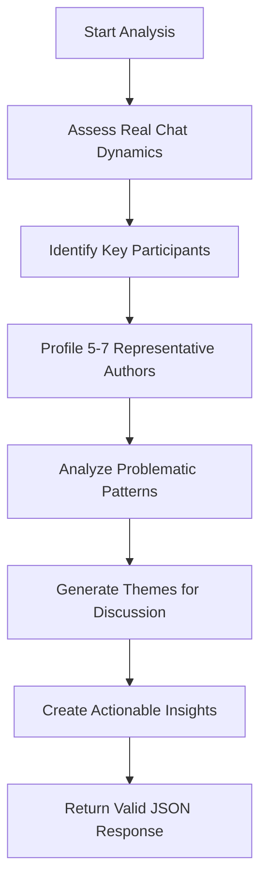
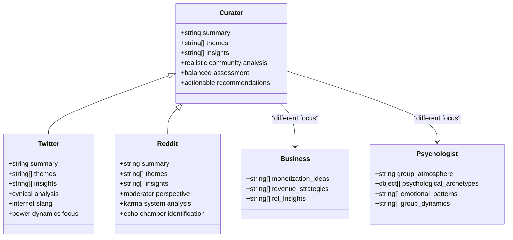

# Curator Persona Analysis

<cite>
**Referenced Files in This Document**   
- [ai.ts](file://lib/ai.ts)
- [reportSchemas.ts](file://lib/reportSchemas.ts)
- [report.ts](file://lib/report.ts)
</cite>

## Table of Contents
1. [Introduction](#introduction)
2. [Core Report Schema Structure](#core-report-schema-structure)
3. [Curator Persona Implementation](#curator-persona-implementation)
4. [Default Analysis Mode](#default-analysis-mode)
5. [Balanced Community Assessment](#balanced-community-assessment)
6. [Comparison with Specialized Personas](#comparison-with-specialized-personas)

## Introduction
The curator persona serves as the foundational analytical mode within the AI report generation system, providing balanced, actionable insights into Telegram chat dynamics. Designed for practical community management, this persona delivers honest assessments of community health by identifying both strengths and systemic issues. Unlike specialized personas that focus on specific domains like business or psychology, the curator offers a comprehensive view of chat activity, emphasizing real-world applicability and community improvement strategies. The persona operates as the default analysis mode when no specific persona is requested, establishing a baseline for community evaluation across the platform.

**Section sources**
- [ai.ts](file://lib/ai.ts#L588-L940)
- [reportSchemas.ts](file://lib/reportSchemas.ts#L3-L7)

## Core Report Schema Structure
The curator persona shares a standardized JSON schema structure with the twitter and reddit personas, ensuring consistency in report formatting across these community-focused analysis modes. This universal schema consists of three primary fields that structure the analytical output:

| Field | Type | Description | Constraints |
|-------|------|-------------|-------------|
| **summary** | string | Comprehensive overview of chat dynamics | Minimum 10 characters, typically 600-900 characters |
| **themes** | array of strings | Key discussion topics that need addressing | Maximum of 8 themes |
| **insights** | array of strings | Actionable recommendations for improvement | Maximum of 8 insights |

This schema is defined in the `reportSchema` constant within the reportSchemas module and is used as the validation structure for all reports generated by the curator, twitter, and reddit personas. The schema ensures that reports maintain a consistent format while allowing for persona-specific content variations in the actual analysis.

**Diagram sources**
- [reportSchemas.ts](file://lib/reportSchemas.ts#L3-L7)

**Section sources**
- [reportSchemas.ts](file://lib/reportSchemas.ts#L3-L7)

## Curator Persona Implementation
The curator persona is implemented through the `getPersonaPrompt` function in the ai module, which generates a system prompt that shapes the AI's analytical approach. This prompt establishes the curator's distinctive style as a realistic community analyst who "doesn't wear rose-colored glasses and calls problems by their names." The implementation emphasizes direct, no-nonsense analysis in Russian language, avoiding bureaucratic language and sugar-coating while maintaining professional integrity.

The system prompt specifically instructs the AI to provide honest conclusions, even when they are unpleasant, and to identify real problems such as toxicity, passivity, conflicts, and one-sidedness within the community. This approach ensures that the analysis prioritizes truth over comfort, recognizing that "better truth than illusions." The prompt structure guides the AI to produce reports that begin with 2-3 sentences about the real chat dynamics, followed by psychological profiles of 5-7 representative authors, identification of problematic patterns, and actionable recommendations.

**Diagram sources**
- [ai.ts](file://lib/ai.ts#L588-L940)

**Section sources**
- [ai.ts](file://lib/ai.ts#L588-L940)

## Default Analysis Mode
The curator persona functions as the default analysis mode within the system architecture, activated when no specific persona is specified in the report request. This default behavior is implemented in the `buildDailyReport` function within the report module, which checks for the presence of a persona parameter and falls back to a text-based analysis that aligns with the curator's approach when none is provided.

The system's design prioritizes the curator persona as the standard analytical framework because it provides a balanced assessment that combines psychological insights with practical recommendations. When the `generateReport` function processes a request without a specified persona, it constructs a system prompt that mirrors the curator's analytical style, focusing on community dynamics, participant roles, and actionable insights. This default implementation ensures that users receive meaningful community analysis even without explicitly selecting a persona, establishing a baseline for community health assessment across the platform.

**Section sources**
- [report.ts](file://lib/report.ts#L13-L101)
- [ai.ts](file://lib/ai.ts#L33-L165)

## Balanced Community Assessment
The curator persona excels at providing balanced insights by combining constructive criticism with positive observations, creating a comprehensive picture of community health. Unlike personas that focus exclusively on negative aspects (like the twitter persona) or purely positive elements, the curator maintains a realistic perspective that acknowledges both strengths and weaknesses within the chat ecosystem.

The analysis methodology specifically instructs the AI to identify not only problematic participants (such as "toxic dominants" or "attention-seekers") but also valuable contributors (like "useful experts" or "content generators"). This balanced approach extends to the themes and insights sections, where the AI is directed to focus on issues that would genuinely improve the atmosphere rather than creating the appearance of activity. The curator's recommendations emphasize systemic solutions over cosmetic improvements, addressing root causes of community issues while acknowledging existing strengths.

This balanced assessment approach makes the curator persona particularly valuable for community managers seeking actionable recommendations for improving engagement. By identifying both what's broken and what's working, the curator provides a roadmap for community development that is grounded in reality rather than idealism.

**Section sources**
- [ai.ts](file://lib/ai.ts#L588-L940)

## Comparison with Specialized Personas
While the curator persona shares the same report schema structure with the twitter and reddit personas, its analytical approach differs significantly from these and other specialized personas in the system. The curator maintains a professional consultant tone, whereas the twitter persona adopts a cynical, sarcastic style reminiscent of a typical Twitter user, and the reddit persona employs moderator-like analysis with Reddit-specific terminology like "karma farming" and "circlejerk."

Unlike domain-specific personas such as the business consultant (which focuses exclusively on monetization ideas and revenue strategies) or the psychologist (which analyzes emotional patterns and group dynamics), the curator provides a holistic view that incorporates elements of both psychological assessment and practical community management. The curator's analysis includes psychological profiling of participants but frames these insights within the context of actionable recommendations for community improvement.

The shared schema structure among the curator, twitter, and reddit personas reflects their common focus on community dynamics, while other personas like the business consultant, psychologist, and creative director use entirely different schema structures tailored to their specialized domains. This architectural design allows the system to maintain consistency across community-focused analyses while enabling specialized reporting for other domains.

**Diagram sources**
- [ai.ts](file://lib/ai.ts#L588-L940)
- [reportSchemas.ts](file://lib/reportSchemas.ts#L3-L7)

**Section sources**
- [ai.ts](file://lib/ai.ts#L588-L940)
- [reportSchemas.ts](file://lib/reportSchemas.ts#L3-L7)