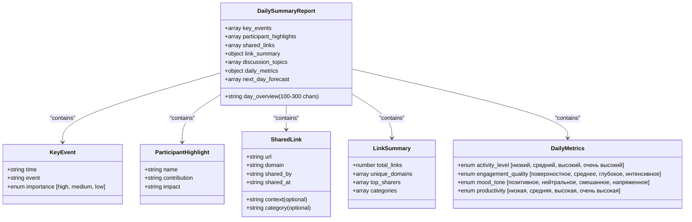
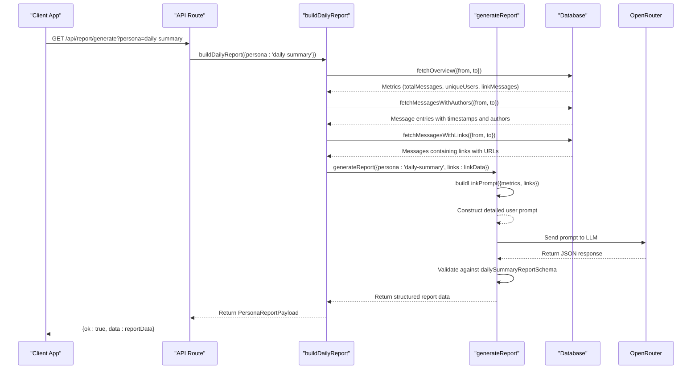
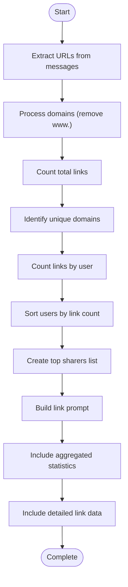
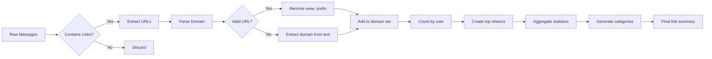
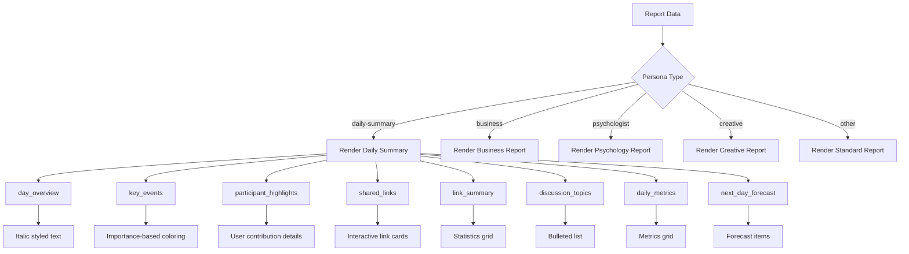
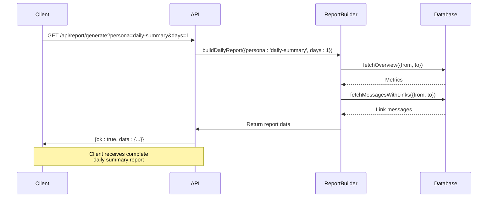

# Daily Summary Report

<cite>
**Referenced Files in This Document**   
- [reportSchemas.ts](file://lib/reportSchemas.ts)
- [ai.ts](file://lib/ai.ts)
- [report.ts](file://lib/report.ts)
- [telegram.ts](file://lib/telegram.ts)
- [queries.ts](file://lib/queries.ts)
- [multi-style-summary-generator.tsx](file://components/multi-style-summary-generator.tsx)
- [route.ts](file://app/api/report/[kind]/route.ts)
</cite>

## Table of Contents
1. [Introduction](#introduction)
2. [Core Structure and Schema](#core-structure-and-schema)
3. [Report Generation Flow](#report-generation-flow)
4. [Link Analysis System](#link-analysis-system)
5. [Data Processing and Aggregation](#data-processing-and-aggregation)
6. [Frontend Rendering](#frontend-rendering)
7. [API Integration](#api-integration)
8. [Conclusion](#conclusion)

## Introduction

The Daily Summary Report feature in the AI report generation system provides community managers with comprehensive, granular insights into daily activity. This report type offers the most detailed analysis among all available report formats, featuring specific timestamps and resource tracking. The system leverages AI to analyze chat activity, extract key events, highlight participant contributions, and perform sophisticated link analysis. The daily-summary persona creates structured reports that help community managers understand engagement patterns, identify influential members, and track shared resources across the community.

**Section sources**
- [reportSchemas.ts](file://lib/reportSchemas.ts#L60-L101)
- [ai.ts](file://lib/ai.ts#L29-L59)

## Core Structure and Schema

The daily summary report is defined by a comprehensive schema that ensures consistent structure and data quality. The `dailySummaryReportSchema` in `reportSchemas.ts` specifies eight required sections, each with specific validation rules and constraints.

The schema enforces strict validation rules:
- `day_overview` requires 100-300 characters to ensure sufficient detail without being overly verbose
- `key_events` must contain 3-8 events, each with a timestamp, description, and importance level
- `participant_highlights` captures 3-6 key contributors with their contributions and impact
- `shared_links` tracks up to 20 links with metadata including domain, sharer, timestamp, context, and category
- `link_summary` provides aggregated statistics on link sharing activity
- `discussion_topics` identifies 3-7 main discussion themes
- `daily_metrics` includes qualitative assessments of activity level, engagement quality, mood tone, and productivity
- `next_day_forecast` offers 2-4 predictive insights for future engagement

This structured approach ensures that every daily summary report contains comprehensive, standardized information that community managers can use to make informed decisions about community management and engagement strategies.

**Diagram sources**
- [reportSchemas.ts](file://lib/reportSchemas.ts#L60-L101)

**Section sources**
- [reportSchemas.ts](file://lib/reportSchemas.ts#L60-L101)

## Report Generation Flow

The daily summary report generation follows a well-defined flow that begins with API requests and ends with formatted output. The process is orchestrated through the `buildDailyReport` function in `report.ts`, which serves as the central coordinator for report creation.

The flow begins when a client requests a report through the API endpoint `/api/report/generate` with the `persona=daily-summary` parameter. The `buildDailyReport` function determines the time range for analysis using the `computeRange` function, which calculates the appropriate date window based on the request parameters. It then retrieves three key data sets from the database: overview metrics, all messages with author information, and specifically messages containing links.

The system prioritizes link data collection when the daily-summary persona is requested, fetching up to 500 messages with links to ensure comprehensive analysis. This data is passed to the `generateReport` function along with other context, which then constructs a detailed prompt using the `buildLinkPrompt` function. The AI processes this prompt and returns structured JSON that conforms to the `dailySummaryReportSchema`. The final report payload includes the original request parameters, metrics, and the AI-generated data, providing a complete record of the analysis.

**Diagram sources**
- [report.ts](file://lib/report.ts#L13-L101)
- [ai.ts](file://lib/ai.ts#L29-L59)
- [queries.ts](file://lib/queries.ts#L298-L370)

**Section sources**
- [report.ts](file://lib/report.ts#L13-L101)
- [route.ts](file://app/api/report/[kind]/route.ts#L0-L83)

## Link Analysis System

The daily summary report features a sophisticated link analysis system that provides deep insights into resource sharing patterns within the community. This system is implemented through the `buildLinkPrompt` function in `ai.ts`, which constructs a comprehensive user prompt that includes both aggregated statistics and detailed link data.

The link analysis process begins with database queries that identify all messages containing URLs using a regular expression pattern that matches HTTP and HTTPS protocols. For each message with links, the system extracts the full URL list and processes them to extract domain information, normalizing by removing "www." prefixes for consistency. This allows the system to identify unique domains and track sharing patterns across different subdomains of the same primary domain.

The `buildLinkPrompt` function creates two levels of information: aggregated statistics and detailed data. The aggregated statistics include the total number of links, count of unique domains, top domains (first five), and top link sharers (top five users with their counts). This summary provides a high-level view of link sharing activity that helps the AI understand the overall pattern of resource sharing.

For detailed analysis, the function includes a formatted list of every link with its context, showing the exact time, sender, message text, and associated URLs. This granular data allows the AI to understand not just what links were shared, but when, by whom, and in what context. The prompt also includes overall metrics about the chat activity, providing additional context for interpreting the link sharing behavior.

This dual-level approach—aggregated statistics plus detailed context—enables the AI to generate comprehensive insights about link sharing patterns, identify key contributors to resource sharing, and understand how external resources are integrated into community discussions.

**Diagram sources**
- [ai.ts](file://lib/ai.ts#L952-L1000)
- [queries.ts](file://lib/queries.ts#L298-L370)

**Section sources**
- [ai.ts](file://lib/ai.ts#L952-L1000)
- [queries.ts](file://lib/queries.ts#L298-L370)

## Data Processing and Aggregation

The daily summary report system performs sophisticated data processing and aggregation to transform raw message data into meaningful insights. This process occurs at multiple levels, from database queries to application logic, ensuring that the AI receives well-structured input for analysis.

The system uses specialized database queries to efficiently extract relevant data. The `fetchMessagesWithLinks` function in `queries.ts` includes a WHERE clause condition `m.text ~* 'https?://'` that uses PostgreSQL's regular expression operator to identify messages containing URLs. This targeted query approach minimizes data transfer and processing overhead by filtering at the database level rather than retrieving all messages and filtering in application code.

Once link data is retrieved, the system processes it to extract meaningful information. The URL extraction uses a comprehensive regular expression that matches various URL formats, including different protocols, subdomains, and path structures. For each URL, the system parses the domain using JavaScript's URL API when possible, with a fallback regex-based extraction for malformed URLs. This ensures robust domain identification even with imperfectly formatted links.

The aggregation process creates multiple data structures that provide different perspectives on link sharing activity. The system maintains a `Map` to count links by user, enabling identification of the most active link sharers. It also creates a `Set` of unique domains to understand the diversity of sources being shared. These aggregated metrics are combined with the detailed message data to create a comprehensive picture of link sharing behavior.

The system also implements rate limiting and data volume controls to ensure performance and cost efficiency. The `fetchMessagesWithLinks` function limits results to 500 messages, preventing excessive data processing for very active communities. Similarly, the main message retrieval is limited to 5000 messages, with text truncated to 80,000 characters if necessary. These limits ensure that the system remains responsive and that AI processing costs are controlled while still providing sufficient data for meaningful analysis.

**Section sources**
- [queries.ts](file://lib/queries.ts#L298-L370)
- [ai.ts](file://lib/ai.ts#L952-L1000)
- [report.ts](file://lib/report.ts#L39-L86)

## Frontend Rendering

The daily summary report is rendered in the frontend through the `multi-style-summary-generator.tsx` component, which provides a rich, interactive interface for viewing and analyzing the report data. The component supports multiple report personas, with specialized rendering logic for the daily-summary persona.

The rendering system uses conditional logic in the `renderReportContent` function to display different sections based on the report persona. For the daily-summary persona, it renders all eight sections of the report with specialized styling and formatting. The `day_overview` is displayed in italic text to distinguish it as a narrative summary, while `key_events` are presented as a list with visual indicators for importance levels (red for high, yellow for medium, green for low).

The `shared_links` section features an interactive card-based layout with scrollable containers for long lists of links. Each link card includes the domain, timestamp, sharer, optional category tag, and the full URL with truncation for long links. The design includes visual hierarchy with color-coded left borders and category badges to help users quickly scan and identify important links.

The `link_summary` section presents aggregated statistics in a two-column grid layout, showing total links and unique domains alongside the top three domains and top link sharers. Category information is displayed with color-coded badges and example links, providing a quick overview of content types being shared. The `daily_metrics` section uses a similar grid layout to present the four qualitative assessments with their Russian-language values.

The component also supports generating all report types simultaneously through the `generateAllReports` function, which makes parallel API requests for each persona. This allows community managers to compare different analytical perspectives on the same data, from the detailed daily summary to specialized views like business, psychology, or creative insights.

**Section sources**
- [multi-style-summary-generator.tsx](file://components/multi-style-summary-generator.tsx#L74-L111)
- [telegram.ts](file://lib/telegram.ts#L245-L347)

## API Integration

The daily summary report is accessible through RESTful API endpoints that follow a consistent pattern for report generation and retrieval. The primary endpoint is located at `/api/report/[kind]`, where `kind` can be "generate", "insights", or "preview", allowing different use cases for the same underlying data.

The API uses query parameters to control report generation, including `date` for specifying a particular day, `days` for choosing between 1-day or 7-day reports, `chat_id` and `thread_id` for targeting specific conversations, and `persona` for selecting the analytical perspective. When requesting a daily summary report, clients specify `persona=daily-summary` to activate the detailed analysis with link tracking.

The API implements type guards to handle different report formats, distinguishing between standard reports with `summary`, `themes`, and `insights` fields, and persona reports that include a `persona` field and structured `data`. This allows the same API endpoint to serve multiple report types while maintaining type safety and predictable response structures.

Error handling is comprehensive, with specific status codes for different failure modes. A 404 status is returned for unsupported report kinds, 503 for AI service unavailability, and 500 for internal server errors. The error responses include descriptive messages that help clients understand the nature of the failure, such as missing API configuration or database errors.

The API also supports sending reports directly to Telegram through the `/api/send-to-telegram` endpoint, which can accept pre-generated report data in the request body or generate a new report. This integration allows automated reporting workflows where daily summaries are generated and delivered to designated Telegram chats without manual intervention.

**Section sources**
- [route.ts](file://app/api/report/[kind]/route.ts#L0-L83)
- [telegram.ts](file://lib/telegram.ts#L245-L347)

## Conclusion

The daily summary report feature provides community managers with the most detailed analysis of daily activity in the AI report generation system. By combining structured data collection, sophisticated link analysis, and AI-powered insights, this report offers granular visibility into community engagement patterns. The eight-section schema ensures comprehensive coverage of key aspects including day overview, key events, participant highlights, shared links, link summary, discussion topics, daily metrics, and next-day forecast.

The system's architecture demonstrates a well-considered approach to data processing, with efficient database queries, thoughtful aggregation, and careful prompt engineering that enables the AI to generate meaningful insights. The frontend rendering provides an intuitive interface for exploring the report data, while the API integration enables automation and integration with communication platforms like Telegram.

This comprehensive analysis capability makes the daily summary report an invaluable tool for community managers who need to understand not just what is happening in their communities, but why it's happening and what might happen next. The combination of timestamped event tracking, resource analysis, and predictive forecasting provides a holistic view of community dynamics that supports data-driven decision making and strategic planning.

**Section sources**
- [reportSchemas.ts](file://lib/reportSchemas.ts#L60-L101)
- [ai.ts](file://lib/ai.ts#L29-L59)
- [report.ts](file://lib/report.ts#L13-L101)
- [telegram.ts](file://lib/telegram.ts#L245-L347)
- [queries.ts](file://lib/queries.ts#L298-L370)
- [multi-style-summary-generator.tsx](file://components/multi-style-summary-generator.tsx#L74-L111)
- [route.ts](file://app/api/report/[kind]/route.ts#L0-L83)