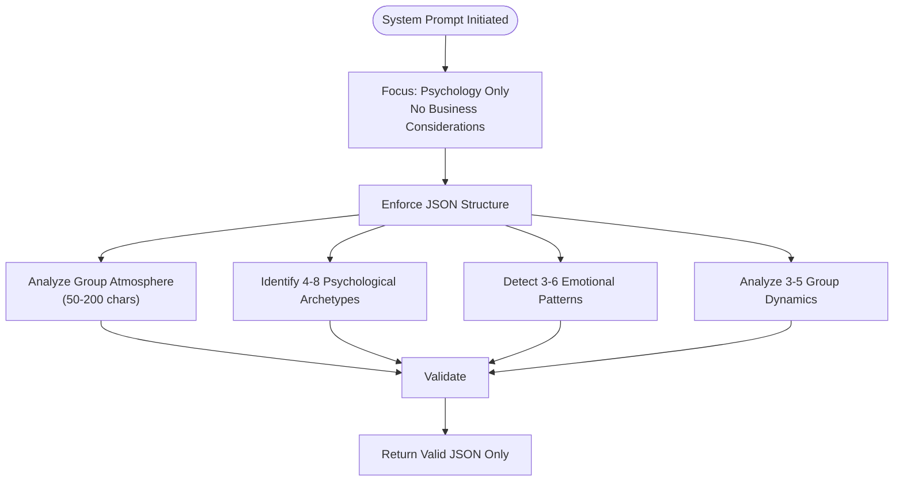
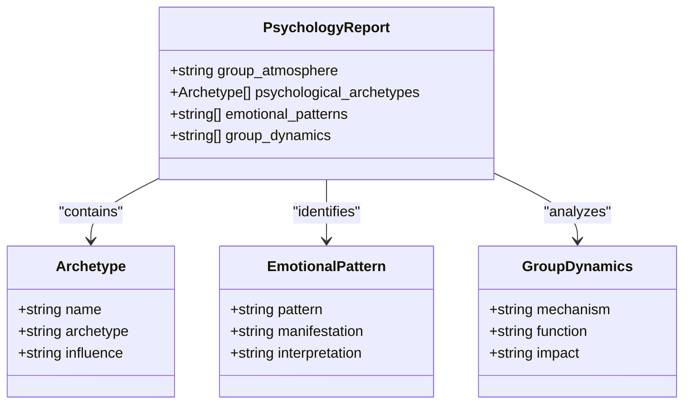

# Psychology Persona Analysis

<cite>
**Referenced Files in This Document**  
- [reportSchemas.ts](file://lib/reportSchemas.ts)
- [ai.ts](file://lib/ai.ts)
- [multi-style-summary-generator.tsx](file://components/multi-style-summary-generator.tsx)
</cite>

## Table of Contents
1. [Introduction](#introduction)
2. [Psychology Report Schema Structure](#psychology-report-schema-structure)
3. [System Prompt for Psychologist Persona](#system-prompt-for-psychologist-persona)
4. [Response Validation and Schema Enforcement](#response-validation-and-schema-enforcement)
5. [Analysis of Community Health and Interpersonal Dynamics](#analysis-of-community-health-and-interpersonal-dynamics)
6. [Common Issues in Psychological Analysis](#common-issues-in-psychological-analysis)
7. [Conclusion](#conclusion)

## Introduction
The psychologist persona in the AI report generation system is designed to provide deep psychological insights into Telegram chat dynamics. Unlike other personas that focus on business, creativity, or curation, the psychologist persona exclusively analyzes group atmosphere, emotional patterns, and interpersonal relationships within the community. This document details how the system performs psychological analysis, the structure of the `psychologyReportSchema`, and how the AI ensures accurate and meaningful outputs without business considerations.

**Section sources**
- [reportSchemas.ts](file://lib/reportSchemas.ts#L17-L26)
- [ai.ts](file://lib/ai.ts#L588-L940)

## Psychology Report Schema Structure
The `psychologyReportSchema` defines a strict JSON structure that the AI must follow when generating psychological reports. This schema ensures consistency, completeness, and analytical depth across all generated outputs.

### Schema Components
The schema consists of four key fields, each with specific constraints and purposes:

| Field | Type | Constraints | Purpose |
|-------|------|-------------|---------|
| `group_atmosphere` | string | 50–200 characters | Describes the overall emotional tone of the group |
| `psychological_archetypes` | array of objects | 4–8 items | Identifies key participant roles and their influence |
| `emotional_patterns` | array of strings | 3–6 items | Captures recurring emotional behaviors |
| `group_dynamics` | array of strings | 3–5 items | Analyzes underlying group processes |

```mermaid
erDiagram
PSYCHOLOGY_REPORT {
string group_atmosphere 50-200
array psychological_archetypes 4-8
array emotional_patterns 3-6
array group_dynamics 3-5
}
PSYCHOLOGICAL_ARCHETYPE {
string name
string archetype
string influence
}
PSYCHOLOGY_REPORT ||--o{ PSYCHOLOGICAL_ARCHETYPE : contains
```

**Diagram sources**  
- [reportSchemas.ts](file://lib/reportSchemas.ts#L17-L26)

**Section sources**  
- [reportSchemas.ts](file://lib/reportSchemas.ts#L17-L26)

## System Prompt for Psychologist Persona
The `getPersonaPrompt('psychologist')` function generates a system prompt that strictly focuses on psychological analysis while excluding any business or monetization considerations.

### Prompt Characteristics
The system prompt enforces the following constraints:
- **Exclusive focus on psychology**: No business, marketing, or revenue-related content
- **Professional terminology**: Requires use of clinical and psychological terms
- **Structured output**: Mandates valid JSON with specific field names
- **No markdown or additional text**: Only returns pure JSON

### Key Instructions
The prompt directs the AI to:
1. Classify the **group atmosphere** using terms like:  
   - Calm  
   - Tense  
   - Emotionally unstable  
   - Supportive  
   - Competitive  
   - Toxic  

2. Identify **psychological archetypes** including:  
   - Leader  
   - Moderator  
   - Provocateur  
   - Caregiver  
   - Sage  
   - Joker  
   - Catalyst  
   - Observer  

3. Analyze **emotional patterns** with format:  
   `"Pattern: how it manifests + psychological interpretation"`

4. Examine **group dynamics** with format:  
   `"Mechanism: how it works + impact on community"`



**Diagram sources**  
- [ai.ts](file://lib/ai.ts#L588-L940)

**Section sources**  
- [ai.ts](file://lib/ai.ts#L588-L940)

## Response Validation and Schema Enforcement
The system ensures all psychological reports conform to the `psychologyReportSchema` through rigorous validation mechanisms.

### Validation Process
When the AI generates a response, it undergoes the following validation steps:

1. **JSON Parsing**: The raw response is parsed to ensure it's valid JSON
2. **Schema Validation**: The parsed object is checked against the Zod schema
3. **Field Verification**: Each field is validated for type, length, and structure
4. **Error Handling**: Invalid responses are rejected and logged

### Schema Enforcement Example
```typescript
const result = _parseAIResponse<any>(response, psychologyReportSchema, "psychologist");
```

This validation ensures:
- `group_atmosphere` is between 50–200 characters
- `psychological_archetypes` contains 4–8 objects with required fields
- `emotional_patterns` and `group_dynamics` have appropriate array lengths
- No extraneous fields are present

**Section sources**  
- [ai.ts](file://lib/ai.ts#L320-L373)
- [reportSchemas.ts](file://lib/reportSchemas.ts#L17-L26)

## Analysis of Community Health and Interpersonal Dynamics
The psychologist persona provides valuable insights into the health and functioning of Telegram communities by analyzing key psychological dimensions.

### Group Atmosphere Assessment
The system evaluates the overall emotional climate, identifying whether the group is:
- **Supportive**: Encouraging, empathetic, collaborative
- **Competitive**: Achievement-oriented, status-driven, performance-focused
- **Toxic**: Hostile, judgmental, conflict-prone
- **Apathetic**: Low engagement, minimal interaction, passive consumption

### Psychological Archetype Identification
The system identifies key participant roles based on communication patterns:

| Archetype | Behavioral Indicators | Influence |
|---------|----------------------|---------|
| Leader | Initiates discussions, resolves conflicts, sets tone | Shapes group direction |
| Provocateur | Challenges norms, creates controversy, tests boundaries | Stimulates engagement (positive/negative) |
| Caregiver | Offers support, mediates disputes, shows empathy | Enhances cohesion |
| Observer | Minimal participation, careful listening, occasional insights | Provides stability |

### Emotional Pattern Detection
The system detects recurring emotional behaviors such as:
- **Attention-seeking**: Frequent posting, dramatic statements, self-promotion
- **Defensiveness**: Reacting strongly to criticism, justifying behavior
- **Empathy cycles**: Periods of mutual support and validation
- **Conflict escalation**: Gradual intensification of disagreements

### Group Dynamics Analysis
The system examines underlying processes including:
- **Groupthink**: Conformity pressure, suppression of dissent
- **Leadership emergence**: Natural authority figures, influence networks
- **Subgroup formation**: Cliques, alliances, informal hierarchies
- **Conflict resolution patterns**: How disagreements are addressed



**Diagram sources**  
- [reportSchemas.ts](file://lib/reportSchemas.ts#L17-L26)
- [multi-style-summary-generator.tsx](file://components/multi-style-summary-generator.tsx#L29-L78)

**Section sources**  
- [multi-style-summary-generator.tsx](file://components/multi-style-summary-generator.tsx#L29-L78)
- [ai.ts](file://lib/ai.ts#L588-L940)

## Common Issues in Psychological Analysis
The system addresses several common challenges in psychological analysis of online communities.

### Identifying Toxic Patterns
The psychologist persona is specifically trained to detect toxic behaviors such as:
- **Gaslighting**: Manipulating others into questioning their reality
- **Triangulation**: Creating conflict between third parties
- **Passive aggression**: Indirect hostility, sarcasm, backhanded compliments
- **Dominance displays**: Interrupting, talking over, dismissing others

### Interpreting Archetype Classifications
The system handles ambiguous cases by:
- **Contextual analysis**: Considering timing, frequency, and triggers
- **Behavioral consistency**: Looking for patterns over time
- **Cross-verification**: Comparing with emotional patterns and group dynamics
- **Confidence assessment**: Indicating certainty levels in interpretations

### Avoiding Overpathologizing
The system prevents inappropriate medicalization by:
- Focusing on observable behaviors rather than diagnoses
- Using descriptive rather than clinical labels
- Emphasizing functional impact over pathology
- Maintaining awareness of online communication limitations

**Section sources**  
- [ai.ts](file://lib/ai.ts#L588-L940)
- [multi-style-summary-generator.tsx](file://components/multi-style-summary-generator.tsx#L29-L78)

## Conclusion
The psychologist persona provides a sophisticated analysis of Telegram chat dynamics through a structured approach to psychological assessment. By focusing exclusively on group atmosphere, archetypes, emotional patterns, and group dynamics, the system delivers insights that help understand community health and interpersonal relationships. The strict schema enforcement ensures consistent, high-quality outputs, while the validation process maintains reliability. This psychological analysis capability enables community managers and researchers to identify both strengths and challenges within their groups, facilitating more informed decisions about moderation, engagement strategies, and community development.

The separation of psychological analysis from business considerations ensures that the insights remain focused on human dynamics rather than commercial outcomes, providing a valuable complement to other analytical perspectives available in the system.

**Section sources**  
- [reportSchemas.ts](file://lib/reportSchemas.ts#L17-L26)
- [ai.ts](file://lib/ai.ts#L588-L940)
- [multi-style-summary-generator.tsx](file://components/multi-style-summary-generator.tsx#L29-L78)