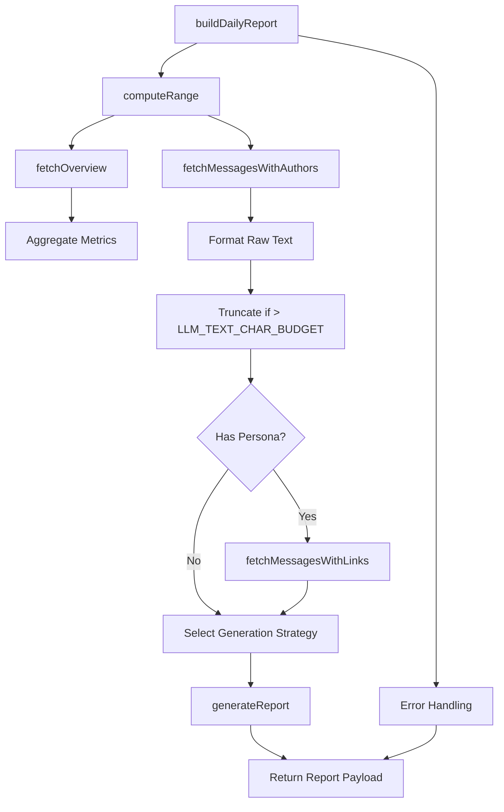
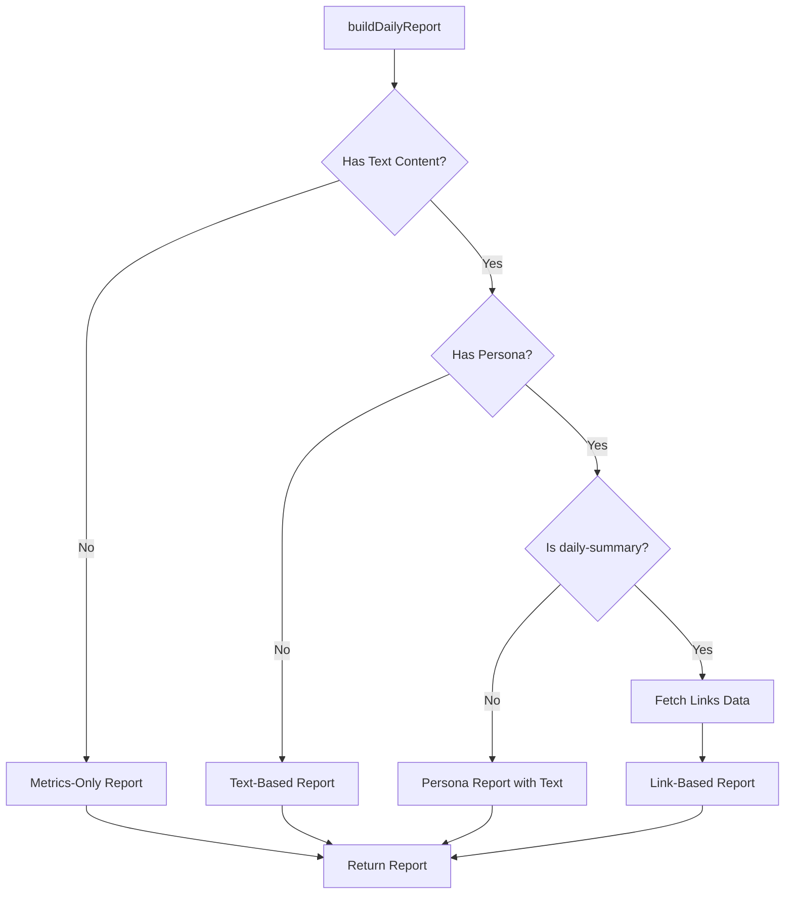
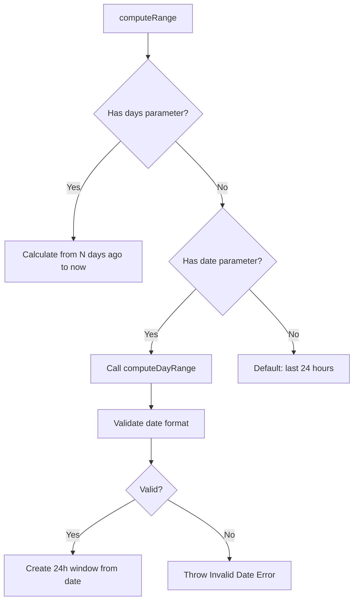
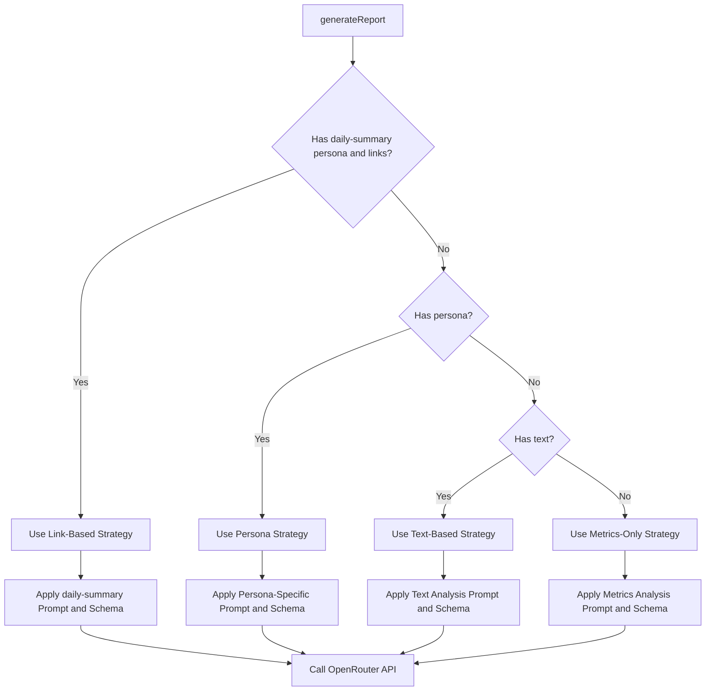
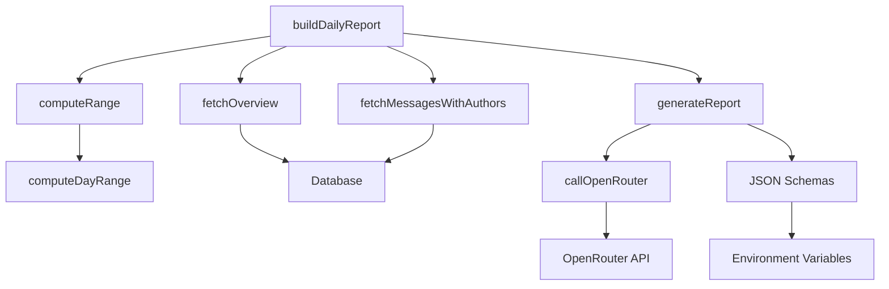

# Report Building Process

<cite>
**Referenced Files in This Document**   
- [lib/report.ts](file://lib/report.ts)
- [lib/ai.ts](file://lib/ai.ts)
- [lib/queries.ts](file://lib/queries.ts)
- [lib/date-utils.ts](file://lib/date-utils.ts)
- [lib/reportSchemas.ts](file://lib/reportSchemas.ts)
- [lib/types.ts](file://lib/types.ts)
</cite>

## Table of Contents
1. [Introduction](#introduction)
2. [Core Components](#core-components)
3. [Architecture Overview](#architecture-overview)
4. [Detailed Component Analysis](#detailed-component-analysis)
5. [Dependency Analysis](#dependency-analysis)
6. [Performance Considerations](#performance-considerations)
7. [Troubleshooting Guide](#troubleshooting-guide)
8. [Conclusion](#conclusion)

## Introduction
The tg-ai-vibecoders-summary application implements a sophisticated report generation system that transforms raw Telegram chat data into structured, insightful summaries. This document provides a comprehensive analysis of the report building process, focusing on the `buildDailyReport` function and its supporting components. The system combines message retrieval, date range calculation, metric aggregation, and AI-powered analysis to create personalized reports based on various personas. The architecture is designed to handle large volumes of messages while respecting AI service limitations through strategic text truncation and fallback mechanisms.

## Core Components

The report building process is orchestrated by several core components that work together to transform raw chat data into meaningful insights. The primary entry point is the `buildDailyReport` function, which coordinates the entire workflow from date range calculation to AI report generation. Supporting this main function are utilities for date manipulation, message retrieval, metric calculation, and AI interaction. The system is designed with modularity in mind, allowing different components to be reused across various report types and use cases. The architecture follows a clear separation of concerns, with data retrieval, processing, and AI generation handled by distinct modules.

**Section sources**
- [lib/report.ts](file://lib/report.ts#L13-L122)
- [lib/ai.ts](file://lib/ai.ts#L33-L165)
- [lib/queries.ts](file://lib/queries.ts#L11-L230)

## Architecture Overview

The report generation architecture follows a sequential processing pipeline that begins with parameter validation and ends with AI-generated insights. The process starts with date range computation based on user input, followed by concurrent retrieval of message content and engagement metrics. Retrieved messages are processed into a structured text format and truncated if necessary to fit within AI service constraints. The system then determines the appropriate report generation strategy based on available data and requested persona. Finally, the selected AI model generates a structured report that is returned to the caller. Error handling is implemented at multiple levels to ensure graceful degradation when components fail.



**Diagram sources **
- [lib/report.ts](file://lib/report.ts#L13-L122)
- [lib/ai.ts](file://lib/ai.ts#L33-L165)
- [lib/queries.ts](file://lib/queries.ts#L11-L230)

## Detailed Component Analysis

### buildDailyReport Function Analysis
The `buildDailyReport` function serves as the central orchestrator of the report generation process, accepting parameters that define the scope and nature of the requested report. It takes five parameters: `date` (specific date for daily reports), `chatId` (identifier for the target chat), `threadId` (optional thread identifier), `days` (time window: 1 or 7 days), and `persona` (report style template). The function first computes the appropriate date range using the `computeRange` utility, which handles various input combinations to determine the correct time window. It then concurrently retrieves engagement metrics through `fetchOverview` and message content via `fetchMessagesWithAuthors`. The retrieved messages are formatted into a timestamped text representation and truncated to fit within the `LLM_TEXT_CHAR_BUDGET` limit, which defaults to 80,000 characters. Based on the presence of a persona parameter, the function determines whether to include link analysis in the report. The final report is generated by the `generateReport` function, which adapts its approach based on available data and requested persona.

#### Report Generation Strategy Selection


**Diagram sources **
- [lib/report.ts](file://lib/report.ts#L13-L101)
- [lib/ai.ts](file://lib/ai.ts#L33-L165)

**Section sources**
- [lib/report.ts](file://lib/report.ts#L13-L101)
- [lib/ai.ts](file://lib/ai.ts#L33-L165)

### Date Range Computation Analysis
The date range computation system provides flexible time window handling for report generation, supporting multiple input scenarios through two complementary functions: `computeRange` and `computeDayRange`. The `computeRange` function serves as the primary interface, accepting either a specific date or a day count (1 or 7) to determine the appropriate time window. When a day count is provided, it calculates a range from the specified number of days ago to the current time. When a specific date is provided, it delegates to `computeDayRange` to create a 24-hour window starting at midnight UTC of the specified date. The `computeDayRange` function validates the input date format (YYYY-MM-DD) and throws an error for invalid inputs, ensuring data integrity at the earliest possible stage. This modular approach allows the system to handle both relative time windows (last 24 hours, last week) and absolute dates (specific day reports) with consistent behavior.

#### Date Range Computation Logic


**Diagram sources **
- [lib/report.ts](file://lib/report.ts#L103-L122)
- [lib/date-utils.ts](file://lib/date-utils.ts#L1-L58)

**Section sources**
- [lib/report.ts](file://lib/report.ts#L103-L122)
- [lib/date-utils.ts](file://lib/date-utils.ts#L1-L58)

### Message Processing and Truncation Analysis
The message processing pipeline transforms raw chat data into a structured text format suitable for AI analysis, implementing several optimization strategies to handle large message volumes efficiently. The `fetchMessagesWithAuthors` function retrieves messages within the specified date range, joining message data with user information to include sender names in the output. Each message is formatted with a timestamp and author label in the pattern `[HH:MM] Author: Message content`, creating a chronological conversation log. The system enforces a 5,000 message limit to prevent excessive database queries and memory usage. After formatting, the complete text is compared against the `LLM_TEXT_CHAR_BUDGET` environment variable (default 80,000 characters), and truncated if necessary. This character-based truncation ensures compatibility with AI service token limits while preserving the chronological order of messages, which is critical for maintaining conversation context.

#### Message Processing Pipeline
```mermaid
flowchart TD
A[fetchMessagesWithAuthors] --> B[Database Query]
B --> C[Join with User Data]
C --> D[Format as [HH:MM] Author: Text]
D --> E[Join All Messages]
E --> F{Length > LLM_TEXT_CHAR_BUDGET?}
F --> |Yes| G[Truncate to Budget]
F --> |No| H[Use Full Text]
G --> I[Log Truncation]
H --> I
I --> J[Return Processed Text]
```

**Diagram sources **
- [lib/queries.ts](file://lib/queries.ts#L167-L230)
- [lib/report.ts](file://lib/report.ts#L13-L101)

**Section sources**
- [lib/queries.ts](file://lib/queries.ts#L167-L230)
- [lib/report.ts](file://lib/report.ts#L13-L101)

### AI Report Generation Strategy Analysis
The AI report generation system implements a sophisticated strategy selection mechanism that adapts to available data and user preferences, ensuring optimal use of AI resources while maintaining report quality. The `generateReport` function serves as a unified interface for all report types, determining the appropriate generation strategy based on input parameters. When a persona is specified and link data is available (specifically for the 'daily-summary' persona), the system generates a link-based report with enhanced context. For other personas with text content, it creates a text-based report that analyzes message content. When no text is available but metrics exist, it falls back to a metrics-only report that interprets engagement data without message context. Each strategy uses a different system prompt and JSON schema to guide the AI's output format, ensuring consistency across report types while allowing for persona-specific content structures.

#### AI Strategy Selection Logic


**Diagram sources **
- [lib/ai.ts](file://lib/ai.ts#L33-L165)
- [lib/reportSchemas.ts](file://lib/reportSchemas.ts#L1-L87)

**Section sources**
- [lib/ai.ts](file://lib/ai.ts#L33-L165)
- [lib/reportSchemas.ts](file://lib/reportSchemas.ts#L1-L87)

## Dependency Analysis

The report generation system exhibits a clear dependency hierarchy with well-defined interfaces between components. The `buildDailyReport` function depends on date utilities for range calculation, database queries for data retrieval, and AI services for report generation. The `computeRange` and `computeDayRange` functions have no external dependencies beyond standard JavaScript Date objects, making them pure utility functions. The message retrieval functions (`fetchMessagesWithAuthors` and `fetchMessagesWithLinks`) depend on the database connection pool and user label formatting utilities. The AI generation system depends on environment variables for service configuration and JSON schemas for response validation. Circular dependencies are avoided through the use of a unified `generateReport` function that consolidates previously separate report generation pathways. The system's modular design allows components to be tested and modified independently, with clear contracts defined through TypeScript interfaces.



**Diagram sources **
- [lib/report.ts](file://lib/report.ts#L13-L122)
- [lib/ai.ts](file://lib/ai.ts#L33-L165)
- [lib/queries.ts](file://lib/queries.ts#L11-L230)

**Section sources**
- [lib/report.ts](file://lib/report.ts#L13-L122)
- [lib/ai.ts](file://lib/ai.ts#L33-L165)
- [lib/queries.ts](file://lib/queries.ts#L11-L230)

## Performance Considerations

The report generation system incorporates several performance optimizations to handle large datasets efficiently while maintaining responsiveness. The message retrieval process limits results to 5,000 messages to prevent excessive database load and memory consumption. Text truncation based on character count rather than message count preserves chronological context while respecting AI service limitations. The system uses environment variables to configure critical parameters like `LLM_TEXT_CHAR_BUDGET` and `OPENROUTER_TIMEOUT_MS`, allowing runtime adjustment without code changes. For large message volumes, the system could be enhanced with pagination or streaming to avoid memory pressure. The AI service call includes timeout handling and request cancellation to prevent hanging requests. When AI services fail, the system gracefully returns null rather than propagating errors, allowing calling code to implement appropriate fallback behaviors. Monitoring is implemented through comprehensive logging of key metrics at each processing stage.

**Section sources**
- [lib/report.ts](file://lib/report.ts#L13-L101)
- [lib/ai.ts](file://lib/ai.ts#L909-L982)
- [lib/queries.ts](file://lib/queries.ts#L167-L230)

## Troubleshooting Guide

The report generation system includes several mechanisms for identifying and resolving common issues. Invalid date formats are caught early by the `computeDayRange` function, which validates input and throws descriptive errors. Empty message entries are handled gracefully by filtering out messages with empty text before processing. Rate limiting considerations are addressed through the `OPENROUTER_TIMEOUT_MS` environment variable and request cancellation mechanisms. When AI service calls fail, detailed error logging helps diagnose the cause, whether it's network issues, authentication problems, or response parsing errors. The system logs key metrics at each stage, including message counts, character usage, and truncation status, enabling performance monitoring and bottleneck identification. For debugging, the `LLM_DEBUG_VERBOSE` environment variable can enable detailed logging of AI service requests and responses. The modular design allows individual components to be tested in isolation, facilitating rapid issue diagnosis and resolution.

**Section sources**
- [lib/report.ts](file://lib/report.ts#L13-L101)
- [lib/ai.ts](file://lib/ai.ts#L909-L982)
- [lib/date-utils.ts](file://lib/date-utils.ts#L1-L58)

## Conclusion

The report building process in the tg-ai-vibecoders-summary application demonstrates a well-architected approach to transforming raw chat data into meaningful insights. By combining modular components for date handling, data retrieval, and AI analysis, the system provides flexible report generation capabilities that adapt to various input scenarios and user preferences. The strategic use of fallback mechanisms, parameter validation, and performance optimizations ensures reliable operation across different use cases. The unified `generateReport` function simplifies the API surface while supporting multiple report types through configurable prompts and schemas. Future enhancements could include support for additional personas, improved handling of very large message volumes through streaming, and enhanced error recovery mechanisms. The current implementation provides a solid foundation for AI-powered chat analysis with clear pathways for extension and improvement.