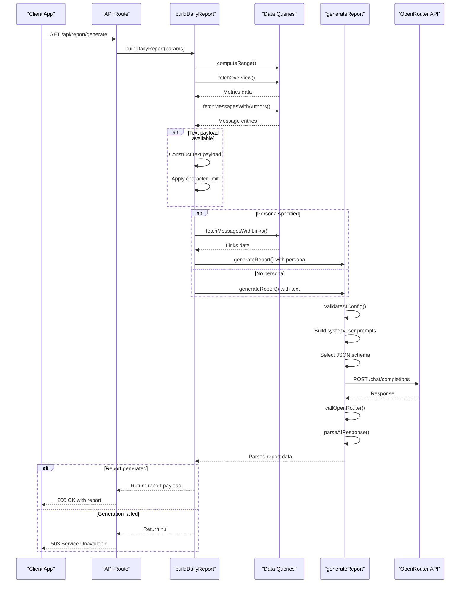

# Service Orchestration

<cite>
**Referenced Files in This Document**   
- [lib/report.ts](file://lib/report.ts)
- [lib/ai.ts](file://lib/ai.ts)
- [lib/reportSchemas.ts](file://lib/reportSchemas.ts)
- [lib/queries.ts](file://lib/queries.ts)
- [lib/types.ts](file://lib/types.ts)
- [app/api/report/[kind]/route.ts](file://app/api/report/[kind]/route.ts)
</cite>

## Table of Contents
1. [Introduction](#introduction)
2. [Orchestration Layer Overview](#orchestration-layer-overview)
3. [buildDailyReport Workflow](#builddailyreport-workflow)
4. [Report Strategy Selection](#report-strategy-selection)
5. [AI Integration and Parameter Mapping](#ai-integration-and-parameter-mapping)
6. [Type System and Validation](#type-system-and-validation)
7. [Error Handling and Fallbacks](#error-handling-and-fallbacks)
8. [Sequence Diagram](#sequence-diagram)

## Introduction
The service orchestration layer of the tg-ai-vibecoders-summary application coordinates data retrieval, AI processing, and report structuring through the lib/report.ts module. This documentation details how the buildDailyReport function serves as the central coordinator, managing the complete report generation workflow from API request to AI response parsing. The system integrates multiple data sources, implements sophisticated strategy selection logic, and provides robust error handling for reliable report generation.

## Orchestration Layer Overview
The lib/report.ts module acts as the central coordinator between data retrieval, AI processing, and report structuring components. It orchestrates the complete report generation process by coordinating with data access functions in lib/queries.ts, the AI processing engine in lib/ai.ts, and validation schemas in lib/reportSchemas.ts. The orchestration layer handles date range calculation, message fetching, text payload construction, and persona-based AI invocation, serving as the integration point between the application's data layer and AI services.

**Section sources**
- [lib/report.ts](file://lib/report.ts#L13-L101)
- [lib/ai.ts](file://lib/ai.ts#L33-L165)

## buildDailyReport Workflow
The buildDailyReport function implements a comprehensive workflow for generating daily reports through several coordinated steps. The process begins with date range calculation using the computeRange function, which determines the time window for data retrieval based on either a specific date or a relative day count (1 or 7 days). The function then retrieves metrics through fetchOverview, which queries the database for message counts, unique users, link messages, top users, and activity series.

Following metrics retrieval, the function fetches message content through fetchMessagesWithAuthors, which retrieves up to 5,000 messages with their timestamps, author labels, and text content. The messages are formatted into a time-stamped text payload with the structure "[HH:MM] Author: Text" for AI processing. The payload is truncated to respect the LLM_TEXT_CHAR_BUDGET environment limit, with logging indicating whether truncation occurred.

**Section sources**
- [lib/report.ts](file://lib/report.ts#L13-L101)
- [lib/queries.ts](file://lib/queries.ts#L167-L230)
- [lib/date-utils.ts](file://lib/date-utils.ts#L112-L122)

## Report Strategy Selection
The system implements a sophisticated strategy selection logic that determines the appropriate report generation approach based on available data and requested persona. The primary decision tree evaluates the presence of a persona parameter and message content to determine the generation strategy.

When a persona parameter is specified, the system selects between text-based analysis with links (for the 'daily-summary' persona) or standard persona-based analysis. For the 'daily-summary' persona, the system additionally fetches messages with links through fetchMessagesWithLinks, which extracts URLs from message text using a regular expression pattern. This enables comprehensive link analysis for the daily summary report.

In the absence of a persona, the system falls back to either text-based analysis (when message content is available) or metrics-only analysis (when no message content is retrieved). The strategy selection is logged with clear indicators of the chosen approach, enabling debugging and monitoring of the decision process.

**Section sources**
- [lib/report.ts](file://lib/report.ts#L13-L101)
- [lib/queries.ts](file://lib/queries.ts#L298-L370)
- [lib/ai.ts](file://lib/ai.ts#L33-L165)

## AI Integration and Parameter Mapping
The integration with generateReport in lib/ai.ts follows a structured parameter mapping approach that adapts to different report types and strategies. The generateReport function serves as a unified interface for all AI report generation, replacing multiple specialized functions with a single, flexible implementation.

The parameter mapping process configures the AI request based on the selected strategy, setting appropriate system prompts, user prompts, JSON schemas, and response format parameters. For text-based and persona-based reports, the system constructs detailed prompts that include date, chat ID, metrics, and message content. The function also handles timeout management through an AbortController with a configurable timeout (OPENROUTER_TIMEOUT_MS), ensuring that AI requests do not hang indefinitely.

Response parsing is implemented through the _parseAIResponse helper function, which first attempts to parse the AI response as JSON and then validates it against the appropriate Zod schema. The integration includes detailed logging of request and response metadata, including message lengths, response duration, and error conditions, facilitating debugging and performance monitoring.

**Section sources**
- [lib/ai.ts](file://lib/ai.ts#L33-L165)
- [lib/ai.ts](file://lib/ai.ts#L909-L982)
- [lib/ai.ts](file://lib/ai.ts#L177-L196)

## Type System and Validation
The application implements a robust type system with distinct ReportPayload and PersonaReportPayload types to handle different report structures. The ReportPayload type represents traditional reports with summary, themes, and insights fields, while PersonaReportPayload accommodates persona-specific reports with a generic data field containing the AI-generated content.

The validation system leverages Zod schemas defined in lib/reportSchemas.ts to ensure response integrity. Each persona type has a dedicated schema (businessReportSchema, psychologyReportSchema, creativeReportSchema, dailySummaryReportSchema) that defines the expected structure, required fields, and validation rules. The base reportSchema serves as the default for standard reports and certain personas.

The type system enables type-safe handling of different report formats while maintaining flexibility for persona-specific structures. The validation process occurs in two stages: JSON parsing and schema validation, with appropriate error handling for both failure modes. This ensures that only properly structured and validated responses are returned to the calling code.

**Section sources**
- [lib/types.ts](file://lib/types.ts#L28-L43)
- [lib/reportSchemas.ts](file://lib/reportSchemas.ts#L1-L87)
- [lib/ai.ts](file://lib/ai.ts#L177-L196)

## Error Handling and Fallbacks
The orchestration layer implements comprehensive error handling patterns to ensure reliability in the face of AI service failures. The primary error handling occurs in the buildDailyReport function, which wraps the entire report generation process in a try-catch block that logs AI generation failures and returns null on error.

The generateReport function includes multiple layers of error handling, including validation of AI configuration (OPENROUTER_API_KEY and OPENROUTER_MODEL), network request timeouts, HTTP response error checking, JSON parsing errors, and schema validation failures. Each error type is logged with appropriate context, enabling effective debugging and monitoring.

The system implements fallback mechanisms at multiple levels: strategy fallback from text-based to metrics-only reporting when message content is unavailable, and graceful degradation to null responses when AI services fail. The error handling also includes specific sanitization for certain personas, such as truncating overly long creative_temperature fields in the creative persona to prevent excessive response sizes.

**Section sources**
- [lib/report.ts](file://lib/report.ts#L13-L101)
- [lib/ai.ts](file://lib/ai.ts#L33-L165)
- [lib/ai.ts](file://lib/ai.ts#L177-L196)

## Sequence Diagram
The following sequence diagram illustrates the complete report generation flow from API request to AI response parsing:

**Diagram sources**
- [lib/report.ts](file://lib/report.ts#L13-L101)
- [lib/ai.ts](file://lib/ai.ts#L33-L165)
- [app/api/report/[kind]/route.ts](file://app/api/report/[kind]/route.ts#L1-L83)

**Section sources**
- [lib/report.ts](file://lib/report.ts#L13-L101)
- [lib/ai.ts](file://lib/ai.ts#L33-L165)
- [app/api/report/[kind]/route.ts](file://app/api/report/[kind]/route.ts#L1-L83)