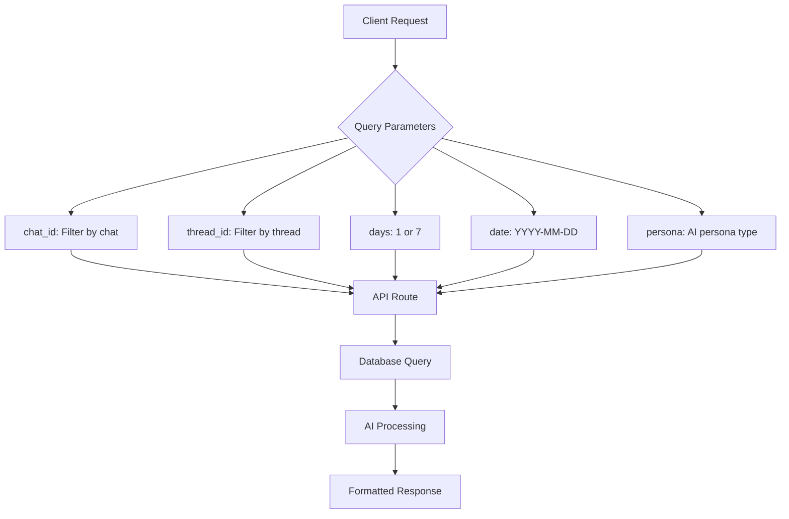

# Developer Guide

<cite>
**Referenced Files in This Document**   
- [README.md](file://README.md)
- [package.json](file://package.json)
- [tsconfig.json](file://tsconfig.json)
- [next.config.mjs](file://next.config.mjs)
- [lib/db.ts](file://lib/db.ts)
- [lib/ai.ts](file://lib/ai.ts)
- [lib/telegram.ts](file://lib/telegram.ts)
- [lib/report.ts](file://lib/report.ts)
- [lib/reportSchemas.ts](file://lib/reportSchemas.ts)
- [lib/queries.ts](file://lib/queries.ts)
- [app/api/overview/route.ts](file://app/api/overview/route.ts)
- [app/api/report/[kind]/route.ts](file://app/api/report/[kind]/route.ts)
- [app/api/send-to-telegram/route.ts](file://app/api/send-to-telegram/route.ts)
- [app/api/topics/route.ts](file://app/api/topics/route.ts)
- [components/summary-generator.tsx](file://components/summary-generator.tsx)
- [components/ai-insights.tsx](file://components/ai-insights.tsx)
- [components/multi-style-summary-generator.tsx](file://components/multi-style-summary-generator.tsx)
</cite>

## Table of Contents
1. [Development Workflow Overview](#development-workflow-overview)
2. [Environment Setup](#environment-setup)
3. [Starting the Development Server](#starting-the-development-server)
4. [Accessing Dashboard Views](#accessing-dashboard-views)
5. [Query Parameters for Filtering](#query-parameters-for-filtering)
6. [Code Quality and Linting](#code-quality-and-linting)
7. [Refactoring Progress and Code Improvements](#refactoring-progress-and-code-improvements)
8. [Contribution Best Practices](#contribution-best-practices)
9. [Common Development Tasks](#common-development-tasks)
10. [Troubleshooting Common Issues](#troubleshooting-common-issues)

## Development Workflow Overview

The tg-ai-vibecoders-summary application follows a structured development workflow that integrates PostgreSQL data access, AI-powered insights generation via OpenRouter, and real-time dashboard visualization. The development process emphasizes code quality, TypeScript strictness, and efficient refactoring to maintain a clean, maintainable codebase. This guide outlines the complete workflow from environment setup to deployment, including best practices for contributing to the codebase.

**Section sources**
- [README.md](file://README.md#L1-L100)

## Environment Setup

Before starting development, ensure the following prerequisites are met:
1. Install Node.js version 18 or higher
2. Set up a PostgreSQL database with the required messages and users tables
3. Configure environment variables in a `.env` file with the following required variables:
   - `DATABASE_URL`: PostgreSQL connection string
   - `OPENROUTER_API_KEY`: API key for OpenRouter AI service
   - `OPENROUTER_MODEL`: Model identifier (e.g., `google/gemini-2.5-pro`)

The application requires valid OpenRouter credentials to generate AI insights, as this functionality is mandatory and no fallback content is provided when AI is unavailable.

**Section sources**
- [README.md](file://README.md#L25-L45)
- [lib/db.ts](file://lib/db.ts#L1-L25)

## Starting the Development Server

To start the development server, follow these steps:
1. Install dependencies by running `npm install`
2. Ensure PostgreSQL is running and accessible via the configured `DATABASE_URL`
3. Verify that OpenRouter credentials are properly configured in the environment
4. Start the development server with the command `npm run dev`

The application uses Next.js 15 App Router, and the development server will be available at `http://localhost:3000`. The server automatically reloads when code changes are detected, providing a hot-reload development experience.

**Section sources**
- [README.md](file://README.md#L30-L35)
- [package.json](file://package.json#L6-L10)

## Accessing Dashboard Views

The application provides multiple dashboard views accessible through different routes:
- `http://localhost:3000` - 24-hour dashboard view
- `http://localhost:3000/week` - 7-day analytics view

These views display real-time analytics powered by PostgreSQL data, including message metrics, user activity, and AI-generated insights. The dashboard components are built using React and leverage Next.js App Router for server-side rendering and data fetching.

**Section sources**
- [README.md](file://README.md#L34-L35)
- [app/page.tsx](file://app/page.tsx)
- [app/week/page.tsx](file://app/week/page.tsx)

## Query Parameters for Filtering

The application's API endpoints support various query parameters for filtering and customization:
- `chat_id`: Filter analytics by specific Telegram chat ID
- `thread_id`: Filter by specific message thread ID
- `days`: Specify the time period (1 or 7 days) for data retrieval
- `date`: Filter by specific date (YYYY-MM-DD format)
- `persona`: Specify the AI persona for report generation (e.g., 'business', 'psychologist', 'creative')

These parameters can be used with API routes such as `/api/overview`, `/api/report/generate`, and `/api/topics` to customize data retrieval and report generation.

**Diagram sources**
- [app/api/overview/route.ts](file://app/api/overview/route.ts#L1-L22)
- [app/api/report/[kind]/route.ts](file://app/api/report/[kind]/route.ts#L1-L83)
- [app/api/topics/route.ts](file://app/api/topics/route.ts#L1-L21)
- [lib/queries.ts](file://lib/queries.ts#L1-L382)

## Code Quality and Linting

The project enforces strict code quality standards through TypeScript and ESLint configuration:
- TypeScript is configured with strict mode enabled (`"strict": true` in tsconfig.json)
- The codebase uses path aliases (`@/*` mapped to the root directory)
- Linting is performed using `npm run lint`, which runs ESLint with Next.js configuration
- The project follows a comprehensive refactoring strategy to eliminate code duplication

The linting process helps maintain code consistency and catch potential issues early in development. All contributions should pass linting without errors before being committed.

**Section sources**
- [tsconfig.json](file://tsconfig.json#L1-L45)
- [package.json](file://package.json#L19-L22)
- [README.md](file://README.md#L75-L78)

## Refactoring Progress and Code Improvements

The codebase has undergone significant refactoring to improve maintainability and reduce duplication:
- **AI Module Refactoring**: Completed on Day 1, saving approximately 586 lines of code
  - Created unified `generateReport()` function
  - Implemented helper functions for AI configuration validation, response parsing, and logging
  - Added deprecated wrappers for backward compatibility
- **Telegram Module Refactoring**: Partially completed on Day 2, saving approximately 90 lines of code
  - Created 6 Telegram formatting helpers
  - Simplified formatters and JSON schema helpers
  - Implemented DRY (Don't Repeat Yourself) principles in message formatting

The total refactoring effort has saved approximately 676 lines of code, improving code maintainability and reducing technical debt. Future refactoring will focus on React components, API routes, and database queries.

**Section sources**
- [README.md](file://README.md#L80-L140)
- [lib/ai.ts](file://lib/ai.ts#L1-L799)
- [lib/telegram.ts](file://lib/telegram.ts#L1-L474)

## Contribution Best Practices

When contributing to the codebase, follow these best practices:
- Maintain TypeScript strict mode compliance
- Use path aliases (`@/*`) for imports to simplify module resolution
- Follow the existing code style and patterns
- Write comprehensive comments for complex logic
- Ensure new code is covered by appropriate error handling
- Test AI-generated content thoroughly, as it is a mandatory feature

The codebase uses modern JavaScript features and leverages Next.js 15 App Router patterns. All new components should be implemented as server components when possible, with client components used only when interactivity is required.

**Section sources**
- [tsconfig.json](file://tsconfig.json#L1-L45)
- [next.config.mjs](file://next.config.mjs#L1-L9)
- [lib/ai.ts](file://lib/ai.ts#L1-L799)

## Common Development Tasks

### Generating AI Reports
To generate AI-powered reports:
1. Ensure OpenRouter credentials are configured
2. Call the `/api/report/generate` endpoint with appropriate parameters
3. The system will fetch message data, process it through the AI service, and return structured insights

### Sending Reports to Telegram
To send reports to Telegram:
1. Configure Telegram bot credentials in environment variables
2. Use the `/api/send-to-telegram` endpoint with the report data
3. The system will format the report for Telegram and send it to the specified chat

### Testing Database Queries
To test database queries:
1. Use the `fetchOverview`, `fetchMessagesWithAuthors`, and other query functions in `lib/queries.ts`
2. Pass appropriate parameters including chat_id, thread_id, and date ranges
3. Verify the returned data structure matches the expected types

**Section sources**
- [lib/report.ts](file://lib/report.ts#L1-L125)
- [app/api/send-to-telegram/route.ts](file://app/api/send-to-telegram/route.ts#L1-L151)
- [lib/queries.ts](file://lib/queries.ts#L1-L382)

## Troubleshooting Common Issues

### Hot-Reload Problems
If hot-reload is not working:
1. Check that the Next.js development server is running without errors
2. Verify that file system permissions allow the server to watch for changes
3. Restart the development server with `npm run dev`
4. Clear the Next.js cache by deleting the `.next` directory and restarting

### Type Errors
For TypeScript type errors:
1. Ensure all variables are properly typed
2. Check that imported modules match the expected types
3. Verify that API responses are properly validated before use
4. Use type assertions only when necessary and well-documented

### AI Service Issues
If AI insights are not generating:
1. Verify that `OPENROUTER_API_KEY` and `OPENROUTER_MODEL` are correctly set
2. Check the network connection to OpenRouter API
3. Review console logs for error messages from the AI service
4. Ensure the request payload does not exceed size limits

### Database Connection Problems
For PostgreSQL connection issues:
1. Verify the `DATABASE_URL` is correctly formatted
2. Check that the PostgreSQL server is running and accessible
3. Ensure the database contains the required tables (messages, users)
4. Verify that the application has appropriate permissions to read from the tables

**Section sources**
- [lib/db.ts](file://lib/db.ts#L1-L25)
- [lib/ai.ts](file://lib/ai.ts#L1-L799)
- [app/api/overview/route.ts](file://app/api/overview/route.ts#L1-L22)
- [app/api/report/[kind]/route.ts](file://app/api/report/[kind]/route.ts#L1-L83)