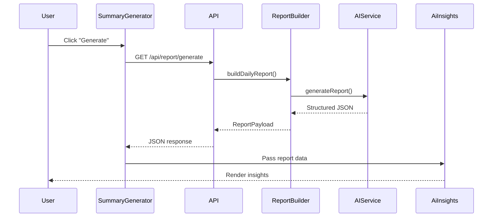
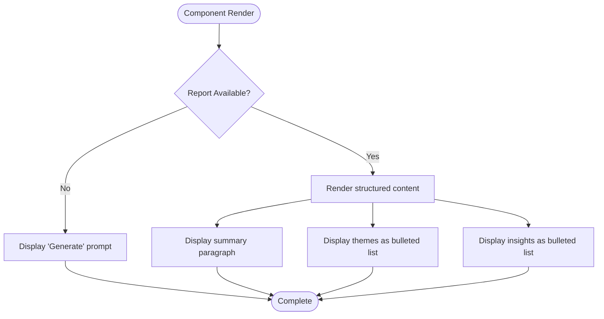

# AI Insights

<cite>
**Referenced Files in This Document**   
- [ai-insights.tsx](file://components/ai-insights.tsx)
- [types.ts](file://lib/types.ts)
- [summary-generator.tsx](file://components/summary-generator.tsx)
- [page.tsx](file://app/page.tsx)
- [route.ts](file://app/api/report/[kind]/route.ts)
- [report.ts](file://lib/report.ts)
- [ai.ts](file://lib/ai.ts)
- [reportSchemas.ts](file://lib/reportSchemas.ts)
</cite>

## Table of Contents
1. [Introduction](#introduction)
2. [Core Components](#core-components)
3. [Data Flow and Integration](#data-flow-and-integration)
4. [Conditional Rendering States](#conditional-rendering-states)
5. [Output Format and Styling](#output-format-and-styling)
6. [Accessibility and Internationalization](#accessibility-and-internationalization)
7. [Conclusion](#conclusion)

## Introduction
The AiInsights component serves as the primary display interface for AI-generated analysis of Telegram community activity. It renders structured insights derived from chat data, including daily summaries, key discussion themes, and behavioral observations. The component is designed to present information in a clear, user-friendly format while supporting multiple rendering states based on data availability. It integrates with backend AI services through API endpoints and works in conjunction with the SummaryGenerator component to provide a complete insight generation and display workflow.

## Core Components

The AiInsights component is a React functional component that accepts optional report data and renders AI-generated insights about Telegram community activity. It is defined in the `ai-insights.tsx` file and uses the `ReportPayload` type from `lib/types.ts` to define its data structure.

The component's interface, `AiInsightsProps`, specifies an optional `report` property of type `ReportPayload | null`. This type includes essential fields such as `summary` (a string containing the main analysis), `themes` (an array of key discussion topics), and `insights` (an array of behavioral observations). The component conditionally renders different UI states based on whether report data is available.

**Section sources**
- [ai-insights.tsx](file://components/ai-insights.tsx#L2-L40)
- [types.ts](file://lib/types.ts#L28-L35)

## Data Flow and Integration

The AiInsights component integrates with the application's AI reporting system through a well-defined data flow. When no report is available, it displays a prompt encouraging users to generate insights. Once data is available, it renders the structured content.

The data flow begins with the SummaryGenerator component, which makes API calls to `/api/report/generate` to request AI-generated reports. This endpoint triggers the `buildDailyReport` function in `lib/report.ts`, which collects chat metrics and messages, then processes them through the AI service using `generateReport` from `lib/ai.ts`. The AI service analyzes the data according to predefined schemas in `lib/reportSchemas.ts` and returns structured JSON responses.

The generated report data flows from the API response through the SummaryGenerator component's state management, and is ultimately passed to the AiInsights component for display. This integration pattern follows a clear separation of concerns, with the SummaryGenerator handling data fetching and state management, while AiInsights focuses solely on presentation.

**Diagram sources**
- [summary-generator.tsx](file://components/summary-generator.tsx#L20-L189)
- [route.ts](file://app/api/report/[kind]/route.ts#L40-L83)
- [report.ts](file://lib/report.ts#L13-L101)
- [ai.ts](file://lib/ai.ts#L33-L165)
- [ai-insights.tsx](file://components/ai-insights.tsx#L6-L40)

## Conditional Rendering States

The AiInsights component implements three distinct rendering states to provide appropriate user feedback at each stage of the insight generation process:

1. **Initial State**: When no report data is available (`report` is null or undefined), the component displays a prompt instructing users to generate insights. This state serves as the entry point for the insight generation workflow.

2. **Loading State**: Although not directly implemented in AiInsights, this state is managed by the parent SummaryGenerator component, which handles the asynchronous API call and displays loading indicators while waiting for the AI service response.

3. **Final State**: When report data is available, the component renders the complete AI analysis with all three content sections: summary, themes, and insights. This state presents the structured information in a formatted layout using bulleted lists.

The conditional rendering is implemented using a simple if-else structure that checks the presence of the report prop, ensuring a seamless user experience as the application transitions between states.

**Section sources**
- [ai-insights.tsx](file://components/ai-insights.tsx#L6-L40)

## Output Format and Styling

The AiInsights component displays AI-generated content in a structured three-section format:

1. **Summary**: A paragraph containing the main analysis of community activity, rendered directly from the `report.summary` field.

2. **Themes**: A bulleted list of key discussion topics, with each theme rendered as a list item. The themes are mapped from the `report.themes` array.

3. **Insights**: A bulleted list of behavioral observations, with each insight rendered as a list item. The insights are mapped from the `report.insights` array.

All content is wrapped in a `content-section` CSS class, which provides consistent styling across different components in the application. The component uses semantic HTML elements (h2, h3, p, ul, li) to ensure proper document structure and accessibility. List items include unique keys based on index to satisfy React's rendering requirements.

**Diagram sources**
- [ai-insights.tsx](file://components/ai-insights.tsx#L6-L40)

## Accessibility and Internationalization

The AiInsights component demonstrates consideration for accessibility through its use of semantic HTML elements and proper document structure. The hierarchical heading levels (h2 for the main title, h3 for section headings) create a logical content outline that assistive technologies can navigate effectively.

However, the component currently has limitations in internationalization support. The text content, including the prompt message "Нажмите «Генерировать» ниже, чтобы получить AI-анализ активности," is hardcoded in Russian, which may limit usability for non-Russian speakers. A more robust internationalization approach would involve using a translation system to support multiple languages.

The component's design follows accessibility best practices by using native HTML elements for interactive content and ensuring proper text hierarchy. The bulleted lists provide clear visual grouping of related items, and the consistent use of the `content-section` class ensures uniform styling that supports readability.

**Section sources**
- [ai-insights.tsx](file://components/ai-insights.tsx#L6-L40)

## Conclusion

The AiInsights component serves as a critical interface for presenting AI-generated analysis of Telegram community activity. It effectively displays structured insights in a user-friendly format, with clear separation between summary, themes, and behavioral observations. The component's conditional rendering logic provides appropriate feedback at each stage of the insight generation process, from initial prompt to final display.

Through its integration with the SummaryGenerator component and backend AI services, AiInsights participates in a comprehensive data flow that transforms raw chat data into meaningful insights. While the component effectively fulfills its primary purpose, opportunities exist to enhance its internationalization capabilities by implementing a proper translation system to support multiple languages beyond the current Russian-only interface.