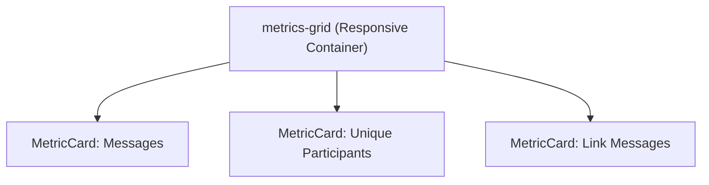
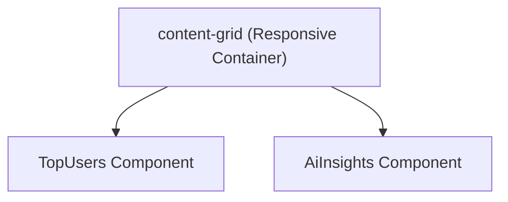
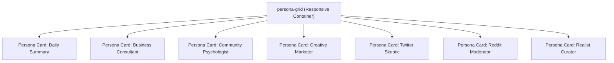

# Component Hierarchy

<cite>
**Referenced Files in This Document**   
- [metric-card.tsx](file://components/metric-card.tsx)
- [top-users.tsx](file://components/top-users.tsx)
- [ai-insights.tsx](file://components/ai-insights.tsx)
- [forum-topics.tsx](file://components/forum-topics.tsx)
- [multi-style-summary-generator.tsx](file://components/multi-style-summary-generator.tsx)
- [page.tsx](file://app/page.tsx)
- [week/page.tsx](file://app/week/page.tsx)
- [types.ts](file://lib/types.ts)
- [globals.css](file://app/globals.css)
</cite>

## Table of Contents
1. [Introduction](#introduction)
2. [Core UI Components](#core-ui-components)
3. [Layout Composition](#layout-composition)
4. [Data Flow and Integration](#data-flow-and-integration)
5. [Responsive Design and Styling](#responsive-design-and-styling)
6. [Component Extension Guidelines](#component-extension-guidelines)
7. [Accessibility and Interactivity](#accessibility-and-interactivity)

## Introduction
This document details the UI component hierarchy of the tg-ai-vibecoders-summary dashboard, focusing on the structure, integration, and design patterns used throughout the application. The dashboard presents analytics and AI-generated insights for community engagement, with components organized into reusable primitives and composite layouts. The system follows a modular architecture where atomic components are combined into higher-level layouts, enabling consistent presentation and maintainable code structure.

## Core UI Components

### MetricCard
The MetricCard component serves as a reusable data display primitive for showing key performance indicators. It accepts a label, numeric value, and optional accent text, rendering them in a standardized format with localized number formatting (ru-RU). The component is designed for consistent presentation of quantitative metrics across the dashboard.

**Section sources**
- [metric-card.tsx](file://components/metric-card.tsx#L0-L15)
- [types.ts](file://lib/types.ts#L0-L4)

### TopUsers
The TopUsers component visualizes participant engagement by displaying a ranked list of top contributors. It receives an array of user objects containing display names and message counts, rendering them in descending order with proper localization. The component handles empty states gracefully by displaying a message when insufficient data is available.

**Section sources**
- [top-users.tsx](file://components/top-users.tsx#L0-L29)
- [types.ts](file://lib/types.ts#L0-L4)

### AiInsights
The AiInsights component renders AI-generated content including summaries, daily themes, and analytical insights. It conditionally displays a call-to-action when no report data is available, encouraging users to generate insights. The component follows a structured layout with clear typographic hierarchy, presenting AI output in an organized and readable format.

**Section sources**
- [ai-insights.tsx](file://components/ai-insights.tsx#L0-L41)
- [types.ts](file://lib/types.ts#L28-L35)

### ForumTopics
The ForumTopics component provides navigation for thread-based discussions, allowing users to filter content by specific topics or view all conversations. As a client component, it manages its own state for loading, error handling, and topic selection. The component fetches available topics from an API endpoint and renders them as interactive buttons, with visual feedback for the currently selected thread.

**Section sources**
- [forum-topics.tsx](file://components/forum-topics.tsx#L0-L101)
- [types.ts](file://lib/types.ts#L11-L16)

### MultiStyleSummaryGenerator
The MultiStyleSummaryGenerator serves as the primary interaction point for report generation, enabling users to create multiple AI-generated summaries with different personas. It manages complex state including loading indicators, error messages, and success notifications for each persona. The component supports both individual and bulk report generation, with integrated functionality for previewing and sending reports to Telegram.

**Section sources**
- [multi-style-summary-generator.tsx](file://components/multi-style-summary-generator.tsx#L29-L1178)

## Layout Composition

### Metrics Grid
The metrics-grid layout organizes MetricCard components in a responsive grid pattern. On smaller screens, metrics display in a single column, while larger viewports arrange them in multiple columns (up to three on standard desktops and more on ultra-wide displays). This adaptive layout ensures optimal use of available screen space while maintaining readability.

**Diagram sources**
- [globals.css](file://app/globals.css#L100-L138)
- [page.tsx](file://app/page.tsx#L30-L33)

### Content Grid
The content-grid layout groups related content sections, typically pairing TopUsers with AiInsights. This layout follows a similar responsive pattern to the metrics grid but with different breakpoints, optimizing the arrangement of content-heavy components. The grid adapts from single-column on mobile to multi-column on larger screens, ensuring balanced visual weight across the dashboard.

**Diagram sources**
- [globals.css](file://app/globals.css#L140-L178)
- [page.tsx](file://app/page.tsx#L35-L38)

### Persona Grid
The persona-grid layout organizes the MultiStyleSummaryGenerator's output, displaying multiple AI persona reports in a responsive grid. The layout adjusts from single-column on mobile devices to multi-column arrangements on desktops, with specific breakpoints optimized for the card-based design. Each persona card maintains consistent styling while allowing for persona-specific color accents.

**Diagram sources**
- [globals.css](file://app/globals.css#L300-L337)
- [multi-style-summary-generator.tsx](file://components/multi-style-summary-generator.tsx#L663-L1178)

## Data Flow and Integration

### Server to Client Data Flow
The dashboard pages (page.tsx and week/page.tsx) act as server components that fetch initial data and pass it to client components. The fetchOverview function retrieves metrics data which is then distributed to MetricCard and TopUsers components through props. This pattern separates data fetching from presentation, allowing for efficient server-side rendering while maintaining interactive client-side functionality.

**Section sources**
- [page.tsx](file://app/page.tsx#L20-L25)
- [week/page.tsx](file://app/week/page.tsx#L20-L25)

### Client Component State Management
Client components maintain encapsulated state using React's useState and useEffect hooks. The ForumTopics component manages loading, error, and topics state, while MultiStyleSummaryGenerator maintains complex state for multiple reports including loading status, error messages, and generated content. This localized state management prevents unnecessary re-renders and keeps component logic cohesive.

**Section sources**
- [forum-topics.tsx](file://components/forum-topics.tsx#L12-L15)
- [multi-style-summary-generator.tsx](file://components/multi-style-summary-generator.tsx#L663-L665)

### API Integration Pattern
Components integrate with backend APIs through fetch calls with URLSearchParams for query parameters. The MultiStyleSummaryGenerator uses a sophisticated pattern with cache busting (via timestamp parameter) and comprehensive error handling. The component constructs API URLs dynamically based on current context (chatId, threadId, date, persona) and handles responses with appropriate state updates.

**Section sources**
- [multi-style-summary-generator.tsx](file://components/multi-style-summary-generator.tsx#L678-L688)
- [forum-topics.tsx](file://components/forum-topics.tsx#L24-L35)

## Responsive Design and Styling

### CSS Class Organization
The styling system uses a BEM-inspired methodology with descriptive class names that indicate both component identity and layout role. Classes like "metric-card", "content-section", and "forum-topics" provide semantic meaning while layout classes like "metrics-grid" and "content-grid" define structural behavior. This separation of concerns allows for consistent styling across components while enabling targeted layout adjustments.

**Section sources**
- [globals.css](file://app/globals.css#L0-L337)

### Responsive Breakpoints
The application implements a mobile-first responsive design with breakpoints at 768px, 1024px, 1280px, 1920px, and 2560px. Each layout component (metrics-grid, content-grid, persona-grid) has tailored grid configurations for these breakpoints, ensuring optimal presentation across device sizes. The responsive strategy prioritizes readability on smaller screens while maximizing information density on larger displays.

**Section sources**
- [globals.css](file://app/globals.css#L100-L138)
- [globals.css](file://app/globals.css#L140-L178)
- [globals.css](file://app/globals.css#L300-L337)

## Component Extension Guidelines

### Creating New Components
New components should follow the established patterns of atomic design, starting with simple, reusable primitives. Components should accept typed props with clear interfaces and maintain encapsulated state when needed. All new components should be placed in the components directory and imported using the @/components path alias.

### Extending Existing Components
When extending components, prefer composition over modification of existing logic. For example, new metric types should use the existing MetricCard rather than creating variations. If new functionality is required, consider adding optional props with default values to maintain backward compatibility.

### Style Consistency
New styles should adhere to the existing CSS architecture, using the same class naming conventions and responsive approach. Custom inline styles should be minimized in favor of CSS classes, except for dynamic styling based on component state or props. Color usage should follow the established palette, with persona-specific colors defined in the PERSONAS constant.

**Section sources**
- [multi-style-summary-generator.tsx](file://components/multi-style-summary-generator.tsx#L29-L72)

## Accessibility and Interactivity

### Interactive Behaviors
Client components implement interactive behaviors through event handlers and state transitions. The ForumTopics component uses onClick handlers for topic navigation, while MultiStyleSummaryGenerator implements complex interactions including report generation, Telegram preview, and modal dialogs. All interactive elements provide visual feedback through hover states, loading indicators, and success/error messages.

**Section sources**
- [forum-topics.tsx](file://components/forum-topics.tsx#L55-L62)
- [multi-style-summary-generator.tsx](file://components/multi-style-summary-generator.tsx#L663-L1178)

### Accessibility Attributes
The components implement basic accessibility features including semantic HTML elements (buttons, headings, lists) and keyboard navigation support. Interactive elements have appropriate ARIA roles and states, with error messages presented in a way that can be detected by screen readers. The application uses sufficient color contrast and provides text alternatives for visual information.

**Section sources**
- [forum-topics.tsx](file://components/forum-topics.tsx#L75-L95)
- [multi-style-summary-generator.tsx](file://components/multi-style-summary-generator.tsx#L663-L1178)