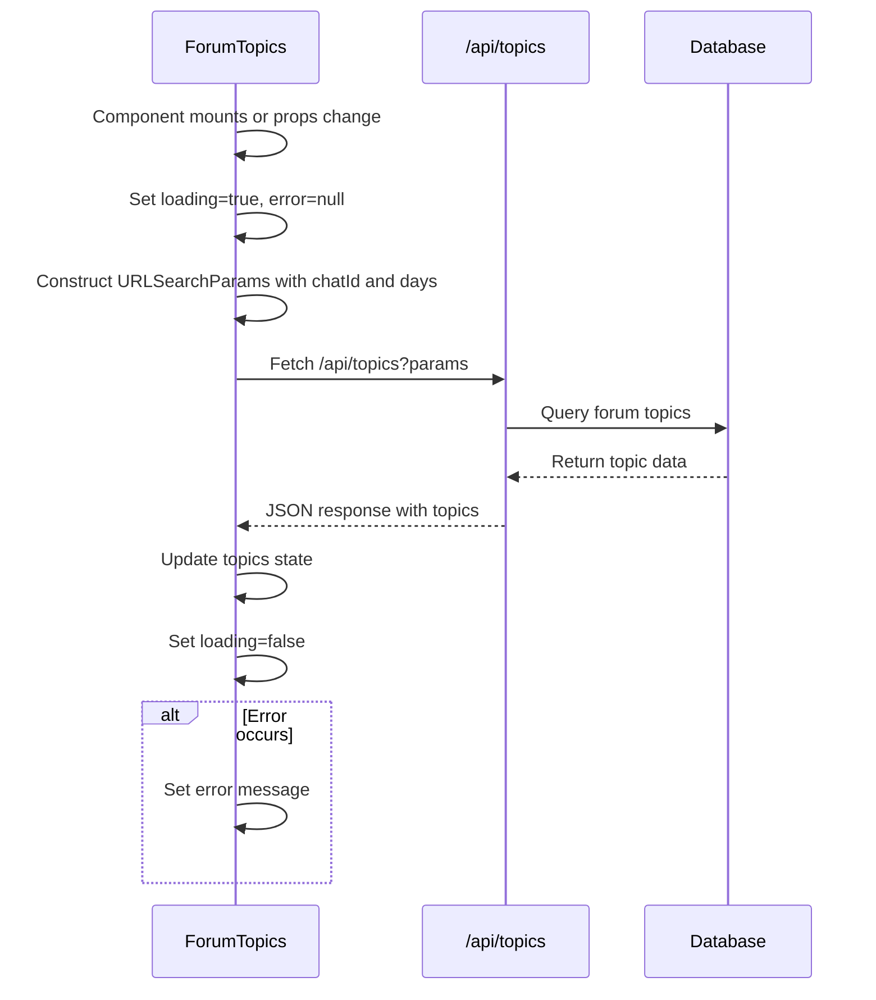
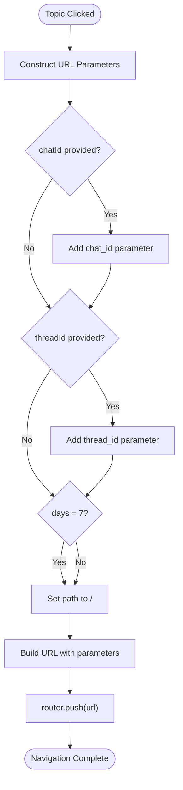

# Forum Topics

<cite>
**Referenced Files in This Document**   
- [forum-topics.tsx](file://components/forum-topics.tsx)
- [route.ts](file://app/api/topics/route.ts)
- [types.ts](file://lib/types.ts)
- [queries.ts](file://lib/queries.ts)
- [page.tsx](file://app/page.tsx)
- [page.tsx](file://app/week/page.tsx)
</cite>

## Table of Contents
1. [Introduction](#introduction)
2. [Core Components](#core-components)
3. [Architecture Overview](#architecture-overview)
4. [Detailed Component Analysis](#detailed-component-analysis)
5. [Integration Examples](#integration-examples)
6. [Error Handling and States](#error-handling-and-states)
7. [Conclusion](#conclusion)

## Introduction
The ForumTopics component serves as a client-side interactive navigation element for filtering dashboard content by specific conversation threads in Telegram groups. It enables users to switch between different discussion threads within a forum-style Telegram group, providing a way to focus analysis and summaries on specific topics of conversation. The component dynamically generates navigation buttons for each active discussion thread and manages the application state through URL parameters, allowing for bookmarkable and shareable views of specific thread analyses.

**Section sources**
- [forum-topics.tsx](file://components/forum-topics.tsx#L1-L102)

## Core Components
The ForumTopics component is a React client component that manages the display and interaction with forum discussion threads. It accepts optional parameters to filter topics by chat ID, current thread ID, and time window (1 or 7 days). The component handles data fetching from the API endpoint, manages loading and error states, and implements navigation through URL parameter updates. It works in conjunction with the backend API route and database query functions to provide a complete solution for thread-based navigation in the analytics dashboard.

**Section sources**
- [forum-topics.tsx](file://components/forum-topics.tsx#L1-L102)
- [types.ts](file://lib/types.ts#L15-L21)

## Architecture Overview

```mermaid
graph TB
subgraph "Client-Side"
ForumTopics[ForumTopics Component]
Router[Next.js Router]
end
subgraph "Server-Side"
API[/api/topics Route]
DB[Database]
end
ForumTopics --> |Fetch topics| API
API --> |Query| DB
DB --> |Return data| API
API --> |JSON response| ForumTopics
ForumTopics --> |Update URL| Router
Router --> |Navigate| ForumTopics
style ForumTopics fill:#f9f,stroke:#333
style API fill:#bbf,stroke:#333
style DB fill:#f96,stroke:#333
```

**Diagram sources**
- [forum-topics.tsx](file://components/forum-topics.tsx#L12-L101)
- [route.ts](file://app/api/topics/route.ts#L1-L21)

## Detailed Component Analysis

### ForumTopics Component Analysis

#### Component Interface and Props
The ForumTopics component is defined with the ForumTopicsProps interface, which specifies three optional parameters: chatId (string), currentThreadId (string), and days (1 or 7). The days parameter defaults to 1 if not specified. These props allow the component to be flexible and reusable across different contexts within the application, enabling filtering by specific chat, highlighting the currently active thread, and selecting the time window for topic analysis.

**Section sources**
- [forum-topics.tsx](file://components/forum-topics.tsx#L6-L10)
- [types.ts](file://lib/types.ts#L15-L21)

#### Data Fetching and State Management
The component utilizes React hooks (useState and useEffect) to manage its internal state and lifecycle. On component mount and whenever the chatId or days parameters change, it triggers a data loading process. The useEffect hook contains an asynchronous loadTopics function that constructs API request parameters using URLSearchParams, makes a fetch request to the /api/topics endpoint, and processes the response. The component maintains three state variables: topics (array of ForumTopic objects), loading (boolean), and error (string or null), which are used to control the UI rendering based on the current state of the data fetching process.



**Diagram sources**
- [forum-topics.tsx](file://components/forum-topics.tsx#L28-L77)
- [route.ts](file://app/api/topics/route.ts#L1-L21)

#### Backend API Implementation
The /api/topics route handles GET requests to retrieve forum topics based on the provided parameters. It extracts the chat_id and days parameters from the request URL, with days defaulting to 1 if not specified or not equal to "7". The route calls the fetchForumTopics function from the queries module with these parameters and returns the results as a JSON response. In case of an error, it returns an error response with status 500. This API endpoint serves as the bridge between the client-side component and the database, abstracting the data access logic and providing a clean interface for the frontend.

**Section sources**
- [route.ts](file://app/api/topics/route.ts#L1-L21)
- [queries.ts](file://lib/queries.ts#L238-L296)

#### Database Query Logic
The fetchForumTopics function in the queries module implements the database logic for retrieving forum topics. It constructs a SQL query that selects message_thread_id, counts messages, finds the last message timestamp, and retrieves the topic name (from the first message in each thread). The query filters messages based on the time window (1 or 7 days) and optionally by chat_id if provided. It groups results by message_thread_id and chat_id, orders them by message count in descending order, and limits to 50 results. The function maps the database rows to ForumTopic objects, providing a clean interface between the raw database results and the application logic.

**Section sources**
- [queries.ts](file://lib/queries.ts#L238-L296)
- [types.ts](file://lib/types.ts#L15-L21)

#### Navigation and URL Management
The component implements navigation through the handleTopicClick function, which is called when a user clicks on a topic button. This function constructs URL parameters based on the selected thread and the current days parameter, then uses the Next.js router to navigate to the appropriate page. For a 7-day view, it navigates to the /week page, while for a 1-day view, it navigates to the root page. The function preserves the chatId parameter if present and adds or updates the thread_id parameter based on the selected topic. This URL-based state management allows users to bookmark or share links to specific thread views.



**Diagram sources**
- [forum-topics.tsx](file://components/forum-topics.tsx#L79-L92)

## Integration Examples
The ForumTopics component is integrated into the main dashboard pages for both 24-hour and weekly views. In the root page (page.tsx), it is used with days=1 to show topics from the last 24 hours, while in the week page (week/page.tsx), it is used with days=7 to show topics from the last week. Both pages extract chat_id and thread_id parameters from the URL search parameters and pass them to the ForumTopics component, which in turn uses these to filter the displayed topics and maintain the current selection state. This consistent integration pattern allows for a unified user experience across different time views of the analytics dashboard.

**Section sources**
- [page.tsx](file://app/page.tsx#L23-L24)
- [page.tsx](file://app/week/page.tsx#L23-L24)

## Error Handling and States
The component implements comprehensive error handling and state management to provide a robust user experience. It displays a loading indicator ("Загрузка тем...") while fetching data from the API. If an error occurs during the fetch process, it displays an error message in red ("Не удалось загрузить темы"). The component also handles the case where no topics are found by returning null, effectively hiding the component when there are no discussion threads to display. The error handling in the backend API and database query functions provides additional resilience, with specific handling for cases where the message_thread_id column might be missing from the database.

**Section sources**
- [forum-topics.tsx](file://components/forum-topics.tsx#L8-L10)
- [forum-topics.tsx](file://components/forum-topics.tsx#L48-L55)
- [forum-topics.tsx](file://components/forum-topics.tsx#L57-L62)
- [route.ts](file://app/api/topics/route.ts#L15-L21)
- [queries.ts](file://lib/queries.ts#L275-L288)

## Conclusion
The ForumTopics component provides a complete solution for navigating between discussion threads in Telegram groups within the analytics dashboard. By combining client-side React components with server-side API routes and database queries, it enables users to filter content by specific conversation threads and time windows. The component's design emphasizes usability through intuitive navigation buttons, robust state management with loading and error states, and persistent state through URL parameters. Its integration with the main dashboard pages demonstrates a consistent pattern for providing time-based and thread-based filtering across the application, enhancing the user's ability to analyze specific aspects of group conversations.

**Section sources**
- [forum-topics.tsx](file://components/forum-topics.tsx#L1-L102)
- [route.ts](file://app/api/topics/route.ts#L1-L21)
- [queries.ts](file://lib/queries.ts#L238-L296)