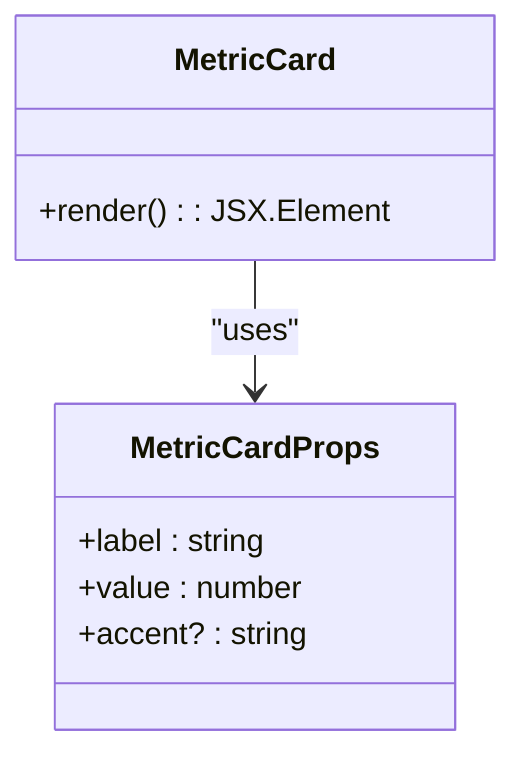
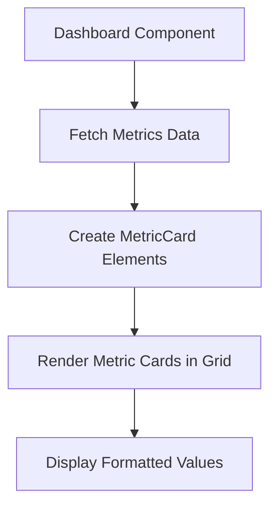
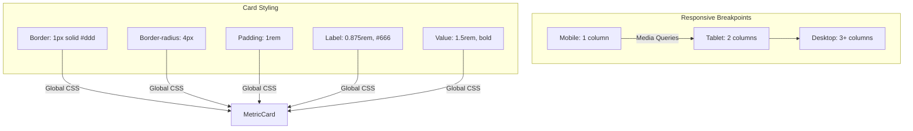

# Metric Card

<cite>
**Referenced Files in This Document**  
- [metric-card.tsx](file://components/metric-card.tsx)
- [page.tsx](file://app/page.tsx)
- [week/page.tsx](file://app/week/page.tsx)
- [globals.css](file://app/globals.css)
- [format.ts](file://lib/format.ts)
</cite>

## Table of Contents
1. [Introduction](#introduction)
2. [Core Components](#core-components)
3. [Usage Examples](#usage-examples)
4. [Styling and Layout](#styling-and-layout)
5. [Data Formatting](#data-formatting)
6. [Accessibility and Responsiveness](#accessibility-and-responsiveness)
7. [Design System Integration](#design-system-integration)

## Introduction

The MetricCard component serves as a fundamental data visualization primitive within the tg-ai-vibecoders-summary dashboard application. Designed as a reusable UI element, it provides a consistent and accessible way to display key performance indicators and numerical metrics throughout the dashboard interface. The component follows atomic design principles, enabling consistent presentation of quantitative data across different views and time periods.

**Section sources**
- [metric-card.tsx](file://components/metric-card.tsx#L0-L14)

## Core Components

The MetricCard component is implemented as a functional React component with a clearly defined props interface. It accepts three primary properties: `label` (required string), `value` (required number), and `accent` (optional string). The component renders these values in a structured layout with appropriate semantic HTML elements, ensuring both visual clarity and accessibility.

The implementation leverages utility classes for styling, maintaining separation between presentation and logic. The component's structure uses a container div with the class "metric-card", containing an h3 element for the label, a p element for the formatted value, and an optional small element for accent text when provided.

**Diagram sources**  
- [metric-card.tsx](file://components/metric-card.tsx#L0-L4)
- [metric-card.tsx](file://components/metric-card.tsx#L6-L14)

**Section sources**
- [metric-card.tsx](file://components/metric-card.tsx#L0-L14)

## Usage Examples

The MetricCard component is utilized across multiple dashboard views to display key metrics such as message counts, user engagement, and content statistics. It is prominently featured in both the daily and weekly dashboard pages, where it presents aggregated data in a grid layout.

In the main dashboard (page.tsx), the component is used to display three core metrics: total messages, unique participants, and messages containing links. The same pattern is replicated in the weekly dashboard view (week/page.tsx), demonstrating the component's reusability across different time periods and data sets.

The component's implementation shows consistent usage patterns, with the label prop providing descriptive text in Russian and the value prop receiving numerical data from the application's data fetching layer.

**Diagram sources**  
- [page.tsx](file://app/page.tsx#L28-L31)
- [week/page.tsx](file://app/week/page.tsx#L28-L31)

**Section sources**
- [page.tsx](file://app/page.tsx#L28-L31)
- [week/page.tsx](file://app/week/page.tsx#L28-L31)

## Styling and Layout

The MetricCard component's visual presentation is defined through CSS utility classes in the application's global stylesheet. The component features a clean, card-based design with a light border, rounded corners, and consistent padding. Typography is carefully scaled, with the label displayed in a smaller, muted font and the value presented in a larger, bold typeface to emphasize its importance.

The component is designed to function within a responsive grid layout (metrics-grid), which adapts to different screen sizes. On mobile devices, metrics are displayed in a single column, while larger screens progressively show two, three, or more metrics per row based on available space. This responsive behavior ensures optimal use of screen real estate across device sizes.

**Diagram sources**  
- [globals.css](file://app/globals.css#L94-L182)

**Section sources**
- [globals.css](file://app/globals.css#L94-L182)

## Data Formatting

The MetricCard component incorporates localization-aware number formatting through JavaScript's toLocaleString method. All numeric values are formatted using the "ru-RU" locale, which applies Russian formatting conventions including appropriate digit grouping and decimal separators. This ensures that large numbers are easily readable and conform to regional expectations.

The formatting is applied directly within the component's render function, guaranteeing consistent presentation regardless of the source data. This approach centralizes formatting logic and prevents inconsistencies that might arise from formatting numbers at different points in the data flow.

The component's design allows for future extension of formatting options, such as specifying different locales or number formats through additional props, while maintaining backward compatibility with existing implementations.

**Section sources**
- [metric-card.tsx](file://components/metric-card.tsx#L9)
- [format.ts](file://lib/format.ts#L3-L10)

## Accessibility and Responsiveness

The MetricCard component adheres to accessibility best practices through the use of semantic HTML elements. The label is rendered as an h3 element, providing proper document structure and navigation for assistive technologies. The value is presented in a paragraph element, while optional accent text uses the small element, preserving the appropriate semantic meaning of each component.

The component's responsive design ensures usability across a wide range of devices and screen sizes. The metrics grid automatically adjusts the number of columns based on viewport width, preventing horizontal scrolling on smaller devices and maximizing space utilization on larger displays. Touch targets are appropriately sized for mobile interaction, and the layout maintains adequate spacing between elements to prevent accidental taps.

The visual hierarchy established by font sizes and weights guides users' attention to the most important information (the metric value) while still providing context through the label and accent text.

**Section sources**
- [metric-card.tsx](file://components/metric-card.tsx#L8-L10)
- [globals.css](file://app/globals.css#L94-L182)

## Design System Integration

The MetricCard component exemplifies the application's design system principles by serving as an atomic, reusable UI primitive. Its implementation follows a consistent pattern of props-based configuration, separation of concerns, and utility-first styling. This approach enables rapid development of new dashboard views while maintaining visual and behavioral consistency.

The component's simplicity and focused scope make it highly extensible for future requirements. New use cases can be accommodated by adding optional props or composition with other components, rather than creating entirely new metric display components. This promotes code reuse and reduces maintenance overhead.

As a foundational element of the dashboard's information architecture, the MetricCard establishes a predictable pattern for data presentation that users can quickly understand and interpret across different contexts within the application.

**Section sources**
- [metric-card.tsx](file://components/metric-card.tsx#L0-L14)
- [page.tsx](file://app/page.tsx#L28-L31)