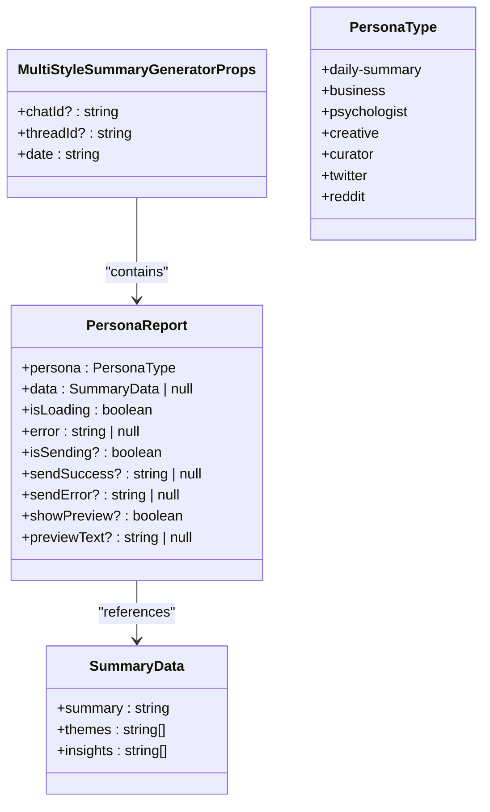
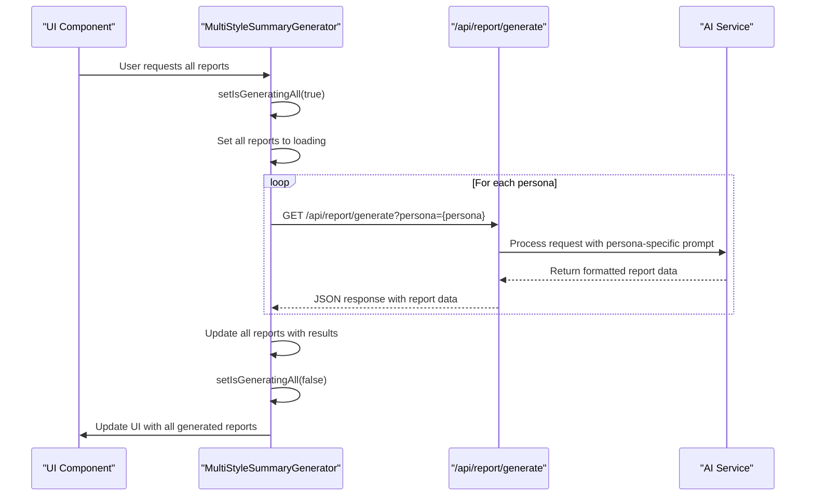
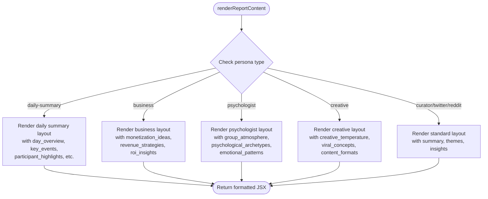
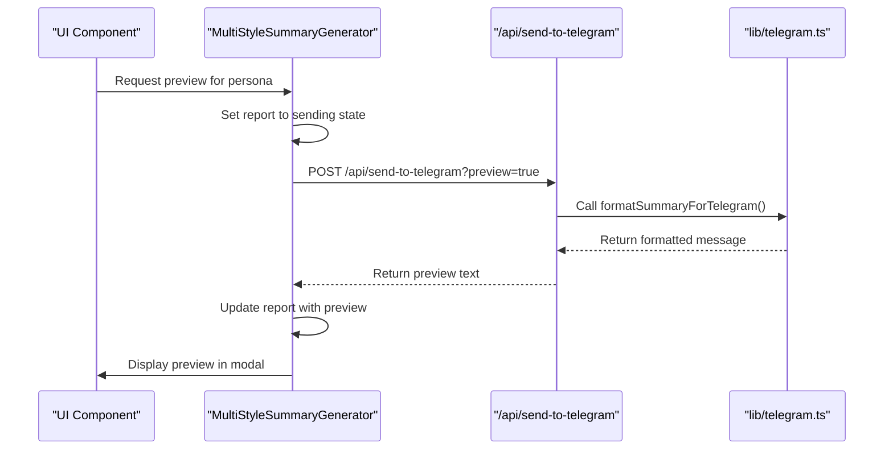
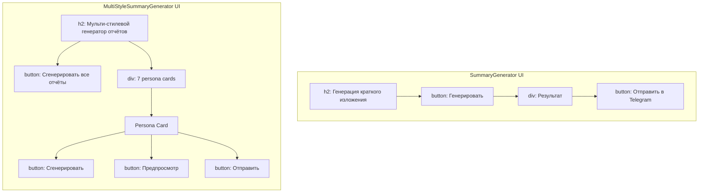

# Multi-Style Summary Generator

<cite>
**Referenced Files in This Document**   
- [multi-style-summary-generator.tsx](file://components/multi-style-summary-generator.tsx)
- [ai.ts](file://lib/ai.ts)
- [reportSchemas.ts](file://lib/reportSchemas.ts)
- [route.ts](file://app/api/report/[kind]/route.ts)
- [send-to-telegram/route.ts](file://app/api/send-to-telegram/route.ts)
- [types.ts](file://lib/types.ts)
- [summary-generator.tsx](file://components/summary-generator.tsx)
</cite>

## Table of Contents
1. [Introduction](#introduction)
2. [Core Components](#core-components)
3. [Architecture Overview](#architecture-overview)
4. [Detailed Component Analysis](#detailed-component-analysis)
5. [Dependency Analysis](#dependency-analysis)
6. [Performance Considerations](#performance-considerations)
7. [Troubleshooting Guide](#troubleshooting-guide)
8. [Conclusion](#conclusion)

## Introduction
The MultiStyleSummaryGenerator component provides advanced AI-powered analysis of Telegram community dynamics through seven distinct expert personas. Unlike the basic SummaryGenerator, this component enables multi-perspective analysis by generating specialized reports from different expert viewpoints, offering comprehensive insights into community behavior, business opportunities, psychological patterns, and creative potential. The component orchestrates complex interactions between frontend UI, AI service layer, and Telegram integration to deliver rich, actionable reports.

## Core Components
The MultiStyleSummaryGenerator is a React component that enables multi-perspective AI analysis of Telegram community dynamics. It extends the functionality of the basic SummaryGenerator by supporting seven distinct expert personas, each providing unique insights into community behavior. The component manages state through a reports array that tracks individual report status for each persona, including data, loading state, and errors. It integrates with the AI service layer in lib/ai.ts and specialized response schemas in lib/reportSchemas.ts to generate and format reports according to specific persona requirements.

**Section sources**
- [multi-style-summary-generator.tsx](file://components/multi-style-summary-generator.tsx#L23-L27)
- [ai.ts](file://lib/ai.ts#L113-L115)
- [reportSchemas.ts](file://lib/reportSchemas.ts#L1-L112)

## Architecture Overview
The MultiStyleSummaryGenerator operates within a client-server architecture that integrates AI analysis with Telegram community data. The component serves as the frontend interface for generating multi-perspective reports, while backend API routes handle report generation and Telegram integration. The architecture follows a layered pattern with clear separation between presentation, business logic, and data access layers.

```mermaid
graph TB
subgraph "Frontend"
MSG[MultiStyleSummaryGenerator]
SG[SummaryGenerator]
end
subgraph "Backend API"
RG[/api/report/generate]
ST[/api/send-to-telegram]
end
subgraph "AI Service Layer"
AI[lib/ai.ts]
RS[lib/reportSchemas.ts]
end
subgraph "Data Layer"
DB[(Database)]
TL[lib/telegram.ts]
end
MSG --> RG
MSG --> ST
SG --> RG
SG --> ST
RG --> AI
ST --> AI
AI --> RS
AI --> DB
ST --> TL
TL --> Telegram[Telegram API]
```

**Diagram sources **
- [multi-style-summary-generator.tsx](file://components/multi-style-summary-generator.tsx)
- [route.ts](file://app/api/report/[kind]/route.ts)
- [send-to-telegram/route.ts](file://app/api/send-to-telegram/route.ts)
- [ai.ts](file://lib/ai.ts)
- [telegram.ts](file://lib/telegram.ts)

## Detailed Component Analysis

### MultiStyleSummaryGenerator Analysis
The MultiStyleSummaryGenerator component enables comprehensive analysis of Telegram communities through seven distinct expert personas, providing multi-perspective insights that go beyond the basic functionality of the SummaryGenerator component.

#### Component Interface and State Management
The component is defined by the MultiStyleSummaryGeneratorProps interface, which specifies the required parameters for operation. The interface includes optional chatId and threadId parameters for targeting specific Telegram conversations, and a required date parameter that determines the timeframe for analysis. The component maintains a sophisticated state management system using a reports array that tracks the status of individual reports for each persona, including data, loading state, and error conditions.



**Diagram sources **
- [multi-style-summary-generator.tsx](file://components/multi-style-summary-generator.tsx#L23-L27)
- [multi-style-summary-generator.tsx](file://components/multi-style-summary-generator.tsx#L14-L21)
- [ai.ts](file://lib/ai.ts#L113-L115)

#### Report Generation Orchestration
The component implements two primary functions for orchestrating report generation: generateSingleReport and generateAllReports. These functions coordinate parallel API calls to the /api/report/generate endpoint with specific persona parameters, enabling efficient multi-perspective analysis. The generateAllReports function leverages Promise.all to execute all report generation requests concurrently, significantly improving performance compared to sequential execution.



**Diagram sources **
- [multi-style-summary-generator.tsx](file://components/multi-style-summary-generator.tsx#L717-L767)
- [multi-style-summary-generator.tsx](file://components/multi-style-summary-generator.tsx#L674-L715)
- [route.ts](file://app/api/report/[kind]/route.ts)

#### Dynamic Content Rendering
The renderReportContent function dynamically formats output based on the persona type and response structure, providing tailored visualizations for each expert perspective. The function implements specialized rendering logic for different personas, with unique layouts and styling for the daily-summary, business, psychologist, and creative personas, while using a standard format for the curator, twitter, and reddit personas.



**Diagram sources **
- [multi-style-summary-generator.tsx](file://components/multi-style-summary-generator.tsx#L75-L661)

#### Telegram Preview Functionality
The showTelegramPreview functionality enables users to preview formatted messages before sending them to Telegram. This feature calls the /api/send-to-telegram endpoint with a preview parameter, allowing users to see how the report will appear in Telegram before committing to send it. The preview includes proper formatting with HTML parsing and message splitting for long reports.



**Diagram sources **
- [multi-style-summary-generator.tsx](file://components/multi-style-summary-generator.tsx#L772-L821)
- [send-to-telegram/route.ts](file://app/api/send-to-telegram/route.ts)
- [telegram.ts](file://lib/telegram.ts#L161-L194)

### Comparison with Basic SummaryGenerator
The MultiStyleSummaryGenerator represents a significant evolution from the basic SummaryGenerator component, offering enhanced functionality and more sophisticated analysis capabilities.

#### Functional Comparison
The basic SummaryGenerator provides a single-perspective analysis with limited functionality, while the MultiStyleSummaryGenerator offers multi-perspective insights through seven distinct expert personas. The advanced component supports parallel report generation, persona-specific formatting, and comprehensive state management for multiple reports simultaneously.

```mermaid
classDiagram
class SummaryGenerator {
+generateSummary()
+sendToTelegram()
+isLoading : boolean
+error : string | null
+generatedSummary : SummaryData | null
}
class MultiStyleSummaryGenerator {
+generateSingleReport()
+generateAllReports()
+showTelegramPreview()
+reports : PersonaReport[]
+isGeneratingAll : boolean
}
SummaryGenerator --> SummaryData
MultiStyleSummaryGenerator --> PersonaReport
MultiStyleSummaryGenerator --> SummaryData
SummaryGenerator -.-> MultiStyleSummaryGenerator : "Extended functionality"
```

**Diagram sources **
- [summary-generator.tsx](file://components/summary-generator.tsx)
- [multi-style-summary-generator.tsx](file://components/multi-style-summary-generator.tsx)

#### User Interface Comparison
The MultiStyleSummaryGenerator features a more complex UI with multiple report cards, persona-specific styling using color coding, and batch operation capabilities. Each persona is represented with a distinct color and icon, allowing users to easily identify different report types. The component supports both individual report generation and batch operations, providing greater flexibility in analysis workflows.



**Diagram sources **
- [summary-generator.tsx](file://components/summary-generator.tsx)
- [multi-style-summary-generator.tsx](file://components/multi-style-summary-generator.tsx)

## Dependency Analysis
The MultiStyleSummaryGenerator component has complex dependencies across multiple layers of the application, integrating with both frontend and backend systems to deliver its advanced functionality.

```mermaid
graph TD
MSG[MultiStyleSummaryGenerator] --> AI[lib/ai.ts]
MSG --> RS[lib/reportSchemas.ts]
MSG --> RG[/api/report/generate]
MSG --> ST[/api/send-to-telegram]
AI --> RS
RG --> AI
ST --> AI
ST --> TL[lib/telegram.ts]
TL --> Telegram[Telegram API]
AI --> DB[(Database)]
style MSG fill:#f9f,stroke:#333
style AI fill:#bbf,stroke:#333
style RS fill:#bbf,stroke:#333
style RG fill:#f96,stroke:#333
style ST fill:#f96,stroke:#333
style TL fill:#bbf,stroke:#333
```

**Diagram sources **
- [multi-style-summary-generator.tsx](file://components/multi-style-summary-generator.tsx)
- [ai.ts](file://lib/ai.ts)
- [reportSchemas.ts](file://lib/reportSchemas.ts)
- [route.ts](file://app/api/report/[kind]/route.ts)
- [send-to-telegram/route.ts](file://app/api/send-to-telegram/route.ts)
- [telegram.ts](file://lib/telegram.ts)

## Performance Considerations
The MultiStyleSummaryGenerator implements several performance optimizations to handle the computational demands of generating multiple AI-powered reports. The generateAllReports function uses Promise.all to execute all report generation requests in parallel, significantly reducing total execution time compared to sequential processing. The component also implements efficient state management by updating all reports in a single state update after all requests complete, minimizing re-renders. The API endpoints leverage caching strategies and efficient data fetching to reduce latency and improve response times.

## Troubleshooting Guide
Common issues with the MultiStyleSummaryGenerator typically relate to API connectivity, AI service configuration, or Telegram integration. Ensure that the OPENROUTER_API_KEY and OPENROUTER_MODEL environment variables are properly configured for AI functionality. Verify that TELEGRAM_BOT_TOKEN, TELEGRAM_CHAT_ID, and TELEGRAM_THREAD_ID are correctly set for Telegram integration. Network connectivity issues may cause timeouts during report generation or sending; implement proper error handling and retry mechanisms. For persona-specific formatting issues, verify that the response schemas in lib/reportSchemas.ts match the expected output structure from the AI service.

**Section sources**
- [ai.ts](file://lib/ai.ts#L15-L25)
- [send-to-telegram/route.ts](file://app/api/send-to-telegram/route.ts)
- [telegram.ts](file://lib/telegram.ts#L405-L473)

## Conclusion
The MultiStyleSummaryGenerator component represents a sophisticated solution for multi-perspective analysis of Telegram community dynamics. By leveraging seven distinct expert personas, the component provides comprehensive insights that go beyond simple summarization, offering valuable perspectives on business opportunities, psychological patterns, creative potential, and community dynamics. The component's architecture demonstrates effective integration between frontend UI, AI service layer, and external APIs, delivering a powerful tool for community analysis and decision-making.