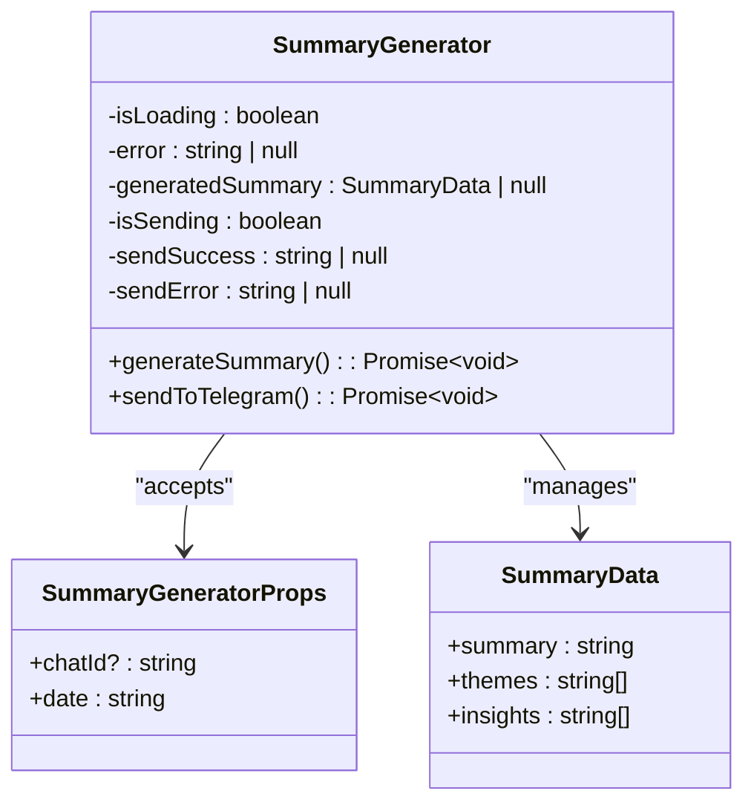
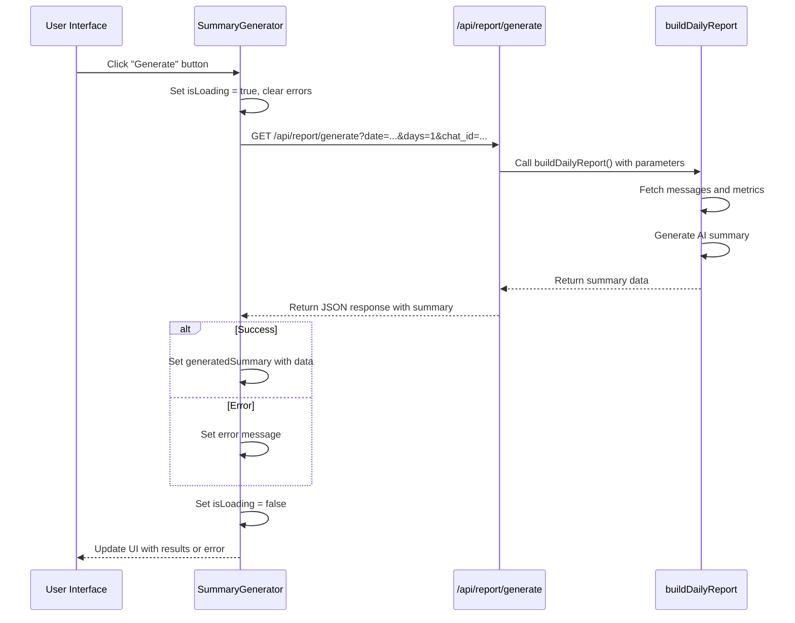
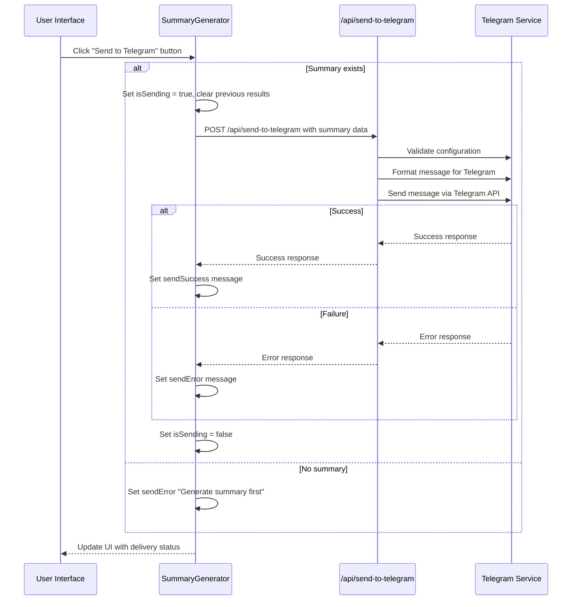
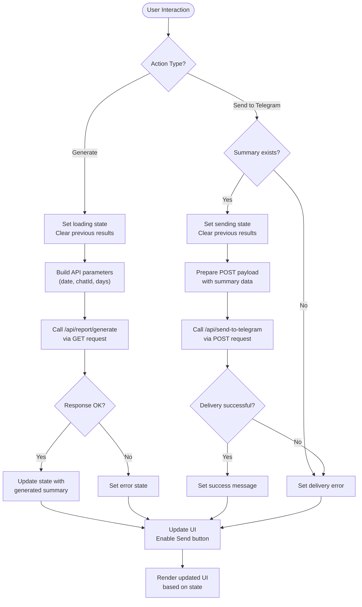
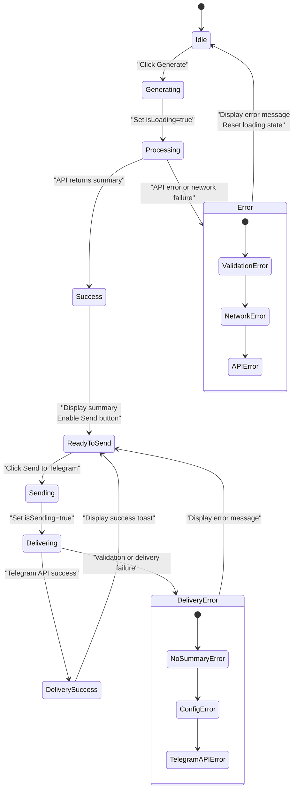

# Summary Generator

<cite>
**Referenced Files in This Document**   
- [summary-generator.tsx](file://components/summary-generator.tsx)
- [types.ts](file://lib/types.ts)
- [report.ts](file://lib/report.ts)
- [telegram.ts](file://lib/telegram.ts)
- [route.ts](file://app/api/report/[kind]/route.ts)
- [route.ts](file://app/api/send-to-telegram/route.ts)
</cite>

## Table of Contents
1. [Introduction](#introduction)
2. [Core Components](#core-components)
3. [Architecture Overview](#architecture-overview)
4. [Detailed Component Analysis](#detailed-component-analysis)
5. [Data Flow and User Interaction](#data-flow-and-user-interaction)
6. [Error Handling and User Feedback](#error-handling-and-user-feedback)
7. [Conclusion](#conclusion)

## Introduction

The SummaryGenerator component serves as the primary interface for creating AI-powered daily summaries of Telegram group activity and delivering them back to the chat. This documentation provides a comprehensive analysis of its functionality, state management, API interactions, and user experience design. The component orchestrates a two-step workflow: generating AI summaries through backend services and sending formatted results to Telegram channels.

**Section sources**
- [summary-generator.tsx](file://components/summary-generator.tsx#L1-L189)

## Core Components

The SummaryGenerator component is built around React's useState hooks for managing various states throughout the summary generation and delivery process. It accepts props defined by the SummaryGeneratorProps interface and interacts with two key backend API endpoints to complete its workflows.

**Section sources**
- [summary-generator.tsx](file://components/summary-generator.tsx#L10-L189)
- [types.ts](file://lib/types.ts#L1-L73)

## Architecture Overview

The SummaryGenerator operates within a client-server architecture where the frontend component triggers API calls to backend services that handle AI report generation and Telegram integration. The component acts as a controller that manages user interactions, state transitions, and communication between the UI and backend services.

```mermaid
graph TB
A[User Interface] --> B[SummaryGenerator Component]
B --> C[/api/report/generate]
B --> D[/api/send-to-telegram]
C --> E[AI Report Generation]
D --> F[Telegram Delivery Service]
E --> G[Formatted Summary Data]
F --> H[Telegram Chat]
G --> B
H --> B
```

**Diagram sources**
- [summary-generator.tsx](file://components/summary-generator.tsx#L1-L189)
- [route.ts](file://app/api/report/[kind]/route.ts#L1-L83)
- [route.ts](file://app/api/send-to-telegram/route.ts#L1-L151)

## Detailed Component Analysis

### SummaryGenerator Component Analysis

The SummaryGenerator component implements a complete workflow for generating AI summaries of Telegram activity and delivering them to specified channels. It manages multiple states to provide feedback throughout the asynchronous operations.

#### Component Interface and State Management

The component is defined with the SummaryGeneratorProps interface which specifies its input parameters:



**Diagram sources**
- [summary-generator.tsx](file://components/summary-generator.tsx#L10-L189)
- [types.ts](file://lib/types.ts#L1-L73)

#### Generate Summary Workflow

The generateSummary function handles the first phase of the workflow by requesting AI-generated content from the backend API. It manages loading states and error conditions while constructing the appropriate query parameters.



**Diagram sources**
- [summary-generator.tsx](file://components/summary-generator.tsx#L45-L85)
- [route.ts](file://app/api/report/[kind]/route.ts#L1-L83)
- [report.ts](file://lib/report.ts#L13-L101)

#### Send to Telegram Workflow

The sendToTelegram function handles the second phase by sending the generated summary to a Telegram chat through the backend service. It validates prerequisites and manages the delivery state.



**Diagram sources**
- [summary-generator.tsx](file://components/summary-generator.tsx#L87-L138)
- [route.ts](file://app/api/send-to-telegram/route.ts#L1-L151)
- [telegram.ts](file://lib/telegram.ts#L161-L194)
- [telegram.ts](file://lib/telegram.ts#L405-L473)

## Data Flow and User Interaction

The SummaryGenerator implements a clear data flow from user interaction to API communication and state updates. The component follows a controlled flow where user actions trigger state changes that are reflected in the UI.



**Diagram sources**
- [summary-generator.tsx](file://components/summary-generator.tsx#L1-L189)

## Error Handling and User Feedback

The SummaryGenerator implements comprehensive error handling strategies to provide clear feedback to users during both summary generation and Telegram delivery processes. The component uses dedicated state variables to manage different types of errors and success conditions.



**Diagram sources**
- [summary-generator.tsx](file://components/summary-generator.tsx#L1-L189)

## Conclusion

The SummaryGenerator component effectively orchestrates the process of creating AI-generated summaries of Telegram activity and delivering them to chat channels. It implements robust state management to handle asynchronous operations, provides clear user feedback through visual indicators and messages, and follows a well-defined workflow for both generation and delivery phases. The component's design separates concerns between UI presentation, state management, and API communication, making it maintainable and extensible. By leveraging backend services for AI processing and Telegram integration, it provides a seamless user experience for generating and sharing insightful summaries of group activity.

**Section sources**
- [summary-generator.tsx](file://components/summary-generator.tsx#L1-L189)