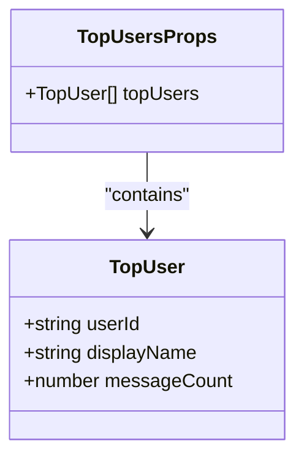
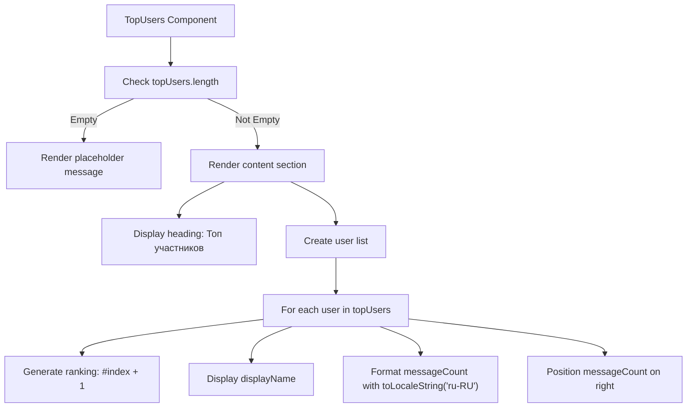
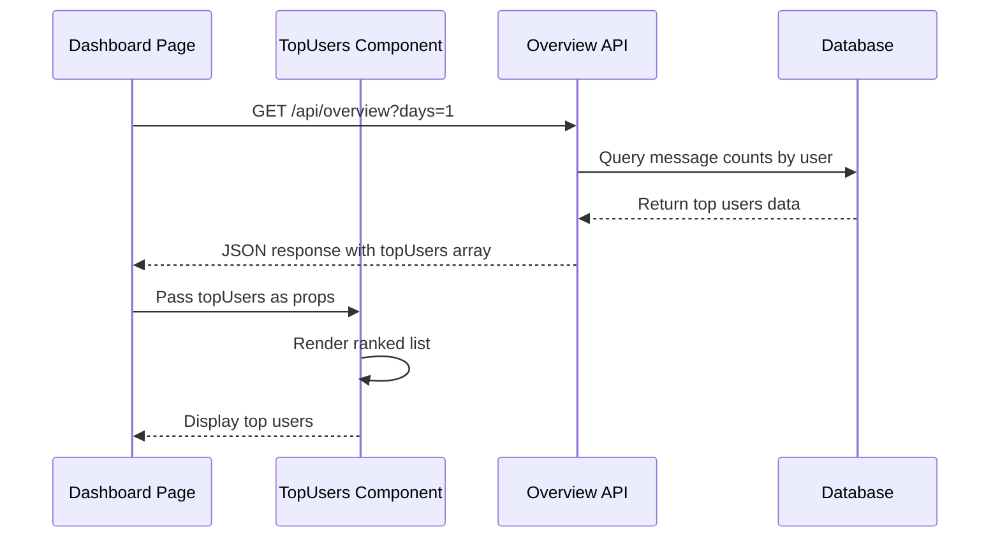

# Top Users

<cite>
**Referenced Files in This Document**   
- [top-users.tsx](file://components/top-users.tsx)
- [types.ts](file://lib/types.ts)
- [page.tsx](file://app/page.tsx)
- [route.ts](file://app/api/overview/route.ts)
- [queries.ts](file://lib/queries.ts)
</cite>

## Table of Contents
1. [Introduction](#introduction)
2. [Core Components](#core-components)
3. [Data Structure and Types](#data-structure-and-types)
4. [Conditional Rendering Behavior](#conditional-rendering-behavior)
5. [UI Structure and Layout](#ui-structure-and-layout)
6. [Integration with API Data](#integration-with-api-data)
7. [Data Processing Pipeline](#data-processing-pipeline)
8. [Usage Examples](#usage-examples)
9. [Potential Extensions](#potential-extensions)

## Introduction
The TopUsers component is a key visualization element in the Telegram analytics dashboard that displays participant engagement rankings based on message count. This component provides insights into the most active community members, helping administrators and moderators identify influential participants and understand community dynamics. The component renders a ranked list of users with their message counts, offering a clear view of user engagement patterns within the analyzed time window.

## Core Components

The TopUsers component is implemented as a React functional component that receives user data through props and renders an ordered list of the most active participants. The component handles both data presentation and empty state scenarios, providing a complete user experience for displaying engagement rankings.

**Section sources**
- [top-users.tsx](file://components/top-users.tsx#L6-L28)

## Data Structure and Types

The TopUsers component relies on a well-defined type system for data consistency. The TopUser type, defined in lib/types.ts, specifies the structure of user data with three required properties: userId (string), displayName (string), and messageCount (number). The component accepts these user objects through the TopUsersProps interface, which requires an array of TopUser objects.

The data structure is designed to support ranking functionality, with messageCount serving as the primary metric for determining user position in the leaderboard. The displayName field is constructed from user profile information to provide a human-readable representation of each participant.

**Diagram sources **
- [types.ts](file://lib/types.ts#L0-L4)
- [top-users.tsx](file://components/top-users.tsx#L2-L4)

## Conditional Rendering Behavior

The TopUsers component implements conditional rendering to handle scenarios where insufficient data is available. When the topUsers array is empty, the component displays a placeholder message "Данных недостаточно." (Insufficient data) within a content section. This empty state handling ensures that the user interface remains informative even when no engagement data is present.

The conditional logic checks the length property of the topUsers array, providing a simple and efficient way to determine whether to render the ranking list or the placeholder message. This approach prevents potential rendering errors and maintains a consistent user experience across different data states.

**Section sources**
- [top-users.tsx](file://components/top-users.tsx#L6-L11)

## UI Structure and Layout

The TopUsers component features a clean and intuitive user interface structure. The main container uses the "content-section" CSS class for consistent styling with other dashboard components. The component displays a heading "Топ участников" (Top Participants) followed by an unordered list with the "user-list" CSS class.

Each list item represents a ranked user, with the ranking indicator (e.g., "#1") and display name on the left side, and the message count on the right side. The ranking is dynamically generated using the array index, with the formula "index + 1" ensuring that rankings start from 1 rather than 0.

The message count is formatted using the toLocaleString method with the "ru-RU" locale, providing appropriate number formatting for the Russian-speaking audience. The right-aligned positioning is achieved using inline CSS with the float property, ensuring that the message counts are consistently positioned regardless of the length of user names.

**Diagram sources **
- [top-users.tsx](file://components/top-users.tsx#L13-L27)

## Integration with API Data

The TopUsers component integrates with the overview API endpoint to receive user engagement data. The API route at /api/overview/route.ts handles GET requests and returns comprehensive analytics data, including the topUsers array. The component is used in the main dashboard page (page.tsx), where it receives the topUsers data from the fetchOverview function.

The data flow begins with the dashboard page calling fetchOverview with parameters such as chatId, threadId, and time window. The database query in queries.ts retrieves user message counts, groups results by user, and orders them in descending order by message count. The top 10 users are then mapped to the TopUser type structure and included in the response.

**Diagram sources **
- [page.tsx](file://app/page.tsx#L27)
- [route.ts](file://app/api/overview/route.ts#L1-L22)
- [queries.ts](file://lib/queries.ts#L11-L115)

## Data Processing Pipeline

The data displayed in the TopUsers component undergoes a multi-step processing pipeline. The fetchOverview function in queries.ts constructs a SQL query that counts messages per user, joining the messages and users tables. The displayName field is generated by the buildUserLabel function, which prioritizes the user's first and last name, falls back to username (prefixed with @), and defaults to "Неизвестный" (Unknown) if no identifying information is available.

The database query uses ORDER BY COUNT(*) DESC to sort users by message count in descending order, ensuring that the most active users appear at the top of the list. The LIMIT 10 clause restricts results to the top 10 participants, optimizing performance and focusing on the most engaged community members.

**Section sources**
- [queries.ts](file://lib/queries.ts#L45-L70)
- [queries.ts](file://lib/queries.ts#L372-L381)

## Usage Examples

The TopUsers component is integrated into the main dashboard page (page.tsx) within a content grid layout. It receives the topUsers array directly from the metrics object returned by fetchOverview. The component is designed to be reusable and can be incorporated into other views by passing an appropriately structured array of TopUser objects.

The component's design follows React best practices with clear separation of concerns, type safety through TypeScript interfaces, and efficient rendering using the map function for list generation. The use of template literals for the key property (userId-index) ensures unique keys even if users have identical userId values across different contexts.

**Section sources**
- [page.tsx](file://app/page.tsx#L27)

## Potential Extensions

The TopUsers component could be extended with several additional features to enhance its functionality. Potential extensions include filtering options to show users from specific time periods or chat threads, sorting capabilities to order by different metrics (such as average message length or response time), and interactive elements that allow users to click on participant names to view detailed profiles.

Additional visualization options could include avatar display if user profile images are available, color-coding based on engagement levels, or integration with user roles and permissions to highlight moderators and administrators. The component could also support pagination or infinite scrolling for communities with more than 10 highly active members.