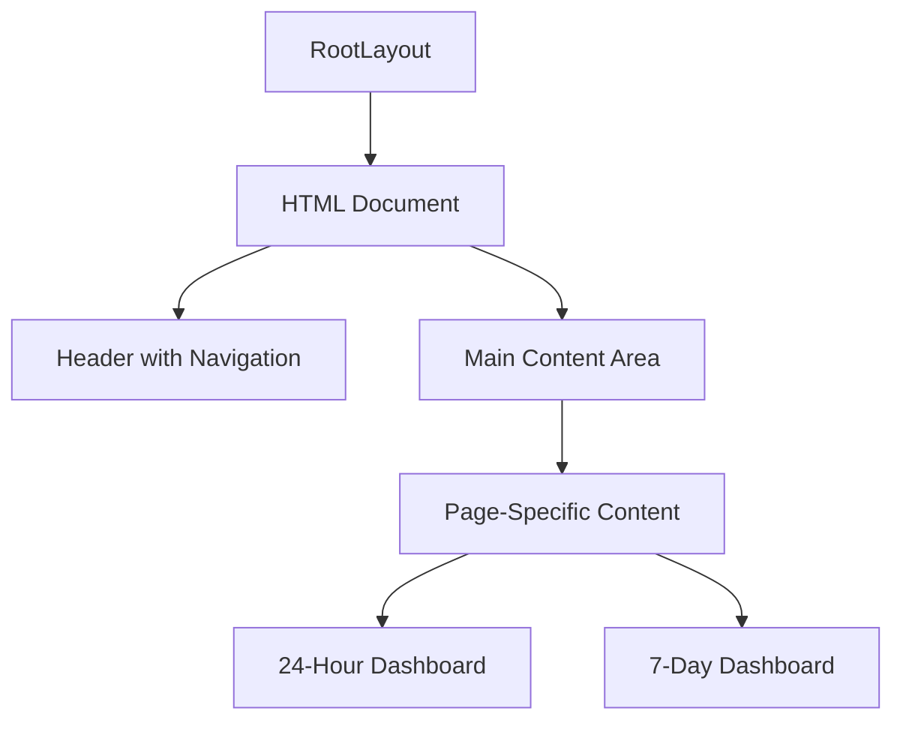
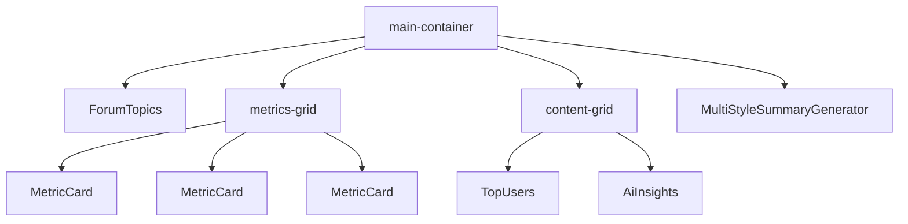
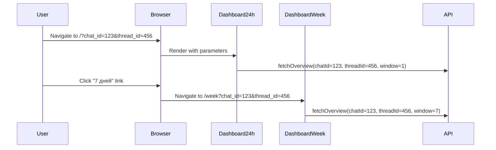

# Dashboard Layout

<cite>
**Referenced Files in This Document**   
- [layout.tsx](file://app/layout.tsx)
- [page.tsx](file://app/page.tsx)
- [week/page.tsx](file://app/week/page.tsx)
- [globals.css](file://app/globals.css)
</cite>

## Table of Contents
1. [Introduction](#introduction)
2. [RootLayout Structure](#rootlayout-structure)
3. [HTML Document Shell and Language Configuration](#html-document-shell-and-language-configuration)
4. [Navigation Header and Time Period Toggles](#navigation-header-and-time-period-toggles)
5. [Shared Visual Hierarchy and Responsive Containers](#shared-visual-hierarchy-and-responsive-containers)
6. [Routing Logic and Context Preservation](#routing-logic-and-context-preservation)
7. [Server-Rendered Metadata and SEO](#server-rendered-metadata-and-seo)
8. [Mobile-First Design and Accessibility](#mobile-first-design-and-accessibility)
9. [Customization Scenarios](#customization-scenarios)
10. [Conclusion](#conclusion)

## Introduction
This document provides comprehensive architectural documentation for the dashboard layout system in the tg-ai-vibecoders-summary application. The layout system is built using Next.js App Router and serves as the foundation for two primary dashboards: a 24-hour view and a 7-day weekly view. The documentation details the structure, functionality, and design principles of the RootLayout component, which provides a consistent wrapper for all pages in the application. It explains how the layout manages language settings, navigation, responsive design, and SEO while supporting mobile-first principles and accessibility standards.

## RootLayout Structure

The RootLayout component in layout.tsx serves as the foundational wrapper for all pages in the application. It defines the HTML document structure that is shared across both the 24-hour and 7-day dashboards. The layout receives children as a React.ReactNode prop, which represents the page-specific content that will be rendered within the main element. This design pattern enables consistent branding, navigation, and styling across all routes while allowing individual pages to define their unique content.



**Diagram sources**
- [layout.tsx](file://app/layout.tsx#L8-L30)

**Section sources**
- [layout.tsx](file://app/layout.tsx#L8-L30)

## HTML Document Shell and Language Configuration

The RootLayout component establishes the HTML document shell with specific language configuration for the Russian-speaking user base. The html element is configured with lang="ru" to set the primary language of the document to Russian, which is essential for proper text rendering, screen reader interpretation, and search engine indexing. This language attribute ensures that assistive technologies and browsers handle text appropriately, including correct pronunciation, hyphenation, and font selection. The document shell also includes the body element that contains the header and main content areas, providing a semantic structure for the entire application.

**Section sources**
- [layout.tsx](file://app/layout.tsx#L8-L30)

## Navigation Header and Time Period Toggles

The navigation header in the RootLayout provides users with seamless switching between the two primary dashboard views: 24 hours and 7 days. The header contains a branding element (h1 with "Telegram Dashboard") and a navigation section with two anchor links. The first link points to the root route ("/") for the 24-hour view with the text "24 часа" (24 hours), while the second link points to the "/week" route for the 7-day view with the text "7 дней" (7 days). These links are separated by a bullet character (•) for visual clarity. The navigation is implemented using standard anchor tags with href attributes, enabling client-side navigation through Next.js routing while maintaining accessibility and SEO benefits.

```mermaid
flowchart LR
A[Header] --> B[Branding]
A --> C[Navigation]
C --> D["24 часа" (/)]
C --> E["7 дней" (/week)]
```

**Diagram sources**
- [layout.tsx](file://app/layout.tsx#L8-L30)

**Section sources**
- [layout.tsx](file://app/layout.tsx#L8-L30)

## Shared Visual Hierarchy and Responsive Containers

Both dashboard pages (page.tsx and week/page.tsx) share a consistent visual hierarchy and responsive container structure defined in globals.css. The main-container class provides a responsive wrapper with adaptive max-width values that scale based on screen size: 1200px for standard displays, 1400px for larger screens, and percentage-based widths (85%, 80%) for ultra-wide displays (1920px and 2560px). This ensures optimal content width across various device sizes. The layout includes two primary grid systems: metrics-grid for displaying key performance indicators in a responsive grid that adapts from single column to multi-column layouts, and content-grid for organizing content sections like top users and AI insights. These grids use CSS Grid with breakpoints to provide a mobile-first responsive design.



**Diagram sources**
- [page.tsx](file://app/page.tsx#L12-L40)
- [week/page.tsx](file://app/week/page.tsx#L12-L40)
- [globals.css](file://app/globals.css#L50-L55)

**Section sources**
- [page.tsx](file://app/page.tsx#L12-L40)
- [week/page.tsx](file://app/week/page.tsx#L12-L40)
- [globals.css](file://app/globals.css#L50-L55)

## Routing Logic and Context Preservation

The application implements routing logic that preserves context between the two dashboard views through search parameters. Both Dashboard24h and DashboardWeek components extract chat_id and thread_id from the searchParams prop, allowing users to maintain their current context when switching between time periods. The search parameter handling is implemented consistently in both pages, with logic to handle both string and string array values. When a user navigates from one dashboard to another via the header links, any existing chat_id and thread_id parameters are preserved in the URL, ensuring a seamless experience. The only difference between the two pages is the time window parameter passed to the fetchOverview function (1 for 24 hours, 7 for 7 days), while all other functionality and layout remain identical.



**Diagram sources**
- [page.tsx](file://app/page.tsx#L12-L40)
- [week/page.tsx](file://app/week/page.tsx#L12-L40)

**Section sources**
- [page.tsx](file://app/page.tsx#L12-L40)
- [week/page.tsx](file://app/week/page.tsx#L12-L40)

## Server-Rendered Metadata and SEO

The application implements server-rendered metadata for improved SEO and social sharing through the metadata object in layout.tsx. This metadata is defined at the layout level, making it available to all pages that use the RootLayout. The metadata includes a descriptive title "Telegram Dashboard — Analytics & Insights" and a concise description "Real-time analytics and AI-powered insights for Telegram communities." By defining metadata at the layout level, the application ensures consistent SEO information across all routes while allowing individual pages to override these values if needed. This approach leverages Next.js's server-side rendering capabilities to generate static metadata that is immediately available to search engine crawlers and social media platforms when the page is loaded.

**Section sources**
- [layout.tsx](file://app/layout.tsx#L3-L6)

## Mobile-First Design and Accessibility

The dashboard layout system implements mobile-first design principles and accessibility standards throughout its implementation. The CSS in globals.css uses a mobile-first approach with responsive breakpoints that progressively enhance the layout for larger screens. The base styles are optimized for mobile devices, with single-column layouts for metrics and content sections that transform into multi-column grids as screen width increases. Accessibility is addressed through semantic HTML structure, with proper heading hierarchy (h1 for branding, h2/h3 for section titles), sufficient color contrast, and interactive elements that provide visual feedback on hover and focus. The navigation links are appropriately sized for touch interaction, and the forum topics component includes scrollable content with visible scrollbars. The application also follows accessibility best practices by using relative units for typography and spacing, ensuring content remains readable and usable across different device configurations.

**Section sources**
- [layout.tsx](file://app/layout.tsx#L8-L30)
- [globals.css](file://app/globals.css#L1-L338)

## Customization Scenarios

The layout system supports several common customization scenarios that developers may need to implement. To add new navigation items, developers can modify the nav element in RootLayout by adding additional anchor tags with appropriate href attributes and localized text. For modifying the header branding, the h1 element content can be updated or replaced with a logo image. The responsive behavior can be customized by adjusting the breakpoints and max-width values in the main-container, metrics-grid, and content-grid classes in globals.css. To extend the context preservation functionality, additional search parameters can be extracted from the searchParams object in both dashboard components and passed to data fetching functions. The metadata can be extended or overridden by individual pages by exporting their own metadata object, allowing for page-specific SEO optimization while maintaining the base layout metadata.

**Section sources**
- [layout.tsx](file://app/layout.tsx#L8-L30)
- [page.tsx](file://app/page.tsx#L12-L40)
- [week/page.tsx](file://app/week/page.tsx#L12-L40)
- [globals.css](file://app/globals.css#L50-L55)

## Conclusion

The dashboard layout system in the tg-ai-vibecoders-summary application provides a robust foundation for displaying analytics and insights from Telegram communities. Built on Next.js App Router, the RootLayout component establishes a consistent HTML document shell with Russian language configuration and a navigation header that enables seamless switching between 24-hour and 7-day views. The shared visual hierarchy and responsive container structure ensure a cohesive user experience across both dashboards, while the routing logic preserves context through search parameters. Server-rendered metadata enhances SEO and social sharing, and mobile-first design principles with accessibility considerations make the application usable across a wide range of devices and user needs. The modular architecture allows for straightforward customization, making it easy to extend the layout with new navigation items, branding elements, or responsive behaviors as requirements evolve.