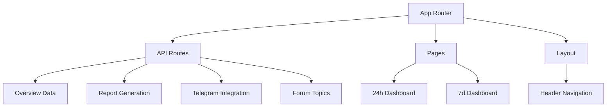
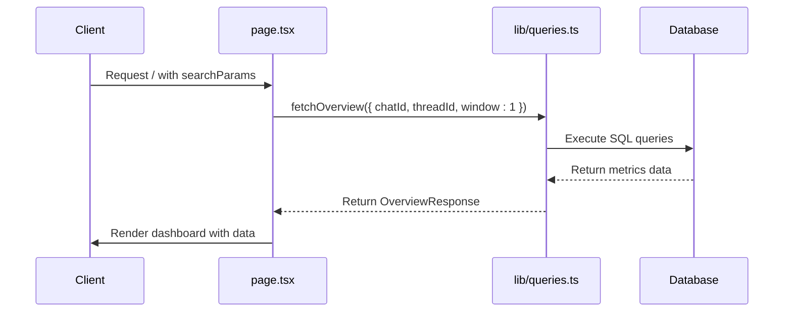
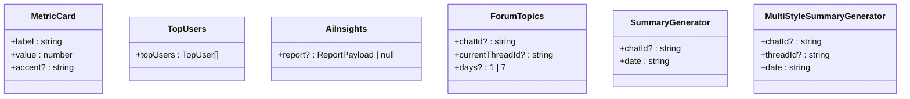
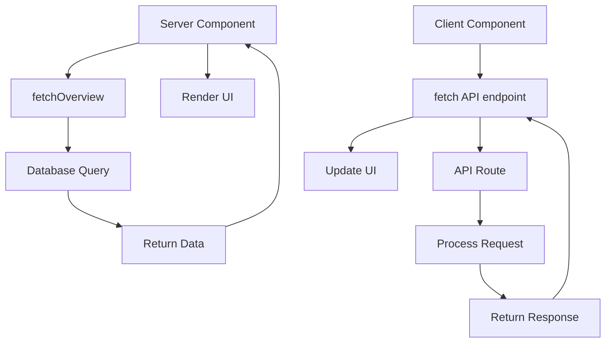
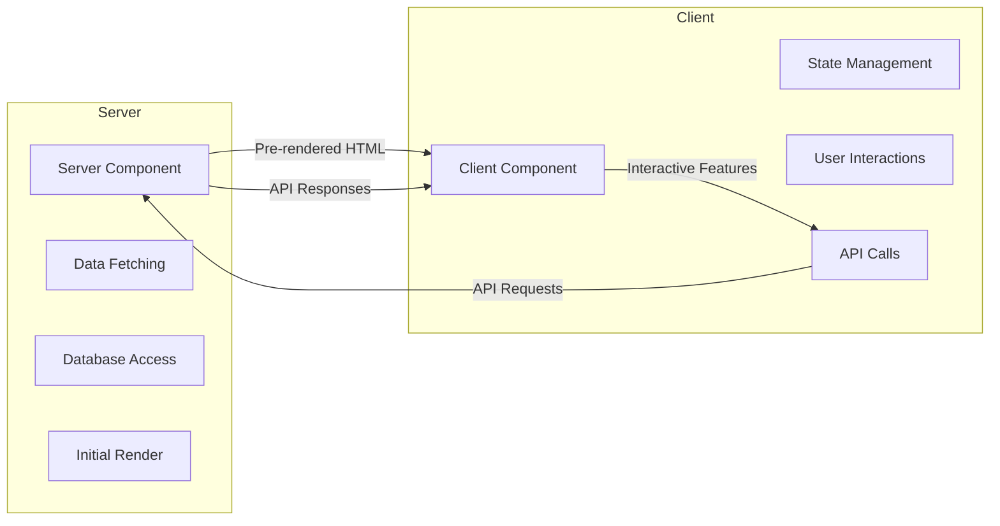
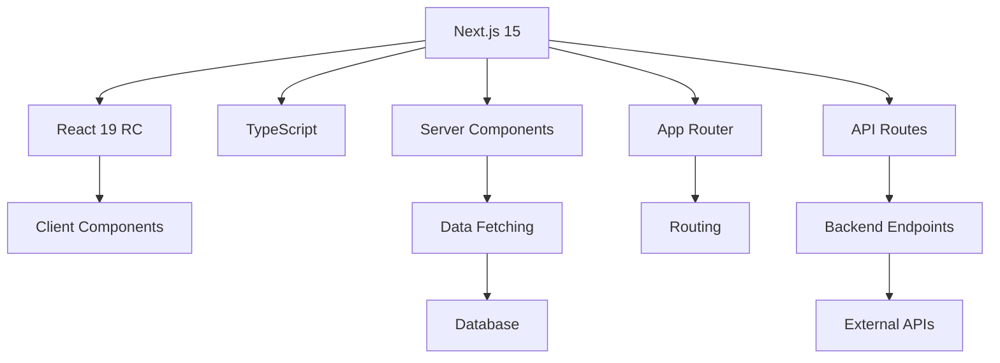

# Frontend Architecture

<cite>
**Referenced Files in This Document**   
- [layout.tsx](file://app/layout.tsx)
- [page.tsx](file://app/page.tsx)
- [week/page.tsx](file://app/week/page.tsx)
- [summary-generator.tsx](file://components/summary-generator.tsx)
- [multi-style-summary-generator.tsx](file://components/multi-style-summary-generator.tsx)
- [ai-insights.tsx](file://components/ai-insights.tsx)
- [metric-card.tsx](file://components/metric-card.tsx)
- [top-users.tsx](file://components/top-users.tsx)
- [forum-topics.tsx](file://components/forum-topics.tsx)
- [globals.css](file://app/globals.css)
- [next.config.mjs](file://next.config.mjs)
- [package.json](file://package.json)
- [lib/types.ts](file://lib/types.ts)
- [lib/queries.ts](file://lib/queries.ts)
- [lib/report.ts](file://lib/report.ts)
- [lib/ai.ts](file://lib/ai.ts)
- [lib/date-utils.ts](file://lib/date-utils.ts)
- [app/api/overview/route.ts](file://app/api/overview/route.ts)
- [app/api/report/[kind]/route.ts](file://app/api/report/[kind]/route.ts)
- [app/api/send-to-telegram/route.ts](file://app/api/send-to-telegram/route.ts)
- [app/api/topics/route.ts](file://app/api/topics/route.ts)
</cite>

## Table of Contents
1. [Introduction](#introduction)
2. [Project Structure](#project-structure)
3. [Core Components](#core-components)
4. [Architecture Overview](#architecture-overview)
5. [Detailed Component Analysis](#detailed-component-analysis)
6. [Data Flow and API Integration](#data-flow-and-api-integration)
7. [Server and Client Component Patterns](#server-and-client-component-patterns)
8. [Technology Stack](#technology-stack)
9. [Infrastructure Requirements](#infrastructure-requirements)
10. [Cross-Cutting Concerns](#cross-cutting-concerns)
11. [Russian Language Implementation](#russian-language-implementation)
12. [Mobile Optimization Strategies](#mobile-optimization-strategies)
13. [Conclusion](#conclusion)

## Introduction

The frontend architecture of the tg-ai-vibecoders-summary application is built on Next.js App Router with a clear separation between Server Components for data fetching and Client Components for interactive features. The application provides analytics and AI-powered insights for Telegram communities, with a focus on real-time data visualization and interactive report generation. This document details the architectural patterns, component hierarchy, data flow, and implementation strategies that enable the application's functionality.

**Section sources**
- [layout.tsx](file://app/layout.tsx)
- [page.tsx](file://app/page.tsx)
- [week/page.tsx](file://app/week/page.tsx)

## Project Structure

The application follows a standard Next.js App Router structure with clear separation of concerns. The main components are organized as follows:

```
app/
├── api/               # API routes for data fetching
├── week/              # 7-day analytics page
├── globals.css        # Global custom styles
├── layout.tsx         # Root layout with Russian header/nav
├── page.tsx           # 24-hour dashboard (homepage)
components/            # Reusable UI components
lib/                   # Utilities and business logic
```

The structure emphasizes modularity and separation between presentation components, business logic, and API routes. The App Router enables server-side rendering while maintaining client-side interactivity through Client Components.



**Diagram sources**
- [app/page.tsx](file://app/page.tsx)
- [app/week/page.tsx](file://app/week/page.tsx)
- [app/layout.tsx](file://app/layout.tsx)

**Section sources**
- [app/page.tsx](file://app/page.tsx)
- [app/week/page.tsx](file://app/week/page.tsx)
- [app/layout.tsx](file://app/layout.tsx)

## Core Components

The application's core components follow a hierarchical structure starting from the root layout through page components to reusable UI elements. The RootLayout component provides the overall structure with Russian language support, while the page components serve as Server Components that fetch and render data. Reusable components in the components directory provide specific functionality such as metric display, user lists, and AI insights.

The component hierarchy enables efficient data fetching on the server while maintaining interactive capabilities on the client. Server Components handle data retrieval and initial rendering, while Client Components manage user interactions and dynamic content updates.

**Section sources**
- [layout.tsx](file://app/layout.tsx)
- [page.tsx](file://app/page.tsx)
- [week/page.tsx](file://app/week/page.tsx)
- [components/metric-card.tsx](file://components/metric-card.tsx)
- [components/top-users.tsx](file://components/top-users.tsx)
- [components/ai-insights.tsx](file://components/ai-insights.tsx)

## Architecture Overview

The frontend architecture implements a hybrid rendering approach using Next.js App Router with Server Components for data fetching and Client Components for interactive features. This pattern optimizes performance by minimizing client-side JavaScript while maintaining rich interactivity where needed.

The architecture follows a clear data flow from API routes to UI components, with Server Components fetching data during rendering and passing it to both Server and Client Components. Client Components handle user interactions such as report generation and Telegram integration, using client-side state management and API calls.

```mermaid
graph TB
subgraph "Server Components"
A[layout.tsx] --> B[page.tsx]
B --> C[week/page.tsx]
B --> D[fetchOverview]
C --> D
end
subgraph "Client Components"
E[summary-generator.tsx]
F[multi-style-summary-generator.tsx]
G[forum-topics.tsx]
end
subgraph "API Routes"
H[/api/overview]
I[/api/report]
J[/api/send-to-telegram]
K[/api/topics]
end
D --> H
E --> I
E --> J
G --> K
B --> E
B --> F
B --> G
C --> E
C --> F
C --> G
```

**Diagram sources**
- [layout.tsx](file://app/layout.tsx)
- [page.tsx](file://app/page.tsx)
- [week/page.tsx](file://app/week/page.tsx)
- [components/summary-generator.tsx](file://components/summary-generator.tsx)
- [components/multi-style-summary-generator.tsx](file://components/multi-style-summary-generator.tsx)
- [components/forum-topics.tsx](file://components/forum-topics.tsx)
- [app/api/overview/route.ts](file://app/api/overview/route.ts)
- [app/api/report/[kind]/route.ts](file://app/api/report/[kind]/route.ts)
- [app/api/send-to-telegram/route.ts](file://app/api/send-to-telegram/route.ts)
- [app/api/topics/route.ts](file://app/api/topics/route.ts)

## Detailed Component Analysis

### Layout and Navigation Components

The RootLayout component serves as the foundation of the application, providing the HTML structure and navigation elements. It sets the language to Russian and includes a header with navigation links to the 24-hour and 7-day dashboards. The layout uses a simple header-main structure with responsive design considerations.

```mermaid
classDiagram
class RootLayout {
+children : React.ReactNode
+metadata : Metadata
+lang : "ru"
}
class Header {
+navigation : Array<{ href : string; label : string }>
}
RootLayout --> Header : "contains"
```

**Diagram sources**
- [layout.tsx](file://app/layout.tsx#L8-L30)

**Section sources**
- [layout.tsx](file://app/layout.tsx)

### Dashboard Page Components

The application includes two main dashboard pages: page.tsx for 24-hour analytics and week/page.tsx for 7-day analytics. Both are Server Components that fetch data using the fetchOverview function from lib/queries.ts. They share a similar structure with ForumTopics, MetricCard, TopUsers, AiInsights, and MultiStyleSummaryGenerator components.

The pages accept search parameters for chat_id and thread_id, allowing filtering of data based on specific Telegram chats or topics. The data fetching is performed server-side, ensuring that the initial page load includes all necessary data without requiring additional client-side requests.



**Diagram sources**
- [page.tsx](file://app/page.tsx)
- [week/page.tsx](file://app/week/page.tsx)
- [lib/queries.ts](file://lib/queries.ts)

**Section sources**
- [page.tsx](file://app/page.tsx)
- [week/page.tsx](file://app/week/page.tsx)
- [lib/queries.ts](file://lib/queries.ts)

### Reusable UI Components

The components directory contains reusable UI components that are used across the application. These include:

- **MetricCard**: Displays key metrics with labels and formatted values
- **TopUsers**: Shows a list of top contributors with message counts
- **AiInsights**: Displays AI-generated insights and summaries
- **ForumTopics**: Client Component for displaying and navigating forum topics
- **SummaryGenerator**: Interactive component for generating and sending AI reports



**Diagram sources**
- [components/metric-card.tsx](file://components/metric-card.tsx)
- [components/top-users.tsx](file://components/top-users.tsx)
- [components/ai-insights.tsx](file://components/ai-insights.tsx)
- [components/forum-topics.tsx](file://components/forum-topics.tsx)
- [components/summary-generator.tsx](file://components/summary-generator.tsx)
- [components/multi-style-summary-generator.tsx](file://components/multi-style-summary-generator.tsx)

**Section sources**
- [components/metric-card.tsx](file://components/metric-card.tsx)
- [components/top-users.tsx](file://components/top-users.tsx)
- [components/ai-insights.tsx](file://components/ai-insights.tsx)
- [components/forum-topics.tsx](file://components/forum-topics.tsx)
- [components/summary-generator.tsx](file://components/summary-generator.tsx)
- [components/multi-style-summary-generator.tsx](file://components/multi-style-summary-generator.tsx)

## Data Flow and API Integration

The application's data flow follows a structured pattern from API routes to UI components. Server Components fetch data during rendering, while Client Components make API calls for interactive features. The API routes in the app/api directory handle various data retrieval and processing tasks.

The data flow can be summarized as follows:
1. Server Components (page.tsx, week/page.tsx) fetch data using utility functions
2. Utility functions (lib/queries.ts, lib/report.ts) interact with the database or external APIs
3. API routes expose endpoints for client-side data fetching
4. Client Components make API calls for interactive features



**Diagram sources**
- [page.tsx](file://app/page.tsx)
- [week/page.tsx](file://app/week/page.tsx)
- [lib/queries.ts](file://lib/queries.ts)
- [lib/report.ts](file://lib/report.ts)
- [app/api/overview/route.ts](file://app/api/overview/route.ts)
- [app/api/report/[kind]/route.ts](file://app/api/report/[kind]/route.ts)
- [components/summary-generator.tsx](file://components/summary-generator.tsx)
- [components/forum-topics.tsx](file://components/forum-topics.tsx)

**Section sources**
- [page.tsx](file://app/page.tsx)
- [week/page.tsx](file://app/week/page.tsx)
- [lib/queries.ts](file://lib/queries.ts)
- [lib/report.ts](file://lib/report.ts)
- [app/api/overview/route.ts](file://app/api/overview/route.ts)
- [app/api/report/[kind]/route.ts](file://app/api/report/[kind]/route.ts)
- [components/summary-generator.tsx](file://components/summary-generator.tsx)
- [components/forum-topics.tsx](file://components/forum-topics.tsx)

## Server and Client Component Patterns

The application implements a clear separation between Server and Client Components, leveraging the strengths of each approach. Server Components are used for data fetching and initial rendering, while Client Components handle user interactions and dynamic content.

Server Components (page.tsx, week/page.tsx) fetch data during rendering, eliminating the need for client-side data fetching and improving performance. They can directly access backend resources like databases without exposing connection details to the client.

Client Components (summary-generator.tsx, multi-style-summary-generator.tsx, forum-topics.tsx) use the "use client" directive and manage client-side state with useState. They handle user interactions such as generating reports, sending content to Telegram, and navigating forum topics.

This hybrid approach optimizes performance by minimizing client-side JavaScript while maintaining rich interactivity. The Server Components ensure fast initial loading with pre-rendered content, while Client Components provide dynamic functionality without requiring full page reloads.



**Diagram sources**
- [page.tsx](file://app/page.tsx)
- [week/page.tsx](file://app/week/page.tsx)
- [components/summary-generator.tsx](file://components/summary-generator.tsx)
- [components/multi-style-summary-generator.tsx](file://components/multi-style-summary-generator.tsx)
- [components/forum-topics.tsx](file://components/forum-topics.tsx)

**Section sources**
- [page.tsx](file://app/page.tsx)
- [week/page.tsx](file://app/week/page.tsx)
- [components/summary-generator.tsx](file://components/summary-generator.tsx)
- [components/multi-style-summary-generator.tsx](file://components/multi-style-summary-generator.tsx)
- [components/forum-topics.tsx](file://components/forum-topics.tsx)

## Technology Stack

The application uses a modern technology stack centered around Next.js and React 19 RC. The key technologies include:

- **Next.js 15**: App Router with Server Components and API routes
- **React 19 RC**: Latest React features and improvements
- **TypeScript**: Type safety and improved developer experience
- **PostgreSQL**: Database for storing Telegram message data
- **CSS**: Custom styling without external frameworks
- **OpenRouter API**: AI-powered report generation

The package.json file specifies the dependencies, including Next.js 15.0.0-canary.58, React 19.0.0-rc.0, and PostgreSQL client. The next.config.mjs file configures experimental features like typed routes and server external packages.



**Diagram sources**
- [package.json](file://package.json)
- [next.config.mjs](file://next.config.mjs)

**Section sources**
- [package.json](file://package.json)
- [next.config.mjs](file://next.config.mjs)

## Infrastructure Requirements

The application requires specific infrastructure to support server-side rendering and client-side interactivity. The server-side rendering capabilities require a Node.js environment with sufficient memory and processing power to handle data fetching and rendering.

Database connectivity is essential for data retrieval, with the application using PostgreSQL through the pg package. The database connection is managed through a connection pool to optimize performance and resource usage.

Environment variables are required for API keys and configuration, including OPENROUTER_API_KEY, OPENROUTER_MODEL, DATABASE_URL, and TELEGRAM_API_TOKEN. These must be securely configured in the deployment environment.

The application's API routes require the server to handle concurrent requests for data fetching, report generation, and Telegram integration. The server external packages configuration in next.config.mjs ensures that the pg package is properly bundled for server-side execution.

**Section sources**
- [next.config.mjs](file://next.config.mjs)
- [lib/db.ts](file://lib/db.ts)
- [lib/ai.ts](file://lib/ai.ts)
- [lib/telegram.ts](file://lib/telegram.ts)

## Cross-Cutting Concerns

### Responsive Design

The application implements responsive design principles to ensure usability across different screen sizes. The layout adapts to various resolutions, with specific breakpoints for mobile, tablet, and desktop views. The CSS includes media queries to adjust the maximum width of containers based on screen size, providing an optimal viewing experience on both small and large displays.

### Accessibility

Accessibility is addressed through semantic HTML structure, proper heading hierarchy, and keyboard navigation support. The application uses standard HTML elements for interactive components, ensuring compatibility with screen readers and other assistive technologies. Form elements and buttons include appropriate labels and states for accessibility.

### Performance Optimization

Performance optimization is achieved through several strategies:
- Server Components for data fetching and initial rendering
- Efficient database queries with proper indexing
- Connection pooling for database access
- Caching strategies for API responses
- Code splitting and lazy loading where appropriate

The application minimizes client-side JavaScript by leveraging server-side rendering, reducing the initial load time and improving perceived performance.

**Section sources**
- [globals.css](file://app/globals.css)
- [layout.tsx](file://app/layout.tsx)
- [page.tsx](file://app/page.tsx)
- [week/page.tsx](file://app/week/page.tsx)

## Russian Language Implementation

The application implements Russian language support at multiple levels. The RootLayout component sets the HTML lang attribute to "ru", ensuring proper language handling by browsers and assistive technologies.

All user interface text is written in Russian, including navigation labels, component titles, and interactive elements. This includes:
- Header navigation: "24 часа" and "7 дней"
- Metric labels: "Сообщения", "Уникальные участники", "Сообщения со ссылками"
- Component titles: "Генерация краткого изложения", "AI дайджест", "Топ участников"
- Interactive elements: "Генерировать", "Отправить в Telegram"

Date and number formatting uses Russian locale settings through the toLocaleString method with "ru-RU" parameter, ensuring proper formatting of numbers and dates according to Russian conventions.

The AI-generated content is also produced in Russian, with system prompts in the lib/ai.ts file specifically instructing the AI to respond in Russian with a natural, conversational style.

**Section sources**
- [layout.tsx](file://app/layout.tsx)
- [page.tsx](file://app/page.tsx)
- [week/page.tsx](file://app/week/page.tsx)
- [components/metric-card.tsx](file://components/metric-card.tsx)
- [components/ai-insights.tsx](file://components/ai-insights.tsx)
- [components/top-users.tsx](file://components/top-users.tsx)
- [components/summary-generator.tsx](file://components/summary-generator.tsx)
- [lib/format.ts](file://lib/format.ts)
- [lib/ai.ts](file://lib/ai.ts)

## Mobile Optimization Strategies

The application employs several mobile optimization strategies to ensure a good user experience on smaller screens:

- Responsive layout with flexible grid systems
- Touch-friendly interactive elements with appropriate sizing
- Optimized navigation for mobile devices
- Reduced data usage through efficient API calls
- Progressive enhancement for older devices

The CSS includes specific styles for mobile devices, with maximum width constraints and appropriate padding. Interactive elements are designed with touch targets of sufficient size for easy interaction on touchscreens.

The application prioritizes essential content and functionality on mobile devices, ensuring that key metrics and insights are easily accessible without requiring excessive scrolling or zooming.

**Section sources**
- [globals.css](file://app/globals.css)
- [layout.tsx](file://app/layout.tsx)
- [page.tsx](file://app/page.tsx)
- [week/page.tsx](file://app/week/page.tsx)
- [components/summary-generator.tsx](file://components/summary-generator.tsx)

## Conclusion

The frontend architecture of the tg-ai-vibecoders-summary application effectively combines Next.js App Router with Server and Client Components to create a performant and interactive dashboard for Telegram analytics. The clear separation of concerns, efficient data flow, and thoughtful component design enable a seamless user experience with fast initial loading and responsive interactions.

The application successfully implements Russian language support throughout the interface and content, while maintaining accessibility and responsiveness across different devices. The hybrid rendering approach optimizes performance by leveraging server-side rendering for data fetching and initial rendering, while preserving client-side interactivity for dynamic features.

Future enhancements could include additional responsive design improvements for ultra-wide monitors, enhanced accessibility features, and performance optimizations for large datasets.