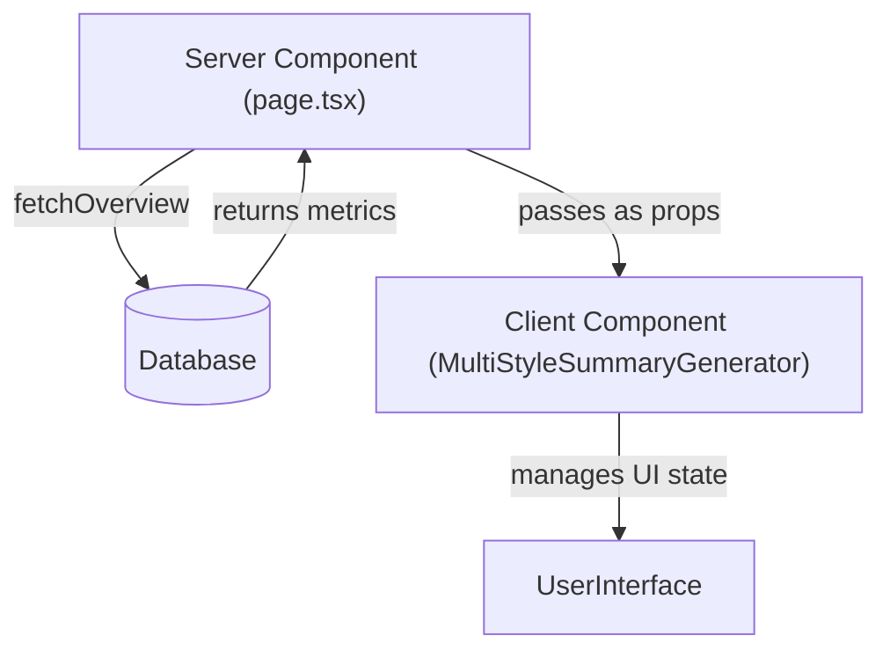
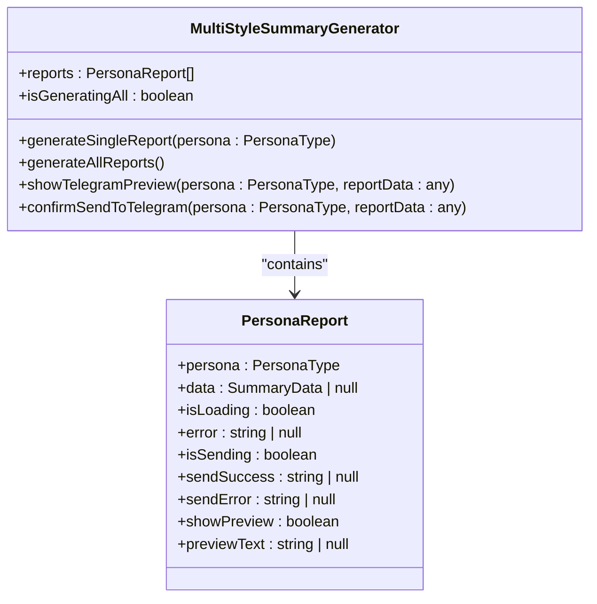
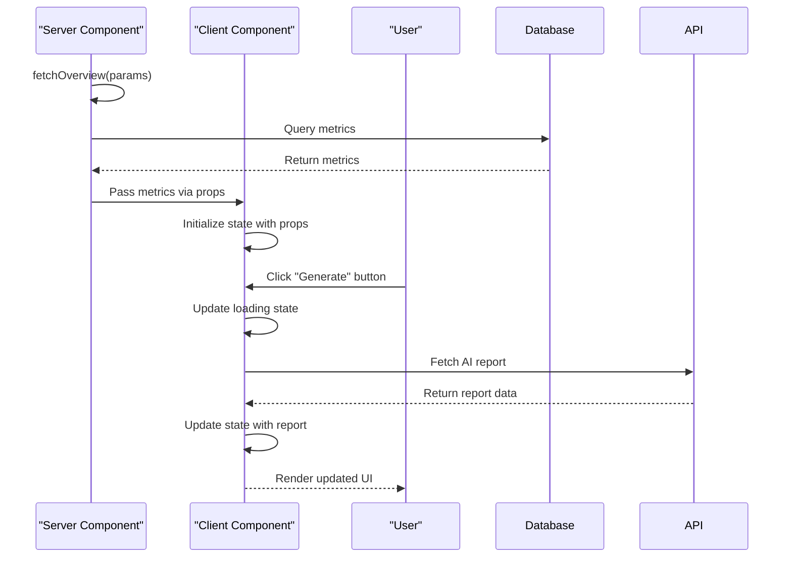
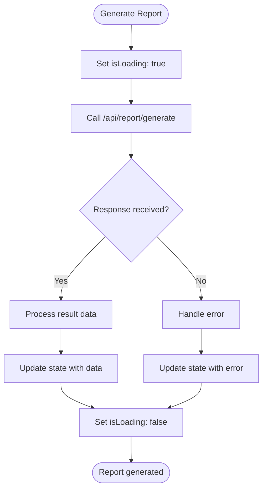
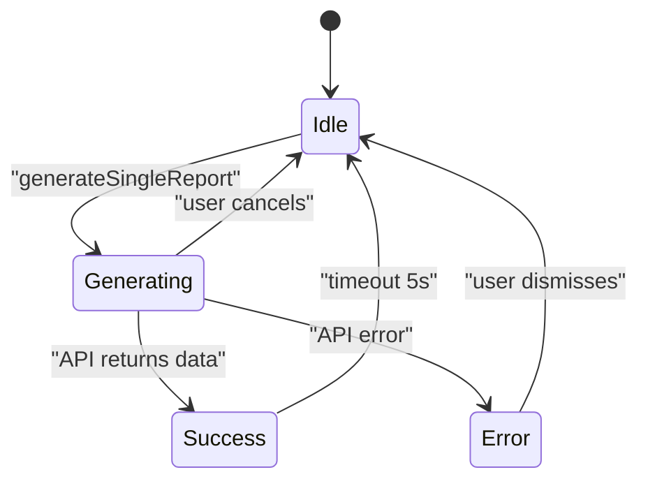

# State Management

<cite>
**Referenced Files in This Document**   
- [page.tsx](file://app/page.tsx)
- [week/page.tsx](file://app/week/page.tsx)
- [multi-style-summary-generator.tsx](file://components/multi-style-summary-generator.tsx)
- [queries.ts](file://lib/queries.ts)
- [date-utils.ts](file://lib/date-utils.ts)
</cite>

## Table of Contents
1. [Introduction](#introduction)
2. [Server-Client Data Separation](#server-client-data-separation)
3. [UI State Management with React Hooks](#ui-state-management-with-react-hooks)
4. [Data Flow from Server to Client](#data-flow-from-server-to-client)
5. [Asynchronous State Transitions](#asynchronous-state-transitions)
6. [Error Handling and Loading States](#error-handling-and-loading-states)
7. [Search Parameter Management](#search-parameter-management)
8. [State Synchronization Across Dashboard](#state-synchronization-across-dashboard)
9. [Performance Optimization](#performance-optimization)

## Introduction
This document provides a comprehensive analysis of the state management approach in the frontend of the tg-ai-vibecoders-summary application. The system implements a clear separation between server-managed data and client-side interactivity, leveraging Next.js Server Components for initial data fetching and React Client Components for interactive features. The architecture demonstrates a modern React state management pattern that efficiently handles asynchronous operations, user interactions, and UI state transitions without requiring full page reloads.

## Server-Client Data Separation
The application maintains a strict separation between server-managed data and client-side interactivity. Server Components are responsible for fetching and providing initial state, while Client Components manage interactive UI state.

Server components use the `fetchOverview` function to retrieve data from the database, which is then passed as props to client components. This approach ensures that the initial page load contains all necessary data, improving performance and user experience.

**Diagram sources**
- [page.tsx](file://app/page.tsx)
- [queries.ts](file://lib/queries.ts)

**Section sources**
- [page.tsx](file://app/page.tsx#L1-L42)
- [queries.ts](file://lib/queries.ts#L11-L115)

## UI State Management with React Hooks
The client-side interactivity is managed within the MultiStyleSummaryGenerator component using React's useState and useEffect hooks to handle various UI states including report generation status, loading indicators, and form inputs.

The component maintains multiple state variables to track the status of AI report generation for different personas, including loading states, error conditions, and success messages. This granular state management allows for precise control over the user interface and provides immediate feedback for user actions.

**Diagram sources**
- [multi-style-summary-generator.tsx](file://components/multi-style-summary-generator.tsx#L663-L1178)

**Section sources**
- [multi-style-summary-generator.tsx](file://components/multi-style-summary-generator.tsx#L663-L1178)

## Data Flow from Server to Client
The data flow in the application follows a unidirectional pattern from server components to client components through props. Server components fetch initial state using the fetchOverview function and pass it to client components, which then manage their own interactive state.

When a user interacts with the interface, state updates occur within the client component without requiring a full page reload. This approach provides a responsive user experience while maintaining data consistency between the server and client.

**Diagram sources**
- [page.tsx](file://app/page.tsx#L1-L42)
- [multi-style-summary-generator.tsx](file://components/multi-style-summary-generator.tsx#L663-L1178)

**Section sources**
- [page.tsx](file://app/page.tsx#L1-L42)
- [multi-style-summary-generator.tsx](file://components/multi-style-summary-generator.tsx#L663-L1178)

## Asynchronous State Transitions
The application handles asynchronous state transitions during AI report generation and Telegram delivery through carefully managed state updates. When a user initiates report generation, the component updates its state to reflect the loading status, makes an API call, and then updates the state again with the results or any errors.

For bulk operations like generating all reports simultaneously, the application uses Promise.all to handle multiple asynchronous operations efficiently while maintaining individual progress tracking for each report.

**Diagram sources**
- [multi-style-summary-generator.tsx](file://components/multi-style-summary-generator.tsx#L663-L1178)

**Section sources**
- [multi-style-summary-generator.tsx](file://components/multi-style-summary-generator.tsx#L663-L1178)

## Error Handling and Loading States
The application implements comprehensive error handling and loading states to provide a smooth user experience. Each report in the MultiStyleSummaryGenerator maintains its own error state, allowing users to see which specific reports failed while others may have succeeded.

Loading skeletons are used during report generation to indicate progress, and optimistic UI patterns are employed for actions like sending reports to Telegram. Success messages are automatically cleared after a timeout period to prevent clutter in the interface.

**Diagram sources**
- [multi-style-summary-generator.tsx](file://components/multi-style-summary-generator.tsx#L663-L1178)

**Section sources**
- [multi-style-summary-generator.tsx](file://components/multi-style-summary-generator.tsx#L663-L1178)

## Search Parameter Management
Search parameters are managed as application state through URL query parameters. The server components extract these parameters and use them to filter data, while client components can modify them to change the application state without full page reloads.

The application uses the Next.js router to handle navigation with updated search parameters, allowing users to bookmark specific views or share links with particular filters applied.

**Section sources**
- [page.tsx](file://app/page.tsx#L1-L42)
- [week/page.tsx](file://app/week/page.tsx#L1-L42)

## State Synchronization Across Dashboard
The application synchronizes state across the dashboard by passing data from parent to child components through props. When search parameters change, the server component re-fetches data with the new parameters and passes the updated data to all child components.

For interactive features like the MultiStyleSummaryGenerator, state is contained within the component but can be influenced by changes in the parent component's props, ensuring that all components display data consistent with the current application state.

**Section sources**
- [page.tsx](file://app/page.tsx#L1-L42)
- [multi-style-summary-generator.tsx](file://components/multi-style-summary-generator.tsx#L663-L1178)

## Performance Optimization
The application implements several performance optimizations to minimize re-renders and improve responsiveness. The MultiStyleSummaryGenerator component uses granular state management to update only the necessary parts of the UI when state changes occur.

By separating server and client components, the application reduces the amount of JavaScript sent to the client and leverages server-side rendering for initial page loads. The use of React's useState with functional updates ensures that state transitions are handled efficiently.

**Section sources**
- [multi-style-summary-generator.tsx](file://components/multi-style-summary-generator.tsx#L663-L1178)
- [page.tsx](file://app/page.tsx#L1-L42)