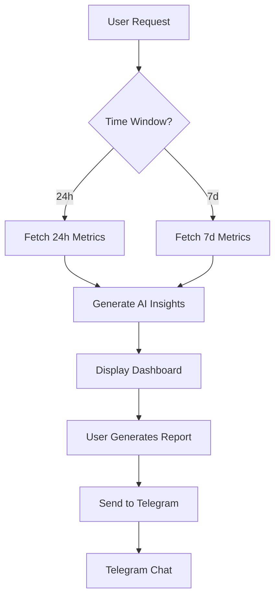
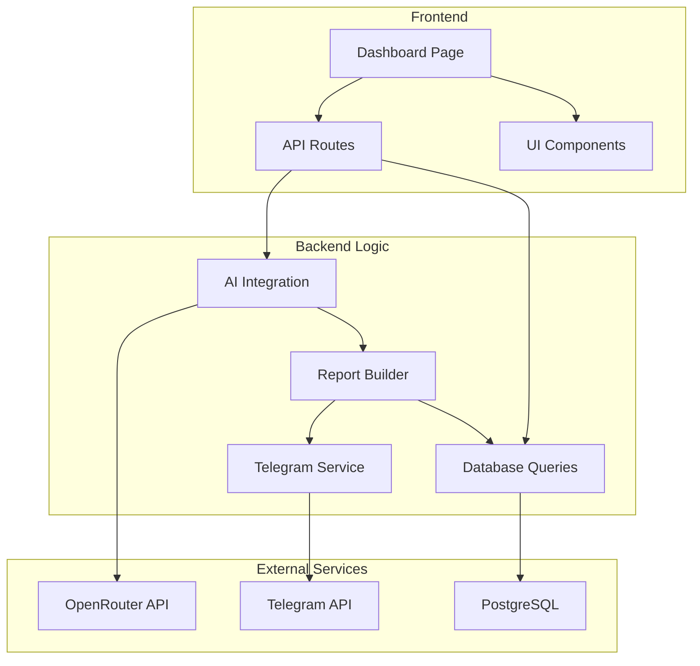
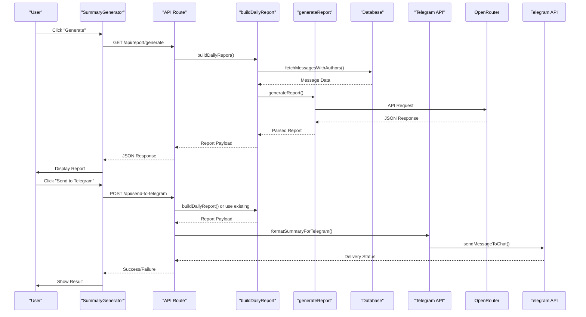

# Project Overview

<cite>
**Referenced Files in This Document**   
- [README.md](file://README.md)
- [app/page.tsx](file://app/page.tsx)
- [app/api/report/[kind]/route.ts](file://app/api/report/[kind]/route.ts)
- [app/api/send-to-telegram/route.ts](file://app/api/send-to-telegram/route.ts)
- [lib/ai.ts](file://lib/ai.ts)
- [lib/report.ts](file://lib/report.ts)
- [lib/telegram.ts](file://lib/telegram.ts)
- [lib/queries.ts](file://lib/queries.ts)
- [components/summary-generator.tsx](file://components/summary-generator.tsx)
- [components/ai-insights.tsx](file://components/ai-insights.tsx)
</cite>

## Table of Contents
1. [Introduction](#introduction)
2. [Core Capabilities](#core-capabilities)
3. [Target Audience](#target-audience)
4. [Technical Architecture](#technical-architecture)
5. [Key Components and Interactions](#key-components-and-interactions)
6. [AI Dependency and Language Requirements](#ai-dependency-and-language-requirements)
7. [Refactoring Progress and Code Efficiency](#refactoring-progress-and-code-efficiency)
8. [Practical Use Cases](#practical-use-cases)

## Introduction

The tg-ai-vibecoders-summary project is a Next.js 15 App Router application designed to provide advanced analytics and AI-powered insights for Telegram chat communities. It connects to an existing PostgreSQL database to extract chat message data and leverages the OpenRouter API with Google Gemini 2.5 Pro to generate intelligent, multi-perspective reports. The application features a responsive dashboard interface that visualizes real-time analytics and enables automated reporting directly to Telegram. This system is specifically tailored for community managers and developers who need deep, actionable insights into their Telegram community dynamics.

**Section sources**
- [README.md](file://README.md#L1-L20)

## Core Capabilities

The application delivers four primary capabilities: real-time analytics, multi-perspective AI insights, automated Telegram reporting, and responsive dashboard visualization. Real-time analytics are powered by direct PostgreSQL queries that calculate key metrics such as total messages, unique users, and link messages within specified time windows (24 hours or 7 days). Multi-perspective AI insights are generated through the OpenRouter API, allowing users to request analyses from different expert personas including business consultants, psychologists, and creative marketers. Automated Telegram reporting enables one-click sending of formatted reports directly to designated Telegram chats or threads. The responsive dashboard visualization presents metrics in an intuitive grid layout with metric cards, top users lists, and AI insights sections that adapt seamlessly to both desktop and mobile devices.

**Diagram sources**
- [app/page.tsx](file://app/page.tsx#L1-L42)
- [lib/queries.ts](file://lib/queries.ts#L1-L50)
- [lib/ai.ts](file://lib/ai.ts#L33-L165)
- [app/api/send-to-telegram/route.ts](file://app/api/send-to-telegram/route.ts#L1-L152)

**Section sources**
- [README.md](file://README.md#L60-L80)
- [app/page.tsx](file://app/page.tsx#L1-L42)

## Target Audience

The primary target audience for this application consists of community managers and developers who oversee active Telegram communities. Community managers benefit from the AI-powered insights that reveal psychological archetypes, monetization opportunities, and content trends within their communities, enabling them to make data-driven decisions about engagement strategies. Developers appreciate the clean, modular codebase with Server Components and the straightforward integration with PostgreSQL and external APIs. The application's Russian-language interface specifically caters to Russian-speaking community managers who need sophisticated analytics tools but prefer to work in their native language. Both audiences value the automated reporting feature that saves time by eliminating manual report compilation and distribution.

**Section sources**
- [README.md](file://README.md#L50-L60)

## Technical Architecture

The application follows a modern Next.js 15 App Router architecture with a clear separation of concerns between presentation, business logic, and data access layers. The architecture consists of Server Components in the `app/` directory that handle page rendering and API routes, UI components in the `components/` directory, and business logic utilities in the `lib/` directory. Data flows from the PostgreSQL database through query functions in `lib/queries.ts` to Server Components, which then pass data to AI generation functions in `lib/ai.ts`. The generated insights are formatted by `lib/report.ts` and can be sent to Telegram via `lib/telegram.ts`. API routes in `app/api/` provide endpoints for report generation and Telegram integration, enabling both server-side and client-side interactions.

**Diagram sources**
- [app/page.tsx](file://app/page.tsx#L1-L42)
- [lib/ai.ts](file://lib/ai.ts#L33-L165)
- [lib/report.ts](file://lib/report.ts#L1-L126)
- [lib/telegram.ts](file://lib/telegram.ts#L1-L475)
- [lib/queries.ts](file://lib/queries.ts#L1-L383)

**Section sources**
- [README.md](file://README.md#L85-L100)
- [package.json](file://package.json#L1-L28)

## Key Components and Interactions

The system's functionality is driven by several key components that interact through well-defined interfaces. The `generateReport` function in `lib/ai.ts` serves as the central AI integration point, accepting parameters such as date, chat ID, metrics, and persona type to produce structured JSON responses from the OpenRouter API. The `buildDailyReport` function in `lib/report.ts` orchestrates the report generation process by first fetching message data through `fetchMessagesWithAuthors` and `fetchMessagesWithLinks`, then passing this data to `generateReport`. The `SummaryGenerator` component in `components/summary-generator.tsx` provides the user interface for initiating report generation, while the `sendToTelegram` API route in `app/api/send-to-telegram/route.ts` handles the formatting and transmission of reports to Telegram using the `formatSummaryForTelegram` and `sendMessageToChat` functions from `lib/telegram.ts`.

**Diagram sources**
- [lib/ai.ts](file://lib/ai.ts#L33-L165)
- [lib/report.ts](file://lib/report.ts#L1-L126)
- [components/summary-generator.tsx](file://components/summary-generator.tsx#L1-L190)
- [app/api/send-to-telegram/route.ts](file://app/api/send-to-telegram/route.ts#L1-L152)
- [lib/telegram.ts](file://lib/telegram.ts#L1-L475)

**Section sources**
- [lib/ai.ts](file://lib/ai.ts#L33-L165)
- [lib/report.ts](file://lib/report.ts#L1-L126)
- [components/summary-generator.tsx](file://components/summary-generator.tsx#L1-L190)
- [app/api/send-to-telegram/route.ts](file://app/api/send-to-telegram/route.ts#L1-L152)

## AI Dependency and Language Requirements

The application has a mandatory dependency on AI functionality through the OpenRouter API with Google Gemini 2.5 Pro, as specified by the `OPENROUTER_API_KEY` and `OPENROUTER_MODEL` environment variables. Without valid credentials, the application cannot generate any AI-powered insights, as there is no fallback content provided. All AI-generated content and the user interface are in Russian, requiring users to understand Russian to effectively use the system. The AI prompts in `lib/ai.ts` are carefully crafted in Russian to ensure the generated insights maintain a natural, conversational tone appropriate for community analysis. This linguistic requirement extends to the formatting of Telegram messages in `lib/telegram.ts`, where all headers, footers, and structural elements are hardcoded in Russian.

**Section sources**
- [README.md](file://README.md#L30-L50)
- [lib/ai.ts](file://lib/ai.ts#L33-L165)
- [lib/telegram.ts](file://lib/telegram.ts#L1-L475)

## Refactoring Progress and Code Efficiency

The project has undergone significant refactoring to improve code quality and reduce duplication. The AI module refactoring was completed successfully, introducing a unified `generateReport` function that replaced multiple specialized functions, resulting in approximately 586 lines of code saved. The Telegram module refactoring achieved 75% completion, creating reusable formatting helpers and simplifying message formatters and JSON schemas, saving approximately 90 lines of code. In total, the refactoring efforts have eliminated around 676 lines of code while improving maintainability. These changes demonstrate a commitment to code efficiency and follow the DRY (Don't Repeat Yourself) principle, with helper functions for JSON schema creation and Telegram message formatting reducing redundancy across the codebase.

**Section sources**
- [README.md](file://README.md#L105-L150)

## Practical Use Cases

Common use cases for the application include viewing 24-hour analytics and sending automated reports to Telegram. To view 24-hour analytics, users navigate to the root path (`/`) where the `Dashboard24h` component fetches metrics through the `/api/overview` endpoint and displays them in metric cards. For sending reports to Telegram, users first generate a summary using the "Generate" button in the `SummaryGenerator` component, which calls the `/api/report/generate` endpoint to create AI insights. Once generated, clicking "Send to Telegram" triggers the `sendToTelegram` function, which posts the report data to the `/api/send-to-telegram` endpoint for formatting and delivery to the configured Telegram chat. These workflows enable community managers to quickly obtain and distribute valuable insights about their community's activity.

**Section sources**
- [app/page.tsx](file://app/page.tsx#L1-L42)
- [components/summary-generator.tsx](file://components/summary-generator.tsx#L1-L190)
- [app/api/send-to-telegram/route.ts](file://app/api/send-to-telegram/route.ts#L1-L152)