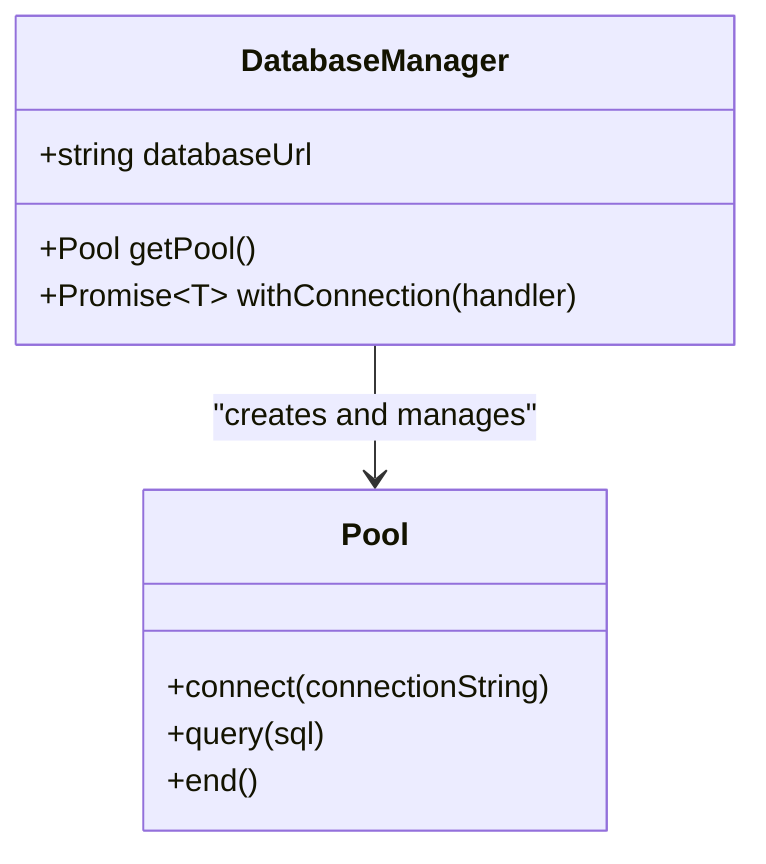
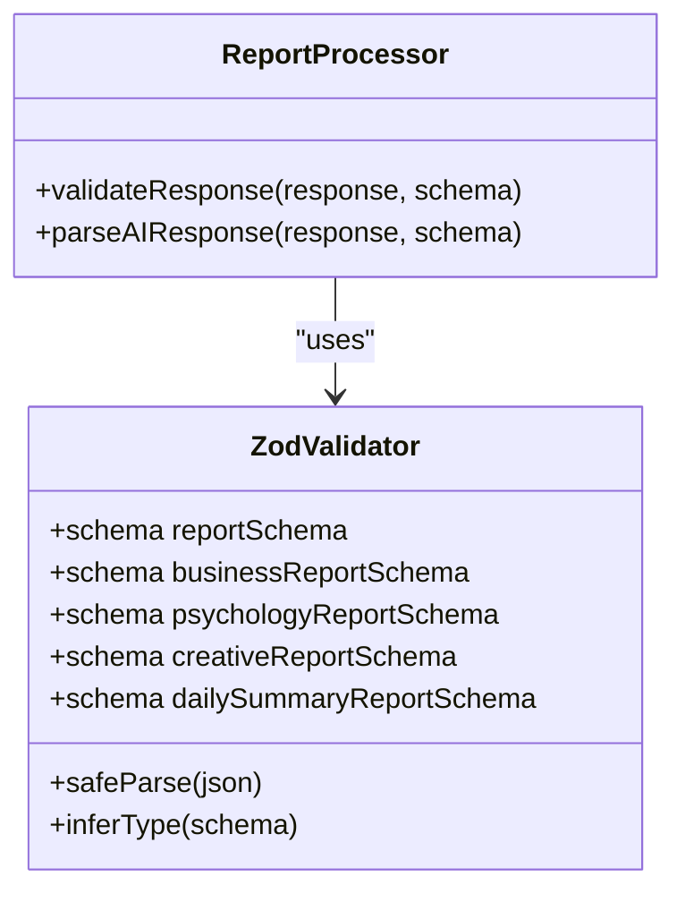
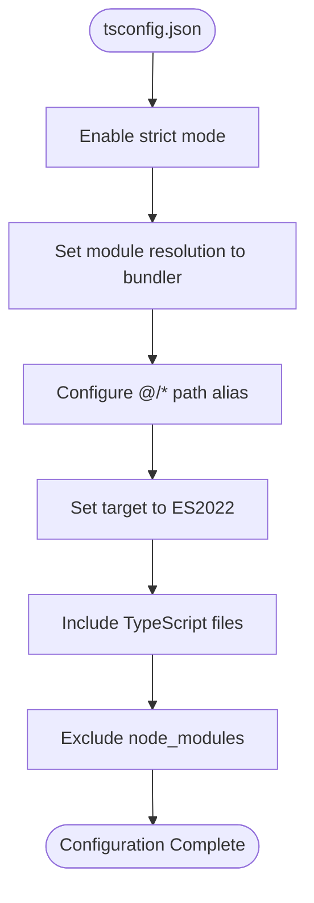
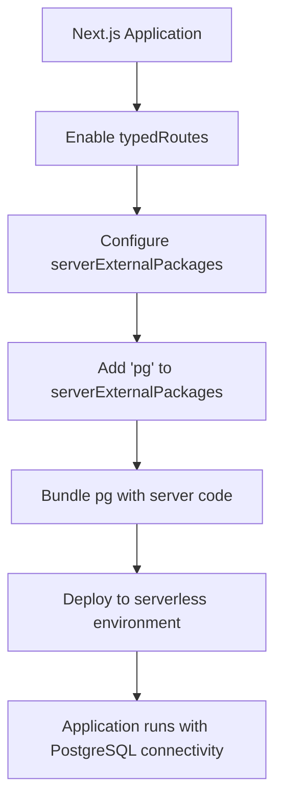
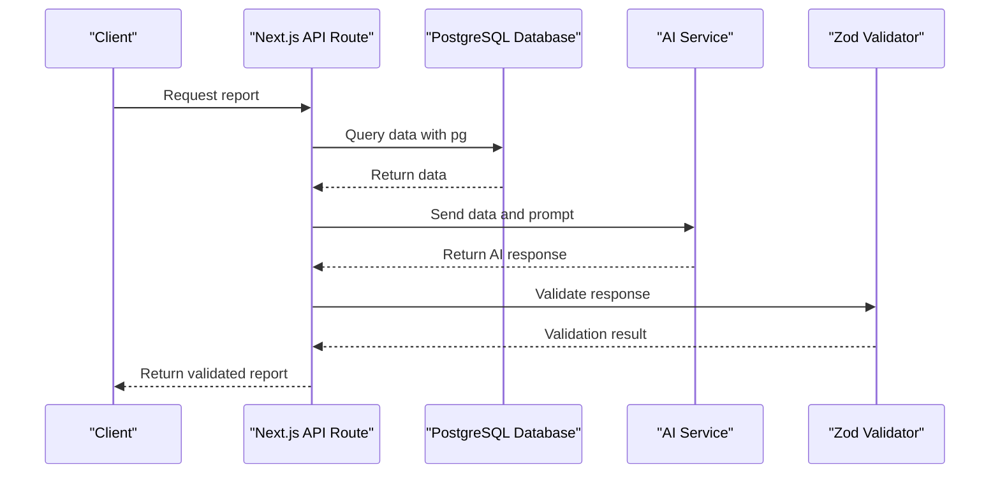

# Technology Stack

<cite>
**Referenced Files in This Document**   
- [package.json](file://package.json)
- [tsconfig.json](file://tsconfig.json)
- [next.config.mjs](file://next.config.mjs)
- [lib/db.ts](file://lib/db.ts)
- [lib/reportSchemas.ts](file://lib/reportSchemas.ts)
- [lib/ai.ts](file://lib/ai.ts)
- [lib/types.ts](file://lib/types.ts)
- [app/api/report/[kind]/route.ts](file://app/api/report/[kind]/route.ts)
- [lib/report.ts](file://lib/report.ts)
</cite>

## Table of Contents
1. [Core Frameworks and Libraries](#core-frameworks-and-libraries)
2. [Development Environment](#development-environment)
3. [Deployment and Infrastructure](#deployment-and-infrastructure)
4. [Technology Integration and Architecture](#technology-integration-and-architecture)

## Core Frameworks and Libraries

The tg-ai-vibecoders-summary application leverages a modern technology stack centered around Next.js 15 with the App Router, React 19 RC, PostgreSQL via the pg library, and Zod for schema validation. This combination provides a robust foundation for building a data-intensive, AI-powered analytics dashboard.

### Next.js 15 (App Router)

The application is built on Next.js 15 canary version 15.0.0-canary.58, utilizing the modern App Router architecture. This choice enables server-side rendering, API routes, and advanced routing capabilities essential for the application's dynamic report generation features. The App Router structure organizes the application into server components for data fetching and client components for interactive elements, following the recommended patterns for optimal performance.

The application's directory structure under the `app/` directory demonstrates the App Router implementation, with API routes for data endpoints and dynamic routing for report types. The use of server components for dashboard pages and client components for interactive elements like the summary generator follows best practices for data fetching and user interaction.

**Section sources**
- [package.json](file://package.json#L10)
- [app/api/report/[kind]/route.ts](file://app/api/report/[kind]/route.ts#L1-L84)

### React 19 RC

The frontend is powered by React 19 RC (version 19.0.0-rc.0), which introduces several new features and improvements over previous versions. React 19 brings enhanced performance optimizations, improved server components support, and new APIs that streamline state management and rendering. The application benefits from React 19's improved server component capabilities, which are crucial for the data-intensive operations performed by the analytics dashboard.

The use of React 19 RC positions the application at the forefront of React development, allowing access to the latest features while requiring careful attention to potential breaking changes in the final release. The application's components are implemented as functional components with explicit TypeScript interfaces for props, following modern React patterns.

**Section sources**
- [package.json](file://package.json#L11-L12)

### PostgreSQL via pg

The application connects to a PostgreSQL database using the pg library (version 8.12.0) for data retrieval. The database integration is implemented through a connection pooling pattern in `lib/db.ts`, which creates a singleton pool instance to efficiently manage database connections. This approach prevents the creation of excessive connections and improves performance by reusing existing connections.

The application uses read-only access to the database, executing SELECT queries for analytics purposes without modifying data. The connection pool is configured with a maximum of 5 connections, balancing performance with resource constraints. The implementation includes error handling for missing database URL configuration and uses environment variables for secure credential management.

**Diagram sources**
- [lib/db.ts](file://lib/db.ts#L1-L26)

**Section sources**
- [lib/db.ts](file://lib/db.ts#L1-L26)
- [package.json](file://package.json#L13)

### Zod for Schema Validation

Zod (version 3.23.8) is used extensively for schema validation, particularly for validating AI-generated responses. The application defines multiple Zod schemas in `lib/reportSchemas.ts` to ensure the structure and data types of AI responses conform to expected formats. This validation is critical for maintaining data integrity when processing unstructured AI output.

The application implements specialized schemas for different report types, including universal reports, business reports, psychology reports, creative reports, and daily summary reports. Each schema defines specific fields with appropriate constraints, such as minimum and maximum array lengths, string length requirements, and enum values. The use of Zod's safeParse method enables graceful error handling when validation fails.

**Diagram sources**
- [lib/reportSchemas.ts](file://lib/reportSchemas.ts#L1-L88)

**Section sources**
- [lib/reportSchemas.ts](file://lib/reportSchemas.ts#L1-L88)
- [package.json](file://package.json#L14)

## Development Environment

The development environment for the tg-ai-vibecoders-summary application is configured with specific requirements to ensure consistency and type safety across the codebase.

### TypeScript 5.5.3

The application uses TypeScript 5.5.3, specified in the devDependencies of package.json. This version of TypeScript provides modern language features, improved type checking, and better integration with the Next.js framework. The strict TypeScript configuration enforces type safety throughout the codebase, reducing runtime errors and improving code maintainability.

TypeScript is used for all application code, with explicit type definitions for components, API responses, and business logic. The application leverages TypeScript's type inference capabilities while maintaining explicit type annotations for public interfaces and complex data structures.

**Section sources**
- [package.json](file://package.json#L20)

### Node.js 18+

The application requires Node.js 18 or higher, which provides the necessary runtime environment for the modern JavaScript features used in the codebase. Node.js 18 includes long-term support (LTS) and performance improvements that benefit the application's server-side operations, particularly the database queries and AI service integrations.

### Strict TypeScript Configuration

The TypeScript configuration in tsconfig.json enforces strict type checking with several key settings. The `"strict": true` option enables all strict type-checking options, including noImplicitAny, strictNullChecks, and strictFunctionTypes. This configuration helps catch type-related errors during development rather than at runtime.

Additional configuration options include:
- `"target": "es2022"` for modern JavaScript compilation
- `"module": "esnext"` for ES module syntax
- `"moduleResolution": "bundler"` with path aliases
- `"jsx": "preserve"` for React JSX processing
- `"baseUrl": "."` with `"paths": { "@/*": ["./*"] }` for module path resolution

The configuration also includes Next.js-specific plugins and excludes node_modules from type checking.

**Diagram sources**
- [tsconfig.json](file://tsconfig.json#L1-L46)

**Section sources**
- [tsconfig.json](file://tsconfig.json#L1-L46)

### Module Resolution with @/* Path Alias

The application uses a path alias configuration that maps `@/*` to the project root directory. This allows for cleaner import statements throughout the codebase, avoiding relative path references that can become unwieldy in larger projects. For example, instead of using `../../../lib/db`, the application can import with `@/lib/db`.

This path alias is configured in the tsconfig.json file and is also supported by Next.js, ensuring consistent behavior between TypeScript compilation and runtime execution. The alias improves code readability and maintainability by providing a consistent way to reference project files regardless of the current file's location.

**Section sources**
- [tsconfig.json](file://tsconfig.json#L35-L38)

## Deployment and Infrastructure

The deployment configuration and infrastructure considerations for the tg-ai-vibecoders-summary application are designed to support its specific requirements for database connectivity and server-side operations.

### Next.js Configuration

The Next.js configuration in next.config.mjs includes experimental features and server-side package handling. The configuration enables the `typedRoutes` experimental feature, which provides type safety for API routes. This feature helps catch routing errors during development by validating route parameters and query strings against TypeScript types.

Additionally, the configuration specifies `serverExternalPackages: ["pg"]`, which tells Next.js to bundle the pg package with the server code rather than treating it as an external dependency. This is necessary because the pg package includes native modules that need to be properly packaged for serverless deployment environments.

**Diagram sources**
- [next.config.mjs](file://next.config.mjs#L1-L10)

**Section sources**
- [next.config.mjs](file://next.config.mjs#L1-L10)

### Infrastructure Considerations

The application's infrastructure must support several key requirements:
1. **PostgreSQL Database**: The application requires access to a PostgreSQL database with read-only permissions for analytics queries.
2. **Environment Variables**: Critical configuration such as DATABASE_URL and AI service credentials must be securely managed through environment variables.
3. **Serverless Compatibility**: The deployment environment must support the bundling of native modules like those in the pg package.
4. **AI Service Integration**: The application depends on external AI services (OpenRouter) for report generation, requiring network connectivity and API key management.

The use of connection pooling in the database layer helps optimize resource usage in serverless environments where cold starts and connection limits are concerns. The application's read-only database access pattern also simplifies deployment by eliminating the need for write permissions and transaction management.

**Section sources**
- [lib/db.ts](file://lib/db.ts#L1-L26)
- [next.config.mjs](file://next.config.mjs#L1-L10)

## Technology Integration and Architecture

The technologies in the tg-ai-vibecoders-summary application work together in a cohesive architecture that enables powerful analytics and AI-driven insights.

### Significance of Next.js 15 Canary with React 19 RC

The combination of Next.js 15 canary and React 19 RC represents a forward-looking technology choice that provides access to the latest features and performance improvements. However, this also introduces considerations for stability and compatibility. The canary version of Next.js may include experimental features and breaking changes that require careful monitoring and potential code adjustments as the versions stabilize.

This technology pairing enables advanced features like improved server components, enhanced streaming capabilities, and better integration between the frontend and backend. The application benefits from these features in its data-intensive operations, particularly in the efficient rendering of analytics dashboards and the processing of AI-generated content.

### Compatibility Considerations

The application's dependencies have specific version constraints that must be maintained for compatibility:
- Next.js 15 canary requires React 19 RC, creating a tight coupling between these versions
- TypeScript 5.5.3 is compatible with the modern JavaScript features used in the codebase
- The pg library version 8.12.0 is compatible with Node.js 18+ and provides the necessary PostgreSQL connectivity
- Zod 3.23.8 works seamlessly with TypeScript for schema validation

These version constraints ensure that the application components work together reliably while providing access to the latest features and security updates.

### Practical Example of Technology Integration

The application demonstrates how these technologies work together through its report generation workflow. When a user requests a report:
1. The Next.js API route receives the request and extracts parameters
2. TypeScript types ensure the parameters are correctly typed throughout the process
3. The application uses the pg library to query the PostgreSQL database for relevant data
4. The retrieved data is processed and sent to an AI service with structured prompts
5. Zod validates the AI response against predefined schemas to ensure data integrity
6. The validated data is returned to the frontend for display

This workflow illustrates the seamless integration of the core technologies, each playing a specific role in delivering the application's functionality.

**Diagram sources**
- [app/api/report/[kind]/route.ts](file://app/api/report/[kind]/route.ts#L1-L84)
- [lib/report.ts](file://lib/report.ts#L1-L126)
- [lib/ai.ts](file://lib/ai.ts#L1-L1064)
- [lib/reportSchemas.ts](file://lib/reportSchemas.ts#L1-L88)

**Section sources**
- [app/api/report/[kind]/route.ts](file://app/api/report/[kind]/route.ts#L1-L84)
- [lib/report.ts](file://lib/report.ts#L1-L126)
- [lib/ai.ts](file://lib/ai.ts#L1-L1064)
- [lib/reportSchemas.ts](file://lib/reportSchemas.ts#L1-L88)
- [lib/types.ts](file://lib/types.ts#L1-L45)