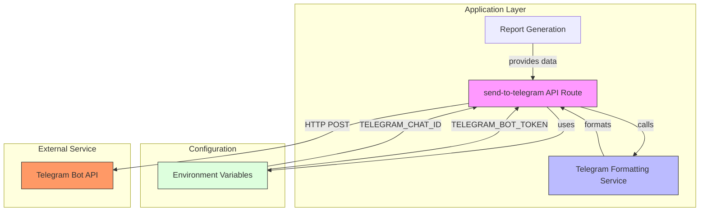
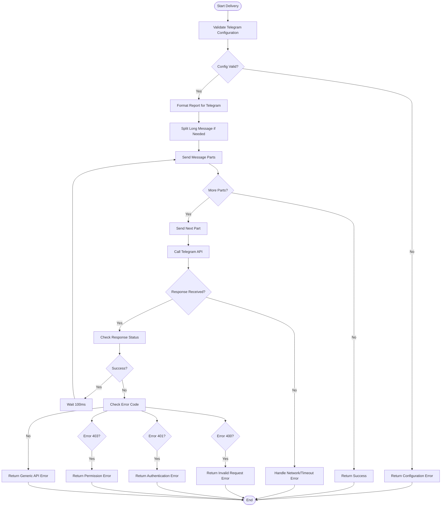

# Telegram Integration

<cite>
**Referenced Files in This Document**   
- [lib/telegram.ts](file://lib/telegram.ts)
- [app/api/send-to-telegram/route.ts](file://app/api/send-to-telegram/route.ts)
- [.env.example](file://.env.example)
</cite>

## Table of Contents
1. [Introduction](#introduction)
2. [Architecture Overview](#architecture-overview)
3. [Core Components](#core-components)
4. [Message Delivery Process](#message-delivery-process)
5. [Error Handling and Recovery](#error-handling-and-recovery)
6. [Configuration and Setup](#configuration-and-setup)
7. [User Workflow](#user-workflow)
8. [Cross-Cutting Concerns](#cross-cutting-concerns)

## Introduction

The Telegram integration component of the tg-ai-vibecoders-summary application enables automated delivery of AI-generated analytics reports to designated Telegram chats. This system leverages the Telegram Bot API to send formatted summaries containing insights, metrics, and recommendations derived from community chat data. The integration supports both standard and persona-based reports, with robust error handling, message splitting for long content, and thread support for forum discussions. The architecture is designed to be reliable, secure, and user-friendly, with clear separation between the application logic and the external Telegram API service.

## Architecture Overview

The Telegram integration follows a layered architecture with clear separation of concerns between message formatting, delivery, and API interaction. The system consists of two primary components: the formatting service in `lib/telegram.ts` and the API endpoint in `send-to-telegram/route.ts`. The formatting service is responsible for transforming raw report data into properly structured Telegram messages using HTML parsing, while the API endpoint handles the HTTP communication with the Telegram Bot API. Configuration is managed through environment variables, ensuring secure handling of sensitive credentials. The architecture is designed to be stateless and scalable, with each message delivery request processed independently.



**Diagram sources**
- [lib/telegram.ts](file://lib/telegram.ts)
- [app/api/send-to-telegram/route.ts](file://app/api/send-to-telegram/route.ts)

**Section sources**
- [lib/telegram.ts](file://lib/telegram.ts)
- [app/api/send-to-telegram/route.ts](file://app/api/send-to-telegram/route.ts)

## Core Components

The Telegram integration is built around two core components that work together to deliver formatted reports to Telegram chats. The first component, located in `lib/telegram.ts`, provides a comprehensive set of utilities for message formatting, validation, and delivery. This includes functions for escaping HTML content, validating configuration, formatting different types of reports, and splitting long messages. The second component is the API route at `send-to-telegram/route.ts`, which serves as the entry point for message delivery requests. This route validates configuration, generates or accepts report data, formats it for Telegram, and initiates the delivery process. The components are designed with separation of concerns, allowing the formatting logic to be reused across different parts of the application while keeping the API interface simple and focused.

**Section sources**
- [lib/telegram.ts](file://lib/telegram.ts)
- [app/api/send-to-telegram/route.ts](file://app/api/send-to-telegram/route.ts)

## Message Delivery Process

The message delivery process follows a well-defined sequence of steps to ensure reliable transmission of reports to Telegram. When a request is made to the send-to-telegram API endpoint, the system first validates the Telegram configuration by checking for the presence of required environment variables. If validation passes, the system either generates a new report or uses a pre-generated report provided in the request body. The report is then formatted into a Telegram-compatible message using HTML parsing, with appropriate headers, sections, and styling. For messages exceeding Telegram's 4096-character limit, the system automatically splits the content into multiple parts while preserving message integrity. Each part is sent sequentially with a small delay to avoid rate limiting, and the entire process is wrapped in error handling to manage network issues and API errors.

```mermaid
sequenceDiagram
participant Client as "Client App"
participant API as "send-to-telegram API"
participant Formatter as "Telegram Formatter"
participant Sender as "Message Sender"
participant Telegram as "Telegram Bot API"
Client->>API : POST /api/send-to-telegram
API->>API : Validate configuration
alt Configuration invalid
API-->>Client : Return error
else Configuration valid
API->>API : Generate or use report data
API->>Formatter : formatSummaryForTelegram(report)
Formatter-->>API : Formatted message
API->>Sender : splitMessage(message)
Sender-->>API : Message parts
loop For each message part
API->>Sender : sendMessageToChat(part)
Sender->>Telegram : POST /sendMessage
alt Success
Telegram-->>Sender : 200 OK
else Error
Telegram-->>Sender : Error response
Sender-->>API : Error details
API-->>Client : Return delivery error
break
end
alt Not last part
Sender->>Sender : Wait 100ms
end
end
API-->>Client : Success confirmation
end
```

**Diagram sources**
- [lib/telegram.ts](file://lib/telegram.ts#L368-L400)
- [app/api/send-to-telegram/route.ts](file://app/api/send-to-telegram/route.ts#L88-L88)

**Section sources**
- [lib/telegram.ts](file://lib/telegram.ts#L368-L400)
- [app/api/send-to-telegram/route.ts](file://app/api/send-to-telegram/route.ts#L88-L88)

## Error Handling and Recovery

The Telegram integration implements comprehensive error handling at multiple levels to ensure robust message delivery. At the configuration level, the system validates the presence of required environment variables before attempting any API calls, providing clear error messages when credentials are missing. During message delivery, the system handles various Telegram API error codes with specific user-friendly messages, such as authentication failures, invalid chat IDs, or permission issues. Network-related errors, including timeouts and connection failures, are caught and translated into meaningful error messages. The system also implements rate limiting protection by introducing small delays between sending message parts. For long messages that are split into multiple parts, the system ensures atomic delivery by stopping the process if any part fails, preventing partial message delivery that could confuse recipients.



**Diagram sources**
- [lib/telegram.ts](file://lib/telegram.ts#L405-L473)
- [app/api/send-to-telegram/route.ts](file://app/api/send-to-telegram/route.ts)

**Section sources**
- [lib/telegram.ts](file://lib/telegram.ts#L405-L473)
- [app/api/send-to-telegram/route.ts](file://app/api/send-to-telegram/route.ts)

## Configuration and Setup

The Telegram integration requires proper configuration through environment variables to function correctly. The primary configuration variables are `TELEGRAM_BOT_TOKEN` and `TELEGRAM_CHAT_ID`, both of which must be set in the `.env` file. The bot token is obtained by creating a new bot through Telegram's @BotFather, while the chat ID can be retrieved using @userinfobot. An optional `TELEGRAM_THREAD_ID` variable can be set to specify a particular forum thread for message delivery. The system validates these configuration values at runtime, providing descriptive error messages when they are missing or invalid. This environment-based configuration approach ensures that sensitive credentials are not hardcoded in the application and can be easily changed between deployment environments.

**Section sources**
- [.env.example](file://.env.example)

## User Workflow

The user workflow for sending reports to Telegram begins with the user clicking the '📤 Отправить в Telegram' button in the application interface. This action triggers a request to the send-to-telegram API endpoint with the appropriate parameters. The system then generates or retrieves the report data, formats it for Telegram, and initiates the delivery process. Users receive immediate feedback on the success or failure of the operation through the application interface. For administrators setting up the integration, the workflow involves creating a Telegram bot via @BotFather, obtaining the bot token, determining the target chat ID using @userinfobot, and configuring these values in the application's environment variables. Once configured, the integration operates automatically, allowing any user with appropriate permissions to send reports to the designated Telegram chat.

**Section sources**
- [app/api/send-to-telegram/route.ts](file://app/api/send-to-telegram/route.ts)

## Cross-Cutting Concerns

The Telegram integration addresses several cross-cutting concerns to ensure maintainable and reliable code. Message formatting is handled through a set of reusable helper functions that create consistent headers, dividers, footers, and list sections, promoting DRY (Don't Repeat Yourself) principles. HTML content is properly escaped to prevent markup issues and potential security vulnerabilities. The system implements robust error handling that translates technical errors into user-friendly messages in Russian, improving the user experience. Configuration validation occurs early in the process to prevent unnecessary processing when credentials are missing. The message splitting functionality ensures compatibility with Telegram's message length limits while maintaining readability. These cross-cutting concerns are centralized in the `lib/telegram.ts` file, making them easy to maintain and update across the application.

**Section sources**
- [lib/telegram.ts](file://lib/telegram.ts)
- [app/api/send-to-telegram/route.ts](file://app/api/send-to-telegram/route.ts)